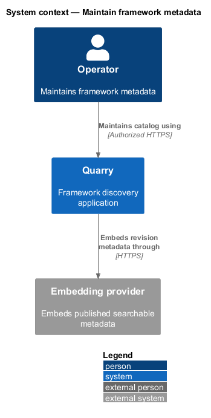
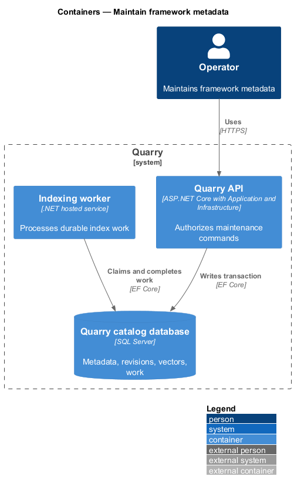
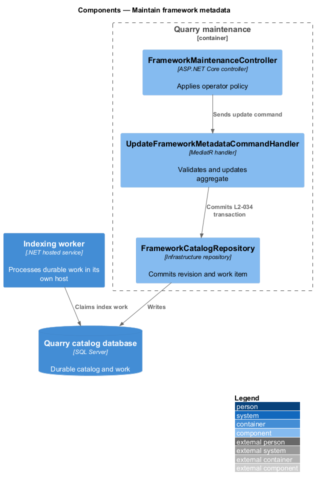
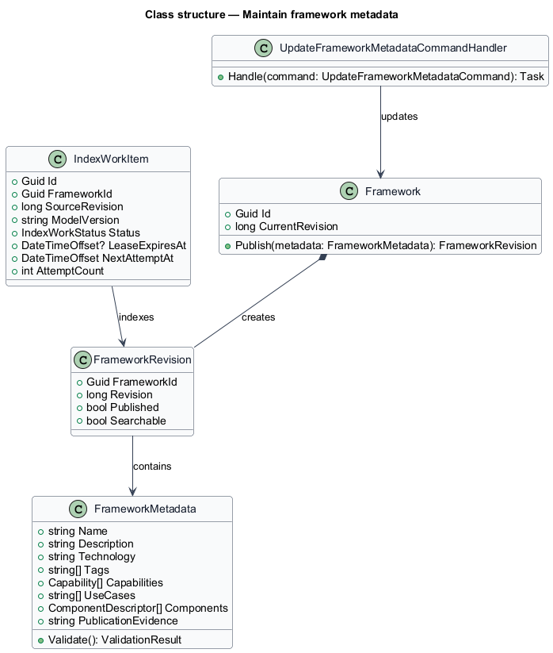
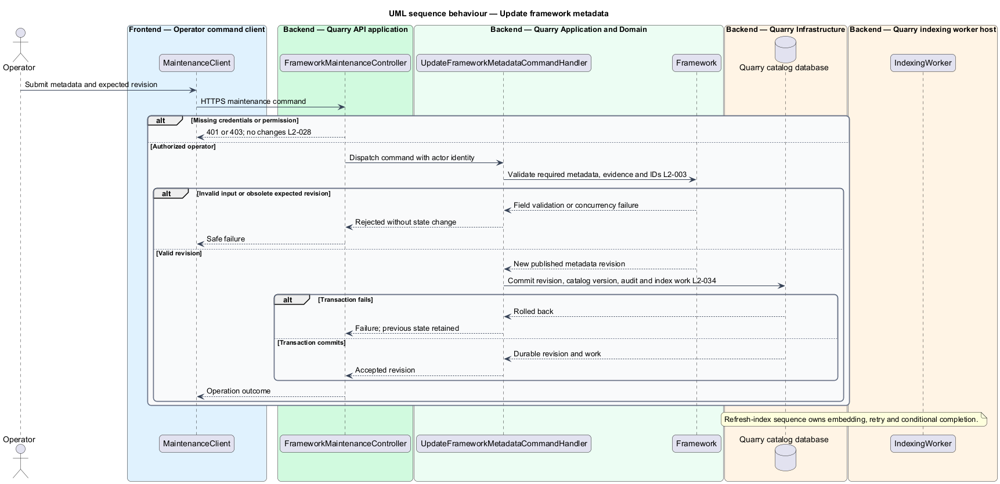

# Maintain framework metadata

## Overview

Framework metadata is the description, tags, technology, components, capabilities, use cases, publication state, and revision that describe a component framework. A *published revision* is an immutable metadata version visible to public reads. An *index work item* records the durable need to embed a changed published revision.

This operator-only feature validates metadata, publishes it atomically, and records indexing work in the same database transaction. It does not expose a browser maintenance surface or grant public discovery callers maintenance access.

## Description

- `FrameworkMaintenanceController` exposes operator-authorized HTTP metadata commands. Anonymous requests return 401; authenticated callers lacking maintenance permission receive 403 before command dispatch.
- `UpdateFrameworkMetadataCommandHandler` validates identifiers, bounded strings, tags, capabilities, and publication transitions.
- `Framework` is the domain aggregate that creates a new revision only after validation succeeds.
- `FrameworkCatalogRepository` saves the aggregate and `IndexWorkItem` in one SQL transaction.
- `IndexingWorker` claims durable work, creates metadata embeddings, and marks only the matching revision searchable.

The chosen transport is HTTP commands, with no administrative UI. Create, update, publish, withdraw, delete, and rebuild actions require the maintenance policy. Cookie authentication, if configured, also requires anti-forgery validation for mutations. Credential provisioning remains an operator configuration decision. Raw metadata has no authority beyond catalog search data.

Validation covers every required metadata field, supported technology, nonempty tags/capabilities/use cases, duplicate IDs, and unique component descriptors. Component count is derived from descriptors. Publication records documentation or working-example evidence for capability claims. Concurrency validation rejects an obsolete expected revision before saving. Invalid input and failed transactions leave the previous published revision and indexing state unchanged.

Publication commits metadata, framework and catalog revisions, and durable index work in one transaction. Withdrawals and deletions immediately remove public eligibility even while old vectors exist. Changes to published metadata invalidate its searchable revision until compatible indexing completes. Draft edits remain private and do not invalidate an unchanged published revision. The audit records actor identity, target ID, revision, operation, and outcome without credentials or raw sensitive content. Public catalog handlers have read-only persistence access; maintenance and indexing writes use separately restricted credentials.

## Requirements

| L2 ID | Refines (L1) | Requirement |
|-------|--------------|-------------|
| `L2-003` | `L1-002` | Each catalog entry shall have a stable unique ID, name, description, technology, nonempty descriptive tags, capabilities, suitable use cases, and component descriptors. Component counts shall be derived from those descriptors. Metadata shall use supported facts and shall persist with a revision identifier. |
| `L2-008` | `L1-003` | Search indexing shall track source revisions, refresh changed descriptions and tags, and prevent obsolete revisions from overwriting newer work. The healthy-service freshness target is 60 seconds after an accepted metadata change. |
| `L2-028` | `L1-011` | Public read operations shall work without sign-in. Public users shall have no catalog or index mutation authority. This requirement does not introduce an administrative UI. |
| `L2-029` | `L1-011` | The API shall enforce input limits independently of browser checks and treat queries, metadata, and preview input as untrusted data. Queries shall be limited to 500 UTF-16 code units after trimming, matching the browser field's counting convention. |
| `L2-034` | `L1-013` | Published metadata, revisions, and unfinished indexing work shall survive restarts. SQL Server Express or LocalDB shall hold catalog persistence through Quarry.Infrastructure. Search indexes shall be recoverable from catalog metadata. |
| `L2-037` | `L1-013` | Operators shall be able to distinguish process liveness, catalog readiness, search readiness, and indexing health. Diagnostics shall expose correlation, outcome, and timing without raw query content. |
| `L2-040` | `L1-015` | Each executable-code increment shall implement the smallest end-to-end slice of one or more stated L2 behaviors using ATDD. This is a delivery evidence requirement, not a repository-layout test. |
| `L2-042` | `L1-015` | Implementation shall comply with the binding constraints in L1 and `AGENTS.md`. Review shall verify these constraints directly without tests that assert filesystem placement. |

## Diagrams

The context separates operator maintenance from anonymous discovery and the configured embedding integration.

The container view places durable revisions and work records in SQL Server.

The component view shows command validation, aggregate mutation, transaction, and asynchronous indexing.

The class diagram names the aggregate, revision, and work record that prevent stale index completion.

The sequence shows authorization, validation, and atomic metadata publication. The refresh-index sequence details embedding and revision-conditional completion.

