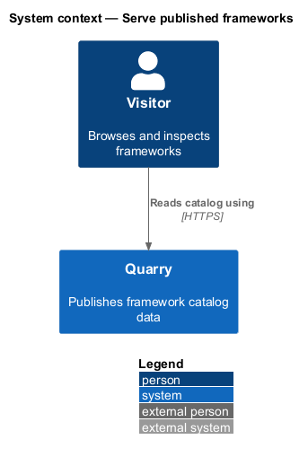
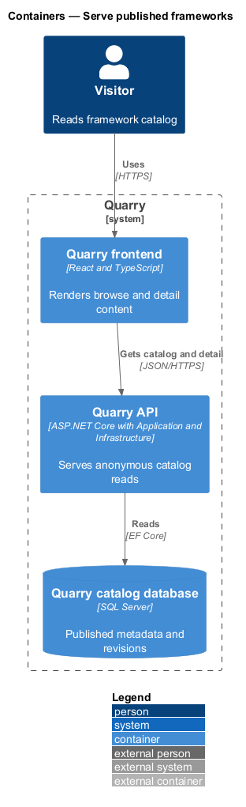
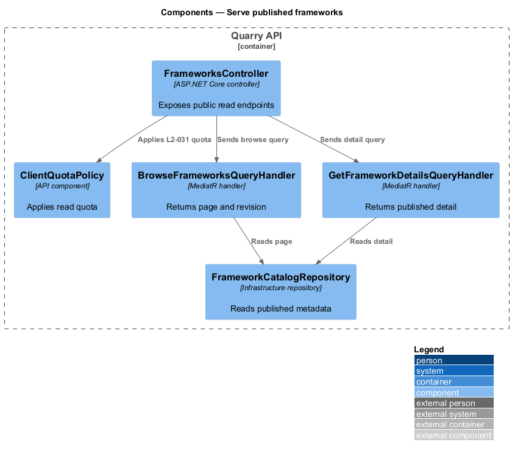
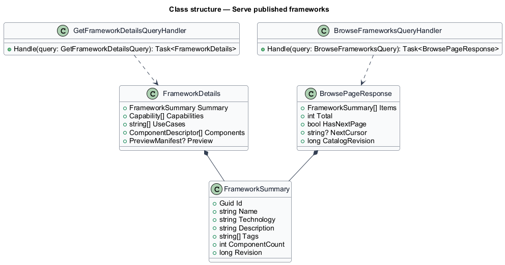
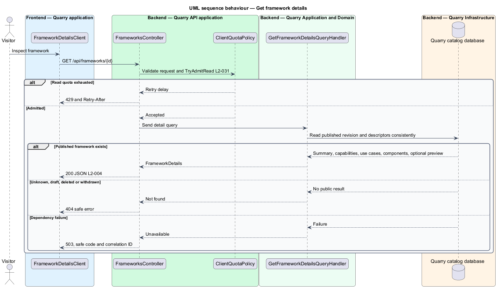

# Serve published frameworks

## Overview

Public catalog reads expose only published framework metadata. A *catalog revision* binds a paged browse response to a consistent ordering source. A *detail revision* identifies the published metadata used by a framework detail response.

The feature supports anonymous browse and detail reads. It distinguishes an absent framework from a maintenance failure and applies a separate public-read quota.

## Description

- `FrameworksController` exposes `GET /api/frameworks` and `GET /api/frameworks/{id}`.
- `ClientQuotaPolicy.TryAdmitRead` tracks the trusted connection address in a fixed 60-second window shared by catalog and detail reads.
- `BrowseFrameworksQueryHandler` returns a revision-aware published page.
- `GetFrameworkDetailsQueryHandler` returns one published framework or a safe not-found result.
- `FrameworkCatalogRepository` implements `IFrameworkCatalogRepository` from Application. It applies publication, technology, sorting, cursor, and revision rules through Infrastructure SQL persistence.

Read responses contain only data needed by discovery and details. They never include maintenance permissions, secrets, draft revisions, raw vectors, or index-work internals.

`GET /api/frameworks` accepts `technology`, `pageSize` (default 24, range 1–24), `cursor`, and `expectedRevision`. An absent technology means all technologies. The cursor carries the last name/ID sort key, technology, and catalog revision. The API validates these values and rejects malformed or filter-incompatible cursors with HTTP 400. Page-number parameters are unsupported. The ordinal name comparer and canonical ID tie-break are applied consistently; database locale collation does not define the ordering.

`BrowsePageResponse` contains `items`, `total`, `hasNextPage`, `nextCursor`, and `catalogRevision`. Each `FrameworkSummary` contains ID, name, description, technology, tags, derived component count, and framework revision. The total, entries, and revision come from one consistent database read. A stale expected revision or cursor returns HTTP 409 with code `catalog_revision_changed`. The client requests page one without the obsolete cursor or revision and replaces the accumulated list only after that current request succeeds.

`FrameworkDetails` contains the same summary, capabilities with stable IDs, use cases, component descriptors, and an optional `PreviewManifest` for that revision. Descriptors identify the actual component and documented example/build evidence. A missing preview does not make otherwise published details unavailable. Unknown or unpublished IDs return HTTP 404; dependency failure returns HTTP 503. Error bodies carry a safe code and correlation ID. HTTP 429 carries `Retry-After` from the shared read quota.

## Requirements

| L2 ID | Refines (L1) | Requirement |
|-------|--------------|-------------|
| `L2-003` | `L1-002` | Each catalog entry shall have a stable unique ID, name, description, technology, nonempty descriptive tags, capabilities, suitable use cases, and component descriptors. Component counts shall be derived from those descriptors. Metadata shall use supported facts and shall persist with a revision identifier. |
| `L2-004` | `L1-002` | The API shall expose published catalog entries, metadata, and framework details with stable identities and bounded pages. Responses shall distinguish unavailable entries from unavailable services. |
| `L2-009` | `L1-004` | Browse mode shall show published entries ordered by case-insensitive ordinal name, then stable ID. It shall load 24 entries initially and expose `Load more` only when another page exists. |
| `L2-010` | `L1-004` | Quarry shall provide `All technologies`, React, Angular, Vue, and Web Components as the baseline filter values. Filtering shall apply to eligible candidates before the three-result limit. |
| `L2-015` | `L1-006` | The detail view shall provide Overview and Components tabs, framework metadata, a theme explanation, and selection controls. |
| `L2-028` | `L1-011` | Public read operations shall work without sign-in. Public users shall have no catalog or index mutation authority. This requirement does not introduce an administrative UI. |
| `L2-031` | `L1-011` | The baseline service shall enforce per-client quotas of 30 semantic searches and 120 catalog/detail reads per 60-second fixed window. Quotas shall be configurable and use the trusted connection address, not arbitrary client-supplied forwarding headers. |
| `L2-034` | `L1-013` | Published metadata, revisions, and unfinished indexing work shall survive restarts. SQL Server Express or LocalDB shall hold catalog persistence through Quarry.Infrastructure. Search indexes shall be recoverable from catalog metadata. |
| `L2-037` | `L1-013` | Operators shall be able to distinguish process liveness, catalog readiness, search readiness, and indexing health. Diagnostics shall expose correlation, outcome, and timing without raw query content. |

## Diagrams

The context identifies anonymous visitor reads and the catalog database.

The container view separates the frontend, API, Application handlers, and SQL persistence.

The component view exposes only controller-mediated public reads.

The class diagram shows typed browse and detail responses.

The sequence shows public detail retrieval and safe 404 handling.

