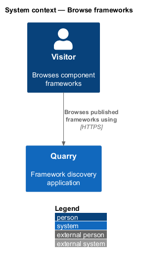
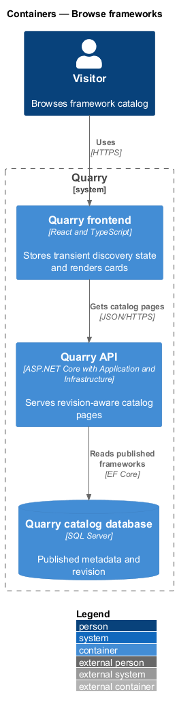
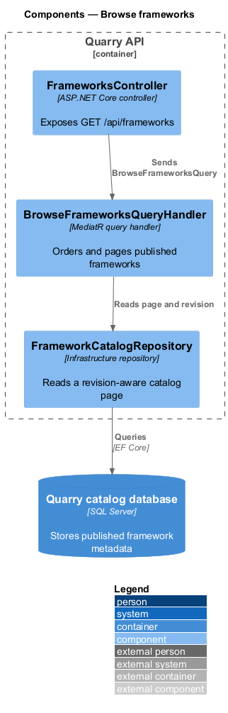
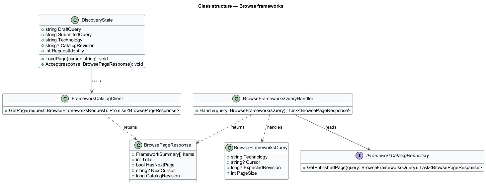
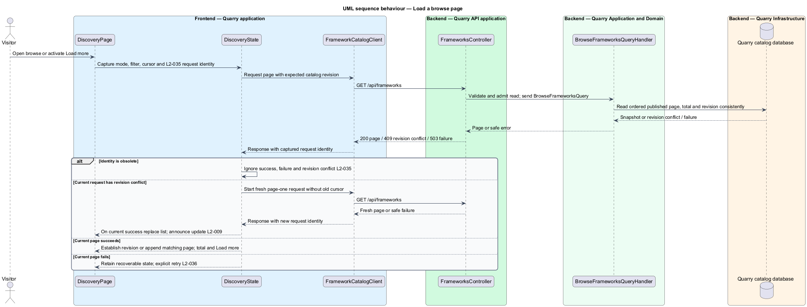

# Browse frameworks

## Overview

Browse mode presents the published framework catalog without a semantic query. A *catalog revision* is the immutable version of published metadata used to construct one paged list. A *browse page* is one 24-entry segment of that revision after the selected technology filter is applied.

The feature gives a new visitor usable discovery content before a project description exists. It keeps query submission separate from browsing, preserves a selected framework, and prevents an obsolete page response from changing the current discovery state.

## Description

- `DiscoveryPage` is the React route in `frontend/apps/quarry`. It owns the visible search controls, technology selector, result region, and selection summary.
- `DiscoveryState` holds the draft query, submitted query, technology, catalog revision, next-page cursor, request identity, and selection ID. It lives only in browser memory.
- `FrameworkCatalogClient` issues typed `GET /api/frameworks` requests. Its request includes technology, cursor, and expected catalog revision.
- `BrowseFrameworksQuery` and `BrowseFrameworksQueryHandler` return published entries in case-insensitive ordinal name order followed by stable ID order.
- `FrameworksController` validates public read input, applies the catalog-read quota, and sends the query through MediatR.
- `FrameworkCatalogRepository` reads published metadata and its revision from SQL Server through `Quarry.Infrastructure`.

The page assigns an increasing request identity before each load and cancels the previous browser request. It rejects obsolete identities before processing successes, failures, or revision conflicts. Page one establishes the catalog revision; subsequent pages append only for the same mode, technology, cursor, and revision. HTTP 409 `catalog_revision_changed` starts a fresh page-one request and presents a catalog-updated notice after replacement succeeds.

Cards in browse mode display published metadata without relevance ranks or query-specific explanations. The heading reports the filtered total. `Load more` appears only while `hasNextPage` is true; a failed page load retains the existing list and offers retry without duplicate appends. An empty published catalog has its own no-frameworks state. Dependency failure is a service-error state, never a successful empty list. Neither revision recovery nor pagination clears selection.

The layout uses one card column at XS and SM sizes, two at MD, and three at LG and XL. The page exposes a skip link, labels controls, publishes loading and recovery status, and respects reduced-motion preferences. The visual treatment explains that theme and skin selection occur during implementation; it supplies no color ranking or color-selection controls.

## Requirements

| L2 ID | Refines (L1) | Requirement |
|-------|--------------|-------------|
| `L2-001` | `L1-001` | Quarry shall lead with a labeled project-description field and a `Find frameworks` submit action. Editing shall remain separate from submitting. |
| `L2-009` | `L1-004` | Browse mode shall show published entries ordered by case-insensitive ordinal name, then stable ID. It shall load 24 entries initially and expose `Load more` only when another page exists. |
| `L2-010` | `L1-004` | Quarry shall provide `All technologies`, React, Angular, Vue, and Web Components as the baseline filter values. Filtering shall apply to eligible candidates before the three-result limit. |
| `L2-011` | `L1-004` | `Clear search` shall clear draft and submitted queries while retaining technology. `Browse all frameworks` shall clear both queries and reset technology to `All technologies`. Neither action shall clear selection. |
| `L2-012` | `L1-004` | Valid zero-match responses shall explain that no matching frameworks were found for the current search or filter and offer query revision, technology changes, and a full browse reset. |
| `L2-021` | `L1-008` | Discovery shall explain implementation-time customization and exclude color-oriented ranking and controls. |
| `L2-024` | `L1-010` | Discovery and modal layouts shall adapt across the entire UI viewport matrix. XS and SM use one card column, MD uses two, and LG and XL use three. |
| `L2-025` | `L1-010` | Every discovery control shall be usable by keyboard with visible focus and logical navigation. Details shall constrain focus until dismissed. |
| `L2-026` | `L1-010` | Controls, results, tabs, dialogs, switches, and status messages shall expose meaningful semantics to assistive technology. |
| `L2-027` | `L1-010` | Quarry shall preserve readability and operation under zoom and motion preferences. These criteria are explicit baseline checks rather than a claim of formal accessibility certification. |
| `L2-035` | `L1-013` | The frontend shall associate every request with its query, technology, and browse-page state and shall render only responses applicable to the current state. |
| `L2-036` | `L1-013` | Quarry shall expose distinct states for work in progress, valid empty results, incomplete indexing, and service failure, preserving the user's recoverable input and selection. |
| `L2-040` | `L1-015` | Each executable-code increment shall implement the smallest end-to-end slice of one or more stated L2 behaviors using ATDD. This is a delivery evidence requirement, not a repository-layout test. |
| `L2-041` | `L1-015` | Frontend acceptance tests shall use Playwright and Page Objects with shared backend fixtures. Separate API, retrieval, and framework checks shall establish the behaviors that frontend mocks cannot prove. |
| `L2-042` | `L1-015` | Implementation shall comply with the binding constraints in L1 and `AGENTS.md`. Review shall verify these constraints directly without tests that assert filesystem placement. |

## Diagrams

### System context

A visitor uses the Quarry browser application, which obtains published catalog entries from the Quarry API. The API reads only published catalog metadata from SQL Server.

### Containers

The React application keeps transient browse state in memory. The API supplies a revision-aware page from its application layer and SQL-backed repository.

### Components

The controller dispatches a MediatR query. The handler applies browse ordering and delegates the revision-aware read to Infrastructure.

### Class structure

`DiscoveryState` associates a browse request with its request identity and revision. The typed client consumes the paged result returned by the API.

### Behaviour — load a browse page

The sequence shows a current request loading page one or appending a later page. A catalog revision change triggers a replacement page rather than mixing entries from two revisions.

