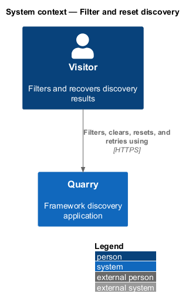
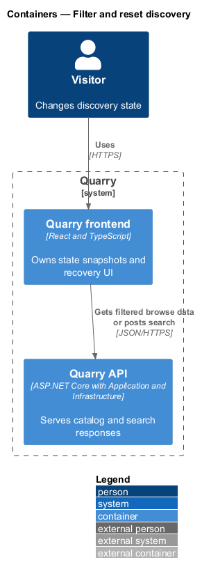
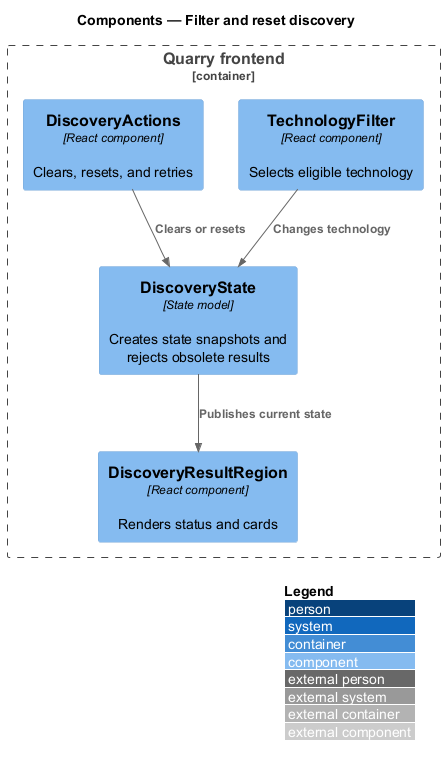
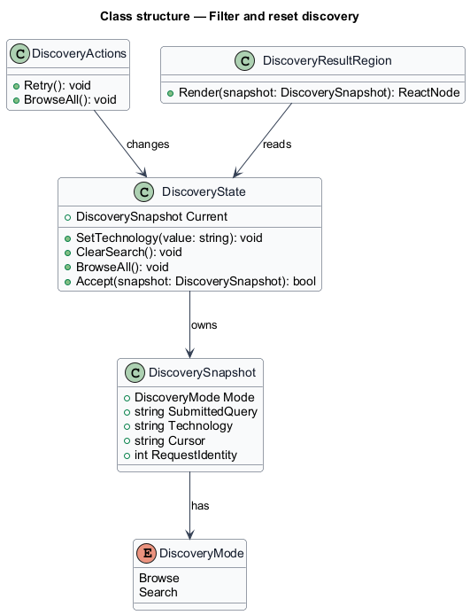
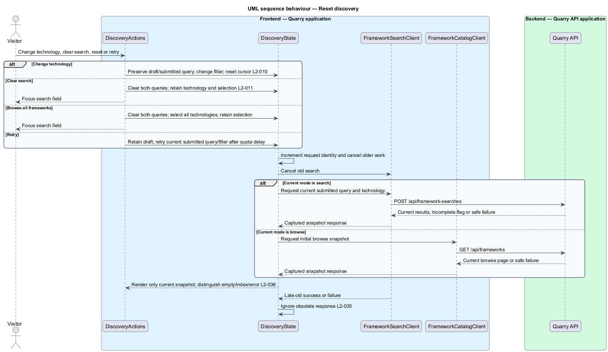

# Filter and reset discovery

## Overview

Discovery filtering constrains the current browse or semantic-search state to a frontend technology. Reset actions recover from a narrow filter, no match, service error, or incomplete index without discarding a framework selection.

The feature changes state deliberately. A filter applies to eligible candidates before relevance limiting. `Clear search` retains technology, while `Browse all frameworks` restores the all-technologies browse page.

## Description

- `TechnologyFilter` exposes the fixed baseline values.
- `DiscoveryState` owns the current filter, mode, submitted query, page cursor, and request identity.
- `DiscoveryActions` executes clear, browse reset, retry, and filter changes.
- `DiscoveryResultRegion` renders loading, complete empty, incomplete-index, and service-error states as separate accessible status views.
- `FrameworkCatalogClient` and `FrameworkSearchClient` receive a state snapshot and return it with their responses.

Each state transition cancels older requests and increments the request identity. An old success or failure cannot replace cards, append a browse page, or clear the current selection. Retry repeats only the current snapshot and never performs an automatic retry loop.

Technology changes preserve both the draft and submitted query, restart browse pagination, and apply the filter to all eligible semantic candidates before taking three. `Clear search` clears both queries, retains technology and selection, and focuses the search field. It remains available when the draft is blank but a submitted query is active. `Browse all frameworks` additionally restores all technologies and focuses search when its initiating control disappears.

An empty complete result offers query revision, technology change, and browse reset. An incomplete result, including zero entries, identifies indexing and offers retry/browse actions. Service errors retain input and selection; catalog browsing remains usable when only embeddings fail. A 429 response disables explicit retry until the rounded-up `Retry-After` delay expires. Retry uses the submitted query and current technology, preserving an unsubmitted draft. A successful retry clears the prior error and loading status once.

## Requirements

| L2 ID | Refines (L1) | Requirement |
|-------|--------------|-------------|
| `L2-009` | `L1-004` | Browse mode shall show published entries ordered by case-insensitive ordinal name, then stable ID. It shall load 24 entries initially and expose `Load more` only when another page exists. |
| `L2-010` | `L1-004` | Quarry shall provide `All technologies`, React, Angular, Vue, and Web Components as the baseline filter values. Filtering shall apply to eligible candidates before the three-result limit. |
| `L2-011` | `L1-004` | `Clear search` shall clear draft and submitted queries while retaining technology. `Browse all frameworks` shall clear both queries and reset technology to `All technologies`. Neither action shall clear selection. |
| `L2-012` | `L1-004` | Valid zero-match responses shall explain that no matching frameworks were found for the current search or filter and offer query revision, technology changes, and a full browse reset. |
| `L2-024` | `L1-010` | Discovery and modal layouts shall adapt across the entire UI viewport matrix. XS and SM use one card column, MD uses two, and LG and XL use three. |
| `L2-025` | `L1-010` | Every discovery control shall be usable by keyboard with visible focus and logical navigation. Details shall constrain focus until dismissed. |
| `L2-026` | `L1-010` | Controls, results, tabs, dialogs, switches, and status messages shall expose meaningful semantics to assistive technology. |
| `L2-031` | `L1-011` | The baseline service shall enforce per-client quotas of 30 semantic searches and 120 catalog/detail reads per 60-second fixed window. Quotas shall be configurable and use the trusted connection address, not arbitrary client-supplied forwarding headers. |
| `L2-035` | `L1-013` | The frontend shall associate every request with its query, technology, and browse-page state and shall render only responses applicable to the current state. |
| `L2-036` | `L1-013` | Quarry shall expose distinct states for work in progress, valid empty results, incomplete indexing, and service failure, preserving the user's recoverable input and selection. |
| `L2-041` | `L1-015` | Frontend acceptance tests shall use Playwright and Page Objects with shared backend fixtures. Separate API, retrieval, and framework checks shall establish the behaviors that frontend mocks cannot prove. |

## Diagrams

The context shows the visitor recovering discovery state entirely through Quarry.

The container view shows filter state held in the React application and sent to the appropriate catalog or search API path.

The component view shows the transition authority in `DiscoveryState`.

The class diagram records the snapshot used to reject obsolete responses.

The sequence shows reset overtaking an earlier search response.

