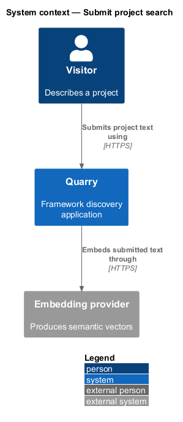
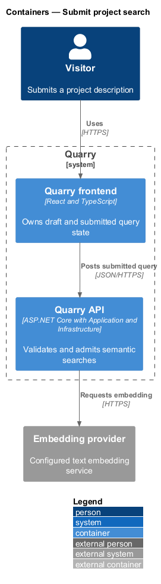
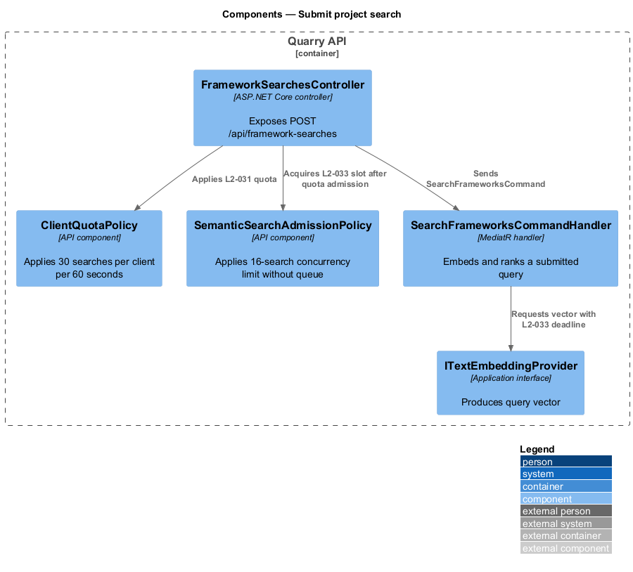
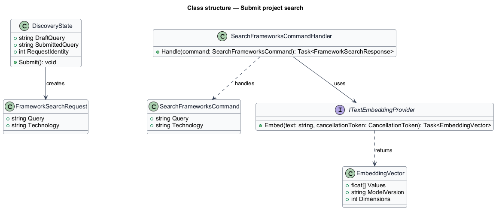
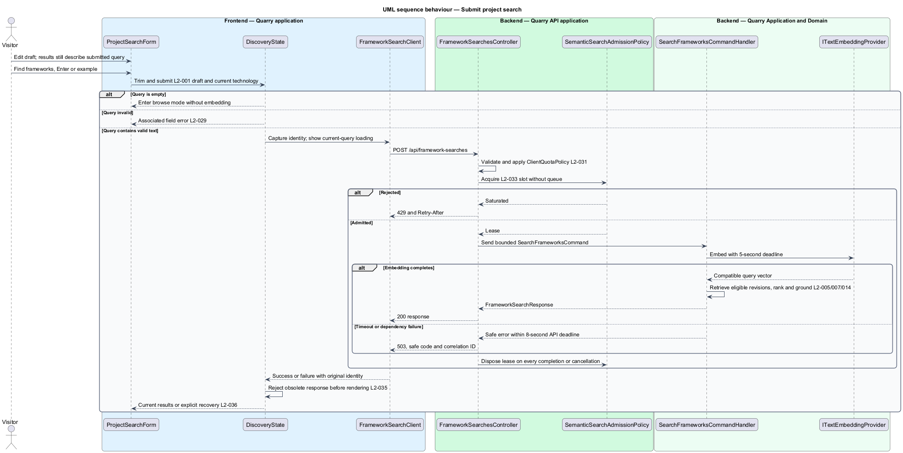

# Submit project search

## Overview

Project search converts a submitted natural-language project description into ranked framework recommendations. A *draft query* is editable field text. A *submitted query* is the trimmed text attached to the current request and heading. The distinction prevents typing from changing results before an explicit action.

The feature submits text through `Find frameworks`, Enter, or the three example buttons. The search shortcut only focuses the field. Submission preserves the selected technology and never sends an embedding request for whitespace-only input.

## Description

- `ProjectSearchForm` renders the labeled field, example buttons, and submit action.
- `DiscoveryState` stores draft and submitted query values separately and starts a semantic request only after explicit submission.
- `FrameworkSearchClient` posts a typed request to `/api/framework-searches`; query text remains in the JSON body.
- `FrameworkSearchesController` validates the request, applies the semantic-search quota, and dispatches `SearchFrameworksCommand`.
- `SearchFrameworksCommandHandler` asks `ITextEmbeddingProvider` for a query vector, then calls `IFrameworkVectorRepository` and `CosineSimilarityRanker` as defined in the ranking design.
- `ITextEmbeddingProvider` isolates provider/model selection. Provider, model, retention disclosure, and calibrated threshold remain `<TO SUPPLY>` until evaluated.

The UI assigns the request identity before dispatch and accepts only a matching result. Ctrl+K or Cmd+K moves focus to the field only outside a detail dialog. Details keep the modal focus trap active.

Typing changes only the draft; results and explanations retain the submitted query. The example buttons submit exactly `Animal Hospital`, `Online store`, and `Analytics dashboard` using the current technology. Submission trims text, applies the 500 UTF-16-unit limit, and exposes associated invalid-field feedback when validation fails. If the configured provider processes queries externally, the UI discloses that processing before submission; the notice makes only documented retention claims.

Loading identifies the current submitted query and hides previous-query cards from the current result region. Success displays every recommendation field, the returned count, query context, and relevance ordering. Empty, incomplete-index, timeout, network, and quota states follow the recovery design. All responses, including failures, pass through the current request identity check before changing the UI. The full-width submit row at XS/SM and wrapping example buttons preserve keyboard order.

## Requirements

| L2 ID | Refines (L1) | Requirement |
|-------|--------------|-------------|
| `L2-001` | `L1-001` | Quarry shall lead with a labeled project-description field and a `Find frameworks` submit action. Editing shall remain separate from submitting. |
| `L2-002` | `L1-001` | Quarry shall offer the three project examples shown in the mock and a keyboard shortcut to focus search. |
| `L2-005` | `L1-003` | Production search shall generate embeddings from framework descriptions and tags and from the submitted query using a compatible embedding model. It shall retrieve by vector similarity. Hard-coded query-to-framework mappings shall not fulfill this requirement. |
| `L2-007` | `L1-003` | Search shall return at most three qualifying recommendations for the current query and technology, ordered by descending cosine similarity. This limit adopts the mock's focused presentation as a baseline decision. Equal scores shall be ordered by stable framework ID using ordinal ascending order. |
| `L2-024` | `L1-010` | Discovery and modal layouts shall adapt across the entire UI viewport matrix. XS and SM use one card column, MD uses two, and LG and XL use three. |
| `L2-025` | `L1-010` | Every discovery control shall be usable by keyboard with visible focus and logical navigation. Details shall constrain focus until dismissed. |
| `L2-026` | `L1-010` | Controls, results, tabs, dialogs, switches, and status messages shall expose meaningful semantics to assistive technology. |
| `L2-030` | `L1-011` | Production transport and integrations shall protect user queries and service credentials. Query history shall not be persisted by Quarry; search text shall stay out of URLs, routine telemetry, and browser persistent storage. |
| `L2-031` | `L1-011` | The baseline service shall enforce per-client quotas of 30 semantic searches and 120 catalog/detail reads per 60-second fixed window. Quotas shall be configurable and use the trusted connection address, not arbitrary client-supplied forwarding headers. |
| `L2-033` | `L1-012` | Each API instance shall admit at most 16 simultaneous semantic searches, perform no unbounded request queuing, and bound dependency waits. The embedding deadline is 5 seconds and the API search deadline is 8 seconds. |
| `L2-035` | `L1-013` | The frontend shall associate every request with its query, technology, and browse-page state and shall render only responses applicable to the current state. |
| `L2-036` | `L1-013` | Quarry shall expose distinct states for work in progress, valid empty results, incomplete indexing, and service failure, preserving the user's recoverable input and selection. |
| `L2-040` | `L1-015` | Each executable-code increment shall implement the smallest end-to-end slice of one or more stated L2 behaviors using ATDD. This is a delivery evidence requirement, not a repository-layout test. |
| `L2-041` | `L1-015` | Frontend acceptance tests shall use Playwright and Page Objects with shared backend fixtures. Separate API, retrieval, and framework checks shall establish the behaviors that frontend mocks cannot prove. |

## Diagrams

The context shows search as a browser-to-API flow with a configured embedding integration. Hosting and any external-processing disclosure remain provider decisions.

The container view separates browser state, the controller, application retrieval, and the embedding provider.

The component view shows validation, admission, and MediatR dispatch.

The class diagram shows the request types and provider boundary.

The sequence records explicit submission, empty-input browsing, and safe timeout handling.

