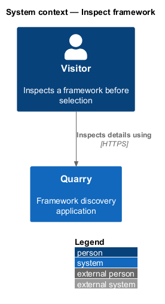
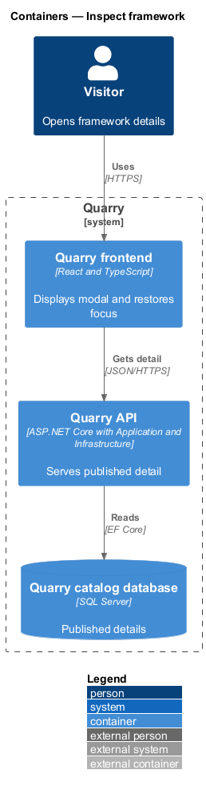
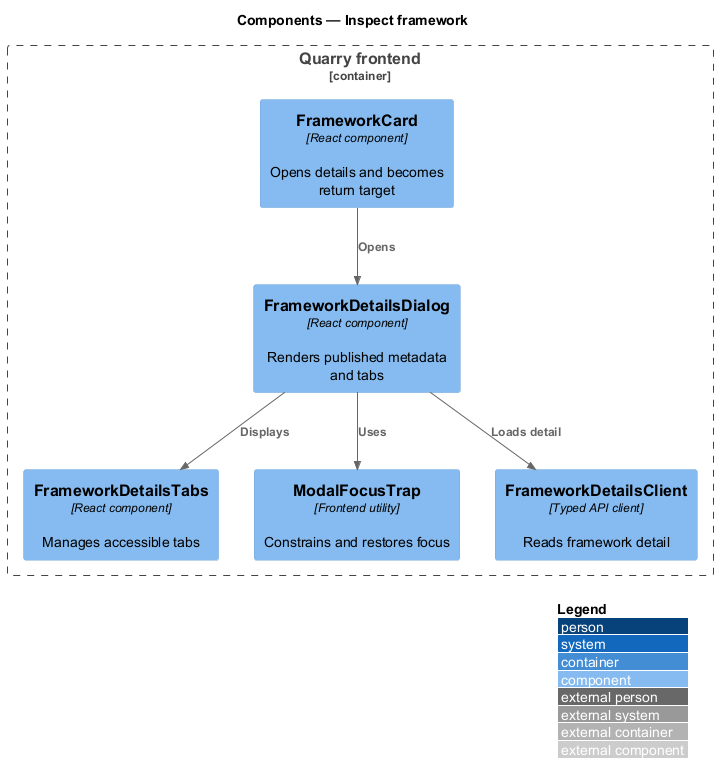
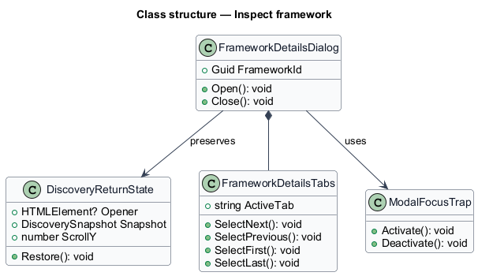
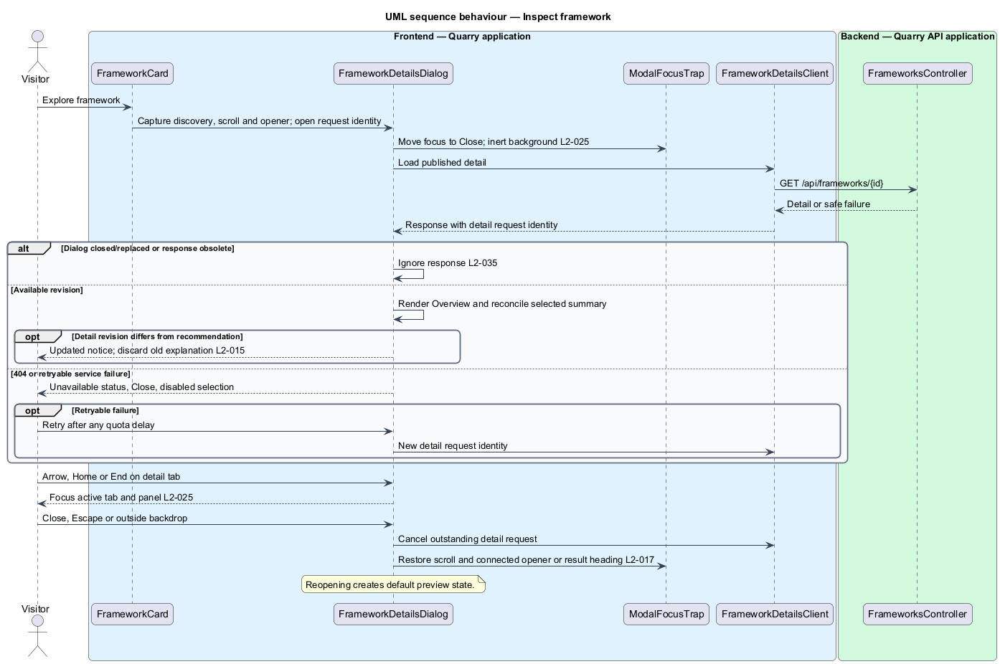

# Inspect framework

## Overview

Framework inspection opens the published details of one framework while preserving discovery context. A *detail dialog* is the modal interface that presents a framework description, tags, capabilities, use cases, technology, and components. A *return focus target* is the detail action that opened the dialog.

The feature lets a visitor evaluate a framework before selection. Closing the dialog restores the captured focus target and leaves draft query, submitted query, filter, cards, and selection unchanged.

## Description

- `FrameworkDetailsDialog` is a React modal with Overview and Components tabs.
- `FrameworkDetailsClient` fetches `GET /api/frameworks/{id}` and maps 404 or service failure into a recoverable dialog status.
- `ModalFocusTrap` moves initial focus to Close and cycles Tab and Shift+Tab within the dialog.
- `FrameworkDetailsTabs` provides tab, tabpanel, selected, and controlled-panel semantics. Left/Right, Home, and End select and focus the corresponding tab.
- `DiscoveryReturnState` captures the opener and current discovery snapshot before opening the dialog.

Details show the implementation-time theme and skin note. They contain no palette gallery, swatches, color filters, preset comparisons, or design-token selection tab.

Each open starts a new detail request identity and cancels the previous one. A late response for a closed or replaced dialog cannot reopen it or change its content. Loading, 404, and service failure retain Close; unavailable details disable selection. Retry appears only for a retryable error and observes a read-quota delay. A newer detail revision replaces the displayed metadata, announces an update, and drops any older explanation. An explanation is shown only when its query and supporting revision match the current context.

Close, Escape, and an outside-backdrop click dismiss the dialog; internal clicks leave it open. `DiscoveryReturnState` retains the draft, submitted query, technology, loaded pages, ordering, selection, and scroll position. Dismissal restores scroll and focuses the connected opener without scrolling; if that opener disappeared, it focuses the result heading. The background remains inert until dismissal. Reopening creates fresh preview state. A detail response also reconciles any selected summary for the same ID through the selection design.

## Requirements

| L2 ID | Refines (L1) | Requirement |
|-------|--------------|-------------|
| `L2-015` | `L1-006` | The detail view shall provide Overview and Components tabs, framework metadata, a theme explanation, and selection controls. |
| `L2-017` | `L1-006` | Closing details shall preserve discovery state and restore focus. Reopening a preview shall start with its default local state. |
| `L2-021` | `L1-008` | Discovery shall explain implementation-time customization and exclude color-oriented ranking and controls. |
| `L2-024` | `L1-010` | Discovery and modal layouts shall adapt across the entire UI viewport matrix. XS and SM use one card column, MD uses two, and LG and XL use three. |
| `L2-025` | `L1-010` | Every discovery control shall be usable by keyboard with visible focus and logical navigation. Details shall constrain focus until dismissed. |
| `L2-026` | `L1-010` | Controls, results, tabs, dialogs, switches, and status messages shall expose meaningful semantics to assistive technology. |
| `L2-027` | `L1-010` | Quarry shall preserve readability and operation under zoom and motion preferences. These criteria are explicit baseline checks rather than a claim of formal accessibility certification. |
| `L2-035` | `L1-013` | The frontend shall associate every request with its query, technology, and browse-page state and shall render only responses applicable to the current state. |
| `L2-036` | `L1-013` | Quarry shall expose distinct states for work in progress, valid empty results, incomplete indexing, and service failure, preserving the user's recoverable input and selection. |
| `L2-041` | `L1-015` | Frontend acceptance tests shall use Playwright and Page Objects with shared backend fixtures. Separate API, retrieval, and framework checks shall establish the behaviors that frontend mocks cannot prove. |

## Diagrams

The context shows inspection as a visitor interaction with Quarry's published detail data.

The container view places modal behavior in the frontend and details data in the public API.

The component view shows dialog and focus ownership.

The class diagram records preserved return state.

The sequence shows opening, tab navigation, and focus restoration on dismissal.

