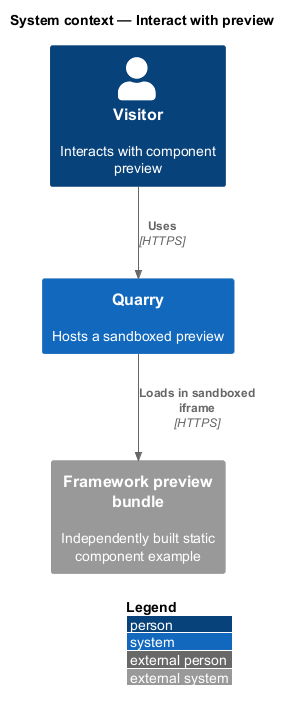
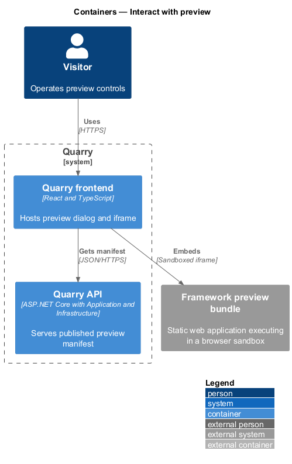
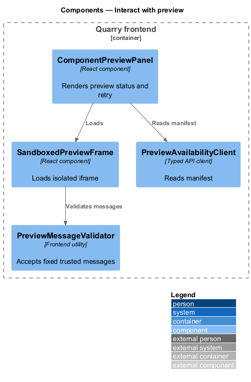
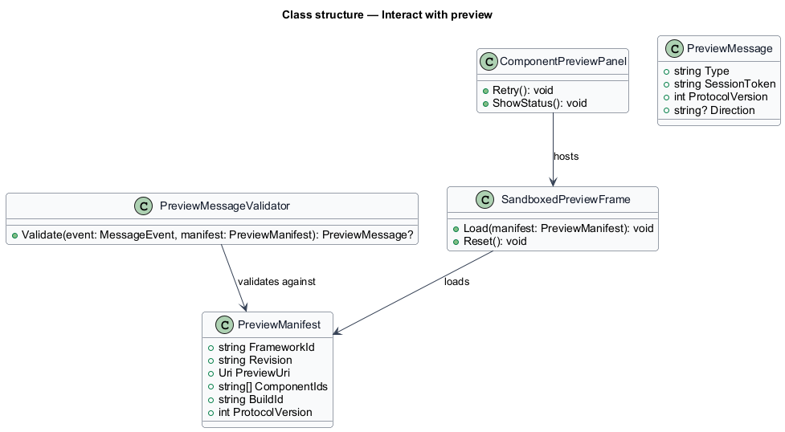
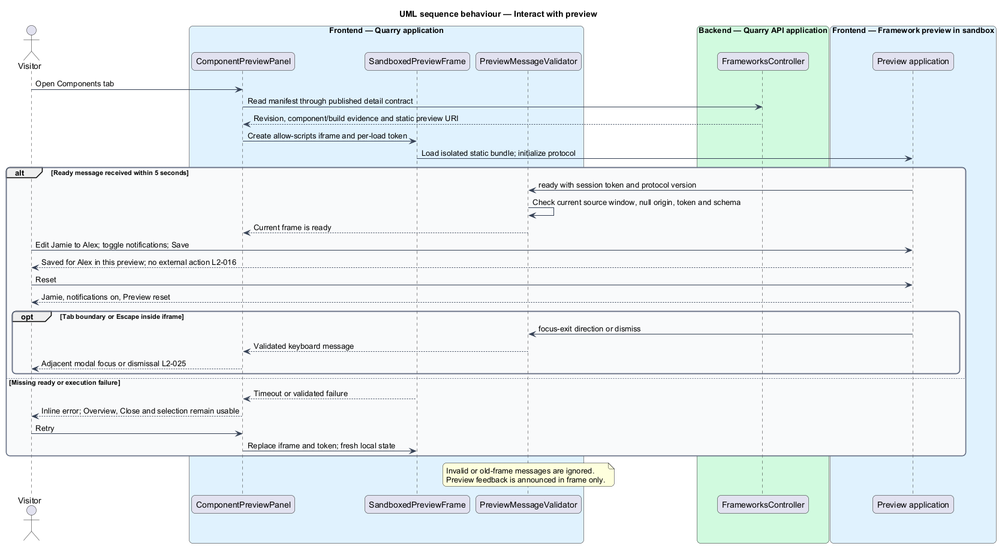

# Interact with preview

## Overview

Component preview lets a visitor operate a small interactive example before choosing a framework. A *preview bundle* is a framework-owned static asset entry point. A *preview host* is the Quarry dialog component that loads that bundle in a sandboxed iframe.

The feature preserves framework independence. The parent page supplies no credentials, maintenance authority, or direct DOM access to a preview. A preview reports documented lifecycle and keyboard-navigation messages through a validated contract.

## Description

- `ComponentPreviewPanel` owns loading, ready, unavailable, and retry status inside the Components tab. Edited-input feedback stays inside the preview.
- `SandboxedPreviewFrame` creates an iframe with `sandbox="allow-scripts"` and a framework-specific accessible title. It grants no same-origin, form-submission, popup, or top-navigation permission.
- `PreviewMessageValidator` accepts only the current frame window, per-load session token, and fixed message schema before changing host state. The sandbox's expected message origin is the opaque origin `null`, not the preview URL's origin.
- `PreviewManifest` describes the selected framework revision and static preview URL.
- `PreviewAvailabilityClient` obtains the manifest from published framework detail data.

The preview bundle executes in the browser. Its manifest binds the static entry point to framework revision, component IDs, and build evidence. The asset host is isolated from Quarry credentials and serves a restrictive content policy: only declared static assets load, network connections and form actions are disabled. Sandbox restrictions alone do not block network requests. The maintenance policy remains authoritative even if a request reaches the API. Opaque-origin assets use compatible static script loading and no credentialed fetches.

The parent validates `event.source` against the current frame and accepts `null` origin only with the per-load session token and known message type. A handshake sends only that token and protocol version into the opaque-origin frame; it contains no query, credentials, or preview input. Retrying replaces the frame and token, invalidating late messages. These choices follow the browser rules for [sandboxed iframes](https://developer.mozilla.org/en-US/docs/Web/HTML/Reference/Elements/iframe) and [postMessage](https://developer.mozilla.org/en-US/docs/Web/API/Window/postMessage).

The baseline bundle owns `Display name` (Jamie), `Email notifications` (enabled), `Save changes`, and `Reset`. Saving Alex reports `Saved for Alex in this preview.`; a blank name uses `you`. Reset restores defaults and reports `Preview reset.`. Input values and save feedback remain inside the preview; no API mutation or selection change occurs. Generic controls are labeled illustrative and cannot establish released-component evidence.

The host waits up to 5 seconds for `ready`, a design timeout independent of API search deadlines. Missing readiness or an execution `failure` message shows an inline error and keyboard-reachable retry while Overview, Close, and selection remain usable. Feedback is announced once within the preview; the host announces only lifecycle errors, avoiding duplicate status messages. Unmounting or closing discards preview state.

The bundle's keyboard adapter reports `dismiss` for Escape and `focus-exit` with forward/backward direction at its tab boundaries. The parent moves focus to the adjacent dialog control, never background content. These messages contain no arbitrary selector or action payload. Frame focus is entered through normal keyboard navigation; the parent modal traps navigation outside the frame. Verification covers focus crossing in both directions, Escape inside the frame, malformed and stale messages, timeout, retry, and blocked credential, network, and top-navigation access.

## Requirements

| L2 ID | Refines (L1) | Requirement |
|-------|--------------|-------------|
| `L2-016` | `L1-006` | Production previews shall demonstrate documented components from the identified framework. The baseline interactive sample shall include a labeled text input, switch, save feedback, and reset behavior. Generic stand-ins shall be labeled as illustrative and shall not be accepted as proof of released components. |
| `L2-024` | `L1-010` | Discovery and modal layouts shall adapt across the entire UI viewport matrix. XS and SM use one card column, MD uses two, and LG and XL use three. |
| `L2-025` | `L1-010` | Every discovery control shall be usable by keyboard with visible focus and logical navigation. Details shall constrain focus until dismissed. |
| `L2-026` | `L1-010` | Controls, results, tabs, dialogs, switches, and status messages shall expose meaningful semantics to assistive technology. |
| `L2-027` | `L1-010` | Quarry shall preserve readability and operation under zoom and motion preferences. These criteria are explicit baseline checks rather than a claim of formal accessibility certification. |
| `L2-029` | `L1-011` | The API shall enforce input limits independently of browser checks and treat queries, metadata, and preview input as untrusted data. Queries shall be limited to 500 UTF-16 code units after trimming, matching the browser field's counting convention. |
| `L2-030` | `L1-011` | Production transport and integrations shall protect user queries and service credentials. Query history shall not be persisted by Quarry; search text shall stay out of URLs, routine telemetry, and browser persistent storage. |
| `L2-036` | `L1-013` | Quarry shall expose distinct states for work in progress, valid empty results, incomplete indexing, and service failure, preserving the user's recoverable input and selection. |
| `L2-041` | `L1-015` | Frontend acceptance tests shall use Playwright and Page Objects with shared backend fixtures. Separate API, retrieval, and framework checks shall establish the behaviors that frontend mocks cannot prove. |

## Diagrams

The context separates a visitor's Quarry session from an independently built preview bundle.

The container view uses an iframe boundary between the Quarry frontend and the framework preview asset.

The component view limits messages and sandbox permissions.

The class diagram shows manifest and message validation types.

The sequence shows a ready message and a failed-load retry.

