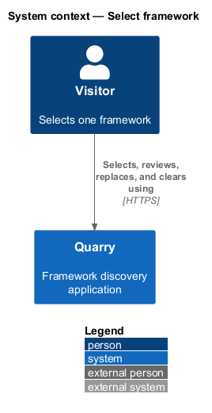
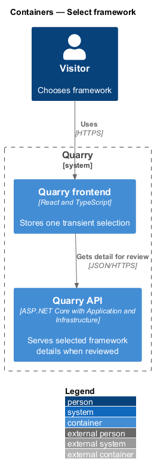
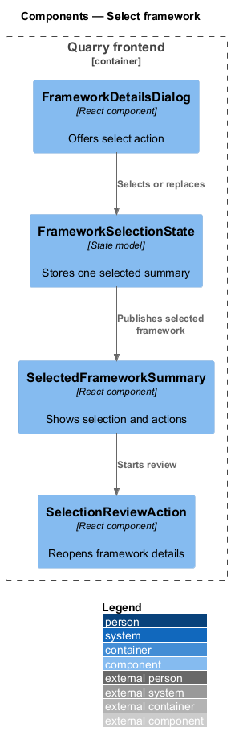
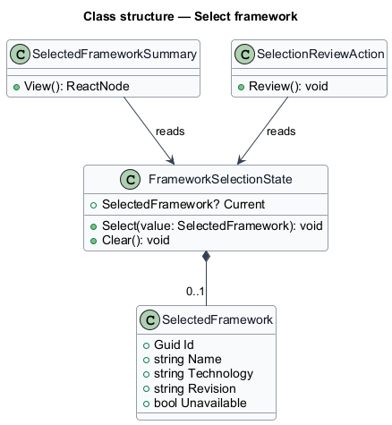
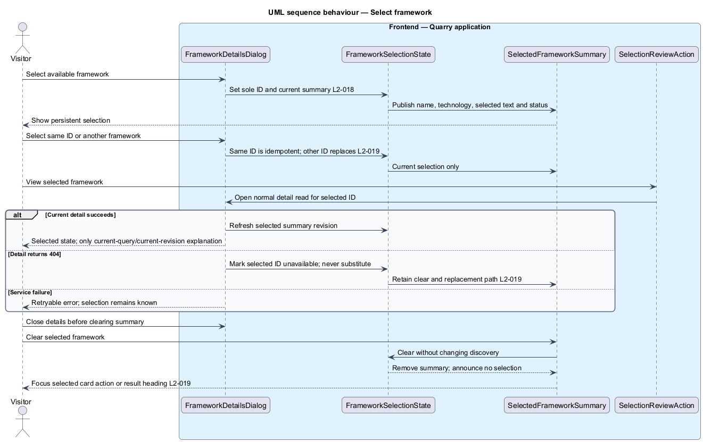

# Select framework

## Overview

Selection records the one framework a visitor intends to use. A *selection summary* is the persistent, browser-memory view that names the selected framework and provides review or clear actions. Selection is independent of the current search, filter, details dialog, or example presentation colors.

The feature allows selecting a framework from details, replacing a prior selection, reviewing it in the same dialog, and clearing it. Page reload clears selection because no query history or browser-persistent selection storage is used.

## Description

- `FrameworkSelectionState` stores one selected framework summary in React memory.
- `SelectFrameworkAction` updates that state from the details dialog and announces the result through a live status region.
- `SelectedFrameworkSummary` renders the selected name, technology, review action, and clear action in a persistent summary with enough page clearance to expose final card actions.
- `SelectionReviewAction` opens the selected framework's detail dialog through the same `DiscoveryReturnState` path.

Selection consumes only returned framework identity and metadata. It does not change semantic score, technology filtering, searchable metadata, or eligibility. The state is local and creates no API write or user profile.

Selecting an available detail revision sets the sole selected ID, changes its button to `Selected`, and announces the change once. Selecting the same ID is idempotent. Selecting another ID immediately replaces it without confirmation. Selected cards include a textual indicator. Review performs the normal detail read and shows a recommendation explanation only when the current query and revision support it.

An observed 404 for the selected ID marks the summary unavailable while retaining its identity and clear/replace actions. A successful newer detail read updates its summary metadata and revision. Network or service errors do not establish that the framework was withdrawn. Clearing selection leaves discovery unchanged, announces no selection, and focuses that card's detail action if present, otherwise the programmatically focusable result heading. A full reload clears both selection and discovery state.

## Requirements

| L2 ID | Refines (L1) | Requirement |
|-------|--------------|-------------|
| `L2-017` | `L1-006` | Closing details shall preserve discovery state and restore focus. Reopening a preview shall start with its default local state. |
| `L2-018` | `L1-007` | Quarry shall retain zero or one selected framework by stable ID during the page session and provide a persistent summary with its name, technology, review action, and clear action. |
| `L2-019` | `L1-007` | Selecting another framework shall replace the previous selection. Explicitly clearing selection shall preserve discovery state. Known unavailable selections shall be identified honestly. |
| `L2-021` | `L1-008` | Discovery shall explain implementation-time customization and exclude color-oriented ranking and controls. |
| `L2-024` | `L1-010` | Discovery and modal layouts shall adapt across the entire UI viewport matrix. XS and SM use one card column, MD uses two, and LG and XL use three. |
| `L2-025` | `L1-010` | Every discovery control shall be usable by keyboard with visible focus and logical navigation. Details shall constrain focus until dismissed. |
| `L2-026` | `L1-010` | Controls, results, tabs, dialogs, switches, and status messages shall expose meaningful semantics to assistive technology. |
| `L2-027` | `L1-010` | Quarry shall preserve readability and operation under zoom and motion preferences. These criteria are explicit baseline checks rather than a claim of formal accessibility certification. |
| `L2-035` | `L1-013` | The frontend shall associate every request with its query, technology, and browse-page state and shall render only responses applicable to the current state. |
| `L2-041` | `L1-015` | Frontend acceptance tests shall use Playwright and Page Objects with shared backend fixtures. Separate API, retrieval, and framework checks shall establish the behaviors that frontend mocks cannot prove. |

## Diagrams

The context keeps selection inside the visitor's Quarry session.

The container view shows that selection state remains in the frontend.

The component view identifies selection and review actions.

The class diagram models the one-item invariant.

The sequence shows replacing and clearing a selection.

