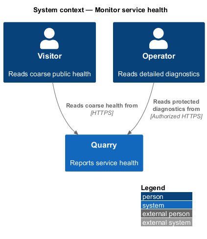
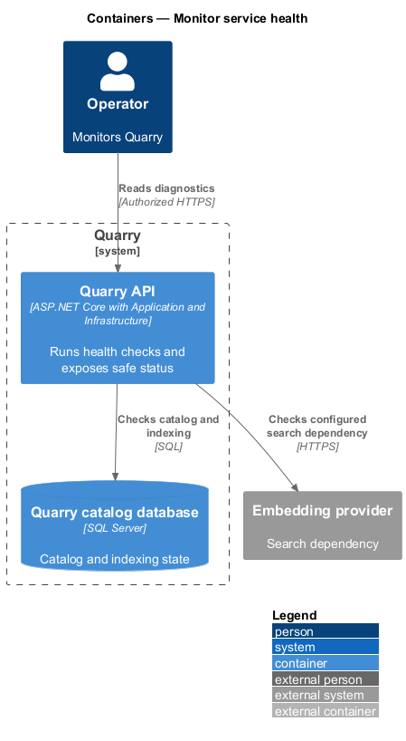
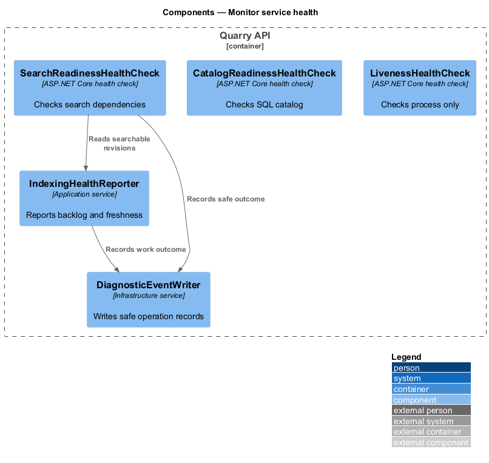
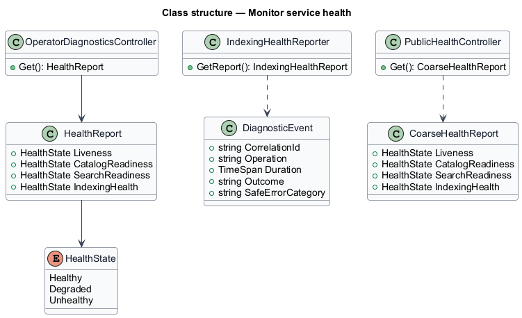
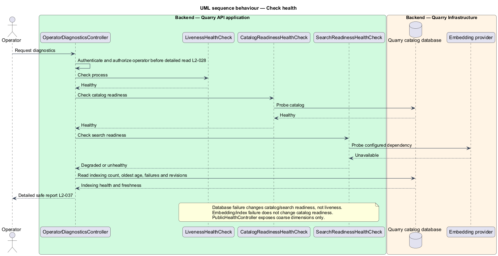

# Monitor service health

## Overview

Service health separates process availability from dependency readiness. *Liveness* states whether the API process can answer. *Catalog readiness* states whether published catalog persistence is usable. *Search readiness* states whether semantic retrieval dependencies are usable. *Indexing health* states whether pending work and searchable revisions meet freshness expectations.

The feature gives anonymous callers coarse health only and provides detailed diagnostics to operators. Diagnostic records use correlation or work IDs, operation, duration, outcome, and safe categories; they never contain raw query text or secrets.

## Description

- `LivenessHealthCheck` reports process viability without database or embedding calls.
- `CatalogReadinessHealthCheck` verifies SQL connectivity and published catalog availability.
- `SearchReadinessHealthCheck` evaluates embedding configuration, availability, and index usability without issuing user-query work.
- `IndexingHealthReporter` exposes pending count, oldest age, failures, and searchable-revision freshness.
- `DiagnosticEventWriter` records safe structured operation data.
- `OperatorDiagnosticsController` protects detailed health data; `PublicHealthController` returns coarse anonymous status.

Invalid required persistence or embedding configuration fails readiness with an actionable operator message. Public responses omit dependency destinations, configuration, stack traces, and secret values.

Catalog readiness depends on catalog persistence, not index completeness. Database failure leaves liveness healthy and catalog readiness unhealthy. An embedding outage or incompatible/pending index degrades search readiness while catalog reads remain available. An empty but healthy published catalog is ready. Search checks use bounded synthetic probes or cached provider health rather than real user text.

Public health reports each dimension's coarse status only. Operator-authorized diagnostics add backlog count, oldest pending age, failure count, and searchable/source revisions, highlighting a freshness age above 60 seconds. Successful and failed requests record correlation ID, operation, duration, outcome, and safe category. Index records additionally carry work ID, framework ID, and source revision. Operator authentication and authorization apply before detailed diagnostics are collected or returned.

## Requirements

| L2 ID | Refines (L1) | Requirement |
|-------|--------------|-------------|
| `L2-030` | `L1-011` | Production transport and integrations shall protect user queries and service credentials. Query history shall not be persisted by Quarry; search text shall stay out of URLs, routine telemetry, and browser persistent storage. |
| `L2-032` | `L1-012` | Performance shall be measured against 1,000 published, fully indexed frameworks with descriptions up to 2,000 characters and up to 20 tags each. The API and database benchmark allocation is 4 vCPU and 8 GiB RAM combined; embedding-model hardware or hosted provider configuration, browser version, and network profile shall be recorded separately. Use 20 distinct admitted clients, a two-minute warm-up, and a ten-minute measured run at 10 requests/second: 60% catalog reads, 20% details, and 20% semantic searches, distributed evenly across clients with varied uncached queries. |
| `L2-034` | `L1-013` | Published metadata, revisions, and unfinished indexing work shall survive restarts. SQL Server Express or LocalDB shall hold catalog persistence through Quarry.Infrastructure. Search indexes shall be recoverable from catalog metadata. |
| `L2-036` | `L1-013` | Quarry shall expose distinct states for work in progress, valid empty results, incomplete indexing, and service failure, preserving the user's recoverable input and selection. |
| `L2-037` | `L1-013` | Operators shall be able to distinguish process liveness, catalog readiness, search readiness, and indexing health. Diagnostics shall expose correlation, outcome, and timing without raw query content. |
| `L2-042` | `L1-015` | Implementation shall comply with the binding constraints in L1 and `AGENTS.md`. Review shall verify these constraints directly without tests that assert filesystem placement. |

## Diagrams

The context separates public coarse status from protected operator diagnostics.

The containers show readiness checks against SQL and the configured embedding provider.

The component view identifies the four health dimensions.

The class diagram models the safe health report.

The sequence shows a search dependency failure while catalog readiness remains healthy.

