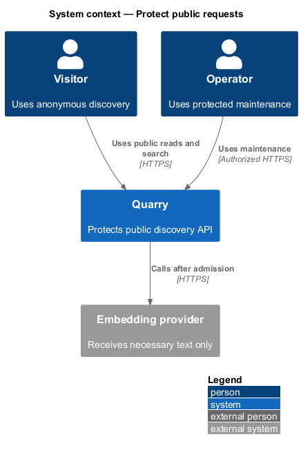
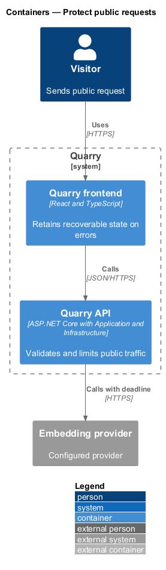
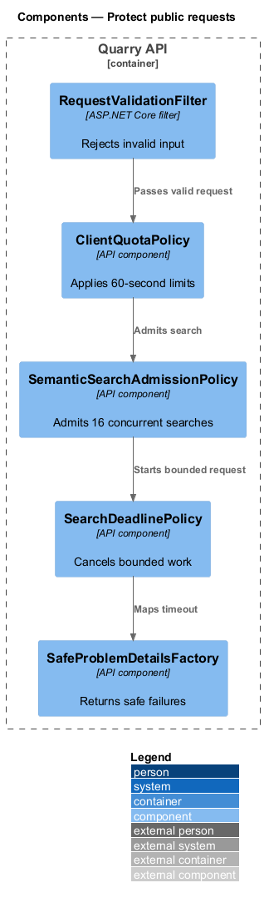
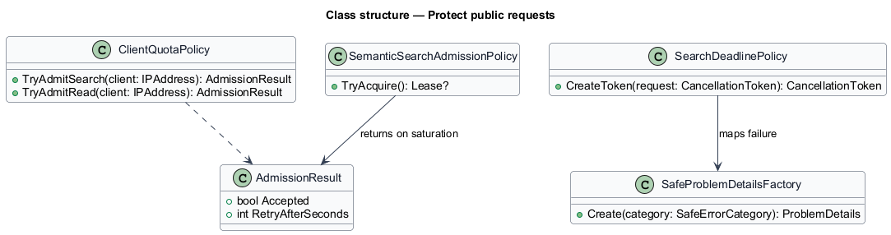
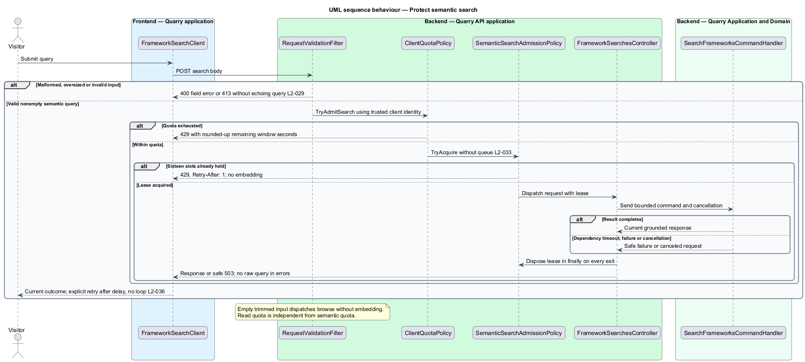

# Protect public requests

## Overview

Public discovery is anonymous, but it accepts untrusted request input and calls an embedding dependency. A *trusted client identity* is the connection address supplied by the server or a configured trusted proxy. An *admission slot* is one of the 16 concurrent semantic-search permits held for the full admitted search, through retrieval and response construction.

The feature validates requests, limits public traffic, bounds embedding work, protects query text, and returns recoverable errors. Operator maintenance is separately authorized and cannot be reached through public catalog content.

## Description

- `RequestValidationFilter` rejects malformed path, cursor, filter, and body values before handler invocation.
- `ClientQuotaPolicy` keeps independent fixed-window counters: 30 searches and 120 catalog/detail reads per trusted client each 60 seconds.
- `SemanticSearchAdmissionPolicy` uses a non-queuing 16-permit gate and returns `429` with `Retry-After: 1` on saturation.
- `SearchDeadlinePolicy` cancels embedding work at five seconds and the full request at eight seconds.
- `SafeProblemDetailsFactory` maps validation, quota, timeout, and dependency errors to public-safe responses.
- `QueryRedactionPolicy` prevents raw query content from URLs, persistent storage, routine logs, telemetry labels, and error responses.

Forwarded headers are honored only from configured trusted proxies. Browser-visible retry controls use the server `Retry-After` value and never automatically retry.

Input validation trims queries and checks their UTF-16 length independently of the browser. Lengths 1–500 enter semantic search; empty text dispatches browse behavior without an embedding or semantic admission slot. HTTP bodies above 16 KiB receive 413 before binding. Invalid filter/cursor/page-size values and overlong queries receive 400 with a safe field error. Accepted HTML, SQL, and instruction-like text remains data: rendering escapes it, SQL uses parameters, and explanation generation has no tool or maintenance authority.

Quota admission precedes concurrency acquisition; rejected requests perform no embedding work. Search and read counters are independent. Quota rejection returns the remaining fixed-window seconds rounded up; concurrency rejection uses one second. The implementation releases its lease in `finally` on success, exception, timeout, and cancellation. Cancellation reaches all dependency work and releases the slot within one second. Noncooperative provider waits are bounded locally; their late completions cannot retain a slot or mutate a completed response.

The API maps catalog/embedding failure and timeout to HTTP 503 with safe code and correlation ID. HTTP 400 field errors never echo rejected query values. Query bodies are excluded from request logging, traces, metrics labels, persistent browser storage, and history tables. HTTPS protects public transport; embedding secrets stay server-side. External processing is disclosed before submission with the provider's recorded retention setting. Synthetic-marker checks inspect success and failure telemetry for leakage.

## Requirements

| L2 ID | Refines (L1) | Requirement |
|-------|--------------|-------------|
| `L2-028` | `L1-011` | Public read operations shall work without sign-in. Public users shall have no catalog or index mutation authority. This requirement does not introduce an administrative UI. |
| `L2-029` | `L1-011` | The API shall enforce input limits independently of browser checks and treat queries, metadata, and preview input as untrusted data. Queries shall be limited to 500 UTF-16 code units after trimming, matching the browser field's counting convention. |
| `L2-030` | `L1-011` | Production transport and integrations shall protect user queries and service credentials. Query history shall not be persisted by Quarry; search text shall stay out of URLs, routine telemetry, and browser persistent storage. |
| `L2-031` | `L1-011` | The baseline service shall enforce per-client quotas of 30 semantic searches and 120 catalog/detail reads per 60-second fixed window. Quotas shall be configurable and use the trusted connection address, not arbitrary client-supplied forwarding headers. |
| `L2-033` | `L1-012` | Each API instance shall admit at most 16 simultaneous semantic searches, perform no unbounded request queuing, and bound dependency waits. The embedding deadline is 5 seconds and the API search deadline is 8 seconds. |
| `L2-036` | `L1-013` | Quarry shall expose distinct states for work in progress, valid empty results, incomplete indexing, and service failure, preserving the user's recoverable input and selection. |
| `L2-037` | `L1-013` | Operators shall be able to distinguish process liveness, catalog readiness, search readiness, and indexing health. Diagnostics shall expose correlation, outcome, and timing without raw query content. |
| `L2-041` | `L1-015` | Frontend acceptance tests shall use Playwright and Page Objects with shared backend fixtures. Separate API, retrieval, and framework checks shall establish the behaviors that frontend mocks cannot prove. |

## Diagrams

The context distinguishes anonymous visitors, operators, and the external embedding provider.

The container view places protection at the API boundary and bounds dependency calls in Application.

The component view shows validation, quotas, admission, deadlines, and safe responses.

The class diagram models the separate quota and admission limits.

The sequence shows overload rejection before embedding work starts.

