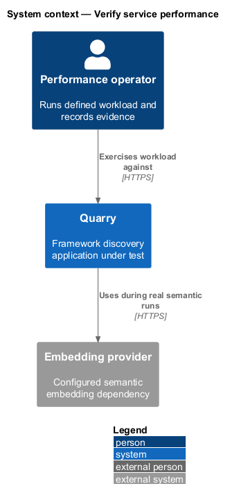
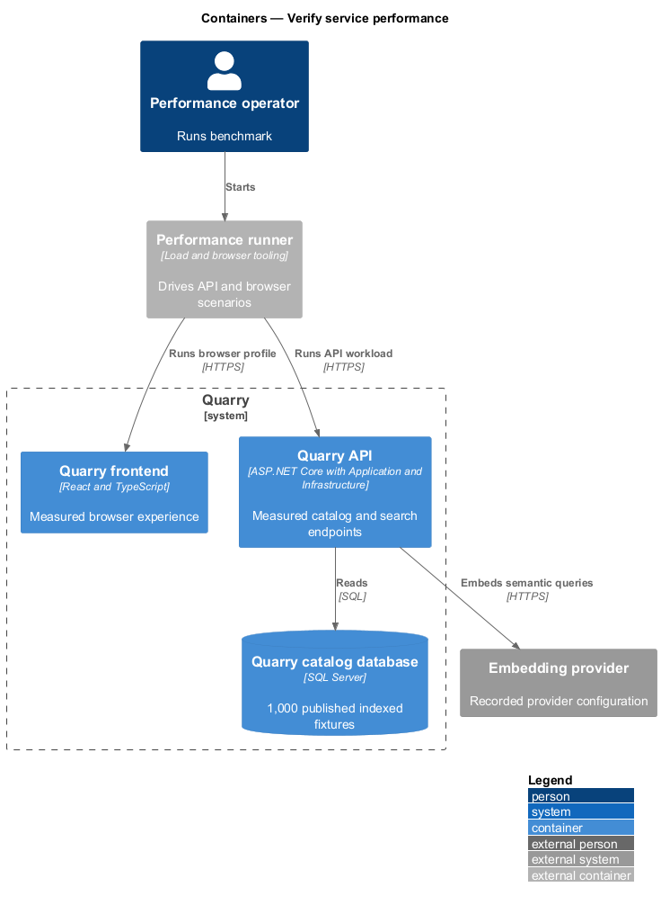
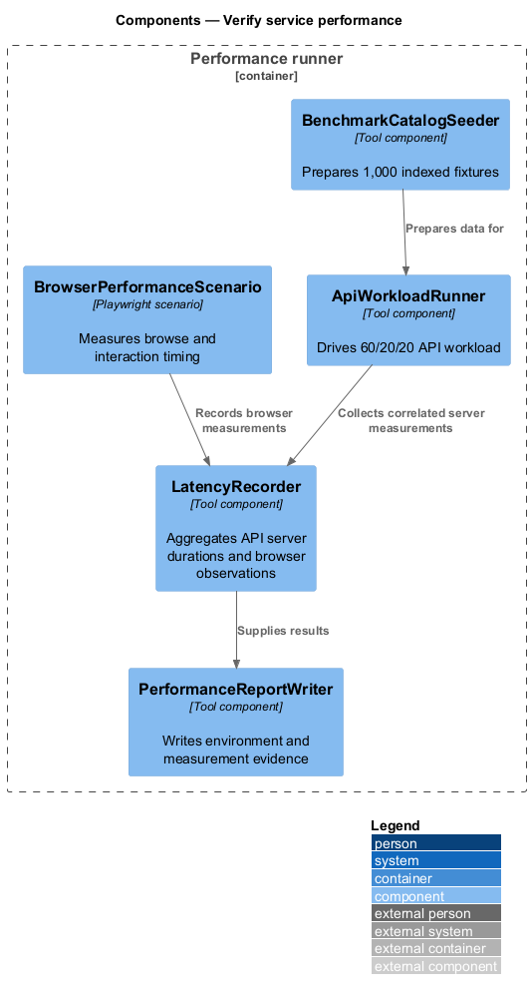
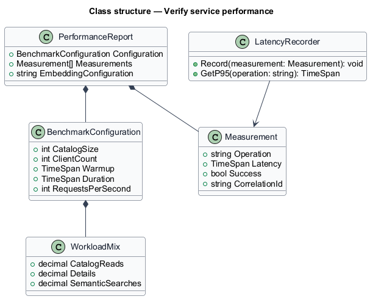
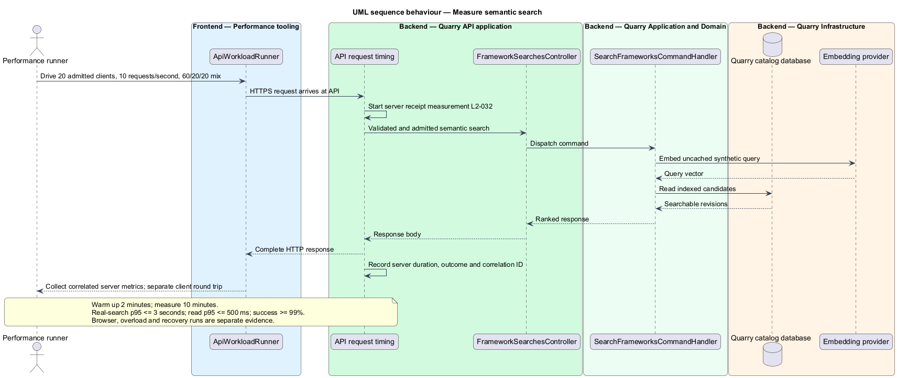

# Verify service performance

## Overview

Performance verification produces repeatable evidence for Quarry's catalog, details, semantic search, and browser interaction budgets. A *benchmark run* is the defined two-minute warm-up followed by a ten-minute measured workload. A *real retrieval result* uses the configured embedding provider and compatible indexed vectors; a stubbed result is labeled and cannot satisfy the semantic-search budget.

The feature records the workload, environment, latency distribution, success outcomes, browser profile, and embedding configuration. It does not invent successful measurement values before the required run completes.

## Description

- `ApiWorkloadRunner` drives 20 distinct admitted clients at 10 requests per second: 60% catalog reads, 20% details, and 20% semantic searches.
- `BenchmarkCatalogSeeder` supplies 1,000 published fully indexed fixtures, bounded descriptions, and tags.
- `LatencyRecorder` measures from API HTTP receipt to response completion and reports p95 and success count.
- `BrowserPerformanceScenario` executes fresh browse and loaded-interaction journeys under the defined network and CPU profile.
- `PerformanceReportWriter` records hardware allocation, model or provider settings, browser version, network profile, workload, and outcomes.

The report requires the API/database allocation of 4 vCPU and 8 GiB RAM combined. Embedding hardware or hosted-provider configuration is recorded separately. Target values remain requirements to verify, not completed design claims.

Server instrumentation measures HTTP receipt through response completion; client network round-trip measurements are recorded separately. The admitted workload targets catalog/detail p95 at most 500 ms, real semantic-search p95 at most 3 seconds, and at least 99% successful valid requests. Distinct clients use trusted connection identities, not spoofed headers. Queries vary and remain uncached; operational telemetry contains correlation and timing but no query text.

Browser evidence uses a production build, 10 Mbps download, 2 Mbps upload, 100 ms round-trip latency, and fourfold CPU throttling. Twenty fresh navigations establish a p95 at most 3 seconds to usable search and first cards. Twenty iterations each of loaded detail tabs, preview controls, and selection establish input-to-visible-feedback p95 at most 100 ms.

Separate overload runs hold 16 searches, verify rejection of the 17th without dependency work, and exercise five/eight-second deadlines and cancellation-slot release within one second. Memory returns within 20% of the post-warm-up baseline within 60 seconds after drain and full collection in the instrumented environment. Recovery runs verify 60-second indexing freshness/restart recovery and rebuilding 1,000 entries within 30 minutes. Real-model relevance evaluation records the L2-006 judgments independently of latency; a fast irrelevant response does not satisfy release evaluation.

## Requirements

| L2 ID | Refines (L1) | Requirement |
|-------|--------------|-------------|
| `L2-006` | `L1-003` | The release evaluation shall verify meaning-based discovery and rejection of irrelevant matches using a frozen catalog and ranking configuration. Expected matches shall be judged by supported capabilities. |
| `L2-032` | `L1-012` | Performance shall be measured against 1,000 published, fully indexed frameworks with descriptions up to 2,000 characters and up to 20 tags each. The API and database benchmark allocation is 4 vCPU and 8 GiB RAM combined; embedding-model hardware or hosted provider configuration, browser version, and network profile shall be recorded separately. Use 20 distinct admitted clients, a two-minute warm-up, and a ten-minute measured run at 10 requests/second: 60% catalog reads, 20% details, and 20% semantic searches, distributed evenly across clients with varied uncached queries. |
| `L2-033` | `L1-012` | Each API instance shall admit at most 16 simultaneous semantic searches, perform no unbounded request queuing, and bound dependency waits. The embedding deadline is 5 seconds and the API search deadline is 8 seconds. |
| `L2-034` | `L1-013` | Published metadata, revisions, and unfinished indexing work shall survive restarts. SQL Server Express or LocalDB shall hold catalog persistence through Quarry.Infrastructure. Search indexes shall be recoverable from catalog metadata. |
| `L2-037` | `L1-013` | Operators shall be able to distinguish process liveness, catalog readiness, search readiness, and indexing health. Diagnostics shall expose correlation, outcome, and timing without raw query content. |
| `L2-040` | `L1-015` | Each executable-code increment shall implement the smallest end-to-end slice of one or more stated L2 behaviors using ATDD. This is a delivery evidence requirement, not a repository-layout test. |
| `L2-041` | `L1-015` | Frontend acceptance tests shall use Playwright and Page Objects with shared backend fixtures. Separate API, retrieval, and framework checks shall establish the behaviors that frontend mocks cannot prove. |

## Diagrams

The context identifies performance evidence as an operator-run interaction with the production-like Quarry deployment.

The container view separates workload tooling, browser scenarios, Quarry, SQL Server, and embedding configuration.

The component view records workload composition and safe measurement reporting.

The class diagram captures reproducible report inputs and outcomes.

The sequence shows one measured semantic-search request and its correlated observation.

