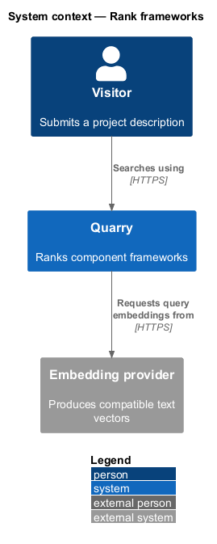
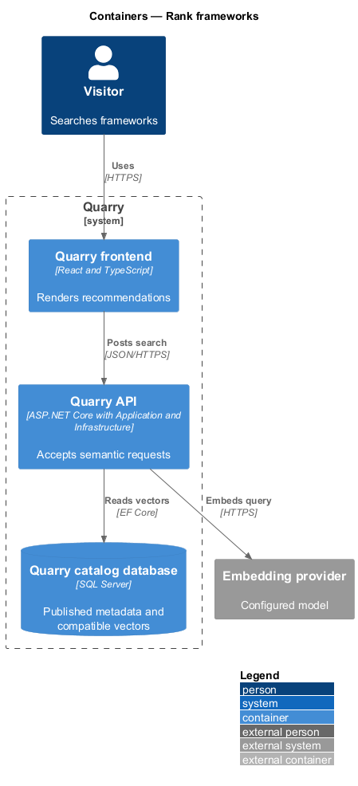
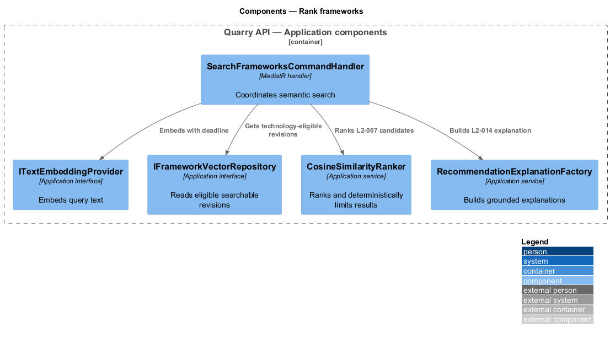
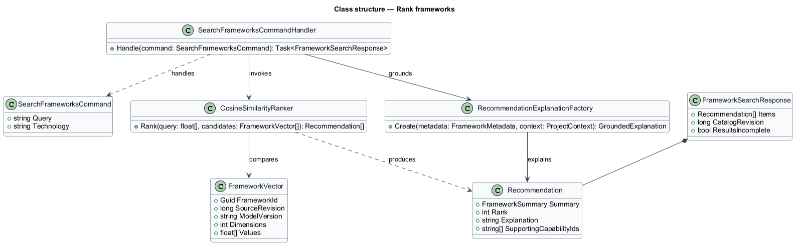
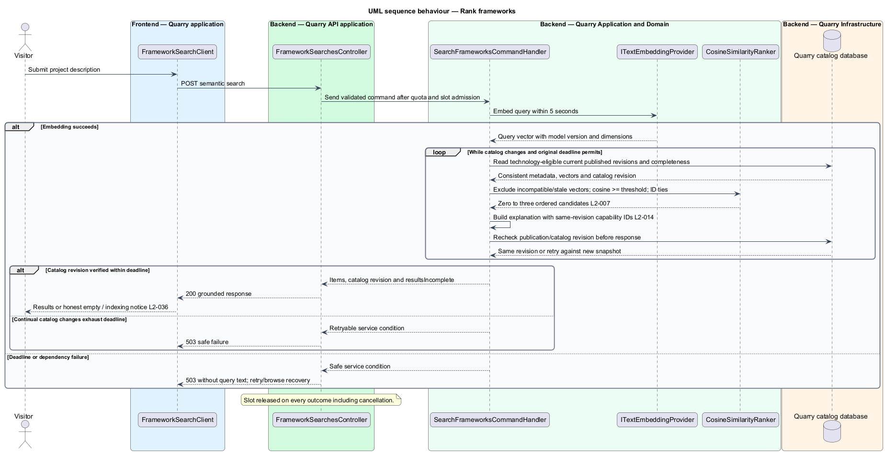

# Rank frameworks

## Overview

Semantic ranking finds frameworks suitable for a submitted project description even when the catalog lacks the query's literal wording. A *query embedding* is the numeric representation returned by the configured embedding model. A *searchable revision* is a published framework revision whose metadata vector corresponds to that revision.

The feature ranks eligible searchable revisions by cosine similarity, applies technology eligibility before the top-three limit, and returns explanations tied to stored capabilities. It does not claim that a component framework provides an industry application or domain compliance.

## Description

- `SearchFrameworksCommandHandler` embeds the query and coordinates retrieval.
- `ITextEmbeddingProvider` produces compatible query vectors. Provider, model, retention, and threshold are `<TO SUPPLY>` until a real evaluation selects them.
- `IFrameworkVectorRepository` reads published searchable revisions and filters technology before limiting results.
- `CosineSimilarityRanker` computes bounded in-process ranking for the 1,000-entry baseline, orders score ties by stable framework ID using ordinal ascending order, and includes scores at or above the calibrated threshold.
- `RecommendationExplanationFactory` returns explanation text and supporting capability IDs from the same metadata revision. Tags and use cases provide context but do not replace capability references.
- `FrameworkSearchResponse` carries the submitted query context, rank, capability-grounded explanation, catalog revision, and incomplete-index indicator.

The handler uses a five-second embedding deadline within an eight-second API deadline. It accepts no more than 16 concurrent semantic searches per instance. A timeout returns a safe dependency condition and exposes no raw query in telemetry or errors.

`IFrameworkVectorRepository` is an Application interface implemented by Infrastructure's `FrameworkVectorRepository`. Candidates include the current published metadata, source revision, model version, dimensions, and vector values. Incompatible, stale, draft, withdrawn, and deleted revisions never enter comparison. Excluding published entries pending compatible indexing sets `resultsIncomplete`; zero candidates with this flag produce an indexing notice, not a definitive no-match claim. Compatibility faults also update indexing diagnostics.

The handler reads technology-eligible candidates and completeness in a consistent catalog snapshot, applies cosine similarity and the ID tie-break, then takes at most three. It rechecks the catalog revision before responding. A changed revision triggers a fresh candidate read and ranking within the original deadline; continual changes produce a retryable service condition. This prevents returning a withdrawn entry or pairing an old vector with new metadata.

`FrameworkSearchResponse` contains `items`, `catalogRevision`, and `resultsIncomplete`. Each recommendation contains `FrameworkSummary`, contiguous `rank`, explanation text, and `supportingCapabilityIds`. Query and technology context stay in the client's request snapshot; the response need not echo raw query text. Similarity remains internal, never a confidence percentage. The factory validates every supporting ID and substitutes factual text citing existing capabilities if grounding fails.

Release evaluation freezes the model/version, input construction, cosine threshold, and augmented synthetic catalog from L2-006. It checks the practice/booking/intake top three, related wording, commerce and analytics first results, and the unrelated-query rejection. Reports record catalog revision, model version, threshold, synthetic query, returned IDs, and order. Known-vector tests verify threshold equality, ID ties, zero-to-three results, and technology filtering before the limit; only real embeddings satisfy semantic relevance evaluation.

## Requirements

| L2 ID | Refines (L1) | Requirement |
|-------|--------------|-------------|
| `L2-005` | `L1-003` | Production search shall generate embeddings from framework descriptions and tags and from the submitted query using a compatible embedding model. It shall retrieve by vector similarity. Hard-coded query-to-framework mappings shall not fulfill this requirement. |
| `L2-006` | `L1-003` | The release evaluation shall verify meaning-based discovery and rejection of irrelevant matches using a frozen catalog and ranking configuration. Expected matches shall be judged by supported capabilities. |
| `L2-007` | `L1-003` | Search shall return at most three qualifying recommendations for the current query and technology, ordered by descending cosine similarity. This limit adopts the mock's focused presentation as a baseline decision. Equal scores shall be ordered by stable framework ID using ordinal ascending order. |
| `L2-010` | `L1-004` | Quarry shall provide `All technologies`, React, Angular, Vue, and Web Components as the baseline filter values. Filtering shall apply to eligible candidates before the three-result limit. |
| `L2-013` | `L1-005` | Each recommendation card shall show the framework name, description, descriptive tags, technology, component count, rank, explanation, and an action to inspect details. |
| `L2-014` | `L1-005` | Explanations shall connect the requested project to recorded capabilities. They shall carry supporting capability references in the API response, enabling validation without requiring a generative explanation model. |
| `L2-029` | `L1-011` | The API shall enforce input limits independently of browser checks and treat queries, metadata, and preview input as untrusted data. Queries shall be limited to 500 UTF-16 code units after trimming, matching the browser field's counting convention. |
| `L2-030` | `L1-011` | Production transport and integrations shall protect user queries and service credentials. Query history shall not be persisted by Quarry; search text shall stay out of URLs, routine telemetry, and browser persistent storage. |
| `L2-032` | `L1-012` | Performance shall be measured against 1,000 published, fully indexed frameworks with descriptions up to 2,000 characters and up to 20 tags each. The API and database benchmark allocation is 4 vCPU and 8 GiB RAM combined; embedding-model hardware or hosted provider configuration, browser version, and network profile shall be recorded separately. Use 20 distinct admitted clients, a two-minute warm-up, and a ten-minute measured run at 10 requests/second: 60% catalog reads, 20% details, and 20% semantic searches, distributed evenly across clients with varied uncached queries. |
| `L2-033` | `L1-012` | Each API instance shall admit at most 16 simultaneous semantic searches, perform no unbounded request queuing, and bound dependency waits. The embedding deadline is 5 seconds and the API search deadline is 8 seconds. |
| `L2-041` | `L1-015` | Frontend acceptance tests shall use Playwright and Page Objects with shared backend fixtures. Separate API, retrieval, and framework checks shall establish the behaviors that frontend mocks cannot prove. |

## Diagrams

The context identifies the configured embedding-provider boundary. External processing, if selected, requires disclosure before submission.

The container view places vector retrieval in the Application layer and durable vectors in SQL Server.

The component view shows admission, embedding, eligibility filtering, ranking, and explanation construction.

The class diagram shows the compatible vectors and ordered recommendation result.

The sequence includes empty/incomplete results, revision changes, and deadline alternatives.

