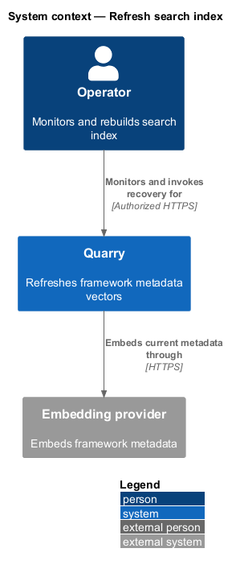
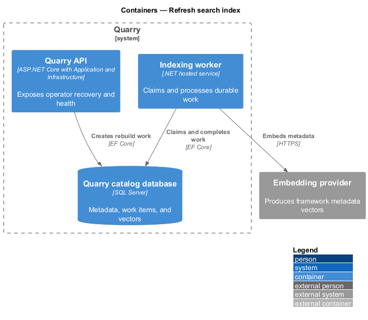
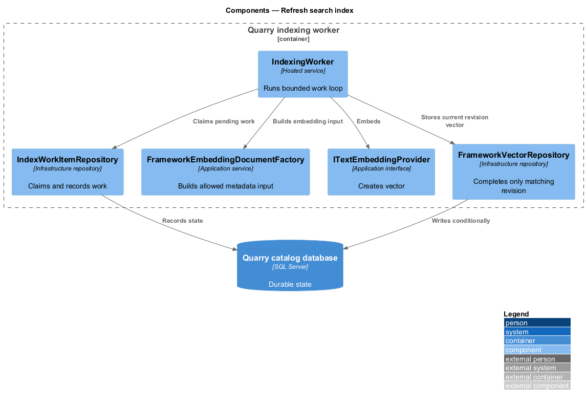
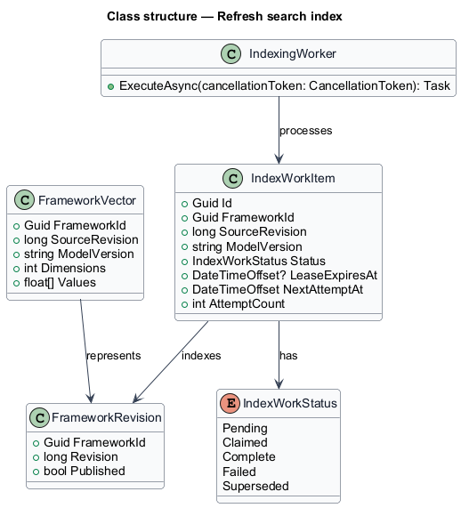
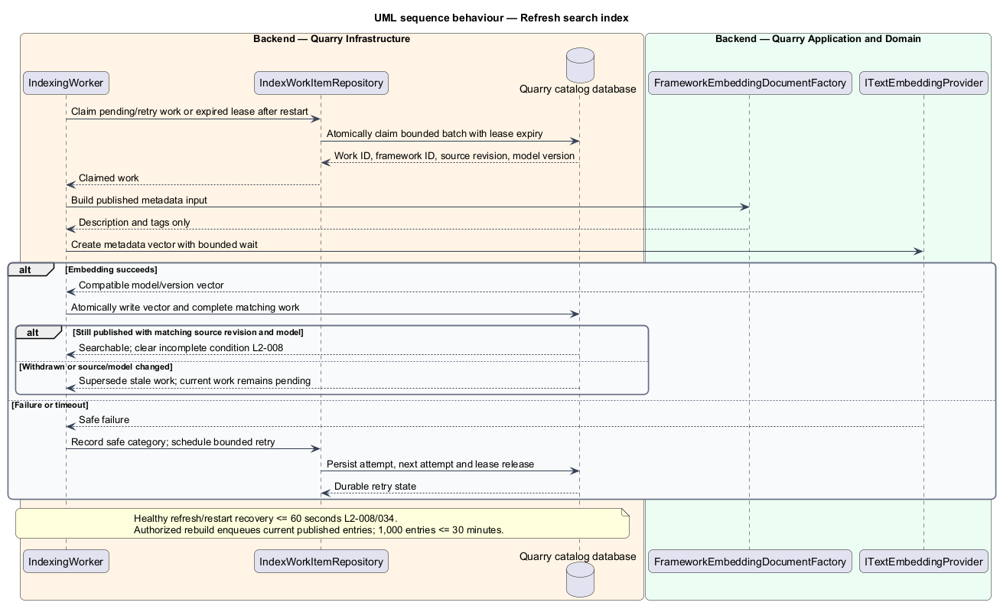

# Refresh search index

## Overview

Index refresh converts the current published metadata revision of each framework into the vector used by semantic ranking. An *index work item* is a durable record for one framework revision. A *searchable revision* is a current published metadata revision with a compatible completed embedding.

This feature makes catalog updates discoverable without claiming that stale, draft, deleted, or interrupted revisions are searchable. It recovers pending work after restarts and supports a documented full rebuild from catalog metadata.

## Description

- `IndexingWorker` is a hosted Infrastructure service that claims pending work in bounded batches.
- `IndexWorkItemRepository` atomically claims, retries, completes, and records failure for work items.
- `FrameworkEmbeddingDocumentFactory` builds the embedding input from the published description and tags only.
- `ITextEmbeddingProvider` creates vectors compatible with the search provider configuration.
- `FrameworkVectorRepository` writes a vector only when the source revision still equals the framework's current published revision.
- `RebuildSearchIndexCommandHandler` creates work for every current published framework after an authorized recovery command.

The worker records framework ID, source revision, work ID, duration, and safe error category. It does not record raw query text because it never processes user queries. Retry policy and backoff values are `<TO SUPPLY>` pending dependency evaluation.

Work items carry a lease expiry, attempt count, next-attempt time, and model version. A restart reclaims expired leases as well as pending or retryable failed work. Each external call has a bounded wait; cancellation and failures release or expire the lease. Completion atomically writes the vector and completes the work item only if publication, source revision, and model configuration still match. Obsolete work becomes superseded rather than retrying indefinitely. A failure keeps the current revision pending and search results incomplete; recovery clears that condition after successful indexing.

Healthy processing and restart recovery meet the 60-second freshness target. The authorized rebuild command idempotently creates work for current published revisions and restores the 1,000-entry catalog within 30 minutes under healthy dependencies. Model changes invalidate incompatible vectors and enqueue current revisions. Browsing and details remain available during indexing. Performance evidence records batching, dependency limits, retry configuration, freshness, and rebuild duration before release.

## Requirements

| L2 ID | Refines (L1) | Requirement |
|-------|--------------|-------------|
| `L2-005` | `L1-003` | Production search shall generate embeddings from framework descriptions and tags and from the submitted query using a compatible embedding model. It shall retrieve by vector similarity. Hard-coded query-to-framework mappings shall not fulfill this requirement. |
| `L2-008` | `L1-003` | Search indexing shall track source revisions, refresh changed descriptions and tags, and prevent obsolete revisions from overwriting newer work. The healthy-service freshness target is 60 seconds after an accepted metadata change. |
| `L2-030` | `L1-011` | Production transport and integrations shall protect user queries and service credentials. Query history shall not be persisted by Quarry; search text shall stay out of URLs, routine telemetry, and browser persistent storage. |
| `L2-032` | `L1-012` | Performance shall be measured against 1,000 published, fully indexed frameworks with descriptions up to 2,000 characters and up to 20 tags each. The API and database benchmark allocation is 4 vCPU and 8 GiB RAM combined; embedding-model hardware or hosted provider configuration, browser version, and network profile shall be recorded separately. Use 20 distinct admitted clients, a two-minute warm-up, and a ten-minute measured run at 10 requests/second: 60% catalog reads, 20% details, and 20% semantic searches, distributed evenly across clients with varied uncached queries. |
| `L2-034` | `L1-013` | Published metadata, revisions, and unfinished indexing work shall survive restarts. SQL Server Express or LocalDB shall hold catalog persistence through Quarry.Infrastructure. Search indexes shall be recoverable from catalog metadata. |
| `L2-036` | `L1-013` | Quarry shall expose distinct states for work in progress, valid empty results, incomplete indexing, and service failure, preserving the user's recoverable input and selection. |
| `L2-037` | `L1-013` | Operators shall be able to distinguish process liveness, catalog readiness, search readiness, and indexing health. Diagnostics shall expose correlation, outcome, and timing without raw query content. |
| `L2-041` | `L1-015` | Frontend acceptance tests shall use Playwright and Page Objects with shared backend fixtures. Separate API, retrieval, and framework checks shall establish the behaviors that frontend mocks cannot prove. |

## Diagrams

The context shows index refresh as an internal Quarry operation backed by an embedding integration.

The containers keep work, revisions, and vectors durable in SQL Server while a hosted worker performs bounded external calls.

The component view shows revision-conditional completion.

The class diagram models the durable work lifecycle.

The sequence shows restart recovery and stale-work suppression.

