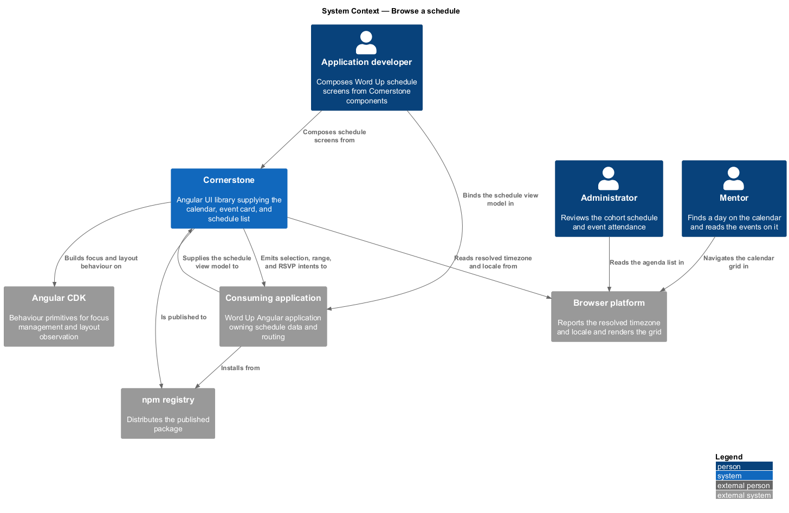
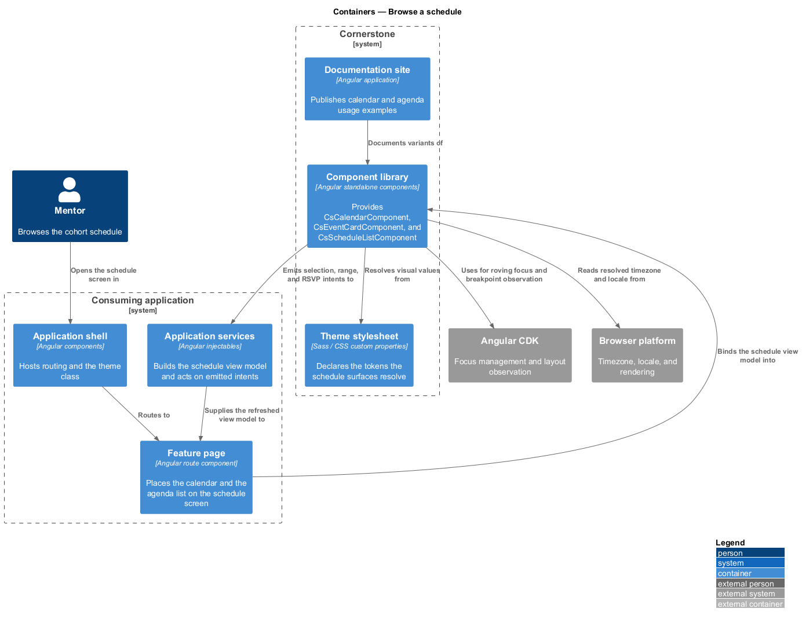
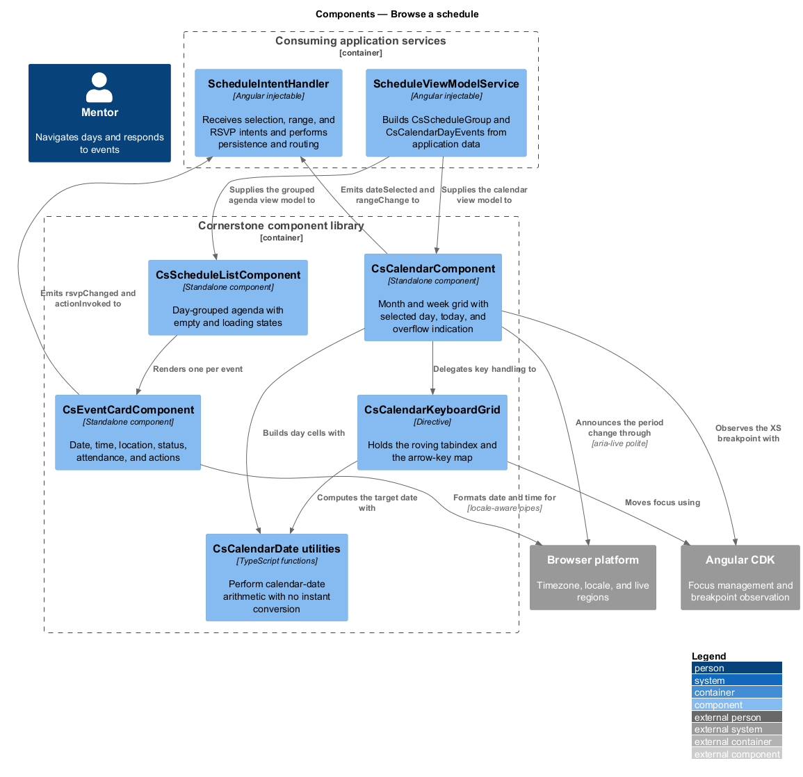
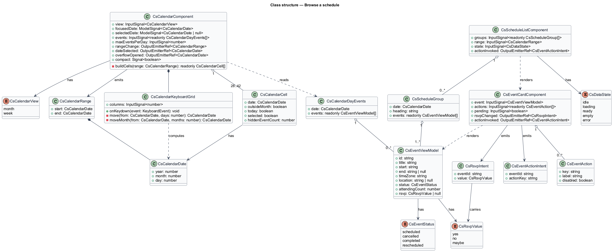
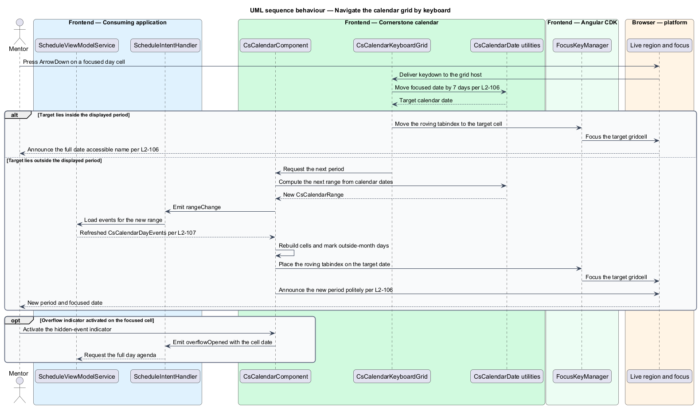
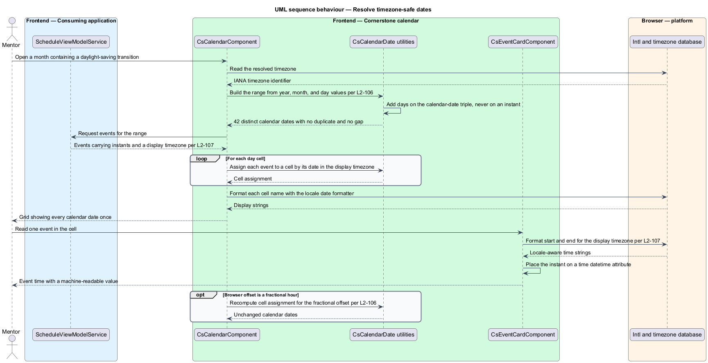
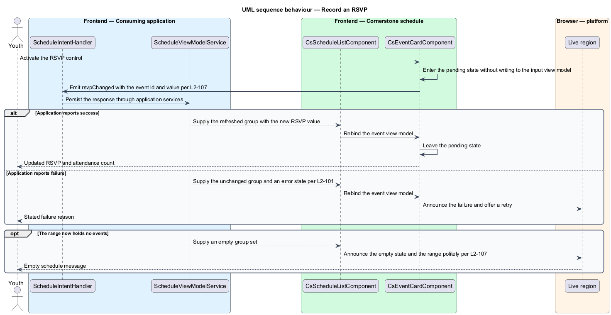

# Browse a schedule

## Overview

Cornerstone is the Angular user-interface library published as `@quinntyne/cornerstone`.
It supplies the components that the Liturgy and Word Up applications compose
their screens from. This feature covers the date-bearing surfaces of that
library: the calendar grid a mentor or administrator uses to find a day, and the
agenda presentation every Word Up role uses to read what happens on it.

**schedule** — ordered set of events covering a stated date range

**event** — dated occurrence carrying a start time, an optional end time, a
location, a status, and attendance metadata

**calendar date** — year, month, and day triple with no instant and no offset
attached

**instant** — absolute point in time, independent of any calendar

**view model** — typed, read-only structure describing everything a component
renders, supplied by the consuming application

**intent** — typed output event naming a user action, emitted for the consuming
application to act on

The components in this feature are composites. They accept a view model input
and emit intents; they fetch nothing, persist nothing, and decide nothing about
authorization or routing. The consuming application's services build the view
model, receive the intents, and own every consequence. That boundary appears in
the component diagram below as the sole edge crossing into and out of the
library.

Word Up consumes all three components. The mentor and administrator calendar uses
`CalendarComponent`; every Word Up role reads `ScheduleListComponent` and the
`EventCardComponent` instances inside it.

The calendar carries two behaviours that the rest of the library does not: a
two-dimensional keyboard grid, and date arithmetic that stays correct across
fractional-hour offsets and daylight-saving transitions. Each has its own
sequence below.

## Description

The feature introduces one grid component, one card component, one list
component, and the types they exchange.

- **`CalendarComponent`** — month and week calendar grid. Inputs:
  `view: InputSignal<CsCalendarView>` selecting `'month'` or `'week'`,
  `focusedDate: ModelSignal<CalendarDate>`, `selectedDate:
  ModelSignal<CalendarDate | null>`, `events: InputSignal<readonly
  CsCalendarDayEvents[]>`, and `maxEventsPerDay: InputSignal<number>`. Outputs:
  `rangeChange: OutputEmitterRef<CalendarRange>` when the displayed period
  moves, `dateSelected: OutputEmitterRef<CalendarDate>`, and `overflowOpened:
  OutputEmitterRef<CalendarDate>` when a hidden-event indicator is activated.
  The host carries `role="grid"`; weekday column headers carry
  `role="columnheader"`; each day cell carries `role="gridcell"` and an
  accessible name holding its full date. The selected day carries
  `aria-selected="true"` and today carries `aria-current="date"`, each
  distinguished by shape and text as well as by colour.
- **`CalendarKeyboardGrid`** — internal directive holding the roving tabindex
  and the arrow-key map. One cell in the grid is tabbable at a time. Arrow keys
  move one day horizontally and one week vertically, `PageUp` and `PageDown`
  move one month, and `Home` and `End` move to the first and last day of the
  focused week. Movement past the displayed period advances the period, keeps
  focus on the computed date, and announces the new period politely.
- **`EventCardComponent`** — single event presentation. Inputs:
  `event: InputSignal<CsEventViewModel>`, `actions: InputSignal<readonly
  CsEventAction[]>`, and `pending: InputSignal<boolean>`. Outputs:
  `actionInvoked: OutputEmitterRef<CsEventActionIntent>` and
  `rsvpChanged: OutputEmitterRef<RsvpIntent>`. Dates and times render through
  Angular locale-aware pipes, and the machine-readable value sits on a
  `<time datetime>` element. The status renders as text and icon and joins the
  card's accessible description.
- **`ScheduleListComponent`** — agenda list grouping events by day. Inputs:
  `groups: InputSignal<readonly ScheduleGroup[]>`, `range:
  InputSignal<CalendarRange>`, and `state: InputSignal<CsDataState>` carrying
  the uniform data-state contract (L2-101). Each group renders as a `<section>`
  with a heading naming the day, and groups render in chronological order. The
  empty state announces politely and names the range that holds no events.
- **`CalendarDate`** — plain calendar date value: `{ year: number; month:
  number; day: number }`. The calendar performs every arithmetic step on this
  type and never on a `Date` instant, so no browser offset can shift a day.
  Formatting converts to a display string only at the render boundary.
- **`CalendarRange`** — inclusive pair of `CalendarDate` values naming the
  displayed period.
- **`CsEventViewModel`** — event fields the card renders: identifier, title,
  start and end as instants, resolved display timezone, location, status,
  attendance counts, and current RSVP value.
- **`RsvpIntent`** and **`CsEventActionIntent`** — typed outputs carrying the
  event identifier and the requested value or action key. Neither carries a
  callback and neither mutates the input view model.
- **`ScheduleGroup`** — one day's heading date and its ordered events.

At viewport XS the month grid switches to the compact agenda presentation. The
switch preserves the grid roles and the full arrow-key map, so keyboard
navigation is unchanged.

The RSVP pending state is local to the card. Activating an RSVP control emits
one intent and marks the card pending; the card leaves the pending state when
the consuming application supplies a new view model. The card never writes to its
input.

The display maximum for events in a month-view day cell defaults to
`<TO SUPPLY>`, pending the density audit of the Word Up mentor calendar.

## Requirements

The feature realizes the following level-2 (L2) requirements. Each L2 requirement
refines a level-1 (L1) requirement, cited by identifier.

| L2 ID | Refines (L1) | Requirement |
|-------|--------------|-------------|
| `L2-106` | `L1-012` | The library shall provide month and week calendar views with keyboard grid navigation, today, previous, and next controls, outside-month days, event density and overflow indication, a selected day, and timezone-safe date handling. |
| `L2-107` | `L1-012` | The library shall provide event presentation carrying date, time, location, status, RSVP and attendance metadata, and actions, plus a grouped agenda list with empty and loading states. |

## Diagrams

### System context

An application developer composes Word Up schedule screens from Cornerstone.
Cornerstone draws its grid and layout behaviour from Angular CDK and reads the
browser's resolved timezone; the Word Up application supplies every event and
receives every intent.

### Containers

The Word Up feature page holds the calendar and the agenda list. Application
services build the schedule view model and act on the emitted intents. The
component library and the theme stylesheet arrive from the published package.

### Components

`CalendarComponent`, `EventCardComponent`, and `ScheduleListComponent` each
receive a view model from the application's schedule service and emit intents
back to it. No component in the boundary reaches past that edge, so the library
performs no fetching and no persistence.

### Class structure

`CalendarComponent` holds calendar-date signals and delegates key handling to
`CalendarKeyboardGrid`. `ScheduleListComponent` composes `EventCardComponent`
per event, and both card and list read the same `CsEventViewModel`.

### Behaviour — navigate the calendar grid by keyboard

A user presses an arrow key on a focused day cell. The keyboard grid computes the
target date, moves the roving tabindex, and advances the displayed period when
the target falls outside it, announcing the change politely.

### Behaviour — resolve timezone-safe dates

The calendar builds its cells from calendar-date arithmetic and converts to a
display string only at render. A daylight-saving transition inside the displayed
month therefore duplicates no day and skips none.

### Behaviour — record an RSVP

A user activates an RSVP control on an event card. The card emits one typed
intent, enters its pending state, and waits for a replacement view model from the
application.

