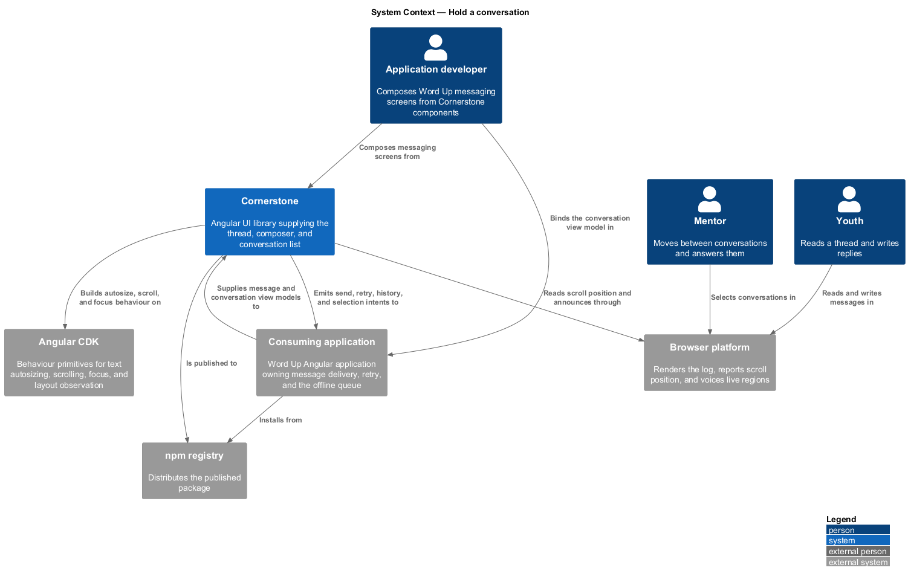
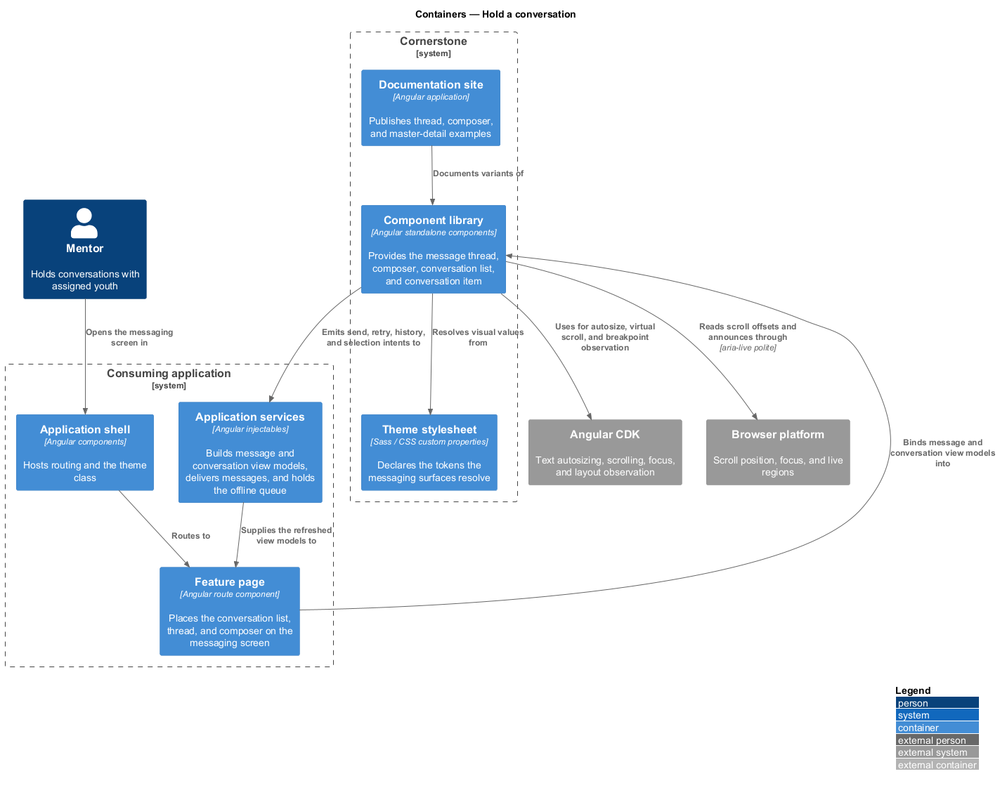
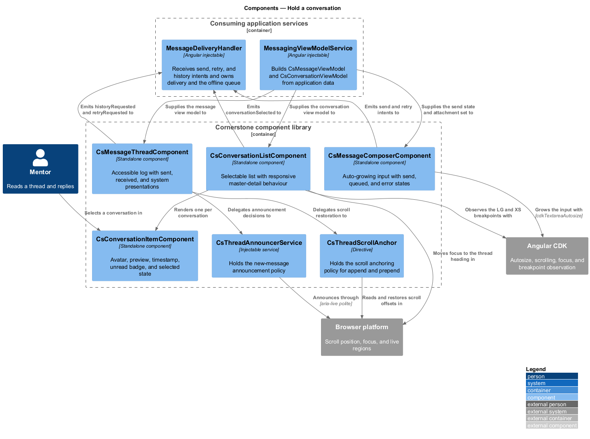
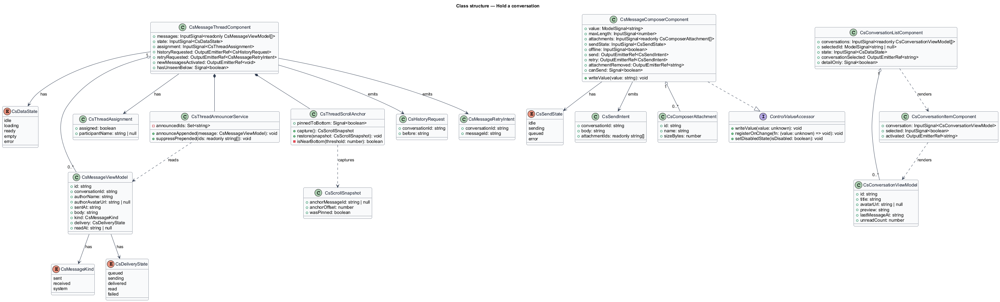
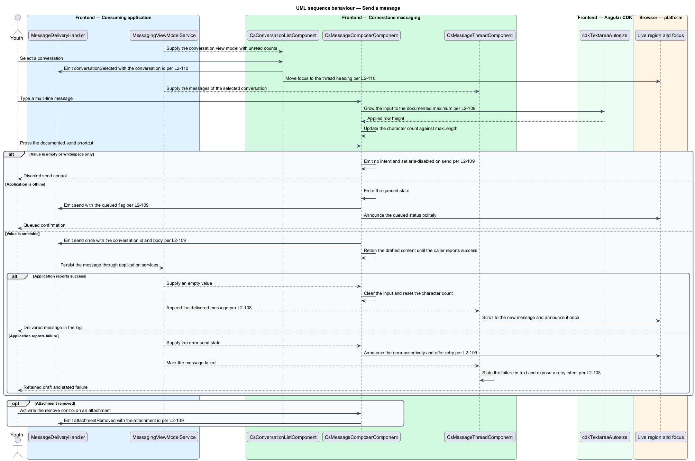
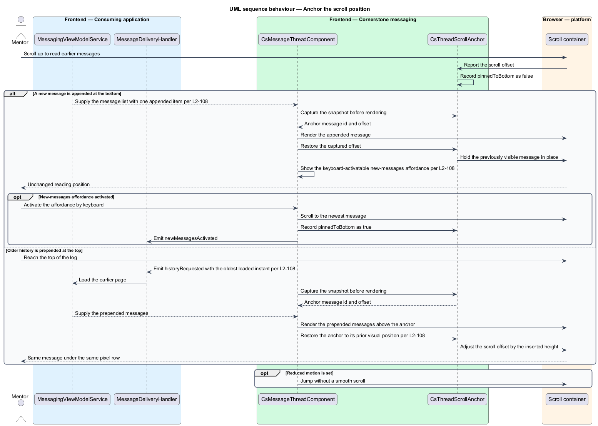
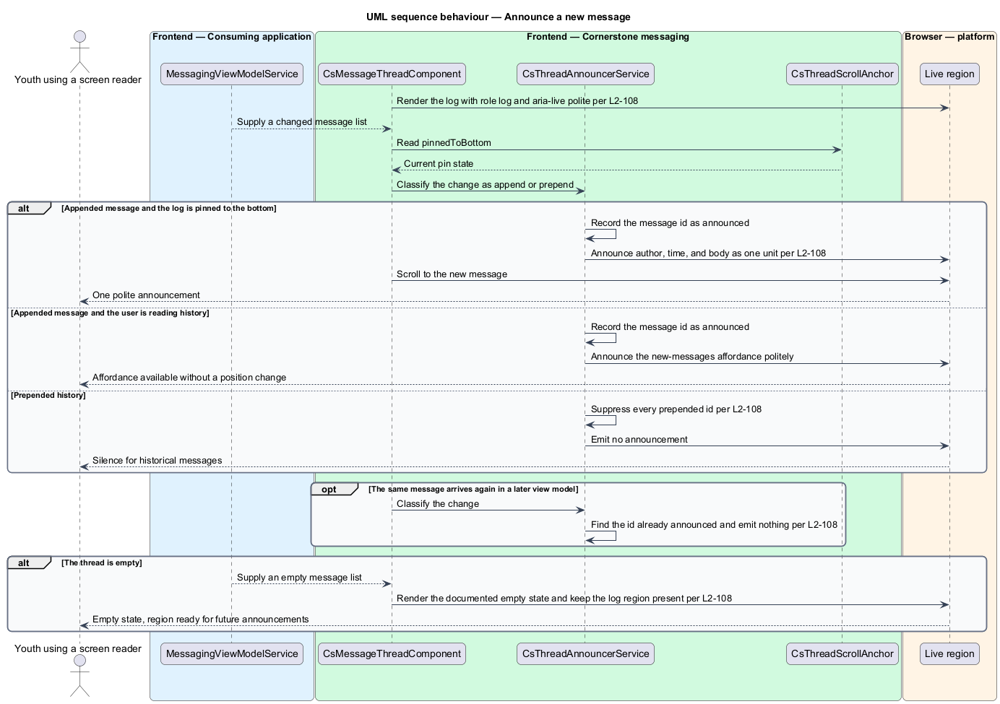

# Hold a conversation

## Overview

Cornerstone is the Angular user-interface library published as `@quinntyne/cornerstone`.
It supplies the components that the Liturgy and Word Up applications compose
their screens from. This feature covers the messaging surfaces of that library:
the list a mentor picks a correspondent from, the log that shows what has been
said, and the composer that adds to it.

**conversation** — named exchange of messages between two or more participants

**message** — single contribution to a conversation, carrying an author, an
instant, a body, and a delivery state

**thread** — chronological presentation of the messages in one conversation

**scroll anchoring** — policy holding a chosen element at a stable viewport
position while content is added around it

**view model** — typed, read-only structure describing everything a component
renders, supplied by the consuming application

**intent** — typed output event naming a user action, emitted for the consuming
application to act on

The four components in this feature are composites. They accept view model
inputs and emit intents; they open no socket, issue no request, and store no
message. The consuming application's services build the view model, receive the
intents, and own delivery, retry, and offline queueing. That boundary appears in
the component diagram below as the sole edge crossing into and out of the
library.

Word Up consumes all four. Youth and mentors use `MessageThreadComponent` and
`MessageComposerComponent`; mentor messaging adds `ConversationListComponent`
and `ConversationItemComponent` for the master-detail layout.

Two behaviours carry the substance of the feature and each has its own sequence
below. Scroll anchoring decides where the thread sits when content arrives at
either end. The announcement policy decides what an assistive technology hears
when it does, and it deliberately stays silent for prepended history.

## Description

The feature introduces one log component, one composer, one list component, one
list item, and the types they exchange.

- **`MessageThreadComponent`** — accessible message log. Inputs:
  `messages: InputSignal<readonly MessageViewModel[]>`, `state:
  InputSignal<CsDataState>` carrying the uniform data-state contract (L2-101),
  and `assignment: InputSignal<CsThreadAssignment>` naming the assigned
  participant or the unassigned condition. Outputs: `historyRequested:
  OutputEmitterRef<CsHistoryRequest>` when the top of the log is reached,
  `retryRequested: OutputEmitterRef<CsMessageRetryIntent>`, and
  `newMessagesActivated: OutputEmitterRef<void>`. The host carries `role="log"`
  and `aria-live="polite"`. Each message renders as one readable unit holding
  author, time, and body.
- **`ThreadScrollAnchor`** — internal directive owning the anchoring policy. It
  records whether the log is pinned to the bottom before a content change, and
  restores either the bottom position or the prior offset of the previously
  visible message after it. Prepending history preserves the visual position of
  that message.
- **`ThreadAnnouncerService`** — internal service holding the announcement
  policy. It announces an appended message once, announces nothing for prepended
  history, and suppresses a repeat announcement of a message already announced.
- **`MessageComposerComponent`** — auto-growing composer. Inputs:
  `value: ModelSignal<string>`, `maxLength: InputSignal<number>`,
  `attachments: InputSignal<readonly CsComposerAttachment[]>`, `sendState:
  InputSignal<CsSendState>`, and `offline: InputSignal<boolean>`. Outputs:
  `send: OutputEmitterRef<SendIntent>`, `attachmentRemoved:
  OutputEmitterRef<string>`, and `retry: OutputEmitterRef<SendIntent>`. The
  input grows through CDK autosize to the documented maximum row count and then
  scrolls internally. The composer implements `ControlValueAccessor`.
- **`ConversationListComponent`** — selectable conversation list. Inputs:
  `conversations: InputSignal<readonly CsConversationViewModel[]>`,
  `selectedId: ModelSignal<string | null>`, and `state:
  InputSignal<CsDataState>`. Output: `conversationSelected:
  OutputEmitterRef<string>`. Items carry list semantics and the selected item
  carries `aria-current="true"`.
- **`ConversationItemComponent`** — one row of that list, showing avatar,
  preview, timestamp, unread badge, and selected state. The unread condition and
  its count join the item's accessible name. A long preview truncates to one line
  visually and stays complete for assistive technology.
- **`MessageViewModel`** — message fields: identifier, author name and avatar,
  instant, body, `kind` of `'sent' | 'received' | 'system'`, read state, and
  delivery state.
- **`SendIntent`**, **`CsMessageRetryIntent`**, and **`CsHistoryRequest`** —
  typed outputs carrying the conversation identifier and the message body,
  message identifier, or oldest loaded instant. None carries a callback.

The send shortcut emits one intent and leaves the input populated. The composer
clears only when the consuming application supplies an empty value, so a failed
send retains the drafted text. An empty or whitespace-only value emits nothing
and the send control carries `aria-disabled="true"`.

Offline sends enter the queued state, announce the queued condition politely, and
emit a queued intent. A send failure announces assertively and offers a retry.

At viewport LG the list and the thread render together and selecting a
conversation moves focus to the thread heading. At viewport XS the thread
replaces the list, a back affordance appears, and activating it restores the list
with focus on the previously selected item.

The documented send shortcut and the maximum composer row count are
`<TO SUPPLY>`, pending the Word Up input-affordance review.

## Requirements

The feature realizes the following level-2 (L2) requirements. Each L2 requirement
refines a level-1 (L1) requirement, cited by identifier.

| L2 ID | Refines (L1) | Requirement |
|-------|--------------|-------------|
| `L2-108` | `L1-012` | The library shall provide an accessible message log with sent, received, and system presentations, author, timestamp, and read state, history loading, empty and unassigned states, and scroll anchoring. |
| `L2-109` | `L1-012` | The library shall provide an auto-growing composer with send, loading, and error states, character count, attachments, a keyboard send shortcut, and a queued or offline state. |
| `L2-110` | `L1-012` | The library shall provide a conversation list with avatar, preview, timestamp, unread badge, and selected state, and responsive master-detail behaviour. |

## Diagrams

### System context

An application developer composes Word Up messaging screens from Cornerstone.
The Word Up application owns message delivery and the offline queue; Cornerstone
renders what it is given and reports what the user did.

### Containers

The Word Up messaging page places the conversation list beside the thread and the
composer. Application services build every view model and receive every intent;
the component library and the theme stylesheet arrive from the published package.

### Components

`ConversationListComponent`, `MessageThreadComponent`, and
`MessageComposerComponent` each receive a view model from the application's
messaging service and emit intents back to it. The scroll anchor and the
announcer sit inside the thread and cross no boundary.

### Class structure

`MessageThreadComponent` composes `ThreadScrollAnchor` and
`ThreadAnnouncerService`. `ConversationListComponent` composes
`ConversationItemComponent` per conversation, and the composer holds its send
state and attachment set.

### Behaviour — send a message

A user types into the composer, presses the send shortcut, and the composer emits
one intent. The application persists the message and supplies a new view model;
the composer clears only then.

### Behaviour — anchor the scroll position

A new message arrives while the user reads history, and older history is
prepended at the top. The anchor holds the previously visible message in place in
both directions.

### Behaviour — announce a new message

The announcer states an appended message once when the log is pinned to the
bottom, offers a keyboard-activatable affordance when it is not, and stays silent
for prepended history.

