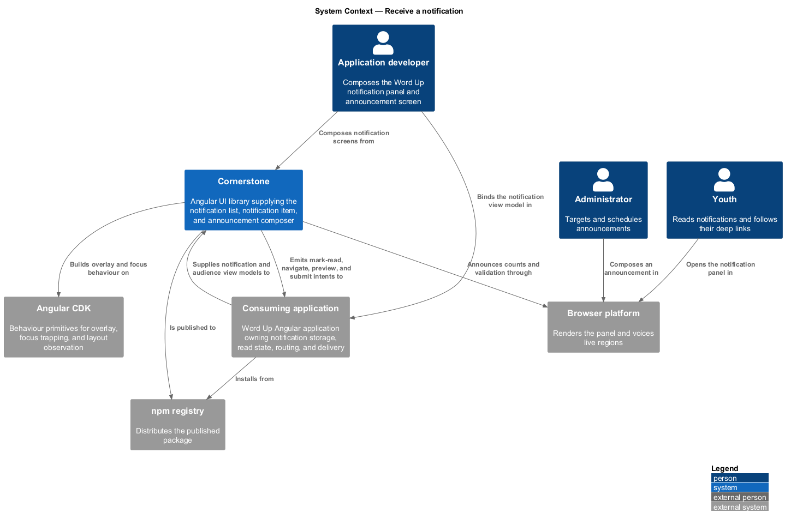
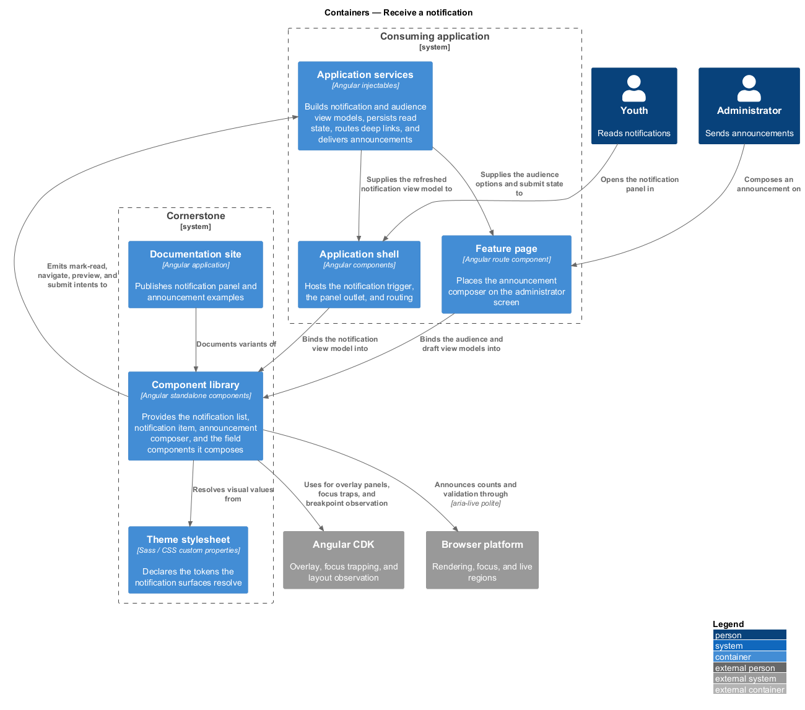
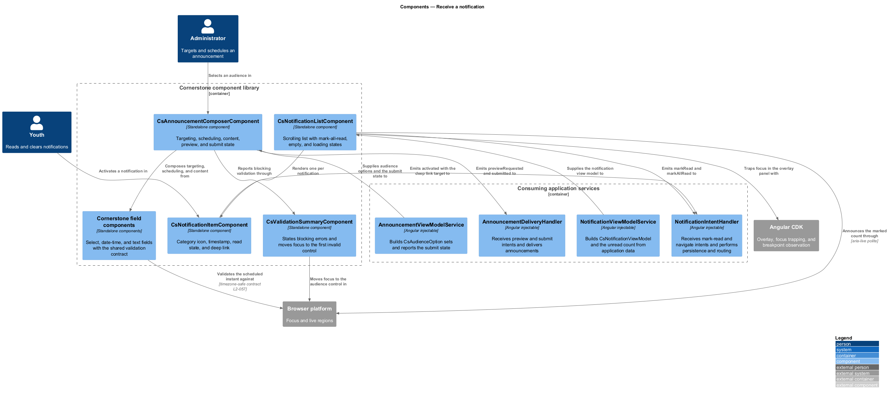
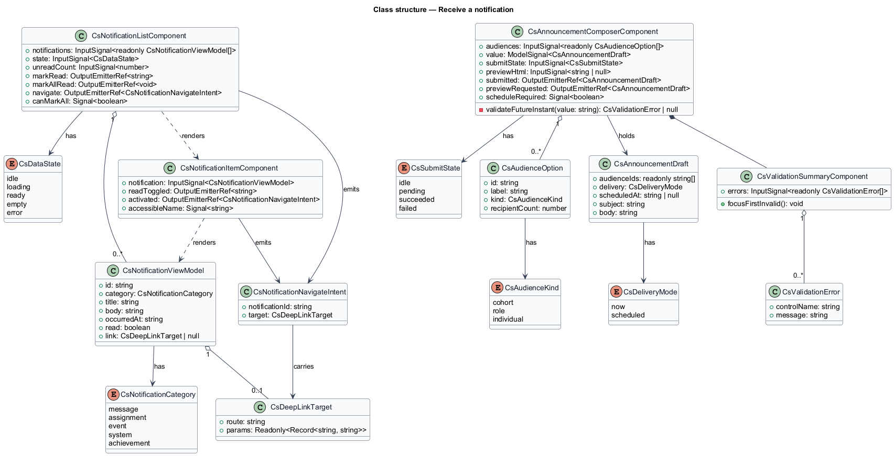
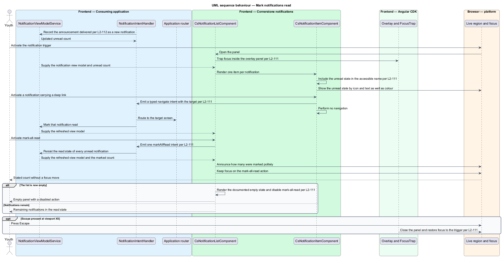
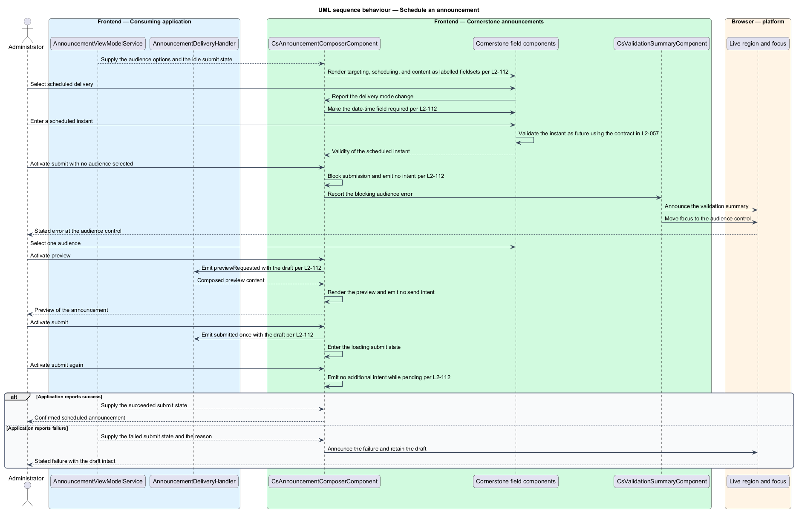

# Receive a notification

## Overview

Cornerstone is the Angular user-interface library published as `@quinntyne/cornerstone`.
It supplies the components that the Liturgy and Word Up applications compose
their screens from. This feature covers the two ends of broadcast messaging:
the panel a Word Up user opens to read what has happened, and the composer a Word
Up administrator uses to send an announcement to a chosen audience.

**notification** — record of an event addressed to one user, carrying a
category, an instant, a read state, and an optional deep link

**deep link** — application route naming the screen a notification refers to

**announcement** — message an administrator addresses to an audience rather than
to one recipient

**audience** — set of recipients named by cohort, role, or explicit selection

**view model** — typed, read-only structure describing everything a component
renders, supplied by the consuming application

**intent** — typed output event naming a user action, emitted for the consuming
application to act on

The three components in this feature are composites. They accept view model
inputs and emit intents; they fetch no notification, mark nothing read, navigate
nowhere, and send nothing. The consuming application's services build the view
model, receive the intents, and own persistence, routing, and delivery. That
boundary appears in the component diagram below as the sole edge crossing into
and out of the library.

Word Up consumes all three. Every Word Up role reads the notification list;
`AnnouncementComposerComponent` is a Word Up administrator surface, and it
composes its controls from the Cornerstone field components rather than from
native elements.

## Description

The feature introduces one list component, one list item, one composer, and the
types they exchange.

- **`NotificationListComponent`** — notification panel. Inputs:
  `notifications: InputSignal<readonly CsNotificationViewModel[]>`,
  `state: InputSignal<CsDataState>` carrying the uniform data-state contract
  (L2-101), and `unreadCount: InputSignal<number>`. Outputs: `markRead:
  OutputEmitterRef<string>`, `markAllRead: OutputEmitterRef<void>`, and
  `navigate: OutputEmitterRef<CsNotificationNavigateIntent>`. The list uses list
  semantics and scrolls internally inside an overlay panel.
- **`NotificationItemComponent`** — one notification row. Inputs:
  `notification: InputSignal<CsNotificationViewModel>`. Outputs: `readToggled:
  OutputEmitterRef<string>` and `activated:
  OutputEmitterRef<CsNotificationNavigateIntent>`. The unread condition joins the
  item's accessible name and is shown by text and icon as well as by a colour
  dot. The category renders as an icon with a text label. The timestamp renders
  through a locale-aware pipe with the instant on a `<time datetime>` element.
- **`AnnouncementComposerComponent`** — announcement authoring form. Inputs:
  `audiences: InputSignal<readonly AudienceOption[]>`, `value:
  ModelSignal<AnnouncementDraft>`, `submitState:
  InputSignal<CsSubmitState>`, and `previewHtml: InputSignal<string | null>`.
  Outputs: `submitted: OutputEmitterRef<AnnouncementDraft>` and
  `previewRequested: OutputEmitterRef<AnnouncementDraft>`. Targeting,
  scheduling, and content occupy three labelled fieldsets, and every control is
  a Cornerstone field component.
- **`ValidationSummaryComponent`** — the shared summary the composer reports
  blocking validation through. It states each blocking error and moves focus to
  the first invalid control.
- **`CsNotificationViewModel`** — notification fields: identifier, category,
  title, body, instant, read state, and optional deep link target.
- **`CsNotificationCategory`** — union naming the category set the icon map
  covers.
- **`CsNotificationNavigateIntent`** — typed output carrying the notification
  identifier and the deep link target. The component performs no navigation
  itself.
- **`AnnouncementDraft`** — draft fields: audience identifiers, delivery mode of
  `'now' | 'scheduled'`, scheduled instant, subject, and body.
- **`AudienceOption`** — one selectable audience, carrying an identifier, a
  label, a kind of `'cohort' | 'role' | 'individual'`, and a recipient count.

The mark-all-read action emits one intent, announces the count of notifications
marked politely, and leaves focus on the action. The action is disabled
when the list is empty.

Selecting scheduled delivery makes the date-time field required and validates
that the scheduled instant lies in the future through the timezone-safe contract
in L2-057. Submitting with no audience selected blocks submission, announces the
validation summary, and moves focus to the audience control. While submission is
pending the submit control renders in the loading state and repeated activation
emits nothing further.

The preview action renders the composed announcement without emitting a send
intent, so the preview never delivers.

At viewport XS the list renders inside an overlay panel that traps focus, scrolls
internally, and closes on `Escape` with focus returned to the trigger.

The category icon map and the maximum announcement body length are
`<TO SUPPLY>`, pending the Word Up notification taxonomy review.

## Requirements

The feature realizes the following level-2 (L2) requirements. Each L2 requirement
refines a level-1 (L1) requirement, cited by identifier.

| L2 ID | Refines (L1) | Requirement |
|-------|--------------|-------------|
| `L2-111` | `L1-012` | The library shall provide a notification list with read and unread states, category icon, timestamp, deep link, mark-one-read and mark-all-read actions, and empty and loading states. |
| `L2-112` | `L1-012` | The library shall provide an announcement composer with audience, cohort, and role targeting, immediate or scheduled delivery, a preview, and a submission state, composed from Cornerstone field components. |

## Diagrams

### System context

An application developer composes the Word Up notification panel and
administrator announcement screen from Cornerstone. The Word Up application owns
notification storage, read state, routing, and announcement delivery.

### Containers

The Word Up shell hosts the notification panel; a separate administrator page
hosts the announcement composer. Application services build both view models and
receive both intent sets.

### Components

`NotificationListComponent` and `AnnouncementComposerComponent` each receive a
view model from an application service and emit intents back to it. The composer
draws its controls from the Cornerstone field components inside the same library
boundary.

### Class structure

`NotificationListComponent` composes `NotificationItemComponent` per
notification. `AnnouncementComposerComponent` holds a draft model and a submit
state, and reads the audience option set.

### Behaviour — mark notifications read

A user opens the panel, activates one notification's deep link, and then marks
the remainder read. The list emits typed intents and announces the count without
navigating or writing.

### Behaviour — schedule an announcement

An administrator selects scheduled delivery and submits with no audience chosen.
Validation blocks submission, the summary is announced, and focus moves to the
audience control.

