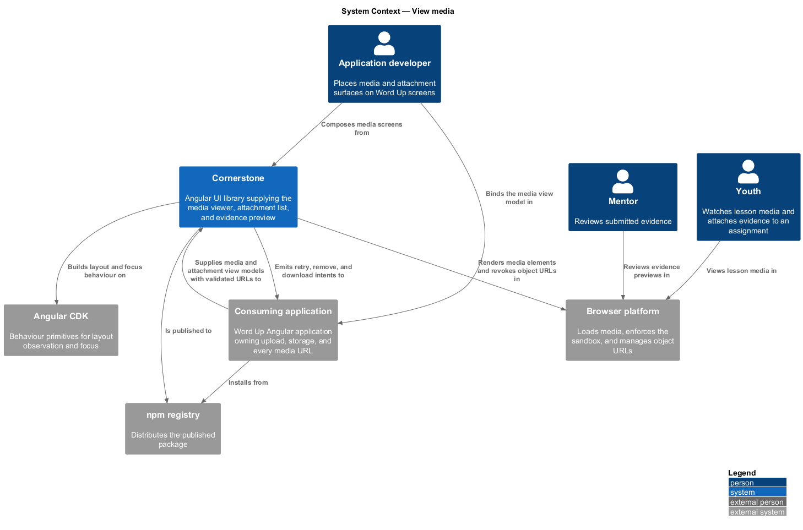
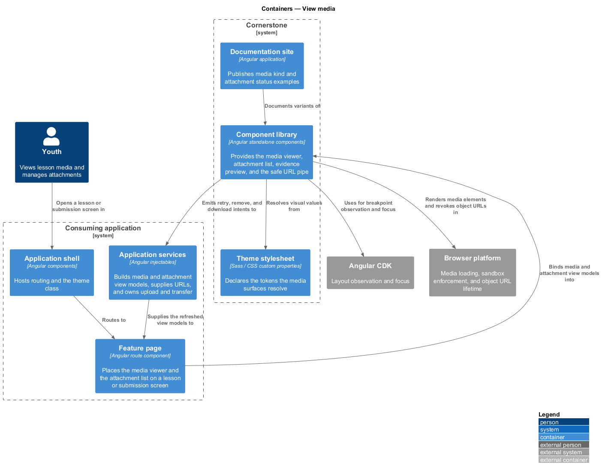
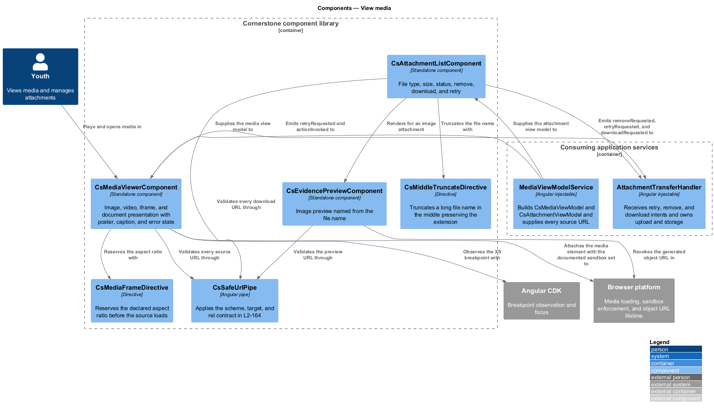
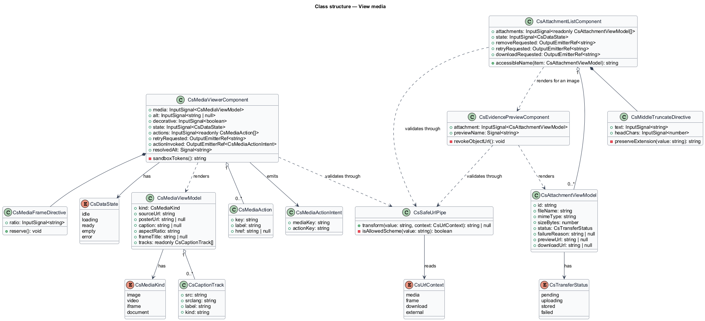
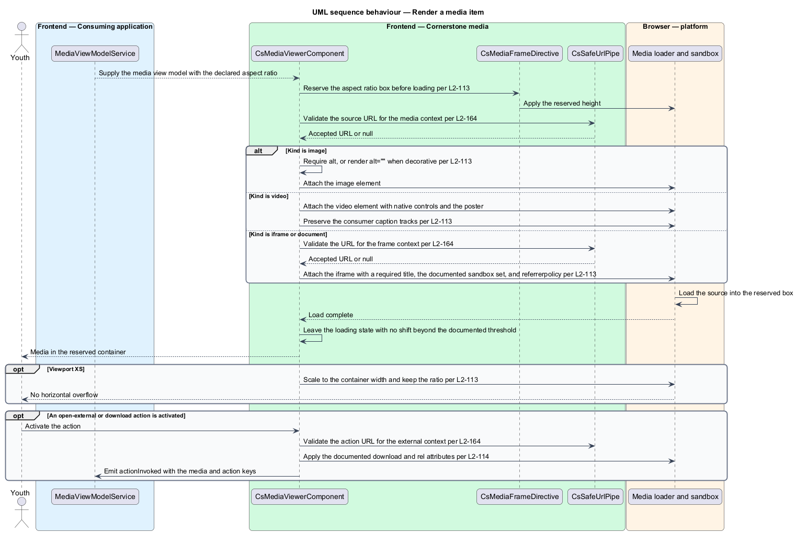
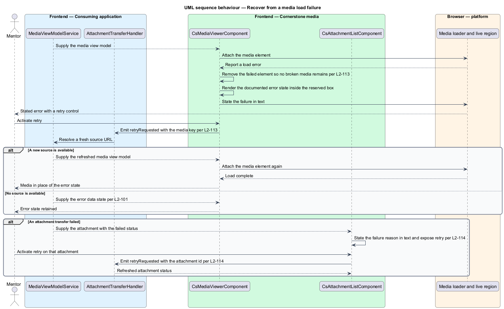
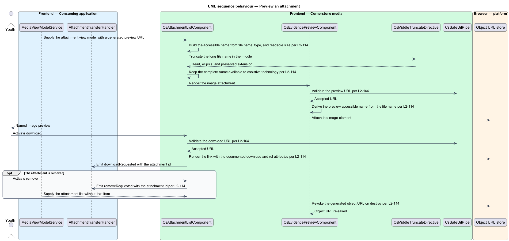

# View media

## Overview

Cornerstone is the Angular user-interface library published as `@quinntyne/cornerstone`.
It supplies the components that the Liturgy and Word Up applications compose
their screens from. This feature covers every surface that renders content the
library did not author: an image in a lesson, a video on the public site, an
embedded document, and the files a youth attaches to an assignment.

**media item** — single piece of consumer-supplied content, carrying a kind, a
source URL, and the metadata needed to present it

**attachment** — file associated with an assignment or a review, carrying a
name, a type, a size, and a transfer status

**evidence** — attachment a youth submits as proof of completed work

**poster** — still image shown in place of a video before playback begins

**aspect ratio box** — container reserving the height a media item will occupy
before it loads

**view model** — typed, read-only structure describing everything a component
renders, supplied by the consuming application

**intent** — typed output event naming a user action, emitted for the consuming
application to act on

The three components in this feature are composites. They accept view model
inputs and emit intents; they upload nothing, download nothing on their own
initiative, and issue no request. The consuming application's services build the
view model, supply every URL, receive the intents, and own transfer and storage.
That boundary appears in the component diagram below as the sole edge crossing
into and out of the library.

Every URL these components render arrives from the consumer, so each one passes
the safe link, URL, and target contract (L2-164) before it reaches the DOM. That
check is the reason the feature exists as one slice rather than three unrelated
components.

Word Up consumes all three: lessons and the public site use
`MediaViewerComponent`; assignments and reviews use
`AttachmentListComponent` and `EvidencePreviewComponent`.

## Description

The feature introduces one viewer, one list, one preview component, and the types
they exchange.

- **`MediaViewerComponent`** — responsive presentation of one media item.
  Inputs: `media: InputSignal<CsMediaViewModel>`, `alt:
  InputSignal<string | null>`, `decorative: InputSignal<boolean>`,
  `state: InputSignal<CsDataState>` carrying the uniform data-state contract
  (L2-101), and `actions: InputSignal<readonly CsMediaAction[]>`. Outputs:
  `retryRequested: OutputEmitterRef<string>` and `actionInvoked:
  OutputEmitterRef<CsMediaActionIntent>`. An image requires `alt` unless
  `decorative` is set, in which case the element renders `alt=""`. A video
  renders native controls and preserves the caption tracks the consumer supplies.
  An iframe carries a required `title`, the documented restrictive `sandbox`
  attribute set, and a `referrerpolicy`.
- **`MediaFrameDirective`** — internal directive holding the aspect ratio box.
  It reserves the declared ratio before the source loads, so the layout shift on
  load stays within the documented threshold.
- **`CsSafeUrlPipe`** — the shared pipe applying the URL contract in L2-164. It
  validates the scheme, rejects an unsupported one, and returns the value the
  template binds. Every URL in this feature passes through it.
- **`AttachmentListComponent`** — list of attachments. Inputs:
  `attachments: InputSignal<readonly AttachmentViewModel[]>` and
  `state: InputSignal<CsDataState>`. Outputs: `removeRequested:
  OutputEmitterRef<string>`, `retryRequested: OutputEmitterRef<string>`, and
  `downloadRequested: OutputEmitterRef<string>`. Each item's accessible name
  states the file name, the file type, and a human-readable size. A download
  renders as a link carrying the documented `download` and `rel` attributes.
- **`EvidencePreviewComponent`** — image preview of one attachment. Input:
  `attachment: InputSignal<AttachmentViewModel>`. The preview derives its
  accessible name from the file name. When the source is a generated object URL,
  the component revokes it on destroy.
- **`MiddleTruncateDirective`** — internal directive truncating a long file name
  in the middle so the extension stays visible. The complete name remains
  available to assistive technology.
- **`CsMediaViewModel`** — media fields: kind of `'image' | 'video' | 'iframe' |
  'document'`, source URL, poster URL, caption, declared aspect ratio, and
  caption track descriptors.
- **`AttachmentViewModel`** — attachment fields: identifier, file name, MIME
  type, size in bytes, transfer status, failure reason, preview URL, and download
  URL.

A media item that fails to load renders the documented error state with a retry
intent, and the failed element leaves the DOM so no broken image or empty frame
remains.

At viewport XS every media item scales to the container width and keeps its
aspect ratio, producing no horizontal overflow.

The documented `sandbox` attribute set and the layout-shift threshold are
`<TO SUPPLY>`, pending the Word Up embedded-content security review.

## Requirements

The feature realizes the following level-2 (L2) requirements. Each L2 requirement
refines a level-1 (L1) requirement, cited by identifier.

| L2 ID | Refines (L1) | Requirement |
|-------|--------------|-------------|
| `L2-113` | `L1-012` | The library shall provide responsive image, video, iframe, and document display with poster, caption, loading and error states, and open-external or download actions. |
| `L2-114` | `L1-012` | The library shall provide attachment presentation with file type, size, and status, image preview, remove, download, and retry actions, and safe link handling. |

## Diagrams

### System context

An application developer places Cornerstone media surfaces on Word Up lesson,
submission, and public-site screens. The Word Up application supplies every URL
and owns upload, storage, and transfer.

### Containers

The Word Up feature page holds the viewer and the attachment list. Application
services build the media and attachment view models and receive the retry,
remove, and download intents.

### Components

`MediaViewerComponent`, `AttachmentListComponent`, and
`EvidencePreviewComponent` each receive a view model from an application service
and emit intents back to it. Every consumer-supplied URL passes `CsSafeUrlPipe`
before reaching the DOM.

### Class structure

`MediaViewerComponent` composes `MediaFrameDirective` for the aspect ratio
box. `AttachmentListComponent` composes `EvidencePreviewComponent` for image
attachments, and both read `AttachmentViewModel`.

### Behaviour — render a media item

The viewer reserves the aspect ratio, validates the source URL, and renders the
element for the media kind. An iframe receives its required title, sandbox set,
and referrer policy before it is attached.

### Behaviour — recover from a load failure

A source fails to load. The viewer removes the failed element, renders the
documented error state, and emits a retry intent when the user asks for one.

### Behaviour — preview an attachment

An image attachment renders a preview from a generated object URL. The component
names the preview from the file name and revokes the object URL on destroy.

