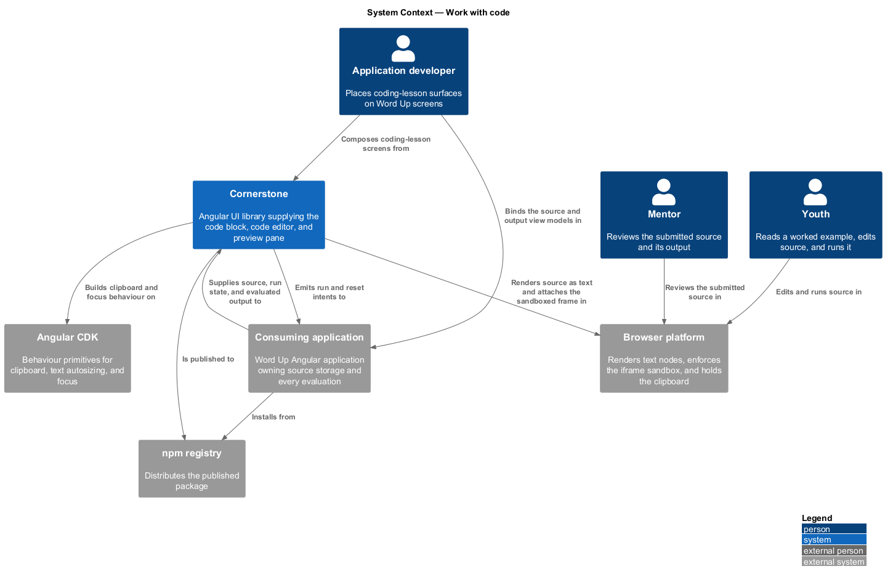
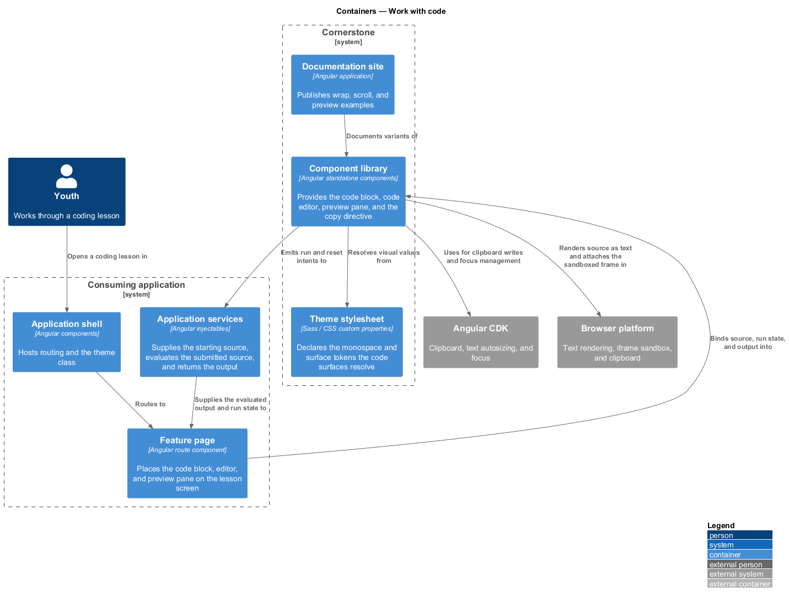
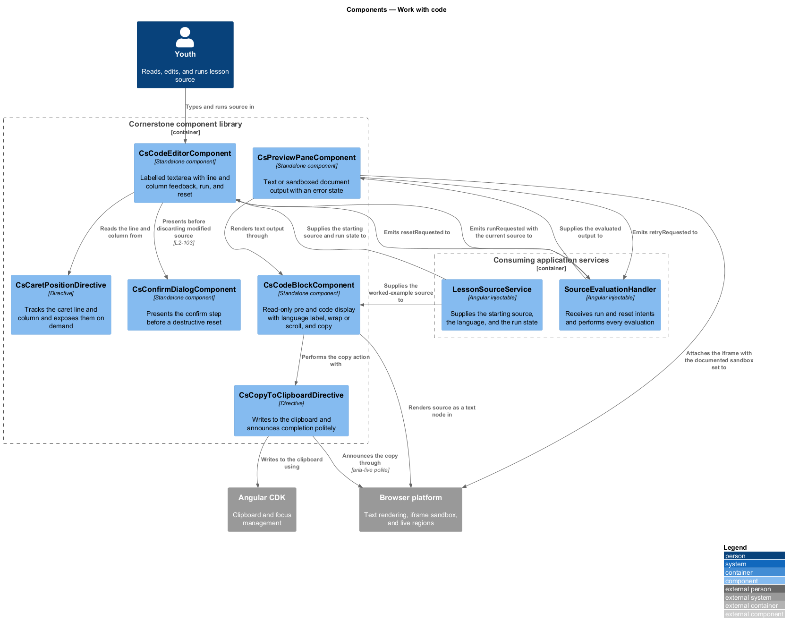
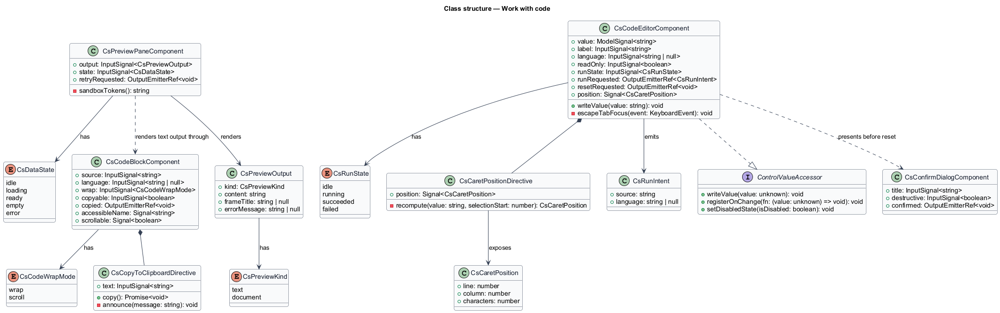
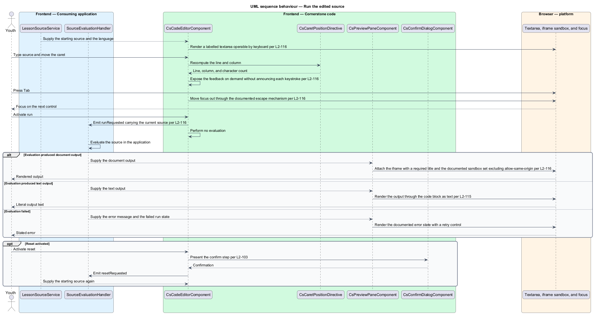
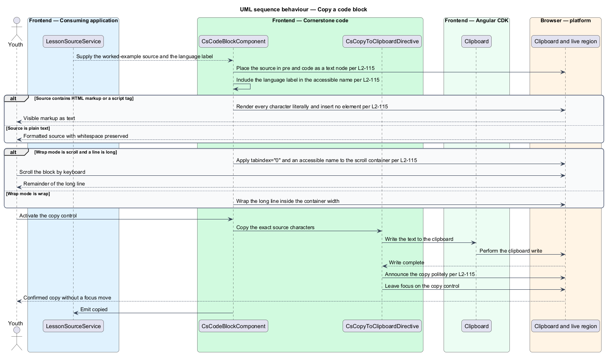

# Work with code

## Overview

Cornerstone is the Angular user-interface library published as `@quinntyne/cornerstone`.
It supplies the components that the Liturgy and Word Up applications compose
their screens from. This feature covers the coding-lesson surfaces of that
library: the block that shows a worked example, the editor a youth types an
answer into, and the pane that shows what the answer produced.

**code block** — read-only presentation of source text with whitespace preserved

**code editor** — editable presentation of source text, backed by a native
`<textarea>`

**preview pane** — presentation of the output an application produced from
editor source

**source** — plain text a learner reads or writes, never interpreted by the
library

**view model** — typed, read-only structure describing everything a component
renders, supplied by the consuming application

**intent** — typed output event naming a user action, emitted for the consuming
application to act on

The three components in this feature are composites. They accept view model
inputs and emit intents; they evaluate no source, run no sandbox of their own,
and persist nothing. The consuming application's services supply the source,
receive the run intent, evaluate it, and supply the resulting output. That
boundary appears in the component diagram below as the sole edge crossing into
and out of the library, and it is what keeps evaluation out of the library
entirely.

Two rules follow from that boundary and shape the whole slice. Source text
renders as text and never as markup, so content carrying an HTML tag or a script
tag displays literally and inserts no element into the document. Consumer output
renders inside an iframe carrying the documented restrictive `sandbox` set with
`allow-same-origin` excluded.

Word Up coding lessons consume all three components.

## Description

The feature introduces one display component, one editor, one preview pane, and
the types they exchange.

- **`CodeBlockComponent`** — read-only source display. Inputs:
  `source: InputSignal<string>`, `language: InputSignal<string | null>`,
  `wrap: InputSignal<CsCodeWrapMode>` selecting `'wrap'` or `'scroll'`, and
  `copyable: InputSignal<boolean>`. Output: `copied:
  OutputEmitterRef<void>`. The source sits in `<pre><code>` as a text node with
  whitespace preserved. The language label renders as text and joins the block's
  accessible name. In scroll mode the block carries `tabindex="0"` and an
  accessible name, so a long line is reachable by keyboard.
- **`CodeEditorComponent`** — accessible editor baseline. Inputs:
  `value: ModelSignal<string>`, `label: InputSignal<string>`,
  `language: InputSignal<string | null>`, `readOnly: InputSignal<boolean>`, and
  `runState: InputSignal<RunState>`. Outputs: `runRequested:
  OutputEmitterRef<RunIntent>` and `resetRequested: OutputEmitterRef<void>`.
  The control is a labelled `<textarea>` implementing `ControlValueAccessor`.
  `Tab` moves focus out of the editor through the documented escape mechanism
  rather than being captured unconditionally.
- **`CaretPositionDirective`** — internal directive tracking the caret. It
  maintains the line and column values and exposes them on demand rather than
  announcing them on every keystroke.
- **`PreviewPaneComponent`** — output presentation. Inputs:
  `output: InputSignal<PreviewOutput>` and `state:
  InputSignal<CsDataState>` carrying the uniform data-state contract (L2-101).
  Output: `retryRequested: OutputEmitterRef<void>`. Text output renders through
  `CodeBlockComponent`; document output renders in an iframe carrying a
  required `title` and the documented restrictive `sandbox` set.
- **`CsCopyToClipboardDirective`** — the shared directive backing the copy action.
  On completion it announces the copy politely and leaves focus on the copy
  control.
- **`RunIntent`** — typed output carrying the current source and the language.
  It carries no callback and the editor performs no evaluation.
- **`PreviewOutput`** — output fields: kind of `'text' | 'document'`, the
  content, and an error message when evaluation failed.
- **`RunState`** — union of `'idle' | 'running' | 'succeeded' | 'failed'`.

The reset action discards modified source. A confirm step per L2-103 precedes the
discard, and the editor emits `resetRequested` only after that step completes.

The documented `Tab` escape mechanism and the preview iframe `sandbox` token set
are `<TO SUPPLY>`, pending the Word Up coding-lesson security review.

## Requirements

The feature realizes the following level-2 (L2) requirements. Each L2 requirement
refines a level-1 (L1) requirement, cited by identifier.

| L2 ID | Refines (L1) | Requirement |
|-------|--------------|-------------|
| `L2-115` | `L1-012` | The library shall provide syntax-preserving code display with a language label, wrap or scroll modes, and a copy action, rendering source as text and never as markup. |
| `L2-116` | `L1-012` | The library shall provide a textarea-based accessible editor baseline with line and character feedback, reset and run actions, and an output or iframe preview with an error state. |

## Diagrams

### System context

An application developer places the coding-lesson surfaces on Word Up screens.
The Word Up application supplies the starting source, evaluates the submitted
source, and returns the output; Cornerstone renders both.

### Containers

The Word Up lesson page holds the code block, the editor, and the preview pane.
Application services supply the source and the output and receive the run and
reset intents.

### Components

`CodeBlockComponent`, `CodeEditorComponent`, and `PreviewPaneComponent` each
receive a view model from an application service and emit intents back to it.
Evaluation sits entirely on the application side of that edge.

### Class structure

`CodeEditorComponent` composes `CaretPositionDirective` and implements
`ControlValueAccessor`. `PreviewPaneComponent` renders text output through
`CodeBlockComponent`, which composes the copy directive.

### Behaviour — run the edited source

A learner edits the source and activates run. The editor emits one typed intent,
the application evaluates it, and the preview pane renders the result in a
sandboxed frame.

### Behaviour — copy a code block

A learner copies a worked example. The block renders the source as text, copies
the exact characters, and announces the copy without moving focus.

