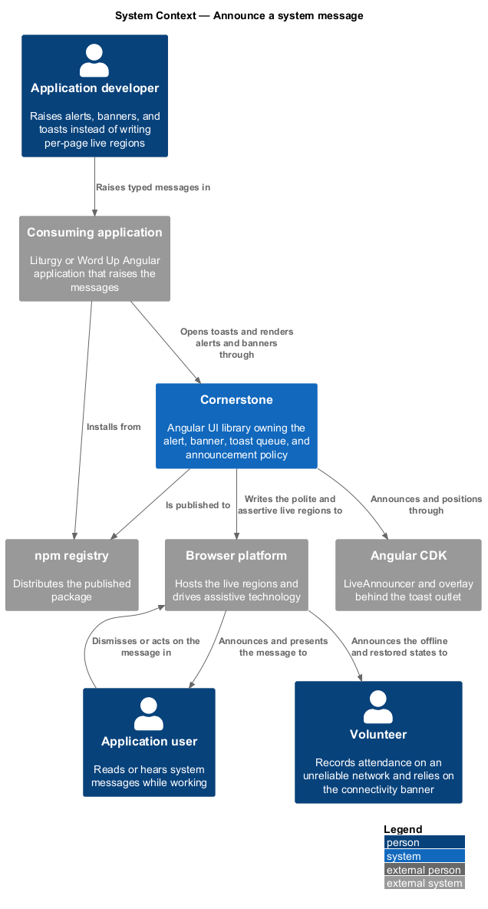
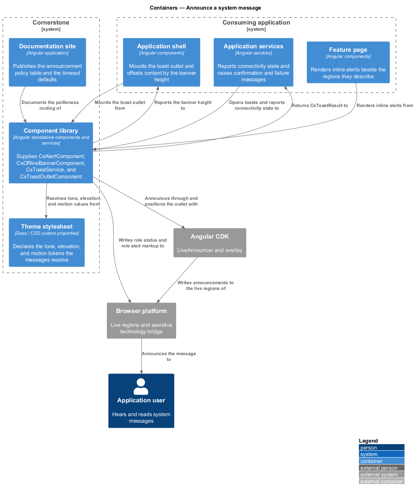
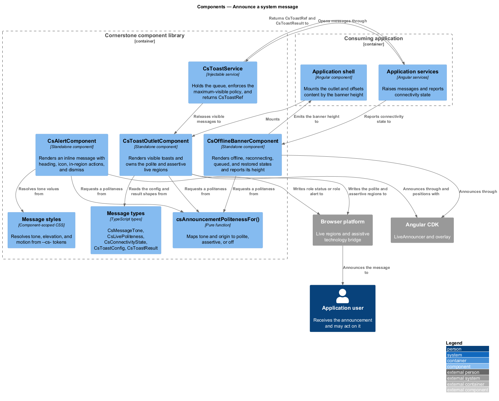
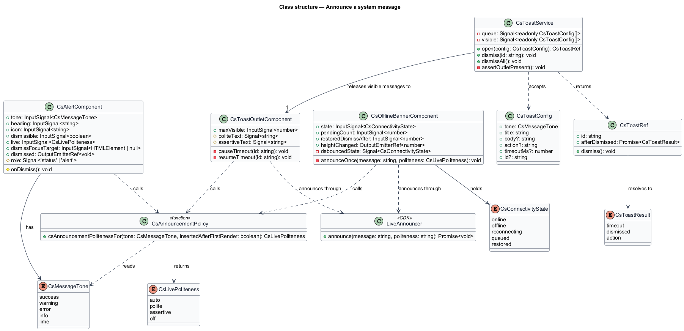
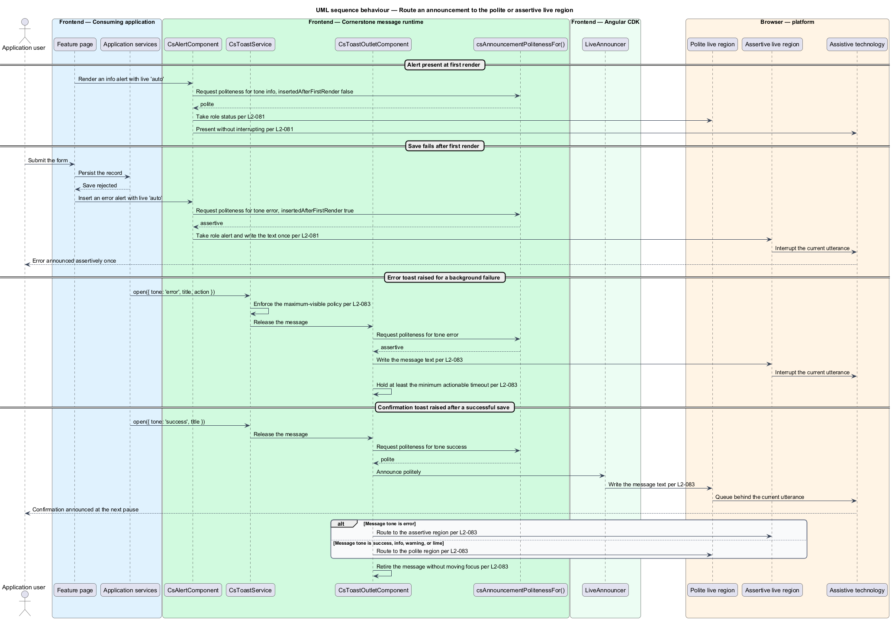
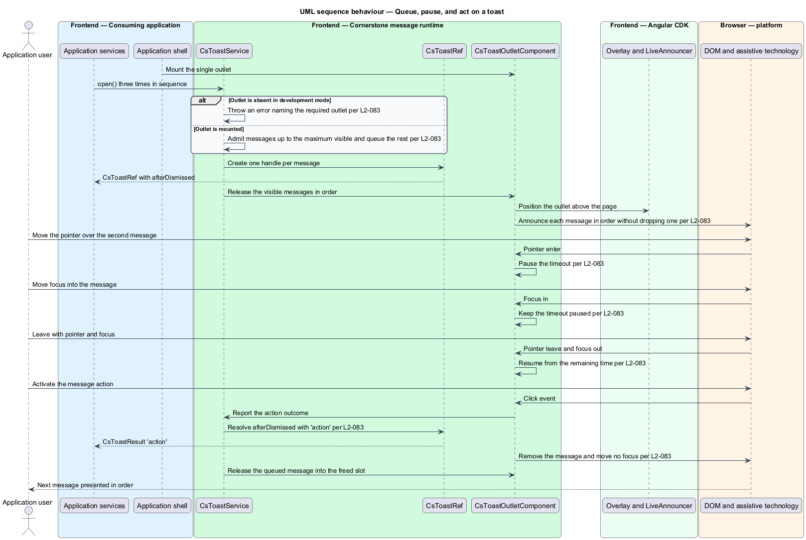
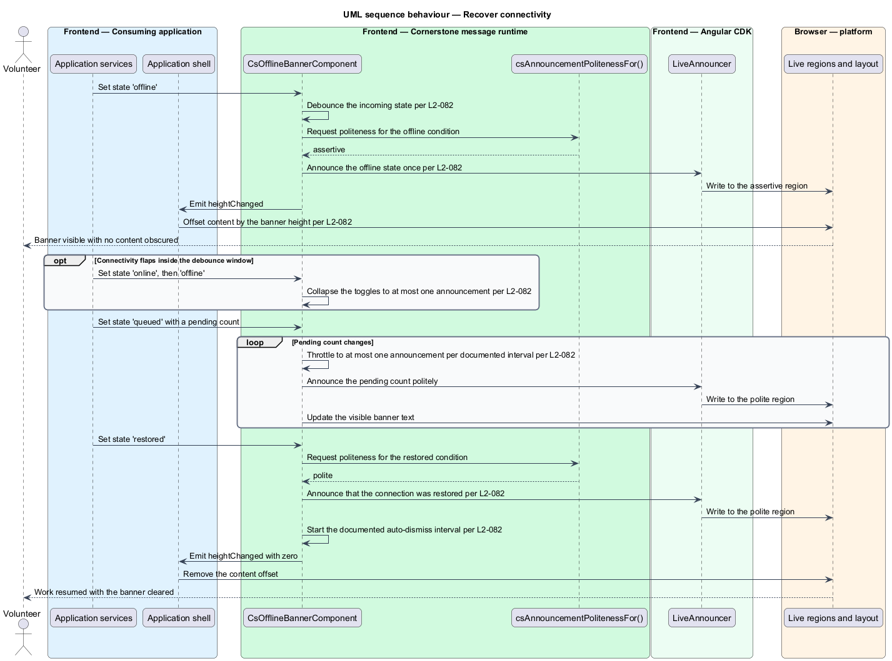

# Announce a system message

## Overview

Cornerstone is the Angular user-interface library published as `@quinntyne/cornerstone`.
It supplies the components that the Liturgy and Word Up applications compose their
screens from, and it carries the FaithTech visual language that makes those screens
look like one product family.

This feature covers every surface through which the product tells a person something
that the person did not directly ask for: the inline alert attached to a region, the
connectivity banner spanning the shell, and the transient toast raised over the page.
It also covers the one policy those three surfaces share, which decides whether a
message interrupts a screen reader or waits for a pause.

**live region** — element whose content changes the browser reports to assistive
technology without moving focus

**politeness** — live-region setting deciding whether an update interrupts the
current utterance (`assertive`) or waits for a pause (`polite`)

**announcement policy** — single mapping from a message tone and its origin to a
politeness, shared by the alert, the banner, and the toast

**toast** — transient message raised above the page, dismissed by timeout or by the
person, and never taking focus

**connectivity banner** — shell-width message stating the application's network
state and the fate of work performed while offline

Liturgy uses alerts for save failures and validation summaries on 4D/5R workflow
forms, and toasts for confirmation after a phase transition. Word Up uses alerts on
authentication and consent screens, the connectivity banner across the youth and
volunteer portals where sessions run on unreliable networks, and toasts for roster,
attendance, and submission confirmations. Both applications own the message text;
Cornerstone owns the presentation, the timing, and the announcement.

The feature sits above the token layer (L2-005) and beside the shell (L2-064), which
reserves the vertical space the banner occupies. It is the single place in the
library that writes to a live region, so no other component declares one.

## Description

The feature is a vertical slice from an application service that raises a message
down to the utterance an assistive technology produces. It introduces two
components, one service, one outlet component, one policy function, and six public
types.

- **`AlertComponent`** — the inline message, selector `cs-alert`. It carries a
  `tone` input over `success`, `warning`, `error`, `info`, and `lime`, a `heading`
  input, an `icon` input, a `dismissible` input, and a `live` input over `auto`,
  `polite`, `assertive`, and `off`. It projects body content and projects actions
  through a `cs-alert-actions` slot placed inside the alert region, so an assistive
  technology reads the actions as part of the message. It emits `dismissed`. Under
  the default `auto` setting the component asks the announcement policy: an alert
  present at first render takes `role="status"`, and an alert inserted after first
  render with an `error` tone takes `role="alert"` and is announced assertively once.
  Every tone renders an icon and text so the tone never rests on colour alone.
- **`OfflineBannerComponent`** — the connectivity message, selector
  `cs-offline-banner`. It carries a `state` input over `online`, `offline`,
  `reconnecting`, `queued`, and `restored`, a `pendingCount` input, and a
  `restoredDismissAfter` input. It emits `heightChanged` so the shell offsets its
  content by the banner height and obscures nothing. The component debounces the
  incoming state so connectivity flapping inside the debounce window produces at most
  one announcement, throttles the `queued` count announcement, announces `offline`
  assertively once, announces `restored` politely, and auto-dismisses the `restored`
  state after the documented interval.
- **`ToastService`** — the injectable that raises transient messages. It exposes
  `open(config: ToastConfig): ToastRef`, `dismiss(id: string)`, and
  `dismissAll()`. It holds the queue, enforces the maximum-visible policy, and
  releases queued messages as visible ones retire. In development mode it throws an
  error naming the missing outlet when `open()` is called and no
  `ToastOutletComponent` is mounted.
- **`ToastRef`** — the handle returned to the caller. It exposes an `afterDismissed`
  promise resolving to `ToastResult`, which reports whether the message timed out,
  was dismissed by the person, or had its action activated. Dismissal moves no focus,
  so the person's caret and focus position stay where they were.
- **`ToastOutletComponent`** — the single mount point, selector `cs-toast-outlet`.
  It renders the visible messages, owns the two live regions the policy routes to,
  and pauses a message's timeout while the pointer rests on it or focus sits inside
  it. When hover and focus both end the timeout resumes from the remaining time
  rather than restarting. A message carrying an action holds at least the documented
  minimum actionable timeout, or holds no timeout at all under the documented
  non-dismissing rule.
- **`csAnnouncementPolitenessFor()`** — the policy function the three surfaces share.
  It takes a tone and an origin and returns a politeness. Tone `error` returns
  `assertive`; tones `success`, `info`, `warning`, and `lime` return `polite`; an
  alert present at first render returns `polite` whatever its tone, because the
  content is part of the initial page rather than an interruption.
- **`CsMessageTone`** — union type of the five tones: `'success' | 'warning' |
  'error' | 'info' | 'lime'`.
- **`CsLivePoliteness`** — union type of the live settings: `'auto' | 'polite' |
  'assertive' | 'off'`.
- **`ConnectivityState`** — union type of the five banner states.
- **`ToastConfig`** — the message description: `tone`, `title`, `body`, optional
  `action`, optional `timeoutMs`, and optional `id`.
- **`ToastResult`** — the typed outcome: `'timeout' | 'dismissed' | 'action'`.
- **`ToastRef`** — the caller-facing handle described above.

The outlet declares exactly two live regions, one `aria-live="polite"` and one
`aria-live="assertive"`, and writes each message's text into the region the policy
selects. Two regions rather than one per message keeps the announcement order stable
and stops a rapid sequence from dropping an utterance. The banner and the alert reuse
the Angular CDK `LiveAnnouncer` for the same reason: one announcer, one queue.

The service raises no HTTP request, reads no network state, and persists nothing. The
banner renders the state the consuming application reports; the application decides
what offline means for its own work queue.

The documented values for the restored auto-dismiss interval, the flapping debounce
window, the queued-count throttle interval, the maximum visible message count, and
the minimum actionable timeout are `<TO SUPPLY>`; each depends on usability testing
that has not yet run against the Word Up field network conditions.

## Requirements

The feature realizes the following level-2 (L2) requirements. Each L2 requirement
refines a level-1 (L1) requirement, cited by identifier.

| L2 ID | Refines (L1) | Requirement |
|-------|--------------|-------------|
| `L2-081` | `L1-010` | The library shall provide alerts with success, warning, error, info, and lime tones, an optional heading, icon, and in-region actions, a dismissible mode emitting a dismiss intent and moving focus to a documented fallback element, and a documented `status` versus `alert` live behaviour under which a dynamically inserted error alert is announced assertively once. |
| `L2-082` | `L1-010` | The library shall provide a connectivity banner with offline, reconnecting, queued, and restored states that announces offline assertively once and restored politely, throttles the queued-count announcement, auto-dismisses the restored state after the documented interval, produces at most one announcement across a flapping window, and reports its height so the shell offsets content without obscuring it. |
| `L2-083` | `L1-010` | The library shall provide a toast queue with tone, icon, title, body, an optional action, pause on hover and on focus with resumption from the remaining time, dismissal, configurable timeout, a minimum timeout for actionable messages, a typed result returned to the caller, a development-mode error when the outlet is absent, dismissal that moves no focus, and a live-region policy routing error messages to the assertive region and success and info messages to the polite region. |

## Diagrams

### System context

An application developer raises messages through Cornerstone rather than writing
live regions per page. Cornerstone reads its announcer from Angular CDK and hands
the browser the two live regions that assistive technology reads to the application
user.

### Containers

Application services raise messages; the component library holds the queue, the
policy, and the two live regions; the application shell reserves the banner height.
The theme stylesheet supplies every tone value.

### Components

`csAnnouncementPolitenessFor()` is the single decision point that the alert, the
banner, and the toast outlet share. The outlet owns both live regions; no other
component declares one.

### Class structure

`ToastService` holds the queue and hands each caller a `ToastRef` that resolves
to a `ToastResult`. The alert, the banner, and the outlet all route their text
through the shared politeness function.

### Behaviour — route an announcement

Two messages are raised in sequence: an error and a confirmation. The policy sends
the error to the assertive region and the confirmation to the polite region, and an
alert already present at first render stays polite whatever its tone.

### Behaviour — queue, pause, and act on a toast

Three messages open in sequence against a maximum-visible policy. Hover pauses a
timeout, the action returns a typed result to the caller, and dismissal leaves focus
untouched.

### Behaviour — recover connectivity

Connectivity drops, flaps, queues work, and returns. The banner debounces the
flapping, throttles the queued count, and announces the restoration politely before
auto-dismissing.

