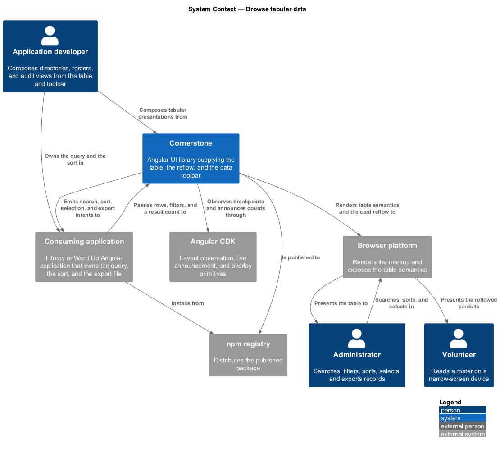
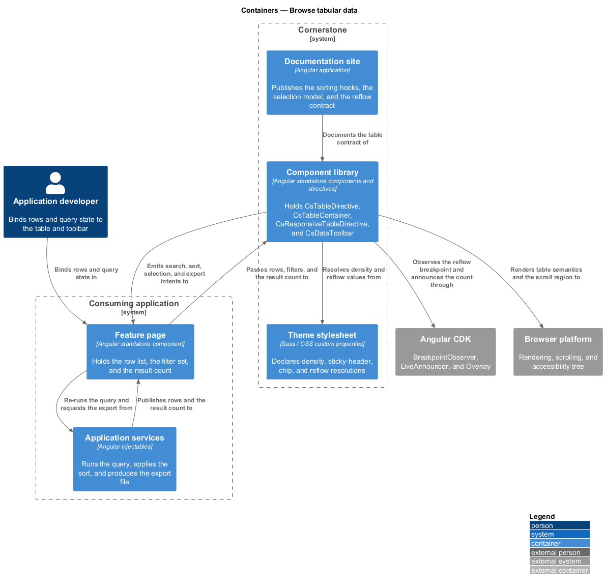
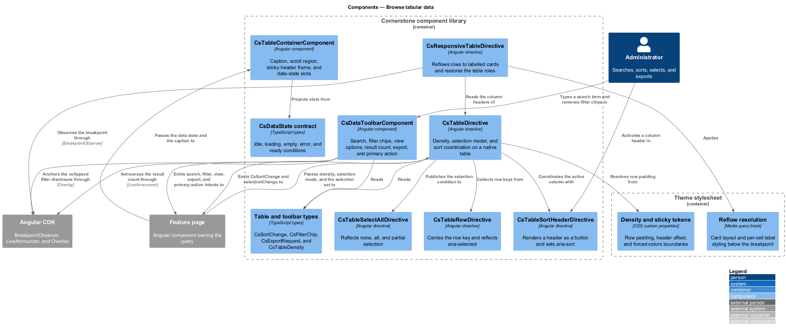
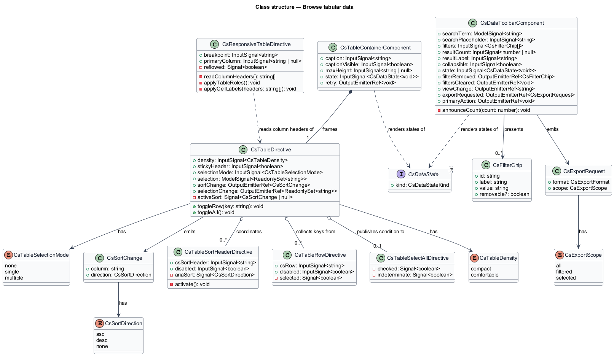
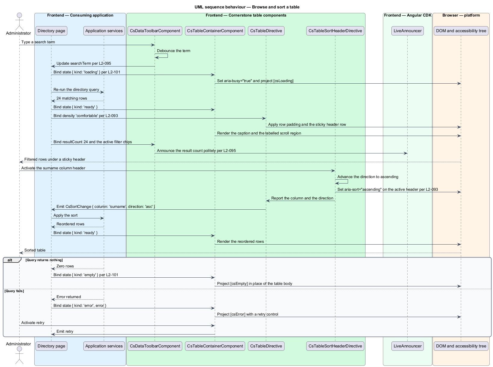
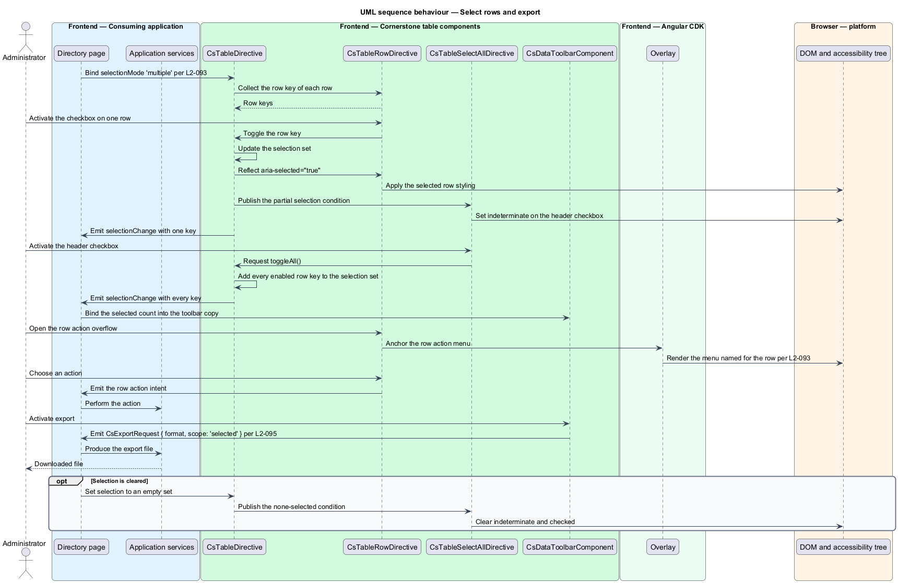
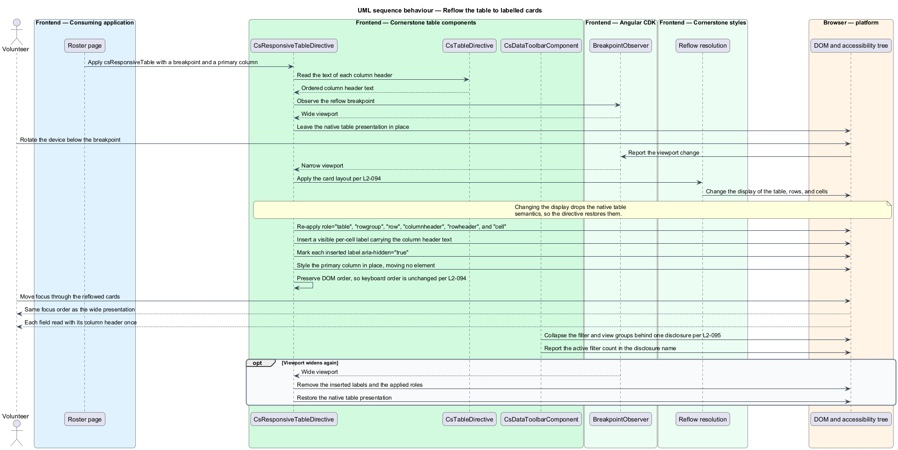

# Browse tabular data

## Overview

Cornerstone is the Angular user-interface library published as `@quinntyne/cornerstone`.
It supplies the components that the Liturgy and Word Up applications compose
their screens from. Directories, rosters, history views, reports, and audit logs
all present records in rows under column headers, above a strip of search,
filter, and export controls. This feature covers that presentation and the
controls that drive it.

**data table** — native `table` element presenting records as rows under column
headers

**table container** — scrolling frame holding a data table and supplying its
caption, sticky header, density, and data states

**card reflow** — narrow-viewport presentation in which each row renders as a
card and each cell carries its column header as a visible label

**data toolbar** — control strip above a data table carrying search, filters,
view options, a result count, export, and a primary action

The feature sits in the data-display subsystem and depends on the vacant-state
feature for the uniform data-state contract (L2-101): a table renders loading,
empty, and error conditions inside the same frame that holds its rows.

Word Up consumes the feature in its member directories, attendance history,
reports, and audit log. Liturgy consumes it in its members surface. In both
applications the library holds no sorting, no filtering, and no paging: the
components expose hooks and emit typed intents, and the application performs the
query.

The table is a native `table` throughout. Header association, row and column
semantics, and caption relationships come from the elements themselves rather
than from ARIA, and the reflow to cards restores them explicitly when the display
change would otherwise drop them.

## Description

The feature is a vertical slice from the toolbar control a reader operates down
to the rendered row, at both wide and narrow viewports. It spans two directives,
two components, three supporting directives, and the table types they share.

- **`TableDirective`** — selector `table[csTable]`. The attribute directive
  that styles and instruments a native table. The inputs are
  `density: InputSignal<TableDensity>` over `'compact' | 'comfortable'`,
  `stickyHeader: InputSignal<boolean>` defaulting to true,
  `selectionMode: InputSignal<CsTableSelectionMode>` over
  `'none' | 'single' | 'multiple'`, and
  `selection: ModelSignal<ReadonlySet<string>>`. It emits
  `sortChange: OutputEmitterRef<SortChange>` and
  `selectionChange: OutputEmitterRef<ReadonlySet<string>>` (L2-093).
- **`TableSortHeaderDirective`** — selector `th[csSortHeader]`. The sorting
  hook. It takes `csSortHeader: InputSignal<string>` naming the column key,
  renders the header as a button, sets `aria-sort` to `ascending`,
  `descending`, or `none` on the active header, and asks its parent
  `TableDirective` to emit `SortChange`. It performs no sort of its own.
- **`TableRowDirective`** — selector `tr[csRow]`. It takes
  `csRow: InputSignal<string>` carrying the row key and
  `disabled: InputSignal<boolean>`. It reflects the selected condition as
  `aria-selected` and contributes its key to the parent directive's selection
  set.
- **`CsTableSelectAllDirective`** — selector `[csSelectAll]`. It reflects the
  three selection conditions of the header control: none selected, all selected,
  and partially selected, the last as `indeterminate` on the native checkbox.
- **`TableContainerComponent`** — selector `cs-table-container`. The frame the
  table sits in. The inputs are `caption: InputSignal<string>`,
  `captionVisible: InputSignal<boolean>`,
  `maxHeight: InputSignal<string | null>`, and
  `state: InputSignal<CsDataState<void>>`. It emits
  `retry: OutputEmitterRef<void>`. It renders the horizontal scroll region as a
  `role="region"` labelled by the caption and carrying `tabindex="0"`, so a
  keyboard reader can pan a wide table. It projects the empty, loading, and error
  slots in place of the table body through the shared data-state contract
  (L2-093, L2-101).
- **`TableDensity`** — union type of the two row densities:
  `'compact' | 'comfortable'`. The density resolves row padding and line height
  from `--cs-` spacing tokens; it changes no font size, so the two densities
  remain legible at the same zoom level.
- **`SortChange`** — the emitted sort intent. It holds `column: string` and
  `direction: 'asc' | 'desc' | 'none'`.
- **`ResponsiveTableDirective`** — selector `table[csResponsiveTable]`. The
  reflow (L2-094). The inputs are `breakpoint: InputSignal<string>` and
  `primaryColumn: InputSignal<string | null>`. Below the breakpoint it renders
  each row as a card and each cell with its column header text as a visible
  label.
- **`DataToolbarComponent`** — selector `cs-data-toolbar`. The control strip
  (L2-095). The inputs are `searchTerm: ModelSignal<string>`,
  `searchPlaceholder: InputSignal<string>`,
  `filters: InputSignal<FilterChip[]>`,
  `resultCount: InputSignal<number | null>`,
  `resultLabel: InputSignal<string>`,
  `collapsible: InputSignal<boolean>` defaulting to true, and
  `state: InputSignal<CsDataState<void>>`. The projection slots are
  `[csToolbarFilters]`, `[csToolbarViewOptions]`, and `[csToolbarActions]`.
- **`FilterChip`** — the removable filter shape. It holds `id: string`,
  `label: string`, `value: string`, and an optional `removable: boolean`.
  `DataToolbarComponent` emits `filterRemoved: OutputEmitterRef<FilterChip>`
  and `filtersCleared: OutputEmitterRef<void>`; it removes nothing from the query
  itself.
- **`ExportRequest`** — the emitted export intent. It holds
  `format: CsExportFormat` and `scope: 'all' | 'filtered' | 'selected'`. The
  application produces the file; the library holds no serializer.

The reflow preserves two properties that a plain CSS display change destroys
(L2-094). It preserves header association: changing a table's display to block
drops the table role from the accessibility tree, so the directive re-applies the
explicit `table`, `rowgroup`, `row`, `columnheader`, `rowheader`, and `cell`
roles that match the native structure. The visible per-cell label the reflow adds
carries `aria-hidden="true"`, so a screen reader hears each column header once
from the restored semantics rather than twice. It preserves keyboard order: the
directive moves no element in the DOM. The primary column is promoted by styling
it in place rather than by reordering, so the visual order and the focus order
stay identical.

Row actions render as persistent controls rather than as controls revealed on
hover, so a keyboard reader and a touch reader reach them on the same terms as a
pointer reader. Where a row carries more than the documented action count, the
overflow collapses into a menu whose accessible name names the row.

The toolbar announces its result count politely on each change, so a reader who
narrows a filter hears the new total without leaving the search control
(L2-095). Below the collapse breakpoint the filter and view-option groups
collapse behind a single disclosure control that reports the active filter count
in its accessible name.

The sticky header uses position sticky on the header row within the container's
scroll region. Under `forced-colors: active` the header retains an explicit
bottom border, so the boundary between the header and the first row survives the
loss of the background colour.

The search debounce interval applied before `searchTerm` propagates is
`<TO SUPPLY>`.

The viewport width at which the default reflow breakpoint takes effect is
`<TO SUPPLY>`.

The row action count above which the overflow menu appears is `<TO SUPPLY>`.

## Requirements

The feature realizes the following level-2 (L2) requirements. Each L2 requirement
refines a level-1 (L1) requirement, cited by identifier.

| L2 ID | Refines (L1) | Requirement |
|-------|--------------|-------------|
| `L2-093` | `L1-010` | The library shall provide semantic table styling with a sticky header, compact and comfortable densities, row actions and selection, sorting hooks, and empty, loading, and error states. |
| `L2-094` | `L1-010` | The library shall reflow a table to labelled cards on narrow viewports without losing header association or keyboard order. |
| `L2-095` | `L1-010` | The library shall provide a data toolbar carrying search, filter controls and chips, view options, a result count, export, and a primary action, collapsible on narrow viewports. |

## Diagrams

### System context

An application developer composes directories, rosters, and audit views from the
table and toolbar. The application owns the query, the sort, and the export file;
Cornerstone owns the presentation and the semantics.

### Containers

The feature page holds the query state and passes rows to the component library.
The theme stylesheet supplies the density, sticky-header, and reflow
resolutions.

### Components

`TableContainerComponent` frames a native table instrumented by
`TableDirective`, its sort headers, and its row directives.
`ResponsiveTableDirective` restores the table roles at narrow widths, and
`DataToolbarComponent` emits the query intents.

### Class structure

`TableDirective` holds the selection model and coordinates the sort headers and
row directives. `DataToolbarComponent` emits search, filter, view, export, and
primary-action intents without holding a query.

### Behaviour — browse and sort a table

A reader types in the toolbar search, the application re-queries, the container
renders the loading and ready states, and a sort header emits a sort intent that
the application performs.

### Behaviour — select rows and export

A reader selects rows through the header control and the row controls, then
exports the selection. The library reports the selection and the intent; the
application produces the file.

### Behaviour — reflow the table to labelled cards

The viewport narrows below the breakpoint. The directive re-applies the table
roles, adds a visible per-cell label, and moves no element, so header association
and keyboard order both survive.

