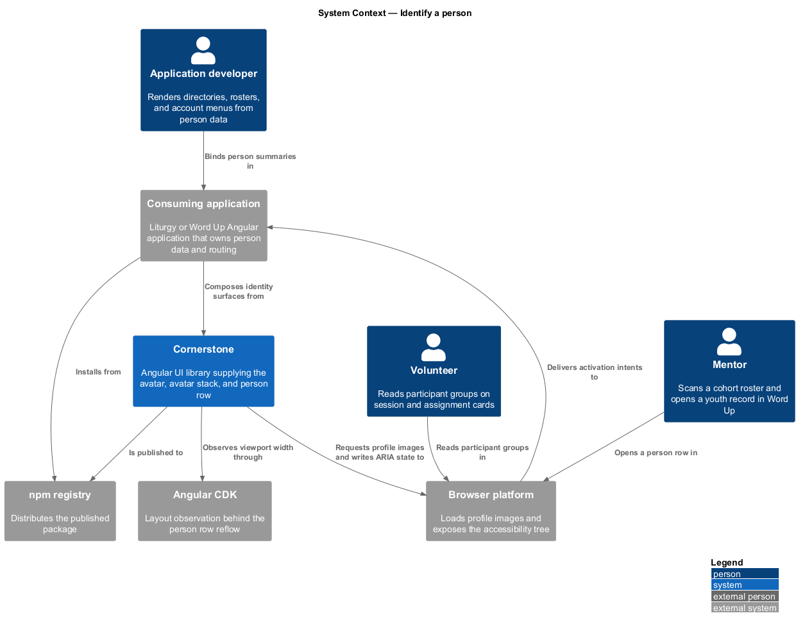
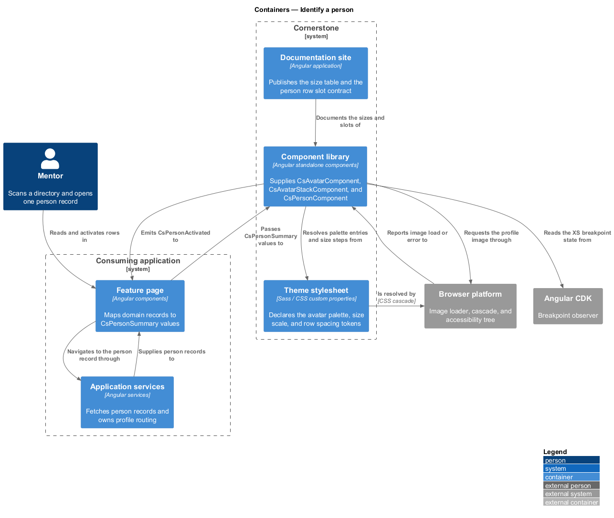
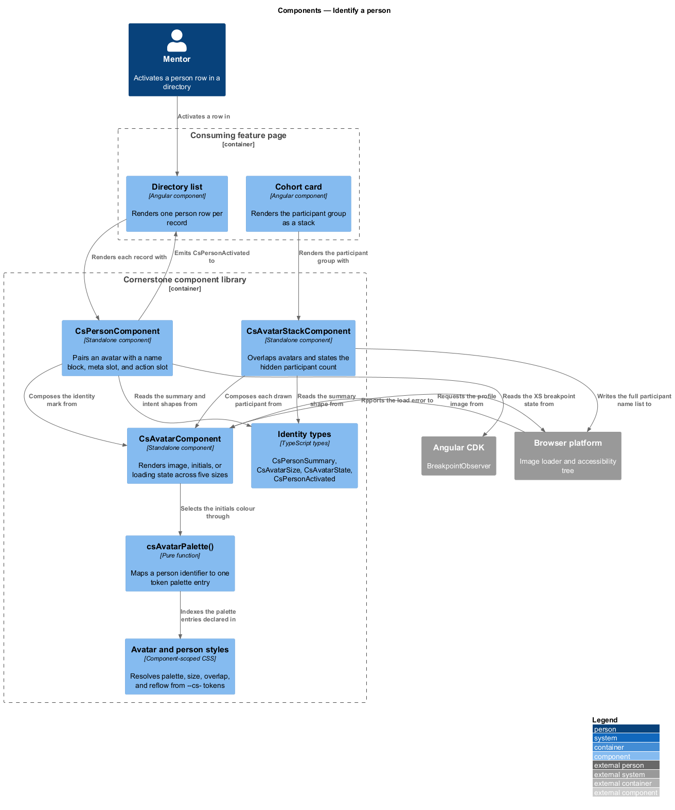
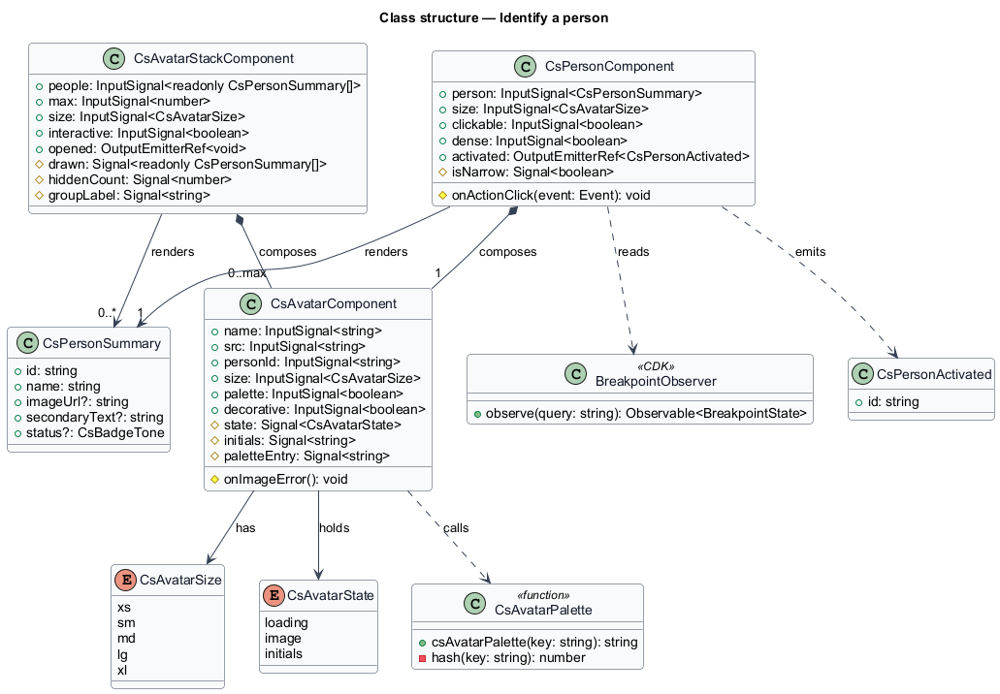
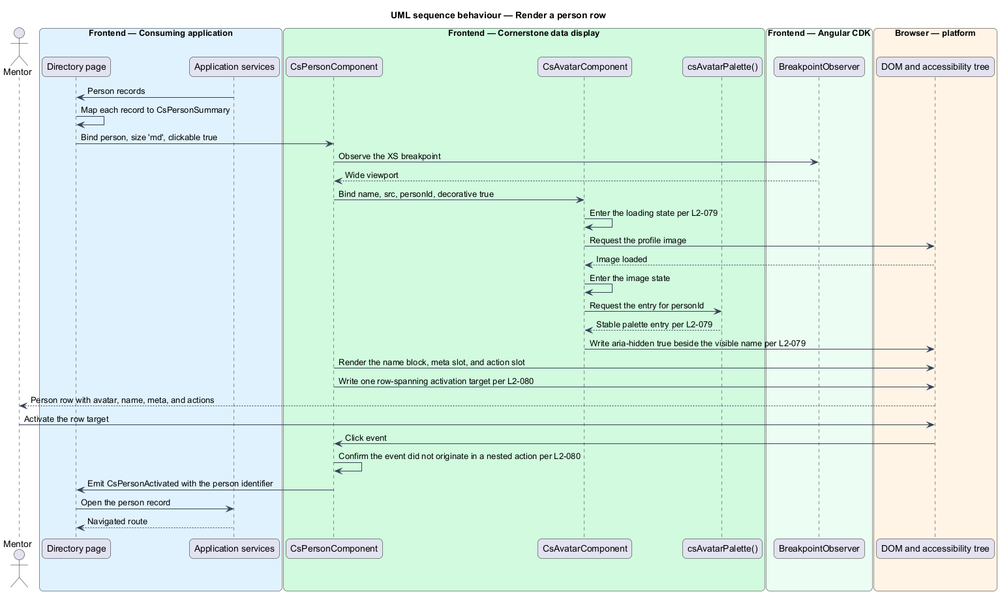
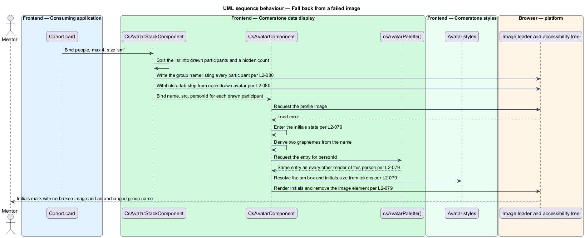
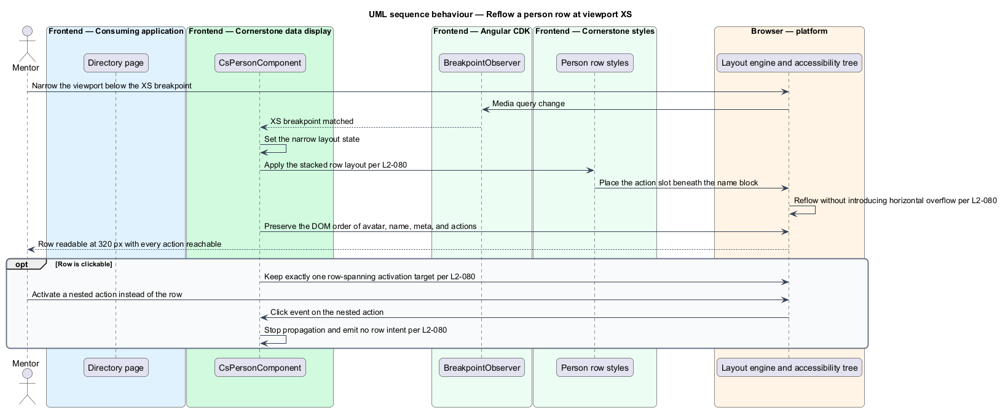

# Identify a person

## Overview

Cornerstone is the Angular user-interface library published as `@quinntyne/cornerstone`.
It supplies the components that the Liturgy and Word Up applications compose their
screens from, and it carries the FaithTech visual language that makes those screens
look like one product family.

This feature covers the surfaces that put a person on the screen: the single
identity mark, the overlapping group that stands for a set of participants, and the
row that pairs an identity mark with a name, supporting detail, and actions.

**avatar** — identity mark for one person, rendered as a photograph or as initials
derived from that person's name

**deterministic palette** — mapping from a stable person identifier to one entry in
the token colour set, so the same person receives the same initials colour on every
screen

**avatar stack** — overlapping group of avatars standing for a set of participants,
with an overflow indicator for the participants it does not draw

**person row** — horizontal record pairing an avatar with a name, supporting meta
text, and an optional action area

Word Up uses the avatar in the account menu and the topbar, the avatar stack on
cohort cards and session rosters, and the person row in directories, mentor
assignments, guardian links, and volunteer rosters. Liturgy uses the avatar on
member lists and on the assignment chips of 4D/5R workflow cards. Both applications
own the person data; Cornerstone owns the presentation, the fallback behaviour, and
the accessibility semantics.

The feature depends on the token layer for its palette and size scale (L2-005) and
on the badge tone set for the status labels a person row projects into its meta area
(L2-077). It supplies the identity mark that the list item (L2-091) and the table
container (L2-095) embed.

## Description

The feature is a vertical slice from a page that holds person data down to the
rendered identity mark and its entry in the accessibility tree. It introduces three
components, one palette function, and four public types.

- **`AvatarComponent`** — the identity mark, selector `cs-avatar`. It carries a
  `name` required input supplying the initials source, a `src` input for the
  photograph, a `personId` input keying the deterministic palette, a `size` input
  over `xs`, `sm`, `md`, `lg`, and `xl`, a `palette` input enabling or disabling the
  deterministic colouring, and a `decorative` input. The component holds three
  presentation states: `image`, `initials`, and `loading`. When `src` is set the
  component starts in `loading` and swaps to `image` on the load event; when the
  image errors it swaps to `initials` and renders no broken image element. A
  decorative avatar placed beside a visible name is `aria-hidden="true"`; a
  standalone avatar exposes `role="img"` with its accessible name from `name`. Each
  size resolves its box dimension and its initials font size from tokens, and the
  `xs` size keeps a documented minimum initials size so the mark stays legible.
- **`csAvatarPalette()`** — the palette function behind the deterministic option. It
  hashes the `personId`, or the trimmed and case-folded `name` when no identifier is
  supplied, and indexes the token palette set by the remainder. The function is pure,
  so two renders of the same person on two screens select the same entry.
- **`AvatarStackComponent`** — the overlapping group, selector `cs-avatar-stack`.
  It carries a `people` input of `PersonSummary` values, a `max` input bounding the
  drawn avatars, a `size` input shared with the avatar, and an `interactive` input.
  It renders the first `max` avatars with a negative inline offset and an overflow
  indicator stating the hidden count. The stack exposes one accessible name listing
  every participant, including those the overflow indicator stands for. Individual
  avatars inside the stack take no tab stop unless `interactive` is set, in which
  case the stack renders one activation target and emits `opened`.
- **`PersonComponent`** — the person row, selector `cs-person`. It carries a
  `person` required input of `PersonSummary`, a `size` input, a `clickable` input,
  and a `dense` input. It projects meta content through a `cs-person-meta` slot and
  actions through a `cs-person-actions` slot, and it emits `activated` when the row
  is clickable and the row target is used. A clickable row renders exactly one
  activation target spanning the row; nested action controls stop propagation so an
  action never triggers the row intent. At viewport XS the row reflows to a stacked
  layout with the action area beneath the name block, so every action stays reachable
  without horizontal scrolling.
- **`PersonSummary`** — the view model the stack and the row accept: `id`, `name`,
  optional `imageUrl`, optional `secondaryText`, and optional `status`.
- **`CsAvatarSize`** — union type of the five sizes: `'xs' | 'sm' | 'md' | 'lg' |
  'xl'`.
- **`CsAvatarState`** — union type of the three presentation states: `'image' |
  'initials' | 'loading'`.
- **`CsPersonActivated`** — typed intent carrying the activated person's identifier.

The initials derivation takes the first grapheme of the first name part and the
first grapheme of the last name part, folds them to upper case, and falls back to
the single available grapheme when the name holds one part. The derivation operates
on graphemes rather than code units so a name outside the Latin script renders one
whole character.

None of the three components fetches an image, resolves a profile route, or checks
authorization. The stack and the row report intents; the consuming application
decides what an activation means.

The exact overlap offset per size and the documented minimum initials size at `xs`
are `<TO SUPPLY>`; both depend on the final avatar box dimensions in the spacing
scale.

## Requirements

The feature realizes the following level-2 (L2) requirements. Each L2 requirement
refines a level-1 (L1) requirement, cited by identifier.

| L2 ID | Refines (L1) | Requirement |
|-------|--------------|-------------|
| `L2-079` | `L1-010` | The library shall provide an avatar with initials or image presentation, an optional deterministic palette keyed on a person identifier, xs through xl sizes resolved from tokens, and loading and error fallbacks that render initials rather than a broken image. A decorative avatar shall be `aria-hidden="true"` and a standalone avatar shall expose `role="img"` with a required accessible name. |
| `L2-080` | `L1-010` | The library shall provide an overlapping avatar group with an overflow count and a full participant list available to assistive technology, and a person row with avatar, name, meta, and action slots. Avatars inside a non-interactive stack shall not be separately focusable, a clickable row shall carry exactly one row-spanning activation target, and nested actions shall not trigger the row intent. |

## Diagrams

### System context

An application developer renders person data through Cornerstone. Cornerstone reads
its layout behaviour from Angular CDK, publishes to the npm registry, and hands the
browser an identity mark that the accessibility tree exposes to the application user.

### Containers

The consuming application's feature pages hold the person data and pass a summary
view model to the component library. The theme stylesheet supplies the palette and
the size scale; the browser loads the photographs.

### Components

`PersonComponent` composes `AvatarComponent` with a name block and two content
slots. `AvatarStackComponent` composes the same avatar with an overflow indicator.
`csAvatarPalette()` supplies the deterministic colour to both.

### Class structure

`PersonSummary` is the single view model that the stack and the row accept.
`AvatarComponent` derives its initials and its palette entry from that summary and
holds the presentation state that the image load result selects.

### Behaviour — render a person row

A directory page passes a person summary to the row. The row composes an avatar, a
name block, and an action area, resolves the deterministic palette, and exposes one
activation target for the whole row.

### Behaviour — fall back from a failed image

The photograph fails to load. The avatar drops the image element, derives initials
from the name, selects the deterministic palette entry, and leaves the accessible
name unchanged.

### Behaviour — reflow a person row at viewport XS

The viewport narrows below the XS breakpoint. The row stacks its name block above
its action area and keeps every action reachable without horizontal scrolling.

