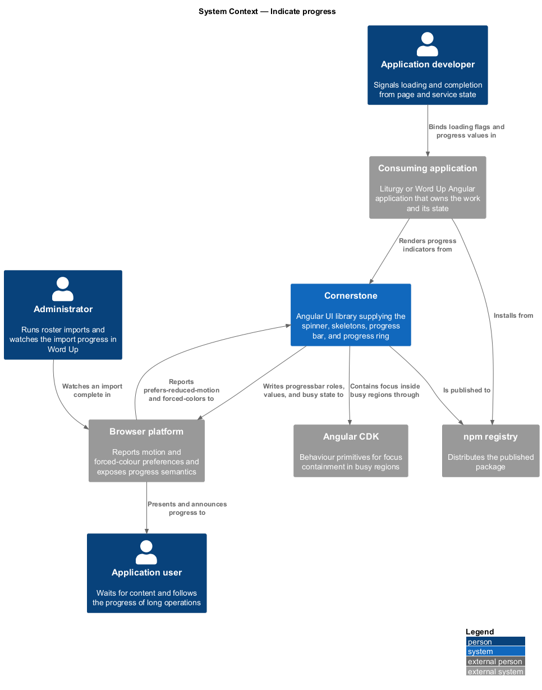
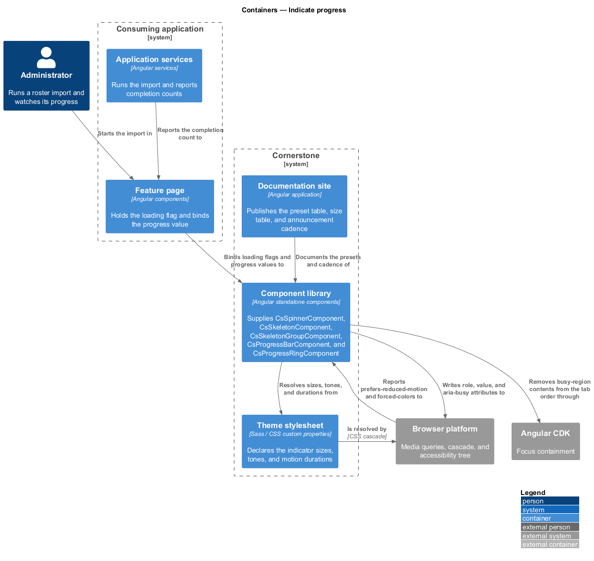
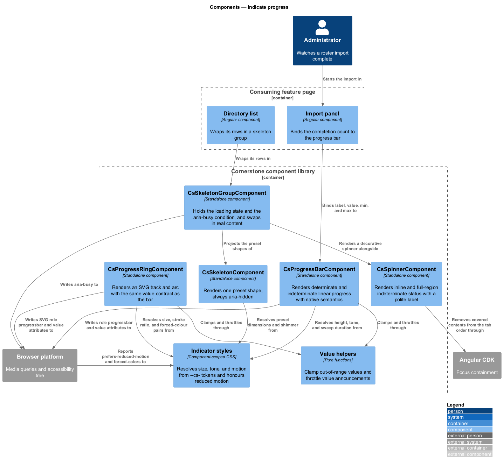
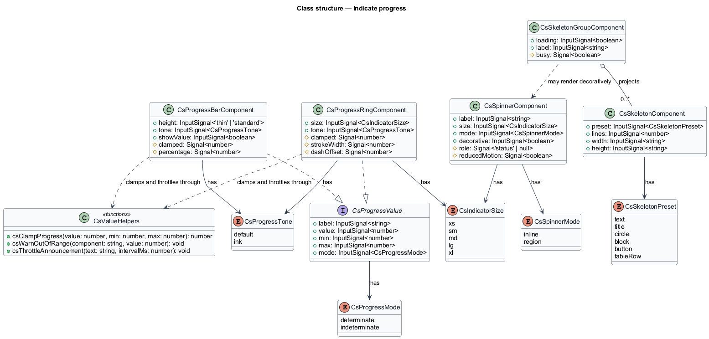
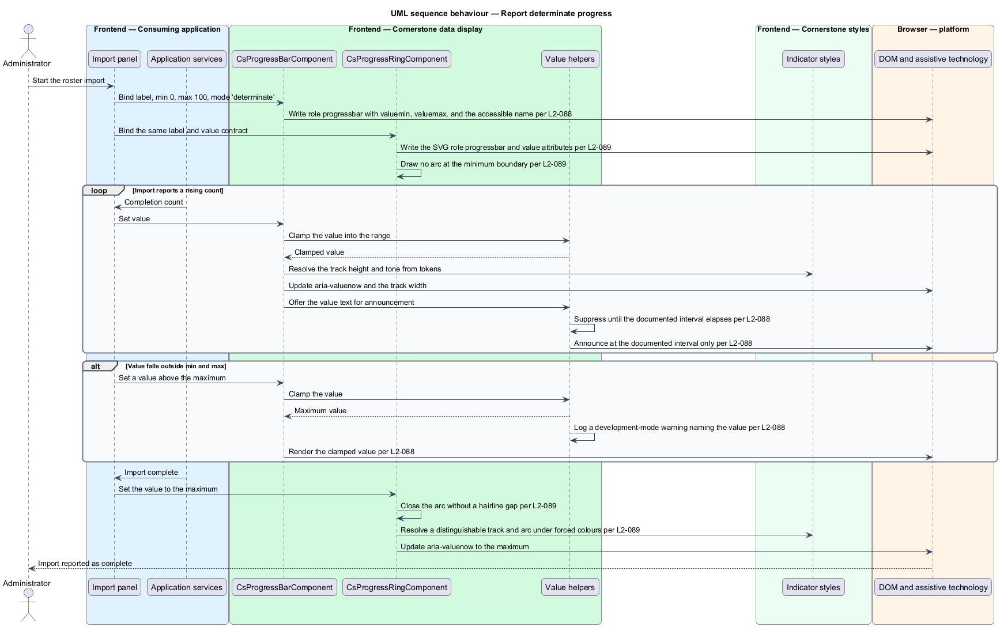
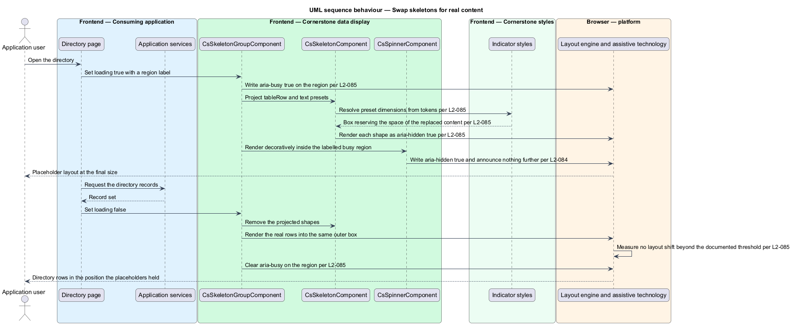
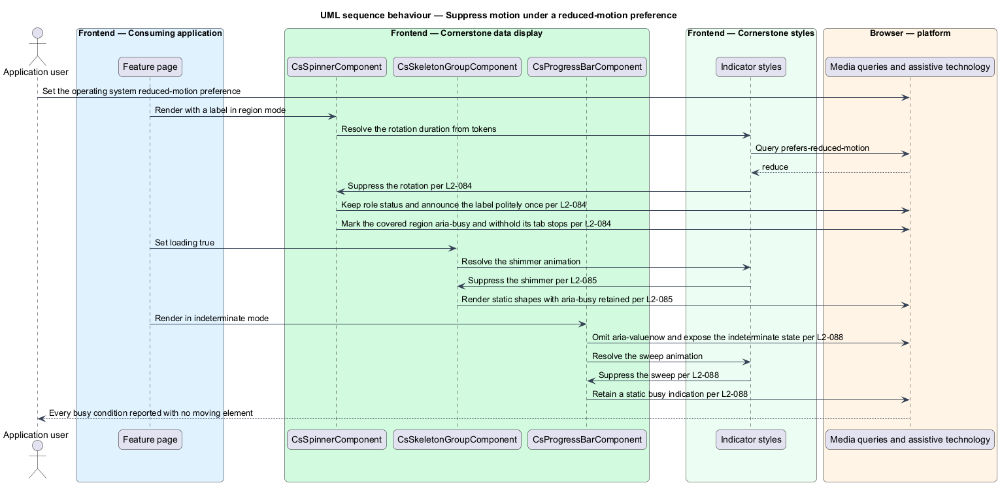

# Indicate progress

## Overview

Cornerstone is the Angular user-interface library published as `@quinntyne/cornerstone`.
It supplies the components that the Liturgy and Word Up applications compose their
screens from, and it carries the FaithTech visual language that makes those screens
look like one product family.

This feature covers the surfaces that tell a person that work is under way and, when
the amount of work is known, how much of it remains. It spans the indeterminate
spinner, the placeholder shapes that stand in for content still loading, the linear
progress bar, and the circular progress ring.

**busy region** — area of the screen whose content is not yet final, marked so
assistive technology reports the condition without moving focus

**determinate progress** — progress carrying a known current value between a
minimum and a maximum

**indeterminate progress** — progress whose completion fraction is unknown, shown as
motion rather than as a value

**skeleton** — placeholder shape holding the layout space of content that has not
arrived, so the arrival of content shifts nothing

**preset** — named skeleton shape whose dimensions match one recurring content form,
such as a line of text, a heading, an avatar, a block, a button, or a table row

Word Up uses the spinner on route transitions, skeletons on directory, report, and
roster pages, the progress bar on file imports and multi-step submissions, and the
progress ring on competency and journey reports. Liturgy uses the spinner on
workspace loads, the progress bar on 4D/5R phase completion, and the ring as the base
of its workflow dial. Both applications own the loading state; Cornerstone owns the
presentation, the motion, and the accessibility semantics.

The feature depends on the token layer for its sizes, tones, and motion durations
(L2-005) and on the reduced-motion contract (L2-008), which every surface here
honours by suppressing animation while keeping the state reported.

## Description

The feature is a vertical slice from a page that holds a loading flag down to the
rendered indicator and its entry in the accessibility tree. It introduces five
components and five public types.

- **`SpinnerComponent`** — the indeterminate indicator, selector `cs-spinner`. It
  carries a `label` input, a `size` input over `xs`, `sm`, `md`, and `lg`, a `mode`
  input over `inline` and `region`, and a `decorative` input. A labelled spinner
  exposes `role="status"` and announces its label politely once. A decorative spinner
  inside an already-labelled busy region is `aria-hidden="true"` and produces no
  second announcement. In `region` mode the spinner marks the covered area
  `aria-busy="true"` and makes its interactive contents unreachable by keyboard, so
  the person cannot act on content that is still settling. Under
  `prefers-reduced-motion: reduce` the rotation is suppressed and the status stays
  announced.
- **`SkeletonComponent`** — one placeholder shape, selector `cs-skeleton`. It
  carries a `preset` input over `text`, `title`, `circle`, `block`, `button`, and
  `tableRow`, a `lines` input for the `text` preset, and `width` and `height` inputs
  overriding the preset. Every preset derives its dimensions from tokens so it
  reserves the same space as the content it replaces within the documented tolerance.
  Each shape is `aria-hidden="true"`; the busy condition belongs to the group.
- **`SkeletonGroupComponent`** — the busy region, selector `cs-skeleton-group`. It
  carries a `loading` input and a `label` input, projects the skeleton shapes while
  `loading` holds, and projects the real content once it clears. The group exposes
  `aria-busy="true"` while loading. The swap preserves the outer box dimensions, so
  the exchange stays inside the documented cumulative-layout-shift threshold. Under
  `prefers-reduced-motion: reduce` the shimmer animation is suppressed and the shapes
  render static.
- **`ProgressBarComponent`** — the linear indicator, selector `cs-progress-bar`. It
  carries a `label` required input, a `value` input, `min` and `max` inputs, a `mode`
  input over `determinate` and `indeterminate`, a `height` input over `thin` and
  `standard`, a `tone` input over `default` and `ink`, and a `showValue` input adding
  a label and value row above the track. A determinate bar exposes
  `role="progressbar"` with `aria-valuenow`, `aria-valuemin`, `aria-valuemax`, and the
  accessible name from `label`. An indeterminate bar omits `aria-valuenow` and exposes
  the indeterminate state. A value outside the range is clamped for rendering, and
  development mode logs a warning naming the component and the offending value.
  Announcements of a changing value are throttled to the documented interval rather
  than emitted on every increment. Under `prefers-reduced-motion: reduce` the sweeping
  animation is suppressed and a static busy indication remains.
- **`ProgressRingComponent`** — the circular indicator, selector
  `cs-progress-ring`. It carries the same `label`, `value`, `min`, `max`, and `mode`
  inputs as the bar, plus a `size` input over `sm`, `md`, `lg`, and `xl` and a `tone`
  input. It renders an SVG track and arc, and the SVG root carries
  `role="progressbar"` with the same value attributes. The stroke width scales with
  the size by the documented ratio. The arc renders correctly at both boundaries: a
  value equal to `min` draws no arc rather than a stray cap, and a value equal to
  `max` draws a closed circle rather than a hairline gap. Under `forced-colors:
  active` the track and the arc resolve to two distinguishable system colours.
- **`CsProgressMode`** — union type of the two modes: `'determinate' |
  'indeterminate'`.
- **`CsSkeletonPreset`** — union type of the six presets.
- **`CsSpinnerMode`** — union type of the two spinner modes: `'inline' | 'region'`.
- **`CsIndicatorSize`** — union type of the size steps shared by the spinner and the
  ring.
- **`CsProgressTone`** — union type of the tone identifiers the bar and the ring
  share: `'default' | 'ink'`.

The four surfaces share one clamp helper and one throttled announcement helper, so a
bar and a ring bound to the same value report the same number and announce on the
same cadence.

None of the components starts work, polls a source, or decides when loading ends. A
page sets `loading` or supplies a value; the components render what they are told.

The documented values for the layout-space tolerance per preset, the
cumulative-layout-shift threshold across the skeleton swap, the value-announcement
throttle interval, and the stroke-width ratio per ring size are `<TO SUPPLY>`; each
depends on measurement against the Word Up report and directory pages that has not
yet run.

## Requirements

The feature realizes the following level-2 (L2) requirements. Each L2 requirement
refines a level-1 (L1) requirement, cited by identifier.

| L2 ID | Refines (L1) | Requirement |
|-------|--------------|-------------|
| `L2-084` | `L1-010` | The library shall provide a spinner with documented sizes, inline and full-region modes, and a labelled live status that exposes `role="status"` and announces politely once, is `aria-hidden="true"` when decorative inside an already-busy region, marks the covered region `aria-busy="true"` with unreachable interactive contents in full-region mode, and suppresses rotation under `prefers-reduced-motion: reduce`. |
| `L2-085` | `L1-010` | The library shall provide text, title, circle, block, button, and table-row skeleton presets whose dimensions derive from tokens and reserve the layout space of the content they replace, with the group exposing `aria-busy="true"`, the individual shapes `aria-hidden="true"`, a swap to real content within the documented cumulative-layout-shift threshold, and shimmer suppressed under `prefers-reduced-motion: reduce`. |
| `L2-088` | `L1-010` | The library shall provide determinate and indeterminate linear progress with an optional label and value row, thin and standard heights, ink and default tones, and native progress semantics carrying `aria-valuenow`, `aria-valuemin`, `aria-valuemax`, and a required accessible name; out-of-range values shall be clamped with a development-mode warning, value announcements shall occur only at the documented interval, and the sweeping animation shall be suppressed under `prefers-reduced-motion: reduce` while a static busy indication remains. |
| `L2-089` | `L1-010` | The library shall provide an SVG progress ring with size, tone, value, and label inputs, accessible value semantics matching the progress bar, an indeterminate option, a stroke width scaling by the documented ratio per size, correct arc rendering at the minimum and maximum boundaries, and a track and arc distinguishable under `forced-colors: active`. |

## Diagrams

### System context

An application developer signals loading and completion through Cornerstone.
Cornerstone reads its motion and colour preferences through the browser, publishes to
the npm registry, and hands the browser the roles and values that assistive
technology reports to the application user.

### Containers

The consuming application's feature pages hold the loading flag and the progress
value; the component library renders the indicators; the theme stylesheet supplies
every size, tone, and motion duration.

### Components

`SkeletonGroupComponent` owns the busy condition that its projected shapes leave
alone. `ProgressBarComponent` and `ProgressRingComponent` share the clamp helper
and the throttled announcement helper.

### Class structure

The bar and the ring carry the same value contract over different geometry. The
skeleton group holds the loading state; the individual skeleton holds only a preset
and its overrides.

### Behaviour — report determinate progress

A file import reports a rising value. The bar clamps an out-of-range value, warns in
development mode, and announces at the documented interval rather than on every
increment.

### Behaviour — swap skeletons for content

A directory page renders a skeleton group, receives its records, and swaps the
placeholder shapes for real rows without shifting the surrounding layout.

### Behaviour — suppress motion under a reduced-motion preference

The operating system reports a reduced-motion preference. The spinner, the skeleton
shimmer, and the indeterminate sweep all stop moving while every busy condition stays
reported.

