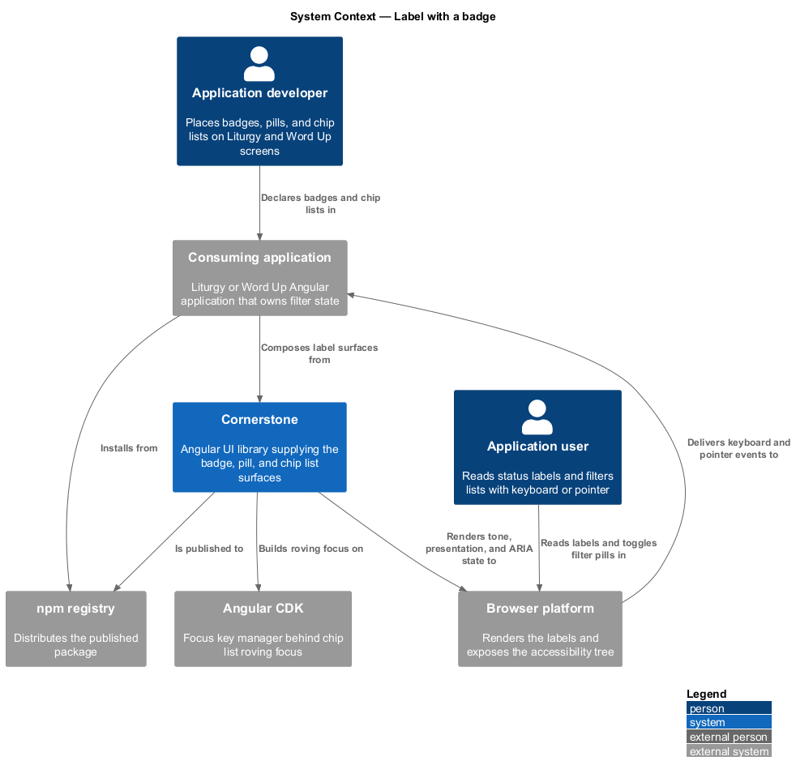
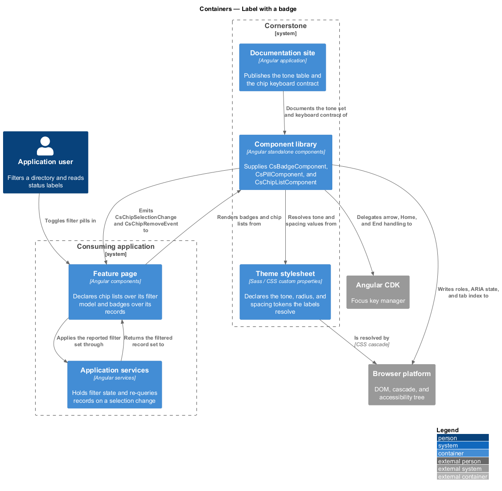
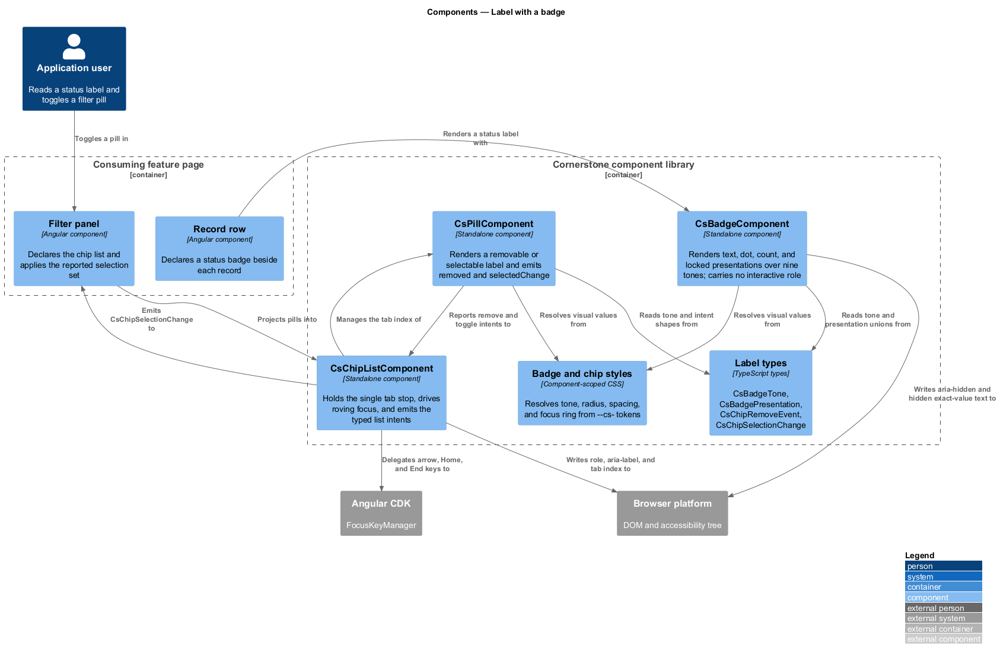
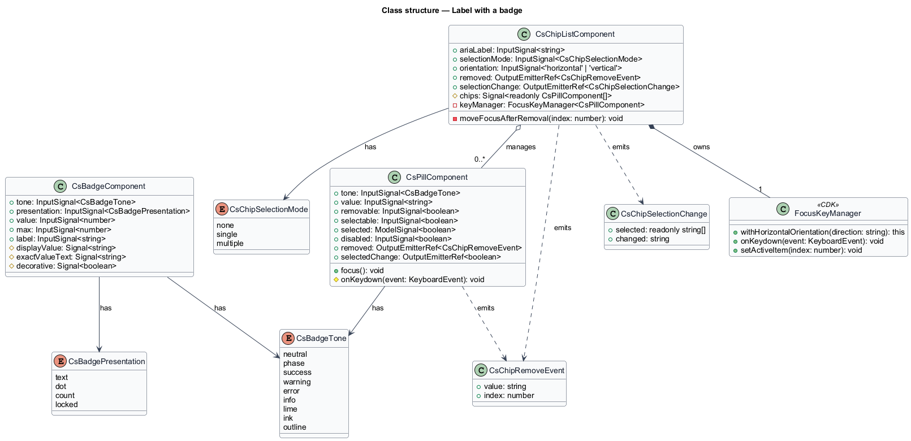
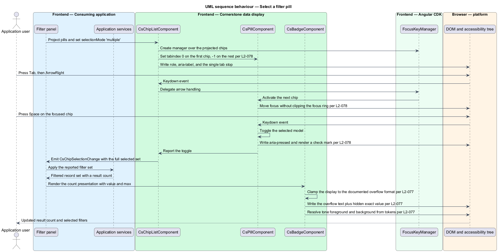
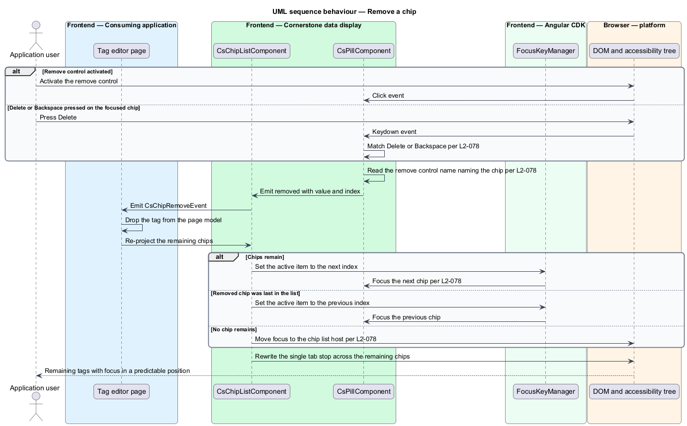

# Label with a badge

## Overview

Cornerstone is the Angular user-interface library published as `@quinntyne/cornerstone`.
It supplies the components that the Liturgy and Word Up applications compose their
screens from, and it carries the FaithTech visual language that makes those screens
look like one product family.

This feature covers the smallest labelling surfaces in the data-display subsystem:
the short coloured labels that state a status, a phase, or a count beside a subject,
and the interactive variants of those labels that a page uses for filtering and for
tag entry.

**badge** — short non-interactive label stating a status, phase, or count for an
adjacent subject

**tone** — named semantic colour resolution selected by an input, resolved from the
token layer rather than from a literal colour

**pill** — compact label that may carry a remove control, a selected state, or both

**chip list** — container that manages a set of pills as one composite widget with a
single tab stop

Liturgy uses badges for the phase labels on 4D/5R workflow cards and for the filter
labels above member lists. Word Up uses badges for roster status, pills for topic
tags on content records, and chip lists for the filter rows above directories,
reports, and audit views. Both applications own the meaning of a label; Cornerstone
owns its presentation, its keyboard behaviour, and its accessibility semantics.

The feature sits at the base of the data-display subsystem. The person row
(L2-080), the list item (L2-091), and the table container (L2-095) all embed a badge
or a pill rather than declaring their own label styles, so the tone set defined here
is the tone set those composites inherit.

## Description

The feature is a vertical slice from a page template that declares a label down to
the computed style and the accessibility tree of the rendered element. It introduces
three components, four public types, and one internal focus manager binding.

- **`BadgeComponent`** — the status label, selector `cs-badge`. It carries a
  `tone` input over the nine documented tones (`neutral`, `phase`, `success`,
  `warning`, `error`, `info`, `lime`, `ink`, `outline`), a `presentation` input over
  `text`, `dot`, `count`, and `locked`, a `value` input for the count presentation, a
  `max` input bounding the displayed count, and a `label` input supplying the
  accessible name when the presentation carries no text. The component declares no
  interactive role and takes no tab stop. In the `dot` presentation the host is
  `aria-hidden="true"` and the meaning travels on the owning control's accessible
  name. In the `count` presentation a value above `max` renders the documented
  overflow format while the exact value stays available to assistive technology
  through visually hidden text. In the `locked` presentation the component renders an
  icon and text together so state never rests on colour alone.
- **`PillComponent`** — the interactive label, selector `cs-pill`. It carries a
  `tone` input, a `removable` input, a `selectable` input, a `selected` model, and a
  `disabled` input. It emits `removed` when the remove control is activated and when
  `Delete` or `Backspace` is pressed while the pill holds focus. It emits
  `selectedChange` when a selectable pill toggles. A selectable pill exposes
  `aria-pressed` when it acts as a toggle button and `aria-selected` when it sits in
  a chip list declared as a listbox, and it indicates selection with a check mark and
  a border weight change in addition to tone.
- **`ChipListComponent`** — the composite container, selector `cs-chip-list`. It
  carries a `selectionMode` input over `none`, `single`, and `multiple`, an
  `orientation` input over `horizontal` and `vertical`, and an `ariaLabel` required
  input. It queries its projected `PillComponent` children, drives a roving tab
  index across them, and holds exactly one child in the document tab order. It emits
  `removed` carrying `ChipRemoveEvent` and `selectionChange` carrying
  `ChipSelectionChange`. When a chip is removed the list moves focus to the next
  chip, to the previous chip when the removed chip was last, and to the list host
  when no chip remains. Chips wrap when they exceed the container width, and the
  focus ring is drawn inside the chip box so wrapping never clips it.
- **`CsBadgeTone`** — union type of the nine tone identifiers.
- **`CsBadgePresentation`** — union type of the four presentations: `'text' | 'dot' |
  'count' | 'locked'`.
- **`ChipRemoveEvent`** — typed intent carrying the removed chip's value and its
  index in the list at the moment of removal.
- **`ChipSelectionChange`** — typed intent carrying the full selected value set
  after the change, so a page applies one filter state rather than reconciling
  individual toggles.
- **`_badge.scss` and `_chip.scss`** — the component stylesheets. Every foreground,
  background, border, radius, and spacing value resolves from a `--cs-` token, so a
  tone re-resolves under `.cs-theme-dark` without a component code path (L2-006).
  Each tone pair meets 4.5:1 text contrast in the light and dark resolutions.

The chip list builds its roving focus on the Angular CDK `FocusKeyManager`, so arrow
keys, `Home`, `End`, and typeahead follow the same rules as the other composite
widgets in the library. The list sets the manager's orientation from its own
`orientation` input.

None of the three components performs filtering, persistence, or authorization. A
chip list reports a selection change and a removal intent; the consuming application
decides what the change means and re-queries its own data.

The documented count overflow format and the count `max` default are `<TO SUPPLY>`;
the overflow rendering rule depends on a numeral-formatting decision that the
typography scale has not yet fixed.

## Requirements

The feature realizes the following level-2 (L2) requirements. Each L2 requirement
refines a level-1 (L1) requirement, cited by identifier.

| L2 ID | Refines (L1) | Requirement |
|-------|--------------|-------------|
| `L2-077` | `L1-010` | The library shall provide a badge with neutral, phase, success, warning, error, info, lime, ink, and outline tones, and with dot, count, and locked or blocked presentations. Every tone shall resolve from tokens and meet 4.5:1 text contrast in the light and dark themes, and a badge shall not be focusable and shall expose no interactive role. |
| `L2-078` | `L1-010` | The library shall provide static and removable tags and single-select and multi-select filter pills with roving focus, a single tab stop, a typed remove intent with documented focus movement, `Delete` and `Backspace` removal, and selection indicated without relying on colour alone. |

## Diagrams

### System context

An application developer places badges and chip lists on Liturgy and Word Up screens.
Cornerstone draws its roving-focus behaviour from Angular CDK, publishes to the npm
registry, and renders labels that the browser exposes to the application user through
the accessibility tree.

### Containers

The consuming application's feature pages declare badges and chip lists; the
component library supplies the elements and the keyboard behaviour, and the theme
stylesheet supplies every tone value. Application services receive the typed
selection and removal intents.

### Components

`ChipListComponent` owns the tab stop and delegates key handling to the CDK focus
key manager. `PillComponent` and `BadgeComponent` render tone and presentation
from the shared tone set; only the pill emits intents.

### Class structure

`BadgeComponent` and `PillComponent` share `CsBadgeTone`. The chip list
aggregates its pills and emits the two typed intents; the pill holds the selected
state as a model so a page can drive it or observe it.

### Behaviour — select a filter pill

The user moves across a chip list with the arrow keys and toggles one pill. The list
holds a single tab stop, emits the full selected set, and the page re-queries and
re-renders the result count as a badge.

### Behaviour — remove a chip

The user removes a chip with the remove control or with `Delete`. The list emits the
typed remove intent and places focus on the next chip, falling back to the list host
when the removed chip was the last one.

