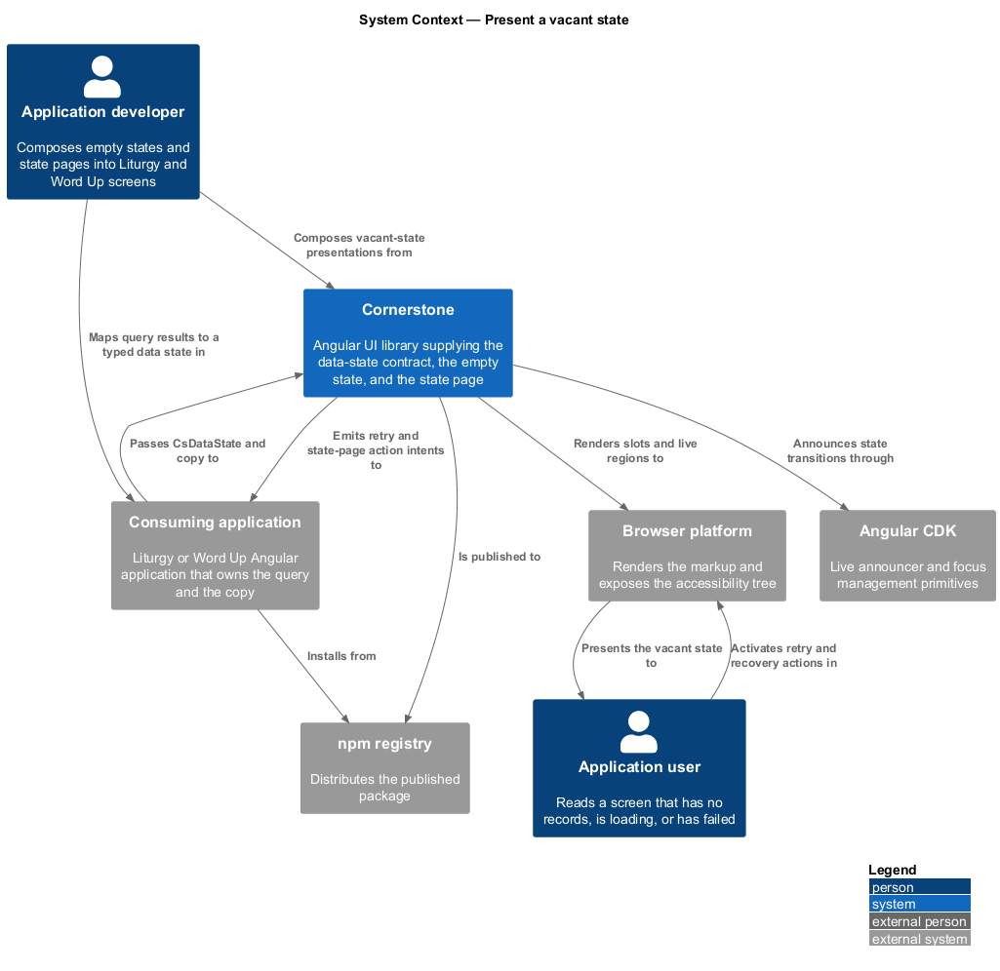
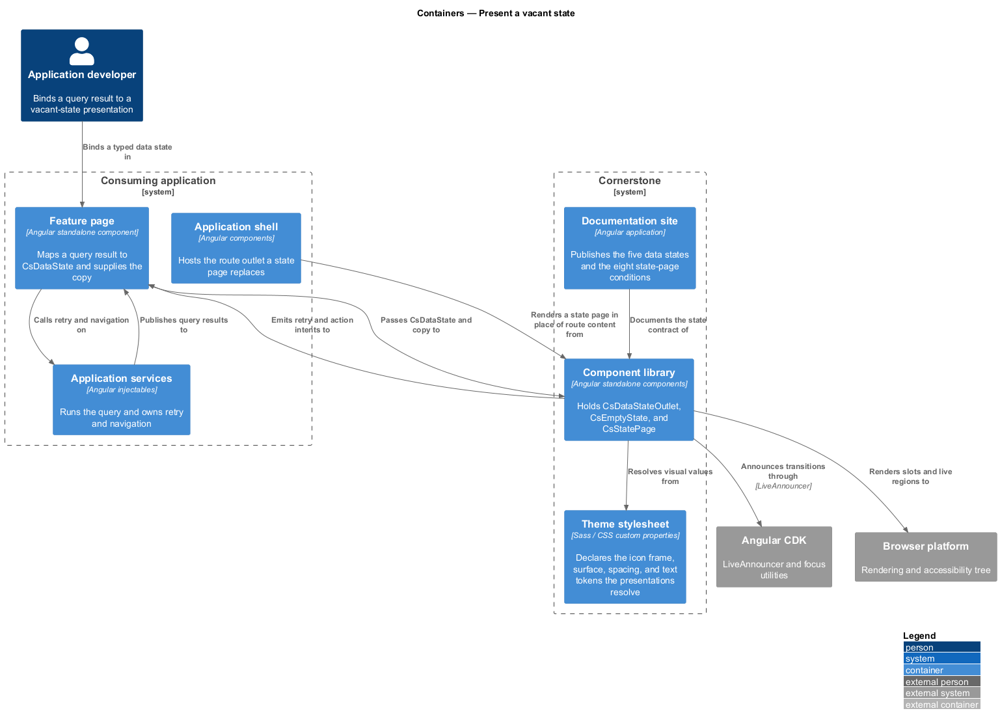
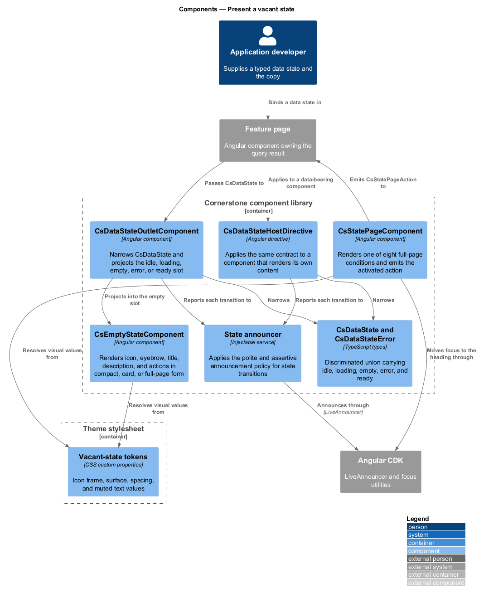
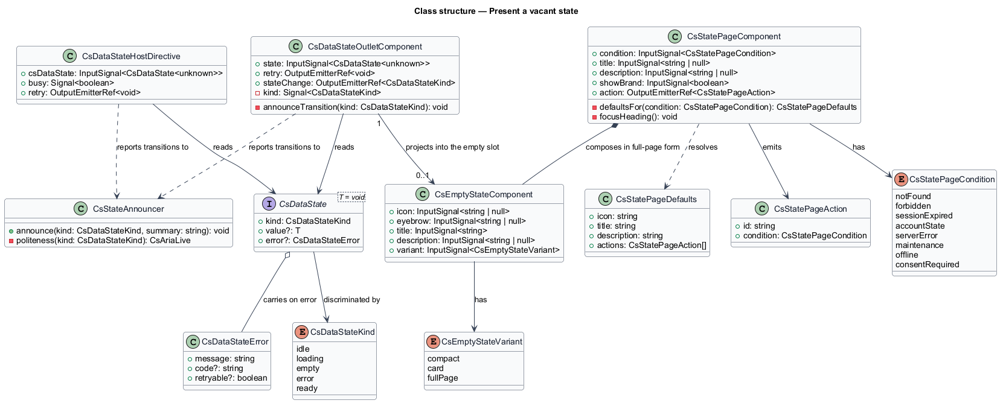
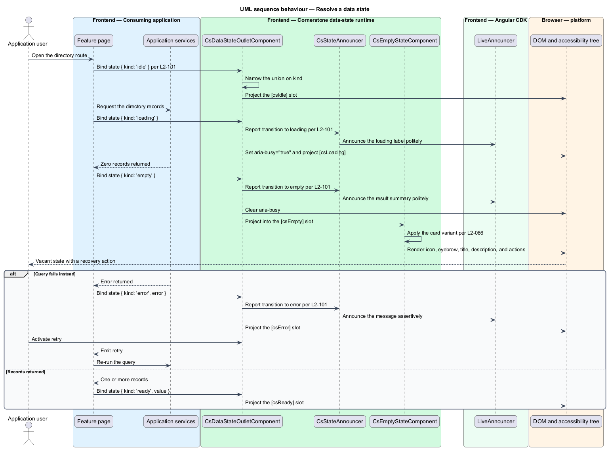
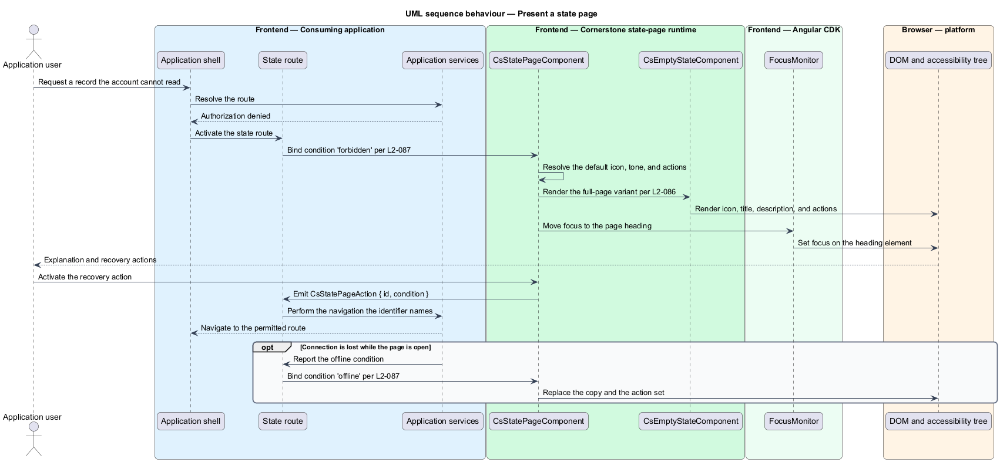

# Present a vacant state

## Overview

Cornerstone is the Angular user-interface library published as `@quinntyne/cornerstone`.
It supplies the components that the Liturgy and Word Up applications compose
their screens from. Every screen that reads data spends part of its life with no
content to show: before a query starts, while it runs, when it returns nothing,
and when it fails. This feature covers those conditions and the contract that
makes them behave the same way everywhere.

**data state** — named condition of a data-bearing component's content, one of
idle, loading, empty, error, or ready

**vacant state** — presentation shown in place of content when a data state
carries no records to display

**state page** — full-viewport presentation of a condition that prevents a route
from rendering its normal content

The feature sits at the base of the data-display subsystem. The list, table,
definition list, timeline, statistic, and chart features all carry data and all
resolve the same five data states, so the contract defined here is the one they
implement. Placing it in a single slice keeps the slot names, the announcement
timing, and the state vocabulary identical across the subsystem.

Both applications consume the feature. Word Up renders state pages for its
not-found, forbidden, session-expired, account, server-error, maintenance,
offline, and consent-required routes, and renders empty states inside its
directories, rosters, and reports. Liturgy renders empty states inside its
member, phase, and activity surfaces.

The consuming application owns the query, the error object, and the copy. The
library owns the layout, the semantics, the focus behaviour, and the
announcement.

## Description

The feature is a vertical slice from the typed state value an application
publishes down to the announced, rendered presentation. It spans three
components, one directive, and the state types they share.

- **`CsDataState<T = void>`** — the discriminated union that carries the
  condition. The five members are `{ kind: 'idle' }`, `{ kind: 'loading' }`,
  `{ kind: 'empty' }`, `{ kind: 'error', error: CsDataStateError }`, and
  `{ kind: 'ready', value: T }`. The `kind` field is the discriminant, so a
  template narrows the union without a type assertion. The type parameter
  defaults to `void`, so a component that carries no payload writes
  `CsDataState` and a component that carries one writes `CsDataState<Row[]>`.
- **`CsDataStateError`** — the error shape a component renders. It holds
  `message: string`, an optional `code: string`, and an optional
  `retryable: boolean`. It carries no HTTP status and no stack, because the
  library holds no HTTP client.
- **`DataStateOutletComponent`** — selector `cs-data-state-outlet`. It takes a
  required `state: InputSignal<CsDataState<unknown>>` and projects one of five
  named slots: `[csIdle]`, `[csLoading]`, `[csEmpty]`, `[csError]`, and
  `[csReady]`. The slot names are the ones every data-bearing component in the
  subsystem reuses (L2-101). It emits `retry: OutputEmitterRef<void>` when the
  error slot's retry control is activated, and `stateChange:
  OutputEmitterRef<CsDataStateKind>` on each transition.
- **`DataStateHostDirective`** — selector `[csDataState]`. It applies the same
  contract to a component that renders its own content, such as
  `TableContainerComponent` or `ListComponent`. It sets `aria-busy` on the
  host during `loading`, and it manages the live announcement so that the host
  component holds no announcement code of its own.
- **`EmptyStateComponent`** — selector `cs-empty-state`. It renders an icon, an
  eyebrow, a title, a description, and actions. The inputs are
  `icon: InputSignal<string | null>`, `eyebrow: InputSignal<string | null>`,
  `title: InputSignal<string>`, `description: InputSignal<string | null>`, and
  `variant: InputSignal<EmptyStateVariant>` defaulting to `card`. The action
  slot is `[csEmptyStateActions]` and the icon slot is `[csEmptyStateIcon]`, so
  an application may project a component in place of a named icon (L2-086).
- **`EmptyStateVariant`** — union type of the three presentations:
  `'compact' | 'card' | 'full-page'`. The compact variant renders a single line
  with no icon frame for use inside a table body or a list. The card variant
  renders the icon frame and centred text inside the surrounding card. The
  full-page variant centres the block in the available height and raises the
  title to the page heading level.
- **`StatePageComponent`** — selector `cs-state-page`. It renders a full-page
  presentation for one of eight conditions (L2-087). The inputs are
  `condition: InputSignal<StatePageCondition>`,
  `title: InputSignal<string | null>`,
  `description: InputSignal<string | null>`, and
  `showBrand: InputSignal<boolean>`. When `title` or `description` is null the
  component renders the documented default copy for the condition. It emits
  `action: OutputEmitterRef<CsStatePageAction>` carrying the identifier of the
  activated action, so the application performs the navigation, the sign-in, or
  the retry.
- **`StatePageCondition`** — union type of the eight conditions:
  `'not-found' | 'forbidden' | 'session-expired' | 'account-state' |
  'server-error' | 'maintenance' | 'offline' | 'consent-required'`. Each
  condition maps to a default icon, a default tone, and a default action set.
- **`CsStatePageAction`** — the emitted intent. It holds `id: string` and
  `condition: StatePageCondition`, so a single handler distinguishes a retry on
  a server error from a retry on an offline condition.

Every state resolves its icon frame, surface, spacing, and text colour from
`--cs-` tokens, so a state page and an empty state on the same screen share one
visual language.

The announcement behaviour is uniform (L2-101). A transition into `loading` sets
`aria-busy="true"` on the state host and announces the loading label through a
polite live region. A transition into `empty` or `ready` clears `aria-busy` and
announces the result summary politely. A transition into `error` announces
through an assertive live region, because the condition interrupts the reading
task. A transition out of `idle` announces nothing, because `idle` precedes any
user-visible request.

`StatePageComponent` moves focus to its heading on first render, so a keyboard
reader that arrives at a forbidden or not-found route lands on the explanation
rather than at the top of the document. `EmptyStateComponent` does not move
focus, because it replaces a region rather than a route.

Both components render without a browser global, so a server renderer produces
the same markup as the client. The live announcement is suppressed during
server-side rendering and replays on the first client render.

The debounce applied before a `loading` announcement, which keeps a fast query
from announcing twice, is `<TO SUPPLY>`.

## Requirements

The feature realizes the following level-2 (L2) requirements. Each L2 requirement
refines a level-1 (L1) requirement, cited by identifier.

| L2 ID | Refines (L1) | Requirement |
|-------|--------------|-------------|
| `L2-086` | `L1-010` | The library shall provide an empty state carrying icon, eyebrow, title, description, and action slots, in compact, card, and full-page variants. |
| `L2-087` | `L1-010` | The library shall provide full-page presentations for the not-found, forbidden, session-expired, account-state, server-error, maintenance, offline, and consent-required conditions. |
| `L2-101` | `L1-010` | Every data-bearing component shall expose a uniform typed state contract covering idle, loading, empty, error, and ready, with consistent slot names and consistent announcement behaviour. |

## Diagrams

### System context

An application developer composes vacant-state presentations into Liturgy and
Word Up screens. Cornerstone draws its live-region behaviour from Angular CDK and
renders through the browser platform; the application supplies the query result
that selects the state.

### Containers

The feature page holds the query result and passes it to the component library as
a typed data state. The theme stylesheet supplies the icon frame, surface, and
text tokens the vacant presentations resolve.

### Components

`DataStateOutletComponent` and `DataStateHostDirective` share one state
contract and one announcer. `EmptyStateComponent` fills the empty slot and
`StatePageComponent` replaces the whole route.

### Class structure

`CsDataState<T>` is the discriminated union every data-bearing component accepts.
The outlet and the host directive both read it; the empty state and the state
page render the presentations it selects.

### Behaviour — resolve a data state

A feature page publishes `loading`, then `empty`. The outlet narrows the union,
sets `aria-busy`, announces each transition, and projects the matching slot.

### Behaviour — present a state page

A route resolves to a forbidden condition. The state page renders the default
copy for that condition, moves focus to its heading, and emits the activated
action back to the application.

