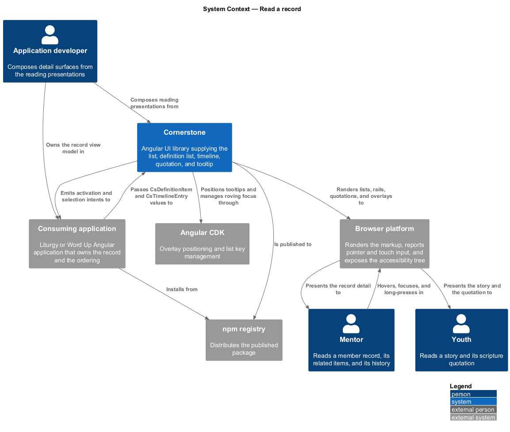
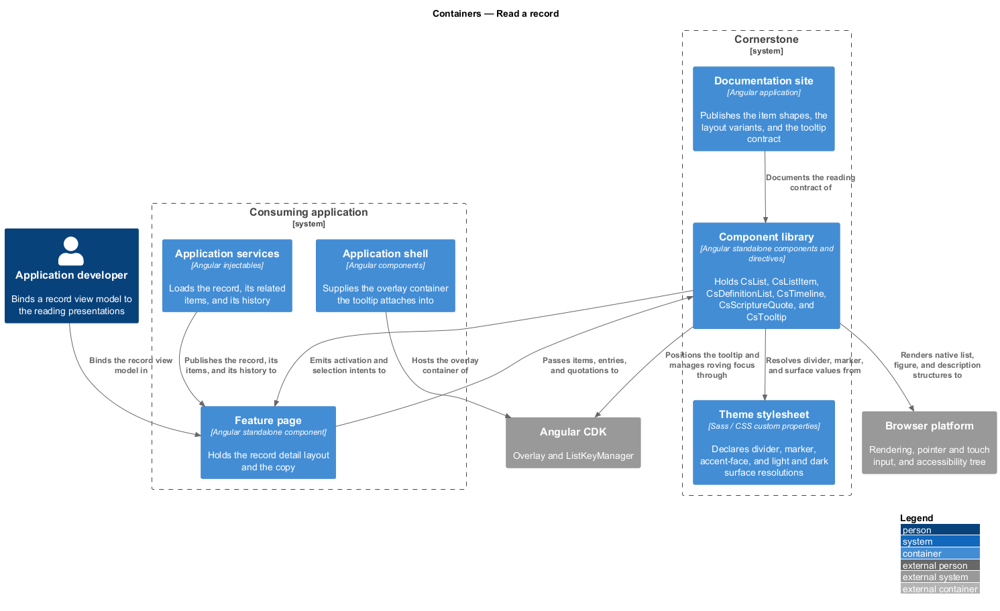
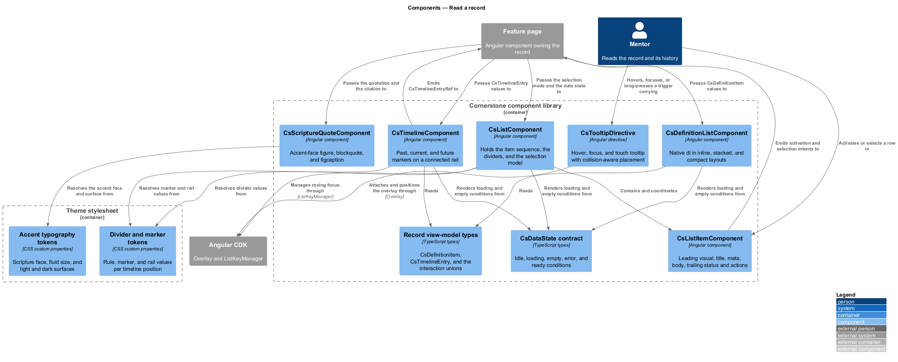
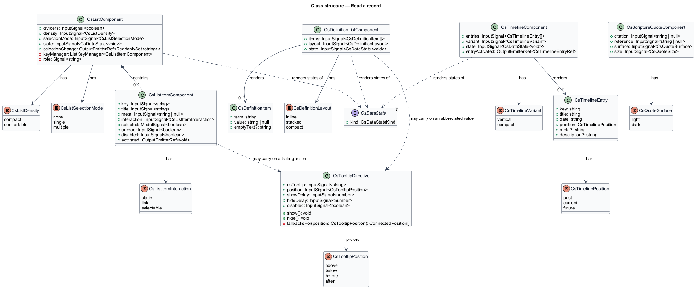
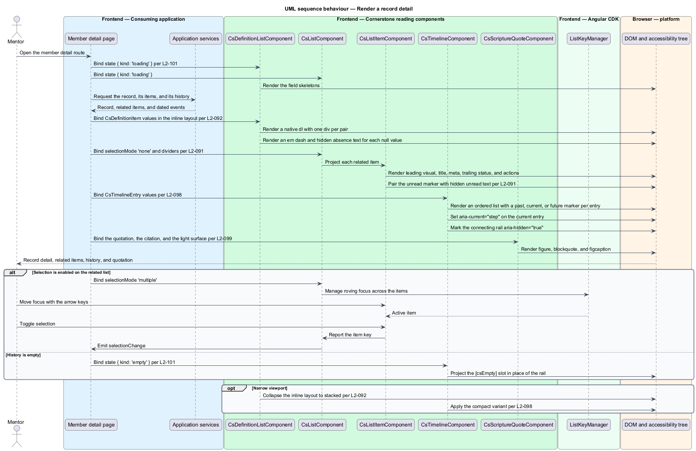
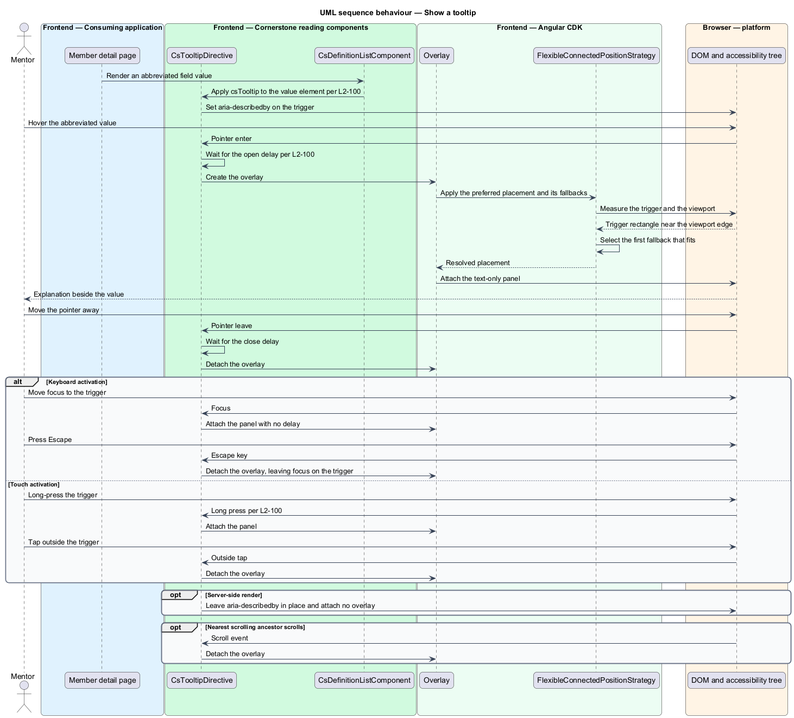

# Read a record

## Overview

Cornerstone is the Angular user-interface library published as `@quinntyne/cornerstone`.
It supplies the components that the Liturgy and Word Up applications compose
their screens from. Detail screens in both applications present one record at a
time: its fields, the items related to it, the events in its history, and the
scripture that frames it. This feature covers those reading presentations and the
tooltip that explains an abbreviated value.

**record** — single domain entity presented on its own detail surface, such as a
member, a session, or a submission

**definition list** — key-and-value presentation pairing each field name with its
value

**timeline** — sequence of dated events presented on a connected rail with past,
current, and future markers

**scripture quote** — quotation set in the FaithTech accent face and paired with
its citation

The feature sits in the data-display subsystem beside the table feature. Where
the table feature presents a set of records for comparison, this feature presents
one record for reading. It depends on the vacant-state feature for the uniform
data-state contract (L2-101), because a list and a timeline both render a loading
and an empty condition inside their own frame.

Word Up consumes the feature on its member, cohort, submission, and story detail
pages, and in its activity feeds. Liturgy consumes the list and timeline
presentations in its journey and activity surfaces, and the scripture quote
across both its cover and its workspace. The library owns the structure, the
semantics, and the overlay behaviour; the application owns the copy, the ordering,
and the navigation.

## Description

The feature is a vertical slice from the record view model an application holds
down to the rendered detail surface and its overlays. It spans six public
components and directives, two supporting components, and the record types they
share.

- **`ListComponent`** — selector `cs-list`. The container for a sequence of
  related items (L2-091). The inputs are `dividers: InputSignal<boolean>`,
  `density: InputSignal<CsListDensity>` over `'compact' | 'comfortable'`,
  `selectionMode: InputSignal<CsListSelectionMode>` over
  `'none' | 'single' | 'multiple'`, and
  `state: InputSignal<CsDataState<void>>`. It emits
  `selectionChange: OutputEmitterRef<ReadonlySet<string>>`.
- **`ListItemComponent`** — selector `cs-list-item`. One row of a list. The
  inputs are `key: InputSignal<string>`, `title: InputSignal<string>`,
  `meta: InputSignal<string | null>`,
  `interaction: InputSignal<CsListItemInteraction>` over
  `'static' | 'link' | 'selectable'`, `selected: ModelSignal<boolean>`,
  `unread: InputSignal<boolean>`, and `disabled: InputSignal<boolean>`. The
  projection slots are `[csListItemLeading]`, `[csListItemBody]`,
  `[csListItemTrailing]`, and `[csListItemActions]`. It emits
  `activated: OutputEmitterRef<void>`.
- **`DefinitionListComponent`** — selector `cs-definition-list`. The key-and-
  value presentation (L2-092). The inputs are
  `items: InputSignal<DefinitionItem[]>`,
  `layout: InputSignal<CsDefinitionLayout>` over
  `'inline' | 'stacked' | 'compact'`, and
  `state: InputSignal<CsDataState<void>>`. It renders a native `dl` with one
  `div` per pair, so the term and the value stay associated at every layout.
- **`DefinitionItem`** — the pair shape. It holds `term: string`,
  `value: string | null`, and an optional `emptyText: string`. A null value
  renders an em dash paired with visually hidden text naming the absence, so a
  screen reader distinguishes an unfilled field from a field the page omitted.
- **`TimelineComponent`** — selector `cs-timeline`. The dated event sequence
  (L2-098). The inputs are `entries: InputSignal<TimelineEntry[]>`,
  `variant: InputSignal<CsTimelineVariant>` over `'vertical' | 'compact'`, and
  `state: InputSignal<CsDataState<void>>`. It emits
  `entryActivated: OutputEmitterRef<CsTimelineEntryRef>`. It renders an ordered
  list; the connecting rail is drawn from the item styling and carries
  `aria-hidden="true"`, because the rail conveys no information the markers and
  dates do not already carry.
- **`TimelineEntry`** — the event shape. It holds `key: string`,
  `title: string`, `date: string`, `position: CsTimelinePosition` over
  `'past' | 'current' | 'future'`, and optional `meta: string` and
  `description: string`. The entry whose position is `current` carries
  `aria-current="step"`, and each position resolves a distinct marker glyph as
  well as a distinct tone.
- **`ScriptureQuoteComponent`** — selector `cs-scripture-quote`. The accent
  quotation (L2-099). The inputs are `citation: InputSignal<string | null>`,
  `reference: InputSignal<string | null>`,
  `surface: InputSignal<CsQuoteSurface>` over `'light' | 'dark'`, and
  `size: InputSignal<CsQuoteSize>`. It renders a `figure` holding a
  `blockquote` and a `figcaption`, so the citation is programmatically tied to
  the quotation rather than merely placed beneath it. The quotation resolves the
  accent face and its fluid size from typography tokens.
- **`CsTooltipDirective`** — selector `[csTooltip]`. The overlay explanation
  (L2-100). The inputs are `csTooltip: InputSignal<string>`,
  `position: InputSignal<CsTooltipPosition>`,
  `showDelay: InputSignal<number>`, `hideDelay: InputSignal<number>`, and
  `disabled: InputSignal<boolean>`. It opens on pointer hover, on keyboard
  focus, and on touch long press, and it closes on pointer leave, on blur, on
  Escape, and on scroll of the nearest scrolling ancestor.
- **`CsTooltipPosition`** — union type of the four preferred placements:
  `'above' | 'below' | 'before' | 'after'`. The directive positions through the
  CDK flexible connected position strategy, and each preferred placement carries
  an ordered fallback list, so a tooltip near a viewport edge flips rather than
  clipping (L2-100).

`ListComponent` selects its semantics from `selectionMode`. A list whose mode
is `none` renders a `ul` of `li` elements, and an item whose interaction is
`link` holds one anchor covering the row, so a keyboard reader reaches one target
per item. A list whose mode is `single` or `multiple` renders a listbox with
roving focus managed by the CDK list key manager, and each item reflects
`aria-selected`.

The unread condition on a list item pairs a marker with visually hidden text
naming the condition, so the state does not rest on font weight or colour alone
(L2-091). The trailing status and action slots render persistent controls rather
than controls revealed on hover.

`DefinitionListComponent` collapses its inline layout to the stacked layout
below the responsive breakpoint, so a long value wraps beneath its term rather
than into a two-character column (L2-092). The compact layout keeps the inline
arrangement and reduces the row gap for use inside a card or a side panel.

The tooltip carries the explanation through `aria-describedby` on the trigger, so
the description reaches a screen reader whether or not the overlay is visible. It
holds text only: it accepts no interactive content, because a tooltip closes on
blur and a control inside it would be unreachable. On a touch device the overlay
also dismisses on the next tap outside the trigger, so a reader without a hover
state can close it.

Every presentation in the feature renders without a browser global, so a server
renderer produces the same markup as the client. The tooltip attaches no overlay
during server-side rendering and leaves the `aria-describedby` relationship in
place, so the description survives with no script.

The default tooltip open and close delays are `<TO SUPPLY>`.

The touch long-press duration that opens a tooltip is `<TO SUPPLY>`.

The viewport width at which the inline definition layout collapses to stacked is
`<TO SUPPLY>`.

## Requirements

The feature realizes the following level-2 (L2) requirements. Each L2 requirement
refines a level-1 (L1) requirement, cited by identifier.

| L2 ID | Refines (L1) | Requirement |
|-------|--------------|-------------|
| `L2-091` | `L1-010` | The library shall provide list presentation with a leading visual, title, meta, body, trailing status and actions, selected, unread, and clickable states, and optional dividers. |
| `L2-092` | `L1-010` | The library shall provide responsive key-and-value detail presentation in inline, stacked, and compact variants. |
| `L2-098` | `L1-010` | The library shall provide past, current, and future markers on a connected rail with dates, meta, and actions, in vertical, mobile, and compact variants. |
| `L2-099` | `L1-010` | The library shall provide a FaithTech accent-typography quotation with a citation or reference, in light and dark surface variants. |
| `L2-100` | `L1-010` | The library shall provide a CDK-overlay tooltip supporting hover, focus, and touch activation, open and close delays, and collision-aware positioning. |

## Diagrams

### System context

An application developer composes detail surfaces from the list, definition list,
timeline, quotation, and tooltip. The application owns the record and the
ordering; Cornerstone owns the structure and the overlay behaviour.

### Containers

The feature page passes a record view model to the component library. The theme
stylesheet supplies the divider, marker, accent-face, and surface tokens the
reading presentations resolve.

### Components

`ListComponent` and `ListItemComponent` share a selection model.
`DefinitionListComponent`, `TimelineComponent`, and
`ScriptureQuoteComponent` render native structural elements, and
`CsTooltipDirective` attaches through the CDK overlay.

### Class structure

`DefinitionItem` and `TimelineEntry` are the two view-model shapes the
feature accepts. The list, definition list, and timeline all render the shared
`CsDataState` contract.

### Behaviour — render a record detail

A detail page resolves a record and binds it to the definition list, the related
list, the timeline, and the scripture quotation, each rendering its own data
state.

### Behaviour — show a tooltip

A reader hovers, focuses, and long-presses an abbreviated value. The directive
applies the open delay, positions against the viewport with a fallback, and
closes on Escape.

