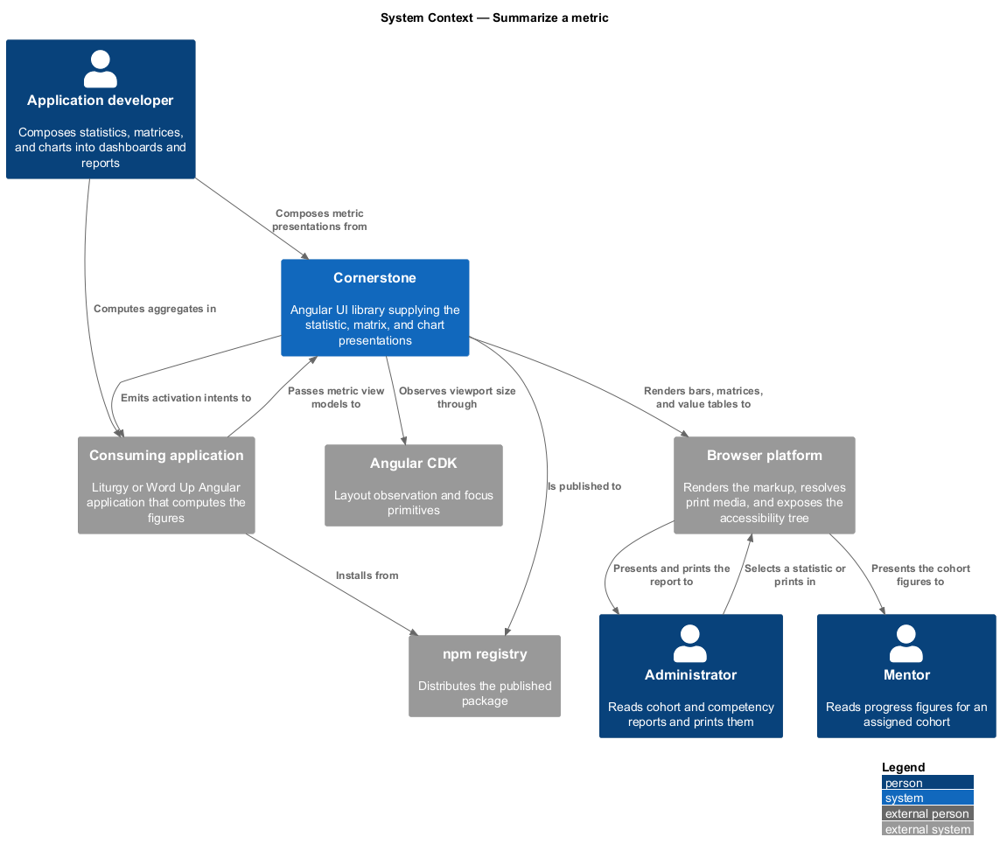
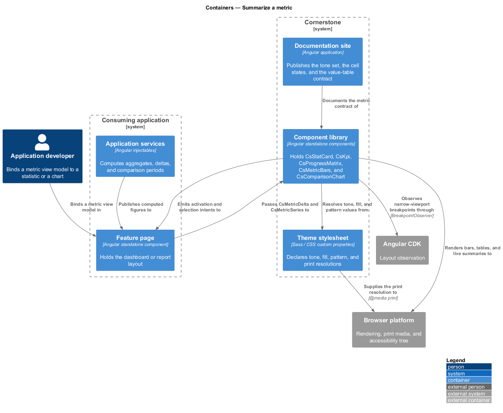
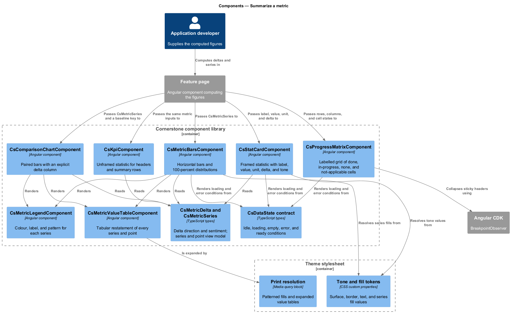
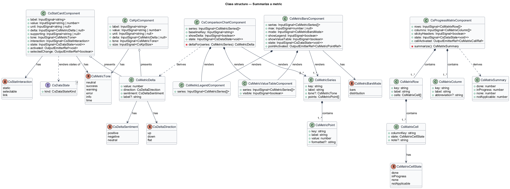
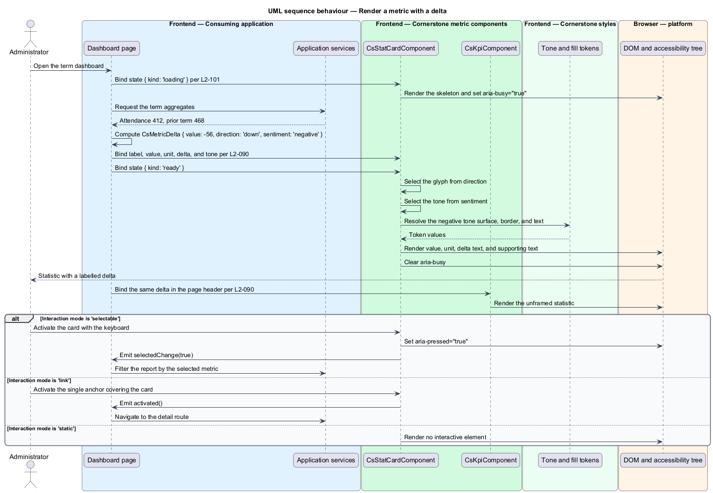
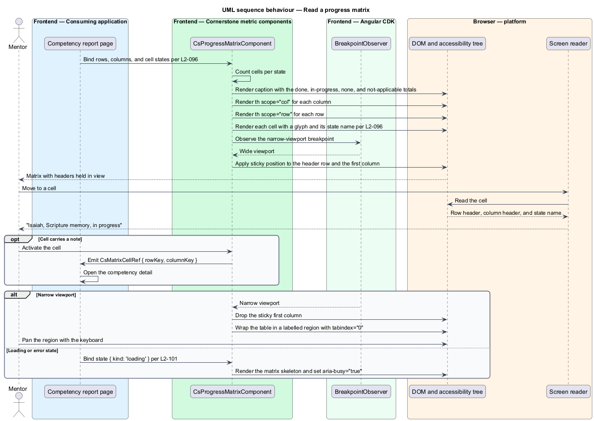
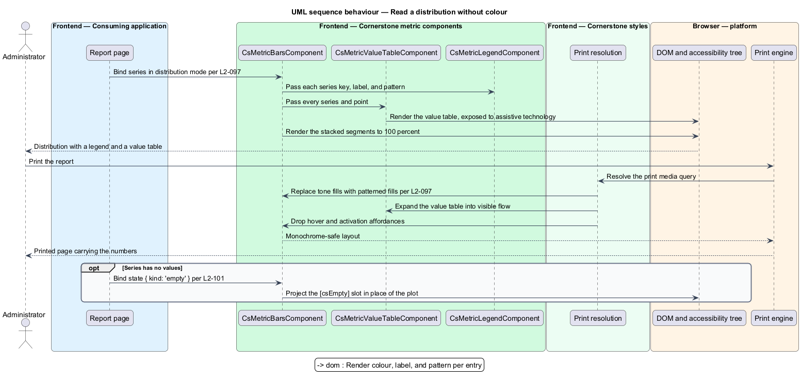

# Summarize a metric

## Overview

Cornerstone is the Angular user-interface library published as `@quinntyne/cornerstone`.
It supplies the components that the Liturgy and Word Up applications compose
their screens from. Dashboards and reports in both applications restate measured
quantities: an attendance count, a cohort's progress against a competency set,
and a term measured against the term before it. This feature covers the
presentations that carry those quantities.

**metric** — single measured quantity presented with a label, a value, and an
optional unit

**delta** — signed difference between a metric's current value and its
comparison value, carrying both a direction and a sentiment

**progress matrix** — grid presenting one completion state at each intersection
of a labelled row and a labelled column

**value table** — tabular restatement of a chart's series, available to assistive
technology and to print

The feature sits in the data-display subsystem alongside the table, list, and
vacant-state features. It depends on the vacant-state feature for the uniform
data-state contract (L2-101), because a statistic and a chart both render a
loading and an error condition before they render a value.

Word Up consumes the feature in its cohort dashboards, competency reports, and
term comparisons. Liturgy consumes the statistic presentations in its phase
dashboards. In both applications the library holds no aggregation: the
application computes the numbers and passes a view model, and the components
render it.

Colour never carries meaning alone. Every delta pairs its tone with a direction
glyph and a text label, and every chart series pairs its colour with a legend
entry and a value-table row.

## Description

The feature is a vertical slice from the metric view model an application
computes down to the rendered, printable, screen-reader-readable presentation.
It spans five public components, two supporting components, and the metric types
they share.

- **`StatCardComponent`** — selector `cs-stat-card`. The framed statistic used
  on a dashboard. The inputs are `label: InputSignal<string>`,
  `value: InputSignal<string | number>`, `unit: InputSignal<string | null>`,
  `delta: InputSignal<MetricDelta | null>`,
  `supporting: InputSignal<string | null>`,
  `tone: InputSignal<CsMetricTone>`,
  `interaction: InputSignal<CsStatInteraction>`, and
  `state: InputSignal<CsDataState<void>>`. It emits
  `activated: OutputEmitterRef<void>` and
  `selectedChange: OutputEmitterRef<boolean>` (L2-090).
- **`CsStatInteraction`** — union type of the three interaction modes:
  `'static' | 'selectable' | 'link'`. The static mode renders no interactive
  element. The selectable mode renders the card as a toggle button carrying
  `aria-pressed`. The link mode renders the label as the accessible name of a
  single anchor that covers the card, so a keyboard reader reaches one target
  rather than three.
- **`KpiComponent`** — selector `cs-kpi`. The unframed statistic used inside a
  page header or a summary row, where the surrounding card supplies the frame. It
  carries the same label, value, unit, delta, supporting, and tone inputs as
  `StatCardComponent`, plus `size: InputSignal<CsKpiSize>` over
  `'sm' | 'md' | 'lg'`.
- **`MetricDelta`** — the comparison shape. It holds `value: number`,
  `direction: 'up' | 'down' | 'flat'`, and
  `sentiment: 'positive' | 'negative' | 'neutral'`, with an optional
  `label: string` naming the comparison period. Direction and sentiment are
  separate fields because a fall in absences is a rise in outcome, and the tone
  follows the sentiment while the glyph follows the direction.
- **`CsMetricTone`** — union type of the six tones:
  `'neutral' | 'success' | 'warning' | 'error' | 'info' | 'lime'`. Each tone
  resolves a surface, a border, and a text colour from `--cs-` tokens.
- **`ProgressMatrixComponent`** — selector `cs-progress-matrix`. The labelled
  grid of completion states (L2-096). The inputs are
  `rows: InputSignal<CsMatrixRow[]>`, `columns: InputSignal<CsMatrixColumn[]>`,
  `stickyHeaders: InputSignal<boolean>` defaulting to true, and
  `state: InputSignal<CsDataState<void>>`. It emits
  `cellActivated: OutputEmitterRef<CsMatrixCellRef>`. It renders a native
  `table` with `th` elements carrying `scope="col"` and `scope="row"`, so each
  cell's accessible name resolves from its two headers.
- **`MatrixCellState`** — union type of the four cell states:
  `'done' | 'in-progress' | 'none' | 'not-applicable'`. Each state resolves a
  glyph, a fill, and a state name; the state name is read into the cell's
  accessible name so the presentation does not depend on the fill.
- **`MetricBarsComponent`** — selector `cs-metric-bars`. Horizontal bars and
  100-percent distributions (L2-097). The inputs are
  `series: InputSignal<CsMetricSeries[]>`, `max: InputSignal<number | null>`,
  `mode: InputSignal<'bars' | 'distribution'>`,
  `showLegend: InputSignal<boolean>`, `showValueTable: InputSignal<boolean>`,
  and `state: InputSignal<CsDataState<void>>`. It emits
  `pointActivated: OutputEmitterRef<CsMetricPointRef>`.
- **`ComparisonChartComponent`** — selector `cs-comparison-chart`. Paired bars
  with an explicit delta column (L2-097). It carries the same series input plus
  `baselineKey: InputSignal<string>` naming the series the others are measured
  against, and `showDelta: InputSignal<boolean>`.
- **`CsMetricSeries`** and **`CsMetricPoint`** — the chart view model.
  `CsMetricSeries` holds `key: string`, `label: string`, an optional
  `tone: CsMetricTone`, and `points: CsMetricPoint[]`. `CsMetricPoint` holds
  `key: string`, `label: string`, `value: number`, and an optional
  `formatted: string` the application supplies when it owns the number format.
- **`MetricValueTableComponent`** — the shared tabular restatement both charts
  render. It is visually hidden when `showValueTable` is false and exposed to
  assistive technology and to print in every case, so the numbers behind a bar
  are always reachable (L2-097).
- **`MetricLegendComponent`** — the shared legend. Each entry pairs the series
  colour with the series label and the fill pattern that series uses, so a
  monochrome print and a colour-blind reader both distinguish the series.

Every statistic and every chart accepts `CsDataState` and renders the loading,
empty, and error conditions through the uniform contract (L2-101), so a
dashboard that has not yet resolved shows skeletons rather than zeroes. A value
of zero and an absent value are distinguishable: zero renders as `0` in the ready
state, and an absent value renders the empty slot.

Print output is a first-class target (L2-097). Under the print media query both
charts expand the value table, replace tone fills with patterned fills, and drop
interactive affordances, so the printed page carries the numbers rather than a
grey rectangle.

The matrix carries a caption summarising the counts per cell state, so a screen
reader reaches the totals without traversing every intersection (L2-096). Sticky
headers use position sticky on the header row and the first column, and they
collapse on narrow viewports, where the matrix scrolls within a labelled region
carrying `tabindex="0"` so keyboard readers can pan it.

The default numeric and percentage formats, which apply when a point supplies no
`formatted` string, are `<TO SUPPLY>`.

The series count above which `MetricLegendComponent` collapses into an overflow
entry is `<TO SUPPLY>`.

## Requirements

The feature realizes the following level-2 (L2) requirements. Each L2 requirement
refines a level-1 (L1) requirement, cited by identifier.

| L2 ID | Refines (L1) | Requirement |
|-------|--------------|-------------|
| `L2-090` | `L1-010` | The library shall provide a statistic presentation carrying label, value, unit, delta or trend, supporting text, and tone, in static, selectable, and link states, with a loading state. |
| `L2-096` | `L1-010` | The library shall provide a labelled matrix of rows and columns with done, in-progress, none, and not-applicable cell states, sticky headers, and screen-reader summaries. |
| `L2-097` | `L1-010` | The library shall provide accessible horizontal bars, distributions, and comparison deltas with legends, value tables, and print-friendly output. |

## Diagrams

### System context

An application developer composes statistics, matrices, and charts into Word Up
reports and Liturgy dashboards. The application computes the numbers; Cornerstone
renders and describes them.

### Containers

The feature page passes a metric view model to the component library. The theme
stylesheet supplies the tone, fill, and pattern tokens the statistics and charts
resolve, including the print resolutions.

### Components

`StatCardComponent` and `KpiComponent` share the delta and tone types.
`MetricBarsComponent` and `ComparisonChartComponent` share the legend and the
value table. `ProgressMatrixComponent` renders a native table with scoped
headers.

### Class structure

`MetricDelta` separates direction from sentiment, and `CsMetricSeries` carries
the points both charts render. Every presentation accepts the shared
`CsDataState` contract.

### Behaviour — render a metric with a delta

A dashboard resolves its figures, binds a statistic, and the card renders the
value, the unit, and a delta whose tone follows the sentiment while its glyph
follows the direction.

### Behaviour — read a progress matrix

A screen reader traverses the matrix. Each cell resolves its accessible name from
its row header, its column header, and its state name, and the caption supplies
the totals.

### Behaviour — read a distribution without colour

A reader opens a report in monochrome print. The chart expands its value table,
swaps tone fills for patterns, and drops interactive affordances.

