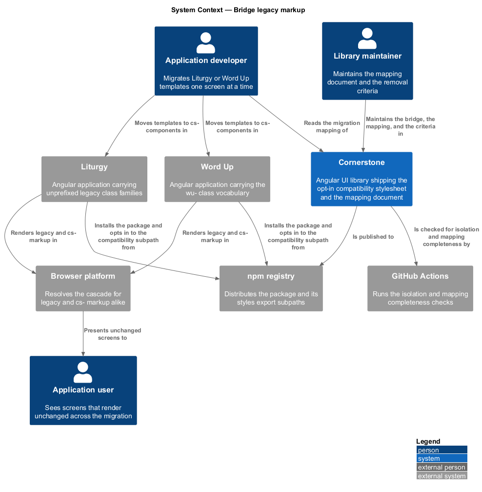
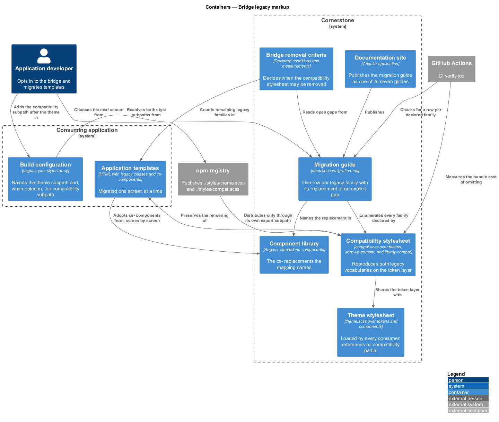
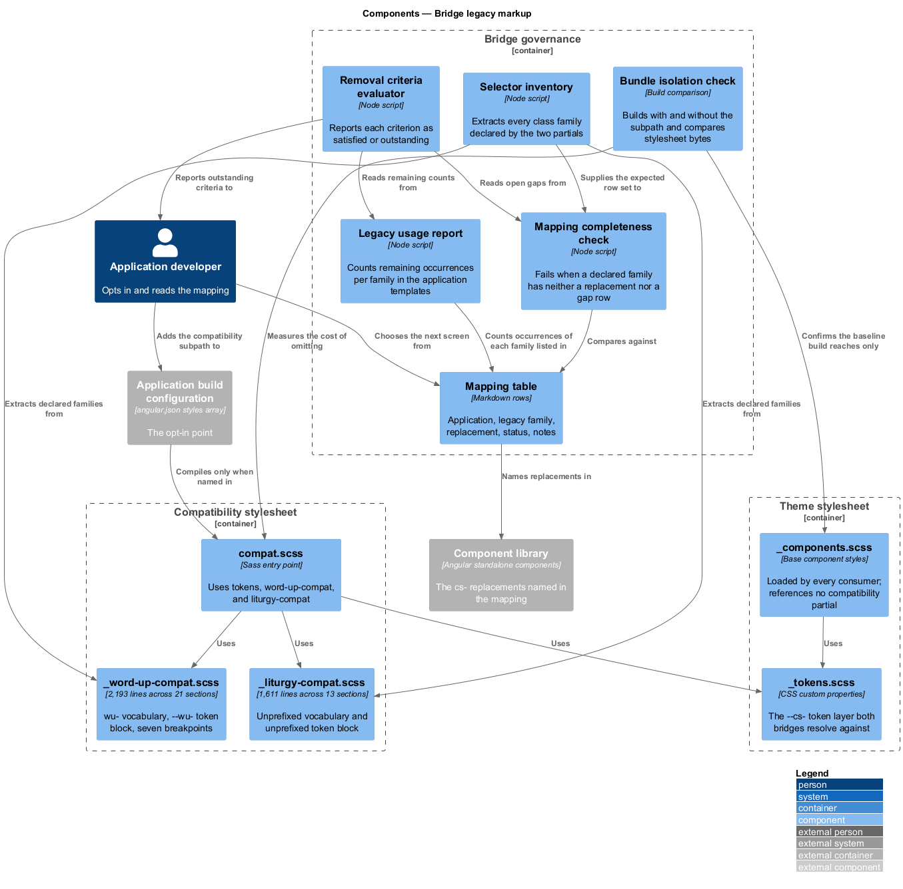
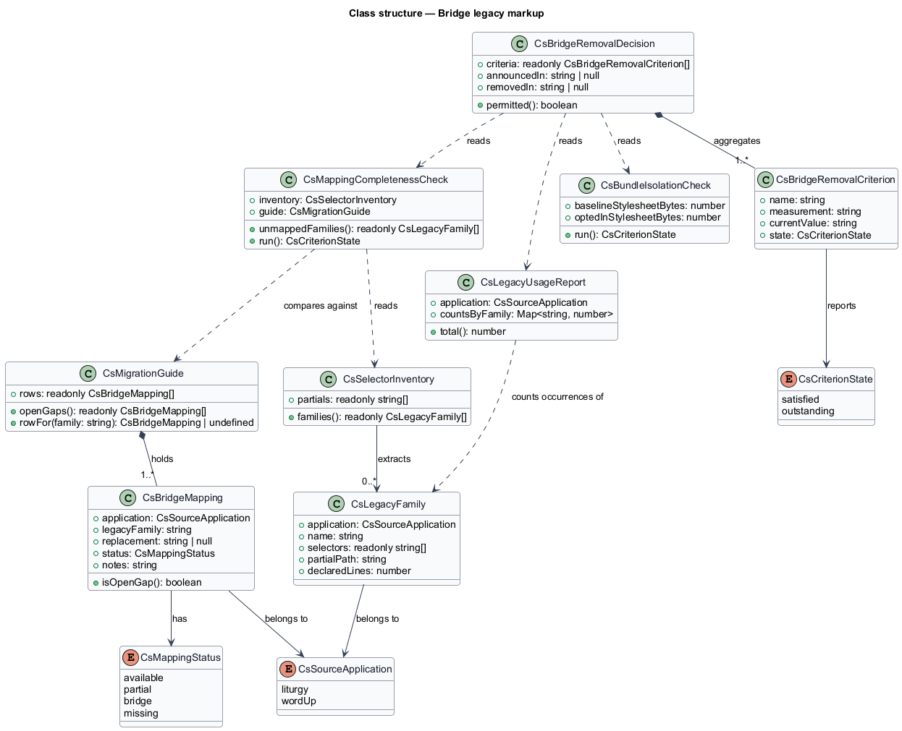
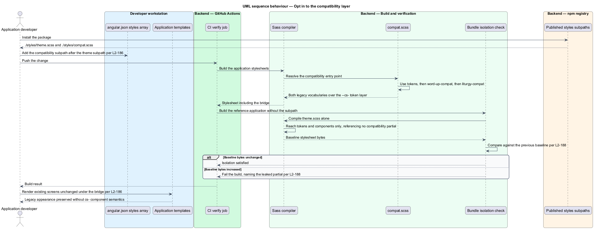
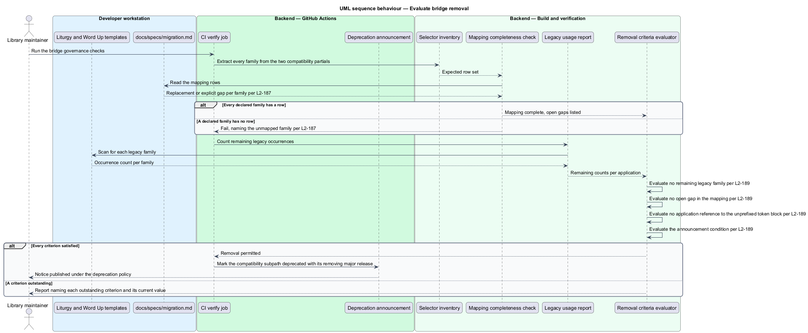

# Bridge legacy markup

## Overview

Liturgy and Word Up each carry a complete stylesheet of their own, written before
Cornerstone existed. Word Up's markup uses a `wu-` prefixed class vocabulary;
Liturgy's uses unprefixed product class names such as `btn`, `field`, `rail`, and
`station`. Rewriting either application's templates to the `cs-` Angular API in
one change would stop feature work for the duration of the rewrite.

**compatibility stylesheet** — opt-in stylesheet that reproduces the legacy class
vocabularies of Liturgy and Word Up on top of the Cornerstone token layer

**legacy class family** — group of related class names from one source
application, such as `wu-table` or `station`, that the bridge preserves

**migration mapping** — audited record pairing each legacy class family or
component with its Cornerstone replacement, or recording it as an explicit gap

**bridge removal criterion** — verifiable condition whose satisfaction permits the
compatibility stylesheet to be removed

The bridge exists so that an application can install Cornerstone, keep rendering
its current screens unchanged, and move templates to `cs-` components one screen
at a time. It is a transitional artefact, not part of the library's intended
public surface; its design therefore includes the conditions of its own removal.

The compatibility stylesheet already exists in the workspace. This feature
describes what it contains, the isolation it relies on, the mapping document that
governs the migration, and the criteria that end it.

## Description

The feature spans three stylesheet files, one published export subpath, a mapping
document, and two checks.

- **`src/cornerstone/styles/compat.scss`** — the published entry point.
  It is four lines: `@use 'tokens'`, `@use 'word-up-compat'`, and
  `@use 'liturgy-compat'`. It pulls in the token layer so the bridge resolves the
  same `--cs-` values as the library, then the two application vocabularies.
- **`src/cornerstone/styles/_word-up-compat.scss`** — 2,193 lines
  covering the `wu-` vocabulary across 21 sections: tokens, reset and base,
  layout primitives, app shell, buttons, forms, cards, table, badge and pill,
  progress ring and bar, avatar, tabs, modal and dialog, toast, offline banner,
  skeleton, empty state, alert and callout, icons, authentication layouts, and
  miscellaneous widgets. The largest families are `wu-table`, `wu-btn`,
  `wu-modal`, `wu-icon`, `wu-card`, `wu-alert`, `wu-sidenav`, and `wu-toast`. It
  declares a `--wu-` prefixed token block on `:root` and holds seven responsive
  breakpoints and a `prefers-reduced-motion: reduce` block.
- **`src/cornerstone/styles/_liturgy-compat.scss`** — 1,611 lines
  covering Liturgy's vocabulary across 13 sections: reset and base, typographic
  utilities, buttons, badges and pills, app shell, the rhythm rail,
  the canonical-hours dial, cards and surfaces, the gate component, the kanban
  board, cover and marketing sections, responsive behaviour, and the additions
  the Liturgy application makes beyond its static mock. Its class names are
  unprefixed, and it declares an unprefixed token block on `:root` covering
  `--ink`, `--paper`, `--lime`, the sand and grey scales, the phase colours,
  `--display`, `--body`, `--accent`, the `--s1` to `--s9` spacing steps, and
  `--radius`. Those unprefixed names are the bridge's principal collision risk,
  and closing it is one of the removal criteria (L2-189).
- **`./styles/compat.scss` export subpath** — the opt-in surface. The published
  package declares it beside `./styles/theme.scss`, and `ng-package.json` copies
  every file under `src/styles` into the distributed `styles/` folder. An
  application opts in by adding the subpath to the `styles` array of its build
  target, after the theme stylesheet so the bridge resolves the token layer the
  theme declares (L2-186).
- **Isolation by construction** — `theme.scss` imports the token layer and the
  base component styles only. It never references either compatibility partial,
  so an application that does not name `compat.scss` compiles none of its
  3,804 lines. The published package declares `sideEffects: false`, so no
  JavaScript entry point can pull the bridge in indirectly (L2-188).
- **Bundle isolation check** — a step in the `CI` verify job that builds a
  reference application twice, once with and once without the compatibility
  entry, and asserts that the stylesheet byte count of the build without it is
  unchanged. The check makes the isolation a measured property rather than a
  structural claim (L2-188).
- **`docs/specs/migration.md`** — the audited mapping document. The workspace
  README already cites it as the record of the component mapping; this design
  supplies it. It holds one row per legacy class family or component, giving the
  source application, the family, the Cornerstone replacement, and the status,
  and it uses the catalog's vocabulary of `Available`, `Partial`, `Bridge`, and
  `Missing`. A family with no replacement is recorded as an explicit gap with the
  catalog entry that would close it (L2-187).
- **`CsBridgeMapping`** — type describing one mapping row: `application`,
  `legacyFamily`, `replacement`, `status`, and `notes`.
- **Mapping completeness check** — a step that extracts every class selector from
  the two compatibility partials and fails when a family appears in neither the
  replacement column nor the gap column of the mapping. The mapping cannot fall
  behind the stylesheet, because the stylesheet is what generates the expected
  row set (L2-187).
- **`CsBridgeRemovalCriterion`** — type describing one removal condition: a name,
  the measurement that decides it, and the current value. The design defines four
  criteria: no legacy class family remains in either application's templates;
  the mapping records no open gap; the unprefixed token block is referenced by no
  application source; and the removal is announced under the deprecation policy
  that `support-and-migrate-consumers` publishes (L2-183, L2-189).
- **Legacy usage report** — the measurement behind the first criterion. It counts
  occurrences of each legacy class family in the Liturgy and Word Up template
  sources and reports the count per family, so the migration's remaining work is
  a number per family rather than an impression.

The bridge reproduces appearance, not behaviour. A legacy class continues to
render its screen, but it carries no ARIA semantics, no keyboard handling, and no
`ControlValueAccessor` integration; those arrive only when the template moves to
the `cs-` component named in the mapping. The migration guide states that
limitation, because a screen that looks migrated and is not accessible is the
failure mode the bridge invites.

The release in which the bridge is removed and the threshold for an acceptable
residual legacy usage count are `<TO SUPPLY>`.

## Requirements

The feature realizes the following level-2 (L2) requirements. Each L2 requirement
refines a level-1 (L1) requirement, cited by identifier.

| L2 ID | Refines (L1) | Requirement |
|-------|--------------|-------------|
| `L2-186` | `L1-024` | The library shall ship a compatibility stylesheet preserving Liturgy and Word Up markup during migration, and shall compile it only when a consuming application explicitly opts in. |
| `L2-187` | `L1-024` | The migration guide shall map every audited legacy component and CSS class family to its Cornerstone replacement, or shall record it as an explicit gap. |
| `L2-188` | `L1-024` | The compatibility layer shall impose no bundle cost on an application that does not use it. |
| `L2-189` | `L1-024` | The conditions for removing the migration bridge shall be defined and verifiable. |

## Diagrams

### System context

Two applications carry legacy markup. The bridge lets each install Cornerstone
before its templates change, and the mapping document governs the order in which
they change.

### Containers

The compatibility stylesheet is published beside the theme stylesheet but is
reachable only through its own export subpath. The mapping document and the
removal criteria sit alongside it as governing artefacts.

### Components

`compat.scss` composes the token layer and the two vocabulary partials. The
checks read the partials to derive the expected mapping rows and to measure the
isolation the design claims.

### Class structure

`CsBridgeMapping` models one audited mapping row and `CsLegacyFamily` the
selector group it covers. `CsBridgeRemovalCriterion` binds each removal condition
to the measurement that decides it.

### Behaviour — opt in to the compatibility layer

An application adds the compatibility subpath after the theme. The build compiles
the bridge for that application, and the isolation check confirms that a build
without the subpath carries none of it.

### Behaviour — evaluate bridge removal

The legacy usage report and the mapping completeness check feed the removal
criteria. Every criterion satisfied permits the removal to be announced under the
deprecation policy.

