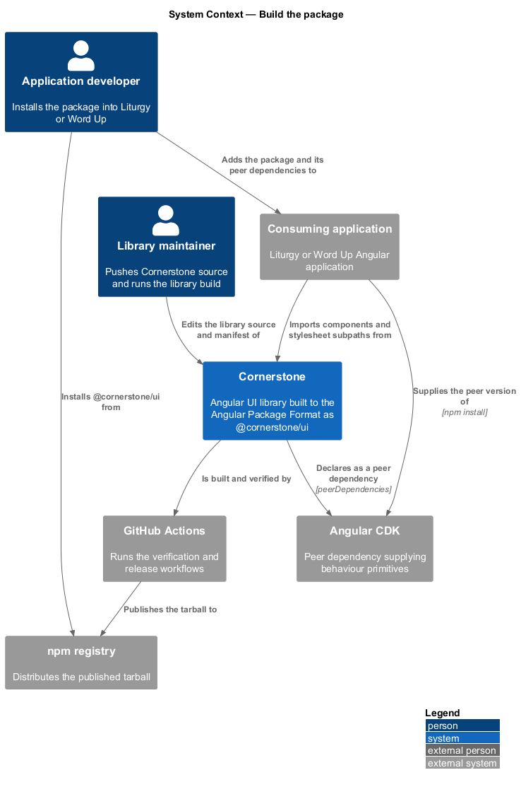
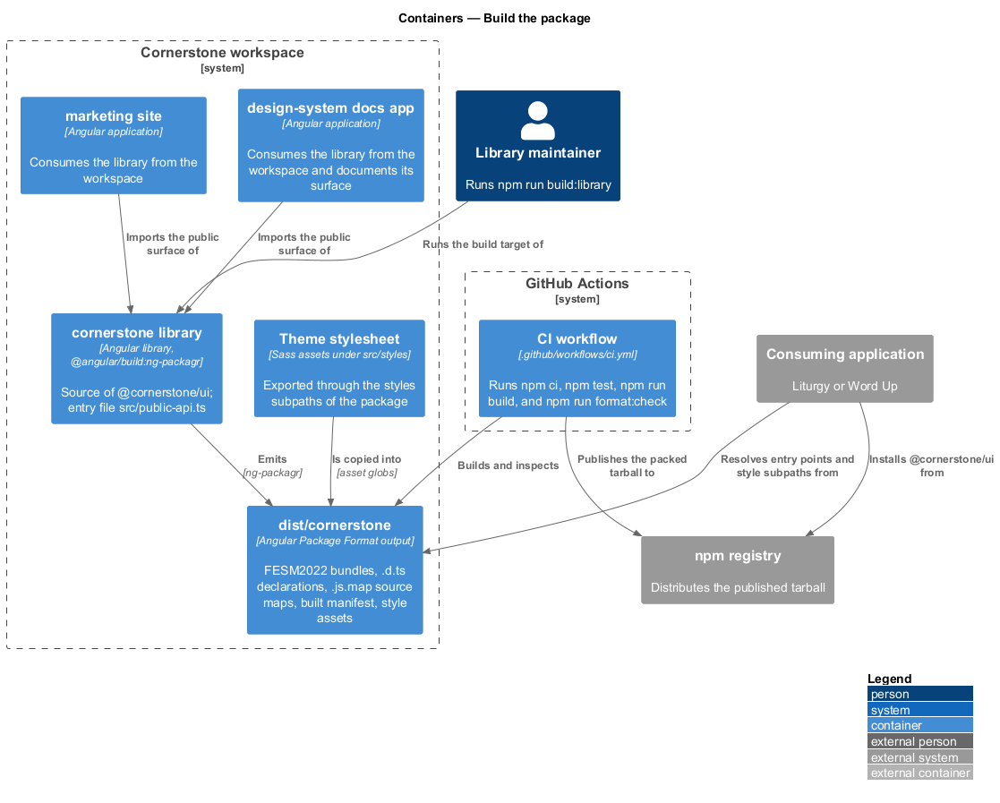
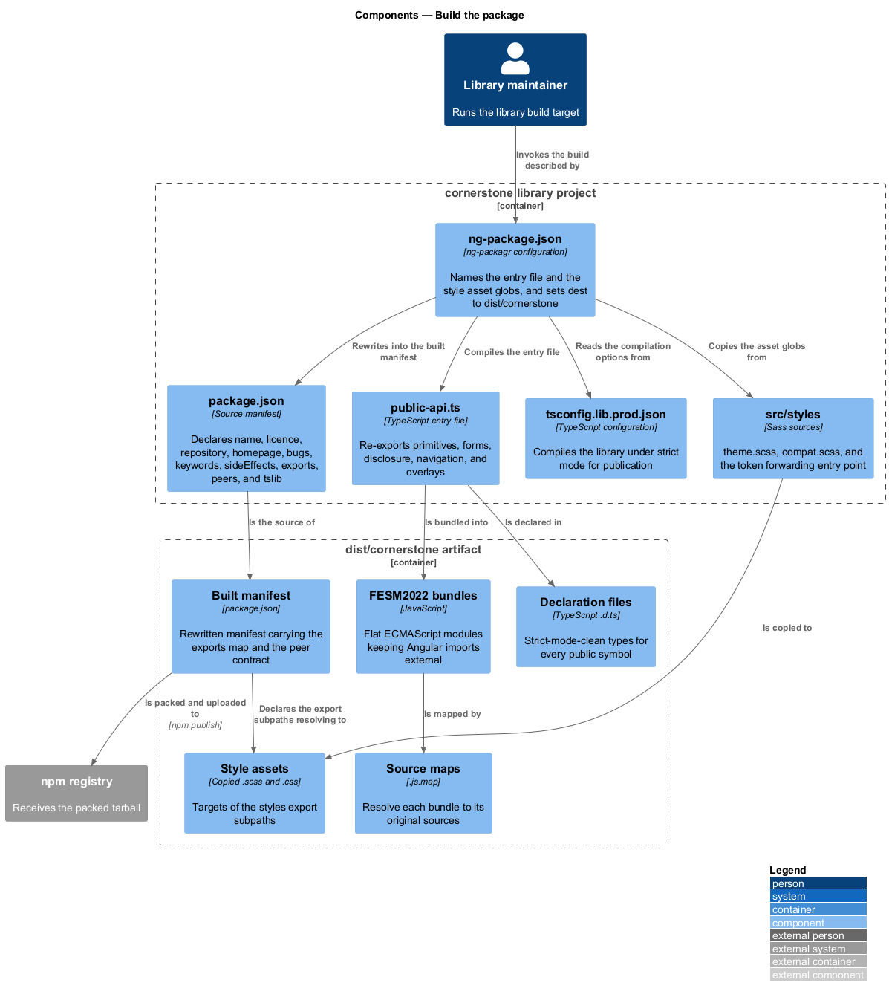
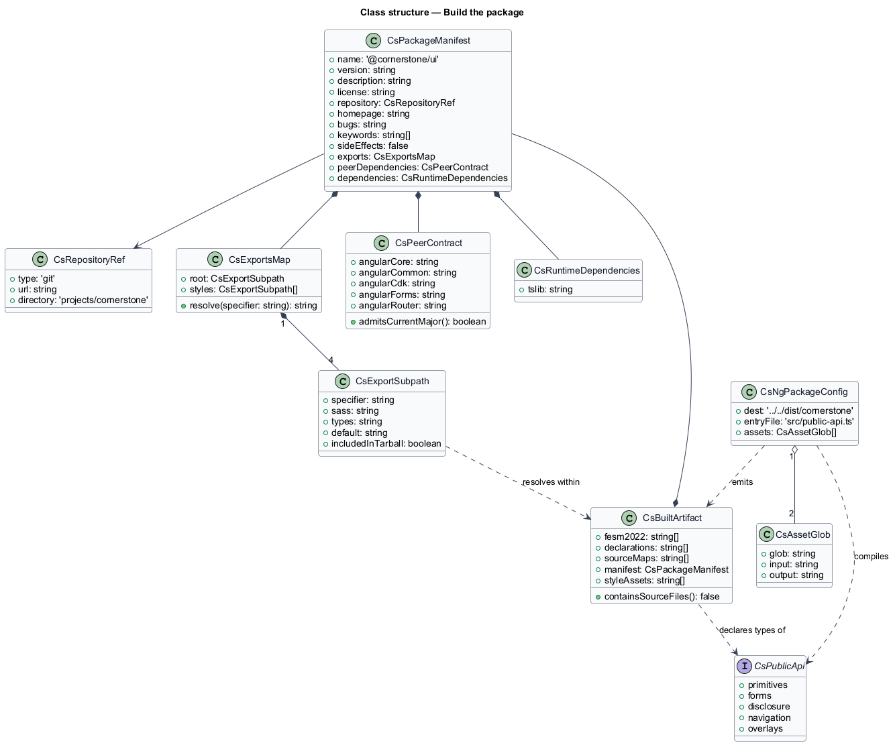
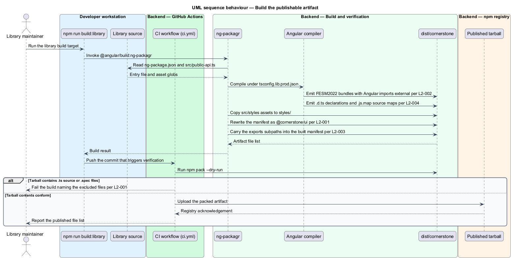
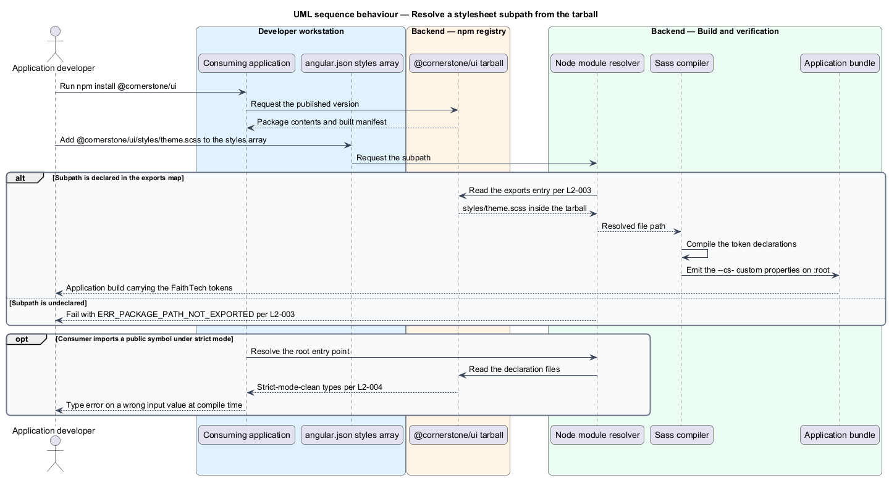

# Build the package

## Overview

Cornerstone is the Angular user-interface library published as `@quinntyne/cornerstone`.
It supplies the components that the Liturgy and Word Up applications compose
their screens from. Before an application can consume a component, the workspace
turns library source into an artifact that the npm registry distributes and that
the Angular compiler accepts without extra configuration.

**Angular Package Format** — publication layout for an Angular library,
comprising FESM2022 bundles, TypeScript declaration files, source maps, and a
package manifest

This feature covers that artifact: the manifest that names it, the dependency
contract it declares, the stylesheet subpaths it exports, and the declarations
and source maps it ships. It sits beneath every other feature of the delivery
subsystem. Publication (L2-176) uploads this artifact, size measurement (L2-160)
measures it, and provenance attestation (L2-166) attests to it.

**entry point** — module specifier a consumer imports from, resolved through a
subpath declared in the package `exports` map

**peer dependency contract** — set of packages a consumer installs at a version
of its own choosing, which the library imports but never bundles

The workspace holds three projects: the `cornerstone` library, the
`design-system` documentation application, and the `marketing` site. Only the
library is published. The two applications consume it from the workspace during
development and reinstall it from the registry after release.

The library project declares the package name `@faithtech/cornerstone` today.
L2-001 requires `@quinntyne/cornerstone`, so the rename of the manifest, the
`public-api.ts` banner, and every workspace reference falls inside this feature.

## Description

The feature is a vertical slice from the library source tree to an installable
tarball. It spans the ng-packagr build configuration, the package manifest, and
the declaration and source-map output of the Angular compiler.

- **`src/cornerstone/package.json`** — the source manifest ng-packagr reads
  and rewrites into the built manifest. It shall declare `name` as
  `@quinntyne/cornerstone`, a `license`, a `repository`, a `homepage`, a `bugs` URL,
  `keywords`, and `sideEffects: false` (L2-001). The current file declares
  `name`, `license`, `keywords`, and `sideEffects`; `repository`, `homepage`, and
  `bugs` are added by this design.
- **`src/cornerstone/ng-package.json`** — the ng-packagr configuration. It
  sets `dest` to `../../dist/cornerstone`, names `src/public-api.ts` as the
  single entry file, and copies `src/styles/**/*.scss` and `src/styles/**/*.css`
  into the `styles/` folder of the artifact.
- **`src/cornerstone/public-api.ts`** — the single entry file. It
  re-exports the five source modules `primitives`, `forms`, `disclosure`,
  `navigation`, and `overlays`, and carries the package name in its banner
  comment.
- **`build:library` script** — `ng build cornerstone`, bound to the
  `@angular/build:ng-packagr` builder in `angular.json` with `production` as the
  default configuration and `src/cornerstone/tsconfig.lib.prod.json` as its
  compilation input.
- **Peer dependency block** — `@angular/core`, `@angular/common`,
  `@angular/cdk`, `@angular/forms`, and `@angular/router`, each with a range that
  admits the current major Angular release (L2-002). The current file declares
  the first four; `@angular/router` is added by this design because the
  navigation components import `RouterLink`.
- **Runtime dependency block** — `tslib` alone. No Angular package appears in
  `dependencies`, and no Angular code is inlined into the FESM2022 bundles;
  every Angular reference stays an external import (L2-002).
- **`exports` map** — the declared subpath surface. It exports `.` for the
  component entry point and three stylesheet subpaths: `./styles/theme.scss`,
  `./styles/compat.scss`, and `./styles/tokens.scss` (L2-003). Each stylesheet
  subpath declares a `sass` condition and a `default` condition so that the Sass
  compiler and a plain CSS pipeline both resolve it. Each also declares an
  extensionless alias so that `@use '@quinntyne/cornerstone/styles/theme' as *;`
  resolves. The current file exports two stylesheet subpaths and no
  extensionless alias; `./styles/tokens.scss` and the aliases are added by this
  design. `src/styles/_tokens.scss` is a Sass partial today, so the design adds
  a `src/styles/tokens.scss` forwarding file for the subpath to resolve to.
- **Declaration output** — one `.d.ts` file per public symbol, emitted under
  `strict` compilation. No public signal input, output, or return type resolves
  to an inferred `any` (L2-004).
- **Source-map output** — one `.js.map` beside each FESM2022 bundle, resolving
  to readable original sources (L2-004).
- **Tarball contents** — the FESM2022 bundles, the declaration files, the source
  maps, the built manifest, the stylesheet assets, `README.md`, and `LICENSE`.
  No `.ts` source file and no `.spec.ts` file is included (L2-001).

The built manifest is the artifact the rest of the delivery subsystem acts on.
`npm pack --dry-run` against `dist/cornerstone` reports the file list that the
publish job uploads, and the post-publish check (L2-180) resolves every declared
subpath from the installed package rather than from the workspace.

The published `homepage` URL is `<TO SUPPLY>`, because the documentation site's
custom domain on Azure Static Web Apps is not yet assigned.

## Requirements

The feature realizes the following level-2 (L2) requirements. Each L2 requirement
refines a level-1 (L1) requirement, cited by identifier.

| L2 ID | Refines (L1) | Requirement |
|-------|--------------|-------------|
| `L2-001` | `L1-001` | The library shall build to a publishable Angular Package Format artifact named `@quinntyne/cornerstone`, and its manifest shall declare `license`, `repository`, `homepage`, `bugs`, `keywords`, and `sideEffects: false`. |
| `L2-002` | `L1-001` | The package shall declare `@angular/core`, `@angular/common`, `@angular/cdk`, `@angular/forms`, and `@angular/router` as peer dependencies with permissive ranges, shall declare `tslib` as its only runtime dependency, and shall not bundle any Angular package. |
| `L2-003` | `L1-001` | The package shall export its theme, compatibility, and token stylesheets through declared `exports` subpaths resolvable by both the Sass compiler and a plain CSS pipeline, and those subpaths shall resolve from a published tarball. |
| `L2-004` | `L1-001` | The published package shall ship complete, strict-mode-clean TypeScript declarations and source maps for every public symbol. |

## Diagrams

### System context

A library maintainer pushes source to the repository; GitHub Actions builds the
package and publishes it to the npm registry, from which an application
developer installs it into Liturgy or Word Up.

### Containers

The `cornerstone` library project is the only workspace project that produces a
published artifact. The `design-system` and `marketing` applications consume the
same source during development, which keeps the exported surface exercised
before it reaches the registry.

### Components

ng-packagr reads `ng-package.json`, compiles the entry file named there, and
rewrites the source manifest into the built manifest. The Angular compiler emits
declarations and source maps alongside the FESM2022 bundles.

### Class structure

The package manifest, the export map, and the dependency contract are the typed
shapes this feature governs. `CsPackageManifest` names the fields L2-001
requires, and `CsExportsMap` holds one `CsExportSubpath` per declared entry
point.

### Behaviour — build the publishable artifact

The maintainer runs `build:library`; ng-packagr compiles the entry file, copies
the stylesheet assets, rewrites the manifest, and emits the tarball contents
that `npm pack --dry-run` reports.

### Behaviour — resolve a stylesheet subpath from the tarball

A consuming application installs the published package and adds
`@quinntyne/cornerstone/styles/theme.scss` to its build. Node resolves the subpath
through the `exports` map, and an undeclared subpath fails with
`ERR_PACKAGE_PATH_NOT_EXPORTED` rather than resolving to a private file.

