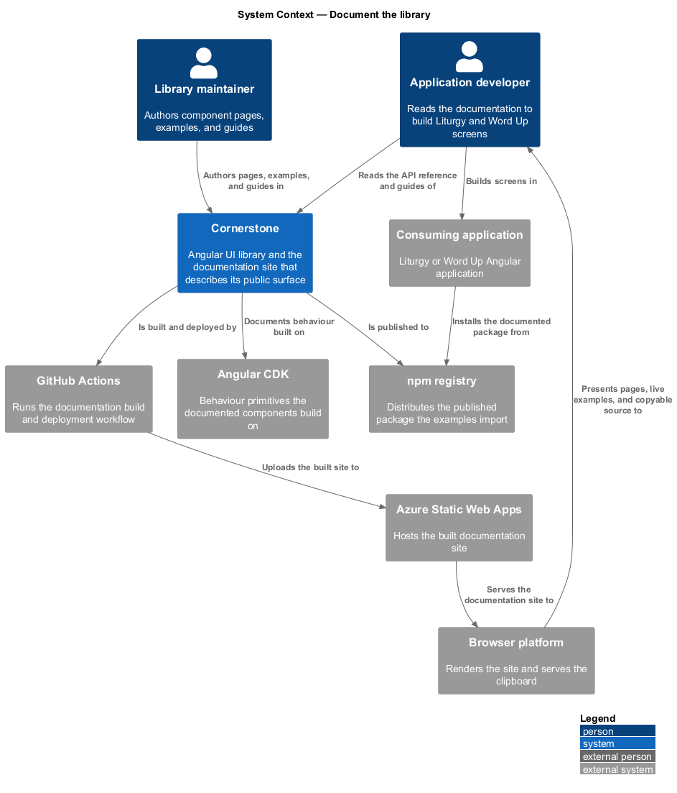
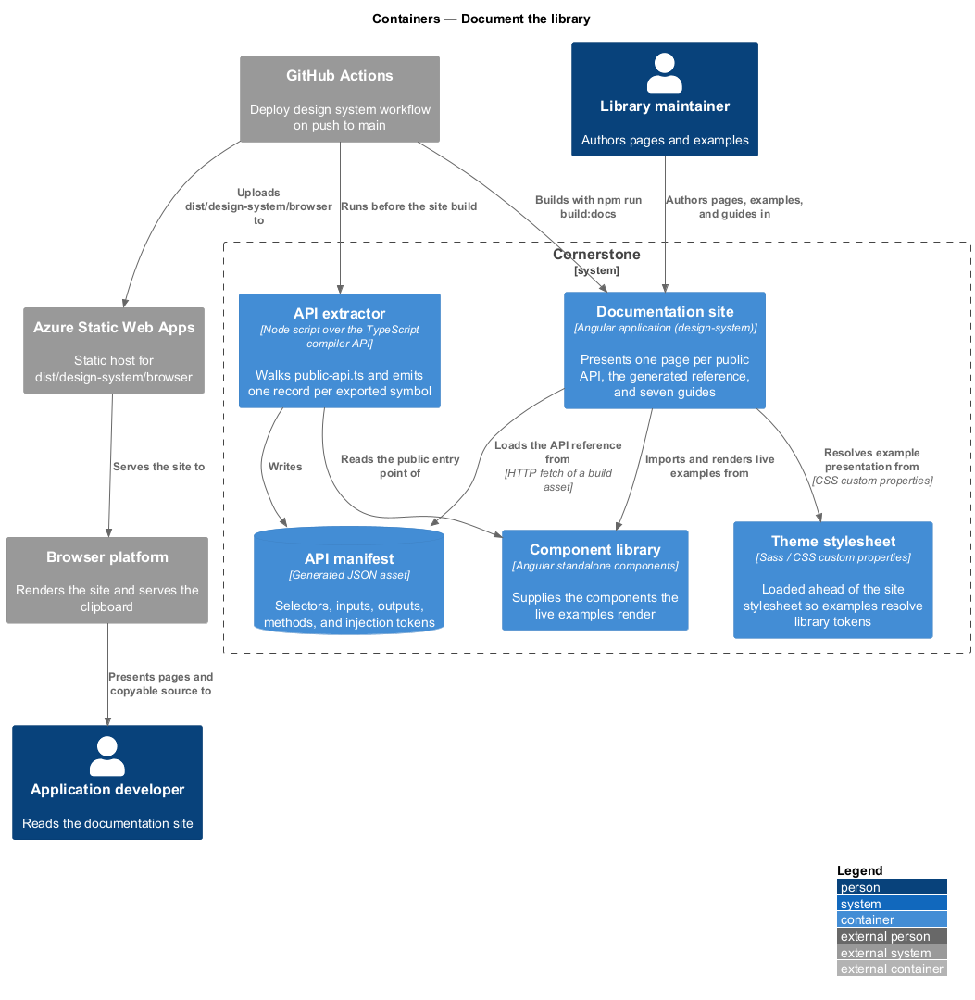
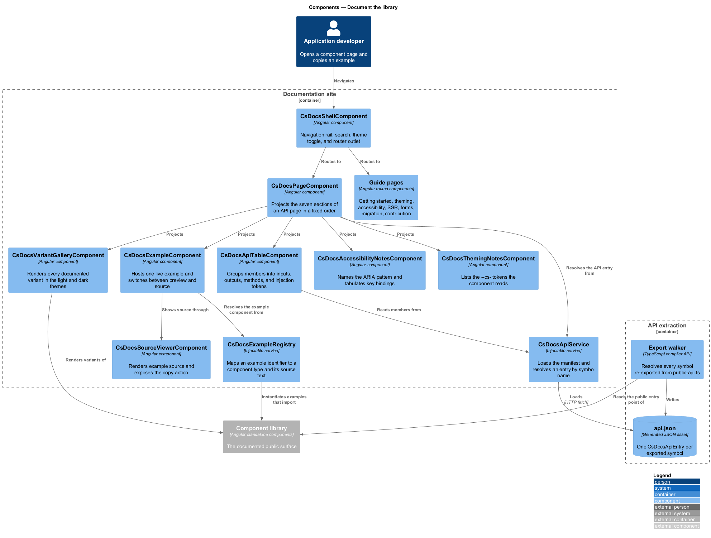
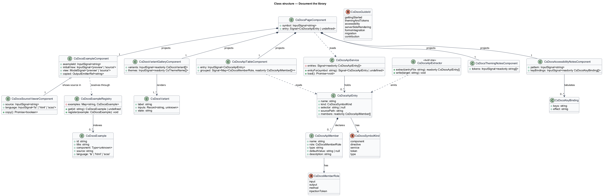
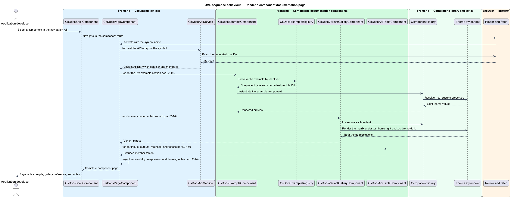
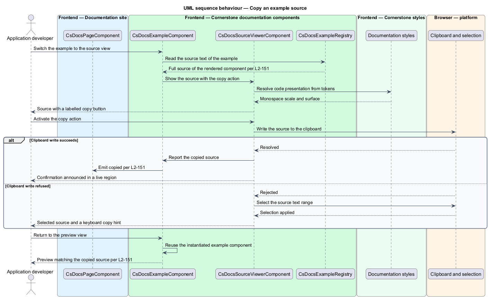
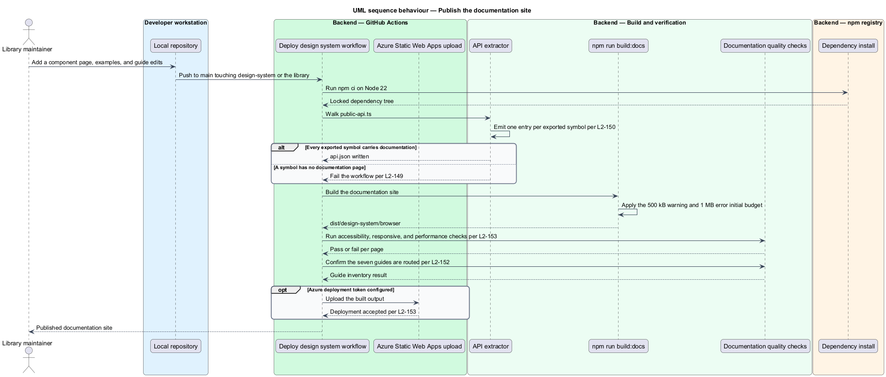

# Document the library

## Overview

Cornerstone is the Angular user-interface library published as `@quinntyne/cornerstone`.
Application developers compose Liturgy and Word Up screens from its components.
The only account of what a component accepts, emits, and guarantees is the
documentation this feature publishes, so the documentation is part of the
library's public surface rather than a description of it.

**documentation site** — Angular application presenting one page per public API,
the generated API reference, and the written guides

The `design-system` project declared in `angular.json` is that application. It
carries the `cs-docs` selector prefix, lists
`src/cornerstone/styles/theme.scss` ahead of its own stylesheet, and
builds to `dist/design-system/browser` under an initial-bundle budget of 500 kB
warning and 1 MB error. The `Deploy design system` workflow publishes that output
to Azure Static Web Apps on every push to `main` that touches the application,
the library, or the workspace build configuration. The project and the workflow
exist; this feature defines the content the site presents and the extraction step
that feeds it.

**API entry** — record describing one exported symbol: its selector, inputs with
types and defaults, outputs with payload types, methods, and injection tokens

**live example** — rendered instance of a component inside a documentation page,
driven by the same built library a consuming application installs

**variant gallery** — grid presenting every documented variant and state of one
component in the light and dark themes

**guide** — prose page covering a task that spans more than one component

The site sits downstream of every other feature in the library. A component is
documented once its page carries an overview, a live example, a variant gallery,
accessibility notes, responsive notes, and a theming note; the traceability gate
in `verify-every-change` treats an undocumented public export as a defect. The
documentation site consumes the same package Liturgy and Word Up install, so an
example that renders on the site renders in an application.

## Description

The feature spans an Angular application, a build-time extraction step, and a
generated manifest that joins the two.

- **`CsDocsShellComponent`** — the site frame. It hosts the navigation rail, the
  search field, and the router outlet, and carries the theme toggle that drives
  the light and dark presentation of every embedded example.
- **`CsDocsPageComponent`** — the per-API page frame. It takes
  `symbol: InputSignal<string>` and projects seven named sections in a fixed
  order: overview, live example, variant gallery, API reference, accessibility,
  responsive behaviour, and theming. A page that omits a section fails the
  documentation completeness check (L2-149).
- **`CsDocsExampleComponent`** — hosts one live example and its source. It takes
  `exampleId: InputSignal<string>` and `initialView: InputSignal<'preview' |
  'source'>`, holds a `view` model signal, and emits
  `copied: OutputEmitterRef<string>` when the source reaches the clipboard. The
  example component is instantiated from the registry, so the rendered output and
  the displayed source come from the same file (L2-151).
- **`CsDocsSourceViewerComponent`** — renders the example source with a copy
  action. It takes `source: InputSignal<string>` and
  `language: InputSignal<'ts' | 'html' | 'scss'>`, and exposes the copy control
  as a labelled button rather than a click target on the code block.
- **`CsDocsVariantGalleryComponent`** — renders the variant matrix. It takes
  `variants: InputSignal<readonly CsDocsVariant[]>` and renders each variant
  twice, once under `.cs-theme-light` and once under `.cs-theme-dark`, which is
  also the surface the visual baselines in `verify-every-change` capture (L2-155).
- **`CsDocsApiTableComponent`** — renders one `CsDocsApiEntry`. It groups members
  into inputs, outputs, methods, and injection tokens, and shows the declared
  type and default of each (L2-150).
- **`CsDocsAccessibilityNotesComponent`** — names the ARIA pattern the component
  implements and tabulates its key bindings, one row per key.
- **`CsDocsThemingNotesComponent`** — lists the `--cs-` custom properties the
  component reads, linking each to its entry in the token table.
- **`CsDocsExampleRegistry`** — injectable service mapping an example identifier
  to a standalone component type and its source text. Registration is generated
  from the example files, so an example cannot appear in the registry without a
  compiled component behind it.
- **`CsDocsApiService`** — injectable service that loads the generated manifest
  and resolves an `API entry` by exported symbol name.
- **API extractor** — build-time Node step that reads
  `src/cornerstone/public-api.ts` through the TypeScript compiler API,
  walks every re-exported declaration, and emits a manifest of `CsDocsApiEntry`
  records. It runs before `npm run build:docs` and fails when an exported symbol
  carries no documentation comment (L2-150).
- **`CsDocsApiEntry`** — type describing one exported symbol: `name`, `kind`,
  `selector`, `members`, and `sourcePath`.
- **`CsDocsApiMember`** — type describing one member: `name`, `role`, `type`,
  `defaultValue`, and `description`.
- **`CsDocsVariant`** — type describing one documented presentation: `label`,
  `inputs`, and `state`.
- **Guides** — seven prose pages: getting started, theming and tokens,
  accessibility, server-side rendering, forms integration, migration, and
  contribution. The migration guide is the mapping document that
  `bridge-legacy-markup` maintains (L2-187), surfaced on the site (L2-152).

The site is held to the requirements the library places on its consumers. Every
documentation page passes the same automated accessibility checks as a library
component, reflows to the narrow viewport range without horizontal scrolling, and
builds within the declared budgets. The deployment step is the existing
`Deploy design system` workflow, which runs `npm ci` and `npm run build:docs` on
Node 22 and uploads `dist/design-system/browser` when the Azure deployment token
is configured (L2-153).

The site's Core Web Vitals thresholds and the syntax-highlighting mechanism for
the source viewer are `<TO SUPPLY>`.

## Requirements

The feature realizes the following level-2 (L2) requirements. Each L2 requirement
refines a level-1 (L1) requirement, cited by identifier.

| L2 ID | Refines (L1) | Requirement |
|-------|--------------|-------------|
| `L2-149` | `L1-016` | Every public component, directive, and service shall have a documentation page carrying an overview, a live interactive example, a gallery of every documented variant and state, accessibility notes naming its ARIA pattern and key bindings, responsive notes, and a theming note listing the tokens it consumes. |
| `L2-150` | `L1-016` | The documentation site shall publish a generated API reference for every exported symbol, listing inputs with types and defaults, outputs with payload types, methods, selectors, and injection tokens. |
| `L2-151` | `L1-016` | Every documentation example shall expose its full source with a copy action, and shall run without additional setup. |
| `L2-152` | `L1-016` | The documentation site shall publish getting-started, theming and tokens, accessibility, server-side-rendering, forms integration, migration, and contribution guides. |
| `L2-153` | `L1-016` | The documentation site shall meet the library's own accessibility, responsive, and performance requirements, and shall deploy on every push to `main`. |

## Diagrams

### System context

An application developer reads the documentation site to learn the library, and a
library maintainer authors the pages that the site serves. The site is built from
the same package that reaches the npm registry and is hosted as a static site.

### Containers

The documentation site, the component library, and the theme stylesheet build
from one workspace. The API extractor reads the library's public entry point and
writes a manifest the site loads at runtime.

### Components

`CsDocsPageComponent` composes the seven sections of an API page. The example
component and the registry share one source of truth, so the rendered preview and
the copyable source cannot diverge.

### Class structure

`CsDocsApiEntry` and `CsDocsApiMember` model the generated reference.
`CsDocsExampleRegistry` binds an example identifier to a component type and its
source text, and `CsDocsPageComponent` reads both.

### Behaviour — render a component page

A developer opens the page for one component. The route resolves the API entry
from the generated manifest, the registry supplies the live example, and the
gallery renders every documented variant in both themes.

### Behaviour — copy an example source

The developer switches an example to its source view and copies it. The clipboard
write may be refused, in which case the viewer selects the source text so the
copy remains possible by keyboard.

### Behaviour — publish the documentation site

A push to `main` triggers the deployment workflow. The API extractor runs before
the site build, and the built output is uploaded to the static host.

