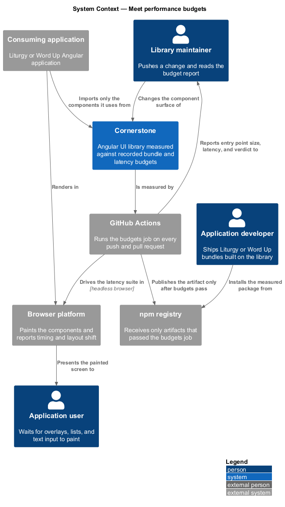
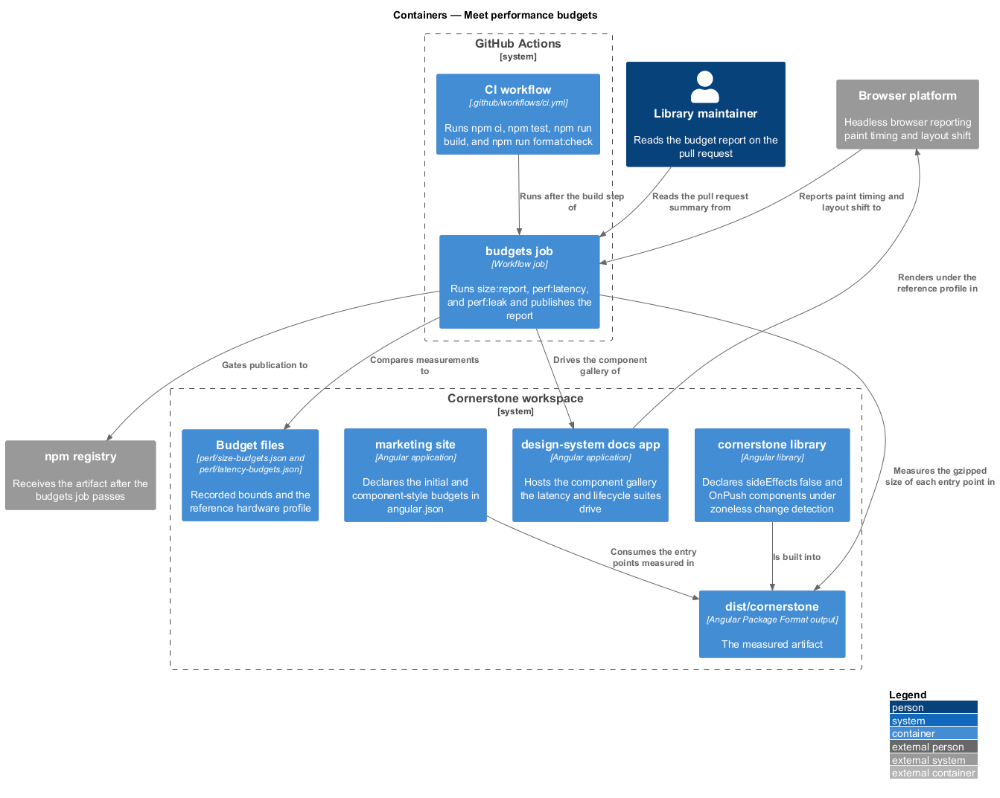
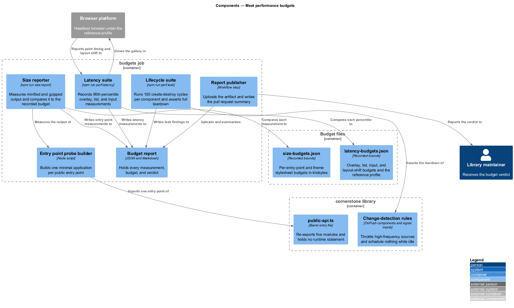
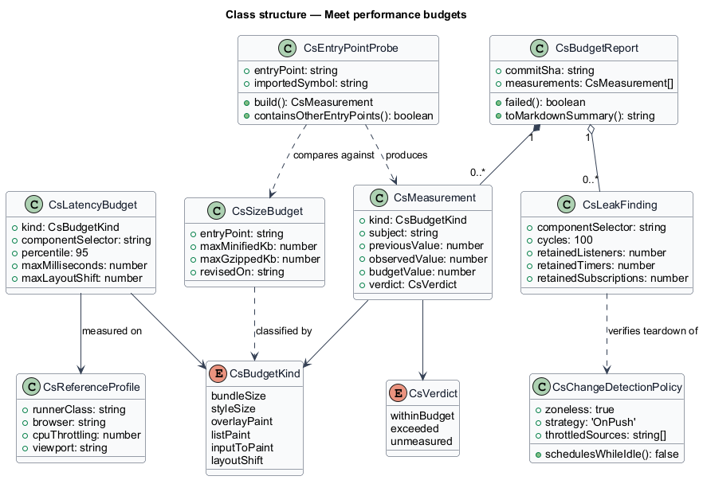
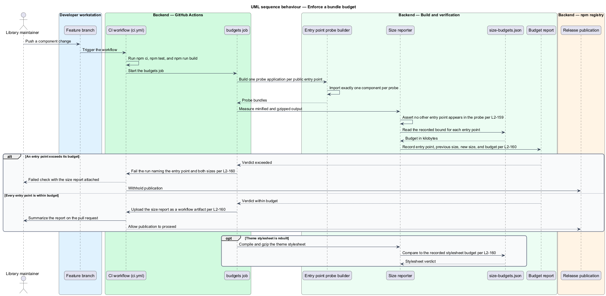
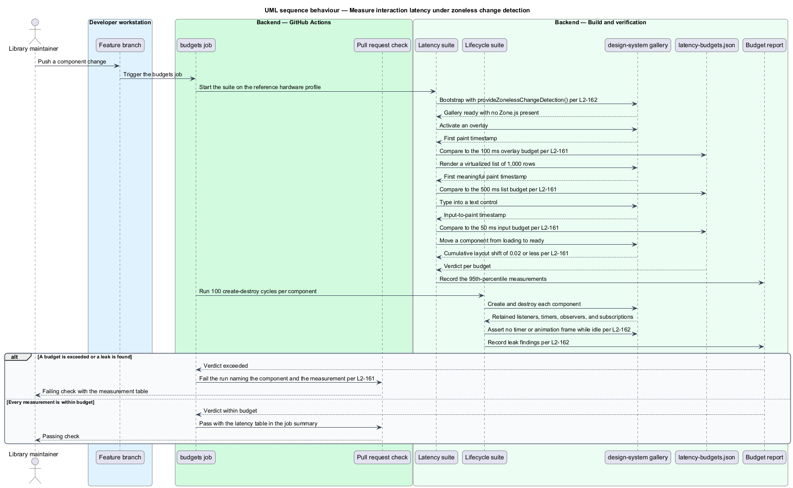

# Meet performance budgets

## Overview

Cornerstone is the Angular user-interface library published as `@quinntyne/cornerstone`.
Every screen in Liturgy and Word Up is assembled from its components, so the cost
of the library is paid by every page of both applications. This feature defines
what that cost may be and how the pipeline holds it there.

**bundle budget** — recorded upper bound on the minified and gzipped size of one
published entry point

**latency budget** — recorded upper bound on the elapsed time between a user
action and the paint that answers it, stated at the 95th percentile

**reference hardware profile** — documented machine, browser, and CPU-throttling
configuration against which every latency budget is measured

**tree shaking** — removal of exported code that no import path reaches,
performed by the application bundler

The feature sits between the package build and publication. It reads the
artifact that `build-the-package` produces (L2-001), measures it, and fails the
build before `publish-to-npm` uploads anything (L2-176). It covers four
concerns: an application pays only for what it imports, the size of what it
imports stays bounded, the components paint and respond inside their budgets,
and the library runs without Zone.js while scheduling no needless work.

Both consuming applications already declare Angular build budgets in
`angular.json`: a 500 kB initial warning with a 1 MB error, and a 12 kB warning
with a 20 kB error for any single component stylesheet. Those application-level
budgets constrain the composed result. The budgets this feature adds constrain
the library itself, per entry point, so that a regression is attributed to the
component that caused it.

## Description

The feature is a measurement slice: two budget files, two measurement suites,
one reporting step, and the change-detection rules the components observe so the
runtime budgets hold.

- **`perf/size-budgets.json`** — the recorded per-entry-point budgets. Each entry
  names the entry point, its minified and gzipped budget in kilobytes, and the
  date the budget was last revised. It also carries one entry for the compiled
  and gzipped theme stylesheet (L2-160).
- **`perf/latency-budgets.json`** — the recorded latency budgets and the
  reference hardware profile they are measured against (L2-161).
- **`npm run size:report`** — the bundle analysis script. It builds a probe
  application per public entry point, measures the minified and gzipped output,
  compares each measurement to its budget, and writes a size report.
- **`npm run perf:latency`** — the latency suite. It drives each overlay,
  data-bearing, and text-entry component under the reference profile and records
  the 95th-percentile measurement for each budget.
- **`npm run perf:leak`** — the lifecycle suite. It creates and destroys each
  component 100 times and asserts that every listener, timer, observer, and
  subscription registered during creation is released on destruction (L2-162).
- **`budgets` job** — the job this design adds to `.github/workflows/ci.yml`. It
  runs the three suites after `npm run build`, uploads the size report as a
  workflow artifact, and summarizes it on the pull request (L2-160).
- **`sideEffects: false`** — the manifest declaration that permits the bundler to
  drop unreached exports. No module in the library performs work at import time
  beyond declaration, and no component registers itself in a global registry at
  import time (L2-159).
- **`public-api.ts`** — the single barrel. It re-exports the five source modules
  and holds no runtime statement, so importing one component does not pull the
  other four modules into the application graph (L2-159).
- **Change-detection rules** — every component declares
  `ChangeDetectionStrategy.OnPush`, reads its state through signal inputs, and
  runs under `provideZonelessChangeDetection()` in both the documentation
  application and the test harness. High-frequency sources — scroll, resize,
  drag, and text input — are throttled or debounced at their documented rate
  rather than notifying on every event. An idle component schedules no timer and
  no animation frame (L2-162).
- **Teardown rules** — every listener, timer, observer, and subscription is
  registered through `takeUntilDestroyed` or released in `ngOnDestroy`, which is
  what the lifecycle suite asserts.

The recorded latency budgets are fixed by L2-161: at most 100 ms from activation
to first paint for an overlay, at most 500 ms to first meaningful paint for a
virtualized list, table, or directory of 1,000 rows, at most 50 ms from input to
paint in a text control, and at most 0.02 cumulative layout shift attributable
to a component moving from a layout-reserving loading state to its ready state.

The per-entry-point kilobyte budgets and the theme stylesheet budget are
`<TO SUPPLY>`, because they are set from the first measurement of the completed
component surface rather than chosen in advance. The reference hardware profile
is `<TO SUPPLY>`, because the CI runner class and CPU throttling factor are not
yet fixed.

## Requirements

The feature realizes the following level-2 (L2) requirements. Each L2 requirement
refines a level-1 (L1) requirement, cited by identifier.

| L2 ID | Refines (L1) | Requirement |
|-------|--------------|-------------|
| `L2-159` | `L1-018` | The package shall be fully tree-shakeable, declaring `sideEffects: false` and performing no import-time work, so that an application bundle carries only the components it imports. |
| `L2-160` | `L1-018` | The library shall record and enforce a minified and gzipped budget for each public entry point and for the theme stylesheet, and CI shall fail a change that exceeds one, reporting the entry point, the previous size, the new size, and the budget. |
| `L2-161` | `L1-018` | Overlay, data-bearing, and text-entry components shall meet their recorded latency budgets at the 95th percentile on the documented reference hardware profile, and CI shall fail the build when a budget is exceeded. |
| `L2-162` | `L1-018` | The library shall operate correctly under zoneless change detection, shall throttle or debounce high-frequency event sources, shall schedule no work while idle, and shall release every listener, timer, observer, and subscription on destruction. |

## Diagrams

### System context

A library maintainer pushes a change; GitHub Actions measures the built package
against the recorded budgets and reports the result before the npm registry ever
receives an artifact.

### Containers

The `cornerstone` library produces the artifact under measurement. The
`design-system` documentation application hosts the gallery the latency and
lifecycle suites drive, and the CI workflow holds the `budgets` job.

### Components

The size reporter, the latency suite, and the lifecycle suite each read a budget
file and write into one shared report. The reporter publishes that report as a
workflow artifact and as a pull request summary.

### Class structure

`CsSizeBudget` and `CsLatencyBudget` are the recorded bounds; `CsMeasurement`
holds one observation against one budget, and `CsBudgetReport` aggregates the
verdicts the CI job acts on.

### Behaviour — enforce a bundle budget

A change lands on a branch. The `budgets` job builds one probe application per
entry point, measures the gzipped output, compares each measurement to its
budget, and fails the run when an entry point exceeds its bound.

### Behaviour — measure interaction latency under zoneless change detection

The latency suite opens an overlay, renders a 1,000-row virtualized list, and
types into a text control under the reference profile, then checks the recorded
percentiles against their budgets.

