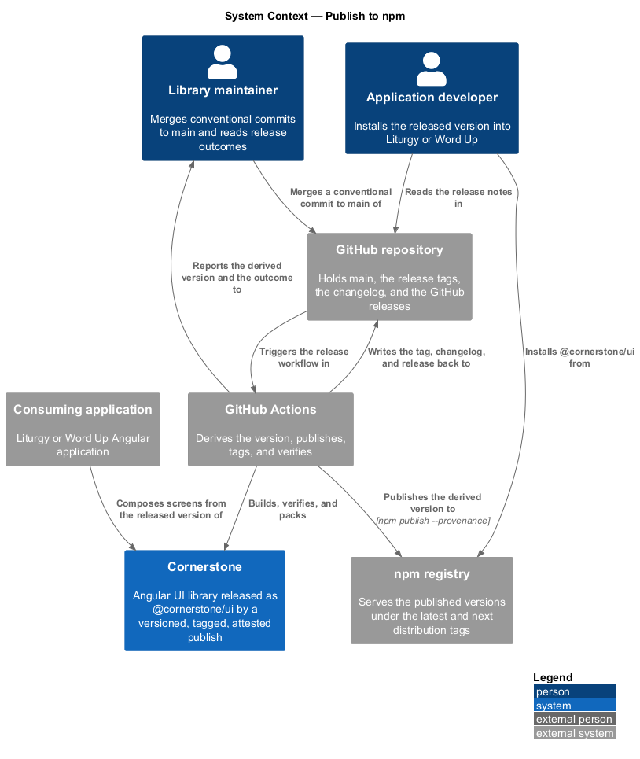
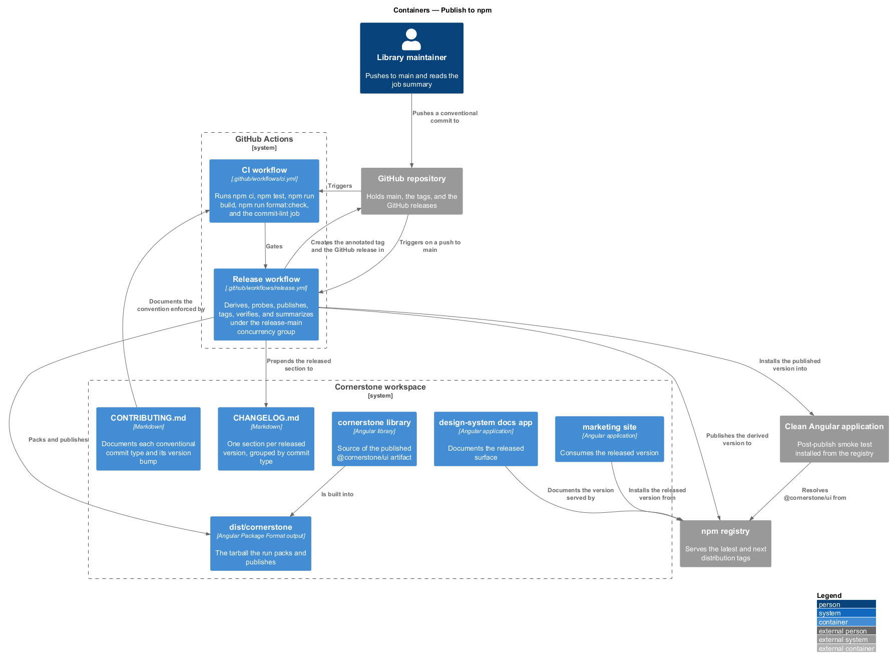
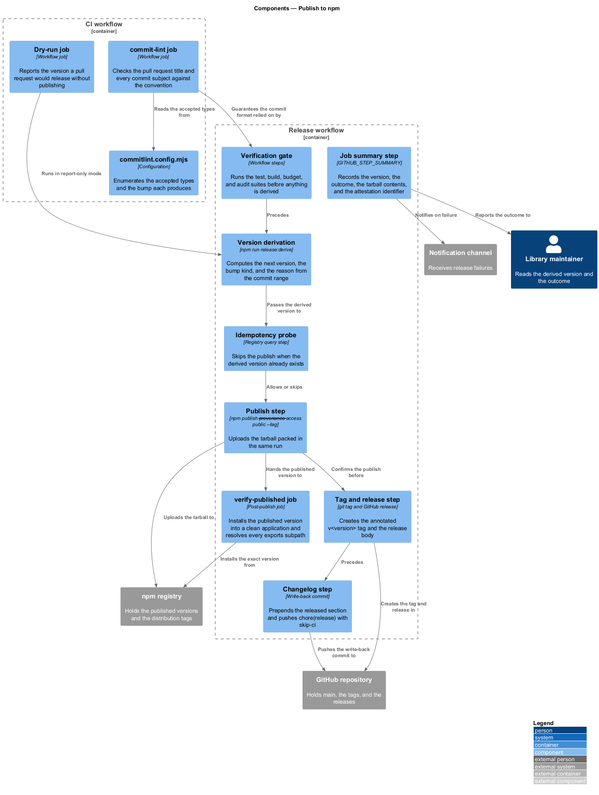
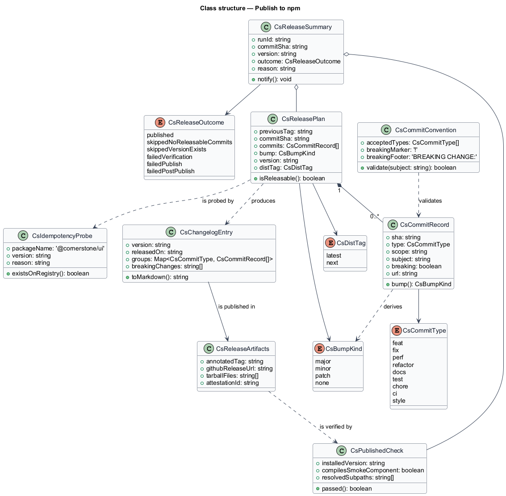
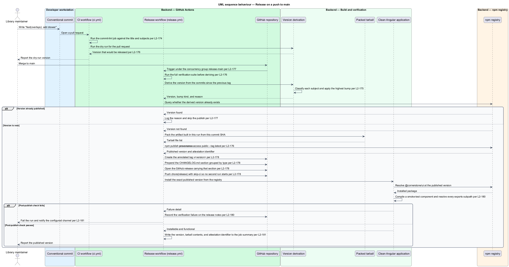
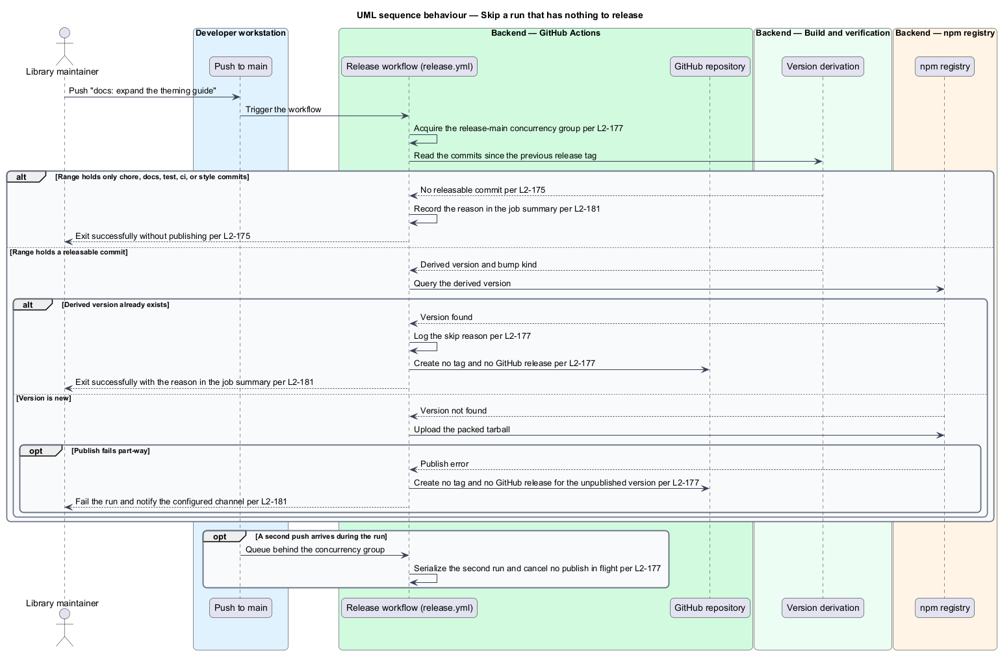
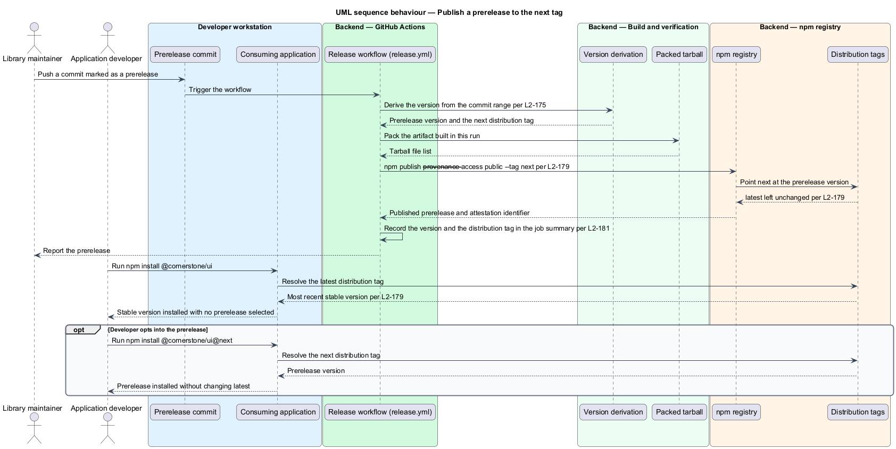

> Historical design: the current implementation and recovery contract are documented in [npm releases](../../../npm-releases.md). It publishes both packages on every passing main push, including documentation, and uses durable draft records instead of generated main commits or next releases.

# Publish to npm

## Overview

Cornerstone is the Angular user-interface library published as `@quinntyne/cornerstone`.
Liturgy and Word Up install it from the public npm registry, so a change reaches
those applications only after a release. This feature defines the release: what
triggers it, how the version is derived, what is published, and what evidence the
release leaves behind.

**conventional commit** — commit subject in the form `type(scope): summary`,
whose type and breaking-change marker determine the version bump it produces

**version derivation** — computation of the next semantic version from the
conventional commits recorded since the previous release tag

**distribution tag** — named pointer in registry metadata that resolves to one
published version, `latest` for stable releases and `next` for prereleases

**release run** — one execution of the release workflow for one commit on `main`

The feature sits at the end of the delivery subsystem. It consumes the artifact
that `build-the-package` produces (L2-001), runs only after the verification,
budget, and audit gates pass (L2-160, L2-165), and publishes with the provenance
that `secure-the-supply-chain` requires (L2-166).

The repository holds three workflows today: `.github/workflows/ci.yml`,
`.github/workflows/deploy-design-system.yml`, and
`.github/workflows/deploy-marketing.yml`. None of them publishes to npm. This
design introduces `.github/workflows/release.yml` and adds a `commit-lint` job
to the existing `ci.yml`.

## Description

The feature is a pipeline slice: one commit convention, one derivation step, one
publish job, and the artefacts each release leaves in the repository and the
registry.

- **`commitlint.config.mjs`** — the commit convention. It enumerates the accepted
  types and binds each to a bump: `fix` to patch, `feat` to minor, and any
  subject carrying `!` or a `BREAKING CHANGE:` footer to major. `chore`, `docs`,
  `test`, `ci`, and `style` produce no release (L2-174, L2-175).
- **`commit-lint` job** — the job this design adds to
  `.github/workflows/ci.yml`. It checks the pull request title and every commit
  subject in the pull request against the convention, and fails naming the
  expected format when one does not match (L2-174).
- **`CONTRIBUTING.md`** — the contribution guide this design adds at the
  repository root. It documents every accepted type beside the bump it produces
  (L2-174).
- **`npm run release:derive`** — the derivation script. It reads the commits
  between the previous release tag and `HEAD`, classifies each by type, and
  emits the next version, the bump kind, and the reason. Two runs over the same
  commit range emit the same version. A range holding no releasable commit emits
  no version and exits successfully (L2-175).
- **`.github/workflows/release.yml`** — the release workflow this design
  introduces. It triggers on push to `main`, runs the full verification suite
  first, then derives, publishes, tags, and verifies. It declares the
  concurrency group `release-main` with `cancel-in-progress: false` so that two
  pushes serialize rather than race, and no run is cancelled part-way through a
  publish (L2-176, L2-177).
- **Idempotency probe** — the step that queries the registry for the derived
  version before publishing. When that version already exists, the workflow logs
  the reason, skips the publish, and exits successfully (L2-177).
- **Publish step** — `npm publish --provenance --access public --tag <dist-tag>`,
  run against the tarball the same workflow run packed from the same commit SHA,
  not a rebuild (L2-176, L2-179).
- **Dist-tag selection** — `latest` for a stable version derived from `main`, and
  `next` for a prerelease version, which leaves `latest` pointing at the most
  recent stable version (L2-179).
- **Dry-run job** — the job that runs on a pull request targeting `main`. It
  performs every step except the publish and reports the version that would be
  released (L2-176).
- **Tag, changelog, and release steps** — after a confirmed publish, the workflow
  creates the annotated tag `v<version>` on the released commit, prepends a
  `CHANGELOG.md` section grouping the included commits by type with a link to
  each commit, and opens a GitHub release for the tag carrying that section as
  its body. A release containing a breaking change carries a marked
  breaking-changes section with migration guidance. None of the three is created
  when the publish fails (L2-177, L2-178).
- **Changelog write-back** — the commit `chore(release): v<version> [skip ci]`
  pushed to `main`. The release workflow ignores commits whose subject begins
  `chore(release):`, so the write-back does not trigger a second release
  (L2-178).
- **`verify-published` job** — the post-publish job. It installs the exact
  published version from the public registry into a clean Angular application,
  compiles a smoke-test component, and resolves every declared `exports`
  subpath. A failure fails the workflow visibly, records the failure on the
  release notes, and opens a failure report (L2-180).
- **Job summary** — the summary every release run writes, stating the derived
  version, whether a publish occurred, the reason when it did not, the tarball
  contents, and the provenance attestation identifier (L2-181).

The order of the steps carries the guarantees. Verification precedes derivation,
derivation precedes the idempotency probe, the probe precedes the publish, and
the tag, changelog, and GitHub release follow only a confirmed publish. A
failure at any point leaves the registry and the repository in the state they
held before the run.

The notification channel that receives a release failure is `<TO SUPPLY>`,
because the maintainer alerting destination is not yet chosen (L2-181). The
branch or subject convention that marks a prerelease is `<TO SUPPLY>`, because
the prerelease trigger has not been fixed (L2-179).

## Requirements

The feature realizes the following level-2 (L2) requirements. Each L2 requirement
refines a level-1 (L1) requirement, cited by identifier.

| L2 ID | Refines (L1) | Requirement |
|-------|--------------|-------------|
| `L2-174` | `L1-022` | Every pull request title and every commit subject reaching `main` shall follow the Conventional Commits specification, each accepted type shall be documented beside the bump it produces, and a `!` marker or `BREAKING CHANGE:` footer shall derive a major bump. |
| `L2-175` | `L1-022` | The released version shall be derived from the conventional commits since the previous release tag, shall be identical across two runs over the same range, and shall produce no release when only non-releasable types are present. |
| `L2-176` | `L1-022` | A GitHub Actions workflow shall publish `@quinntyne/cornerstone` to the public npm registry on every push to `main` after the full verification suite passes, shall publish the artifact built in that run from that commit, and shall report a dry-run version on a pull request without publishing. |
| `L2-177` | `L1-022` | The release shall skip publishing and exit successfully when the derived version already exists, shall serialize concurrent runs through a concurrency group that cancels no run mid-publish, and shall create no tag or release for a version that failed to publish. |
| `L2-178` | `L1-022` | Every published version shall produce an annotated `v<version>` tag, a `CHANGELOG.md` section grouping the included commits by type with links, and a GitHub release carrying that section, and the changelog write-back shall not retrigger the workflow. |
| `L2-179` | `L1-022` | The workflow shall publish stable releases to the `latest` distribution tag and prereleases to the `next` tag, leaving `latest` unchanged so that a plain install resolves the most recent stable version. |
| `L2-180` | `L1-022` | After publishing, the workflow shall install the exact published version from the public registry into a clean Angular application, compile a smoke-test component, resolve every declared `exports` subpath, and fail visibly when the check does not pass. |
| `L2-181` | `L1-022` | Every release run shall publish a job summary stating the derived version, whether a publish occurred, and the reason when it did not, shall record the tarball contents and the provenance attestation identifier, and shall notify the configured channel on failure. |

## Diagrams

### System context

A library maintainer merges a conventional commit to `main`; GitHub Actions
derives the version and publishes to the npm registry, from which the two
consuming applications install.

### Containers

The release workflow is the container this feature adds. It reads the artifact
the `cornerstone` library build produces, writes the tag and changelog back to
the repository, and publishes to the registry.

### Components

Each step of the workflow is a component with one responsibility: derive,
probe, publish, tag, verify, and summarize. The commit convention is enforced
earlier, by the `commit-lint` job in the CI workflow.

### Class structure

`CsCommitRecord` classifies one commit, `CsReleasePlan` holds the derived
version and its bump kind, and `CsReleaseSummary` records the outcome the job
summary and the notification report.

### Behaviour — release on push to main

A push to `main` runs verification, derives a version, probes the registry,
publishes the packed tarball, tags the commit, writes the changelog, opens the
GitHub release, and verifies the published package.

### Behaviour — skip a run that has nothing to release

A run whose commit range holds only non-releasable types, or whose derived
version already exists on the registry, records the reason and exits
successfully without publishing, tagging, or releasing.

### Behaviour — publish a prerelease to the next tag

A prerelease run publishes to the `next` distribution tag, leaving `latest`
pointing at the most recent stable version so that a plain install selects no
prerelease.

