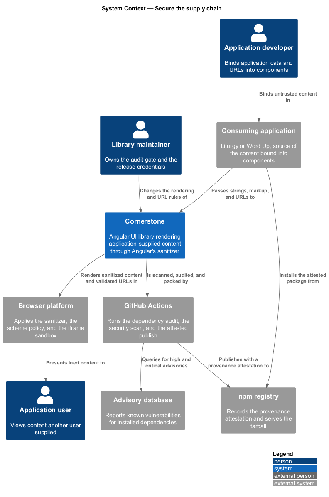
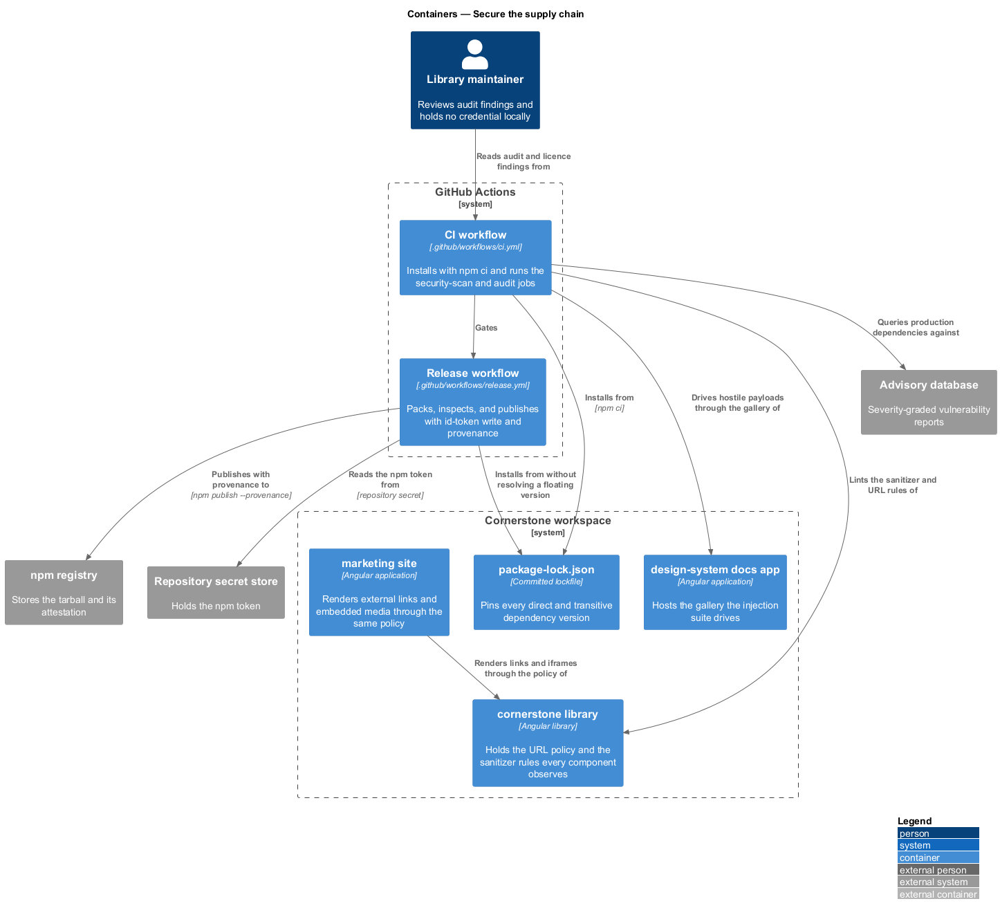
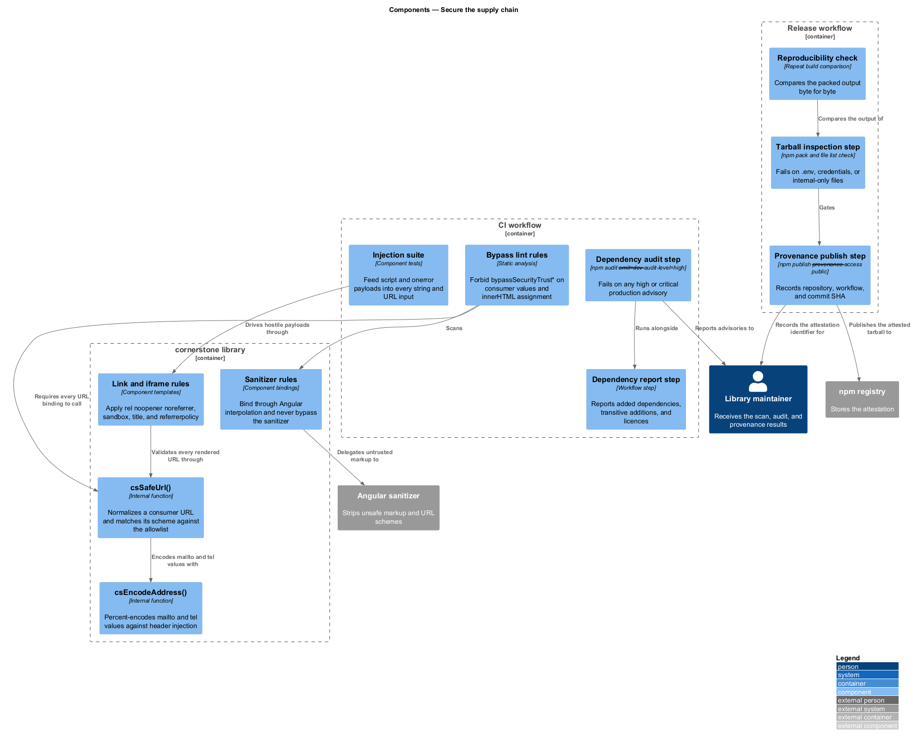
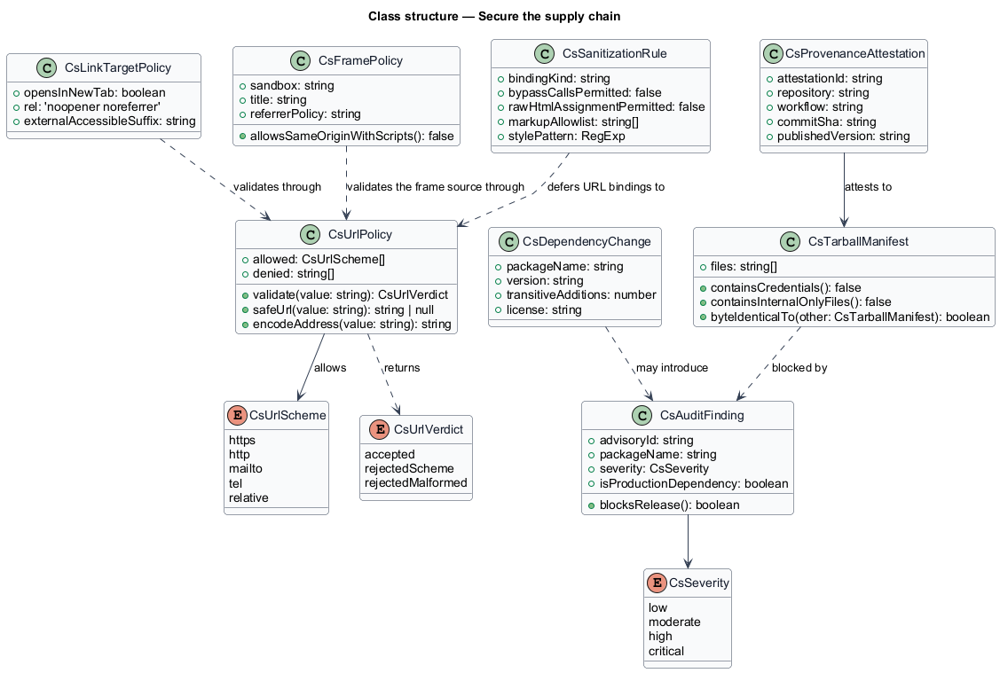
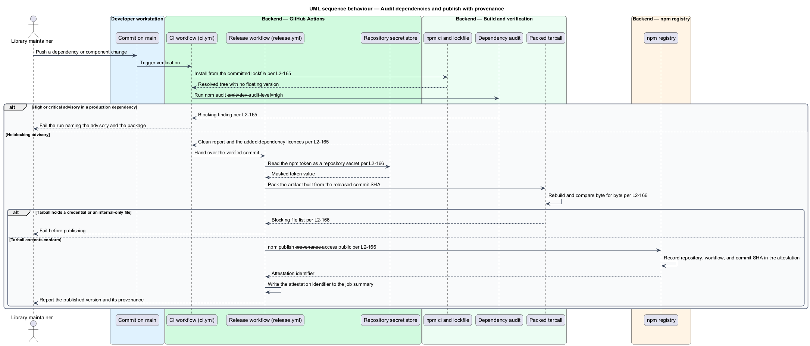
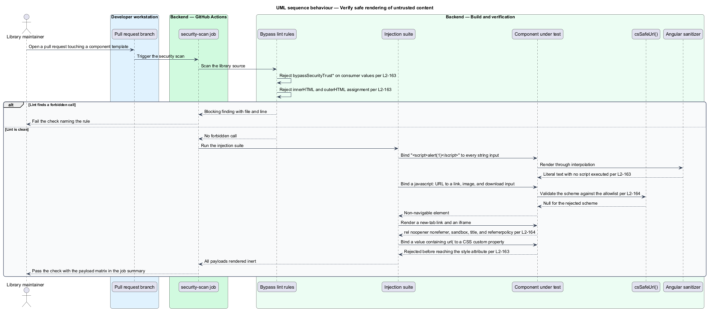

# Secure the supply chain

## Overview

Cornerstone is the Angular user-interface library published as `@quinntyne/cornerstone`.
Liturgy and Word Up render church, youth, mentor, guardian, and volunteer data
through its components, and both applications install the package from the
public npm registry. Two trust boundaries follow from that: the content an
application passes into a component, and the artifact the registry hands back to
an installer.

**application-supplied content** — string, URL, or markup value that a consuming
application binds into a component input

**scheme allowlist** — enumerated set of URL schemes a component accepts, all
other schemes being rejected

**advisory** — published report of a known vulnerability in a dependency, graded
by severity

**provenance attestation** — signed statement linking a published package
version to the source repository, workflow, and commit that produced it

This feature covers both boundaries. It defines how components render untrusted
values without opening an injection path, how they handle consumer-supplied
URLs, how the build audits and pins its dependencies, and how the release
attests to its own origin while keeping credentials out of the artifact and the
logs.

The feature sits across the whole delivery subsystem. Its rendering rules bind
every component in the library; its audit gate runs in the CI workflow before
the package is built; and its provenance and secret rules constrain the release
workflow that `publish-to-npm` defines.

## Description

The feature is a slice of enforcement points: two source-scan rules, one shared
URL policy, one audit job, and the publication flags that produce provenance.

- **`csSafeUrl(value, allowed)`** — the library-internal function every component
  calls before binding a consumer-supplied URL to `href`, `src`, or a download
  target. It normalizes the value, matches its scheme against the allowlist, and
  returns `null` for a rejected value so that the component renders a
  non-navigable element (L2-164). It is internal and is not part of the public
  export surface.
- **`CsUrlScheme`** — the allowlist type. The permitted set is `https`, `http`,
  `mailto`, `tel`, and relative references. `javascript`, `data`, and `vbscript`
  are rejected in every position (L2-164).
- **`csEncodeAddress(value)`** — the internal encoder applied to `mailto:` and
  `tel:` values, which percent-encodes the separators that would otherwise allow
  a header-injection sequence (L2-164).
- **External link handling** — a link that opens in a new tab renders
  `rel="noopener noreferrer"`, and its accessible name states that it opens
  externally (L2-164).
- **Iframe handling** — every iframe the library renders carries an explicit
  `sandbox` attribute that never combines `allow-same-origin` with
  `allow-scripts`, a required `title`, and a `referrerpolicy` (L2-164).
- **Sanitizer rules** — no component calls `bypassSecurityTrustHtml`,
  `bypassSecurityTrustScript`, `bypassSecurityTrustStyle`,
  `bypassSecurityTrustUrl`, or `bypassSecurityTrustResourceUrl` on a
  consumer-supplied value, and no component assigns a consumer-supplied value to
  `innerHTML` or `outerHTML`. Registered icon and SVG markup passes through
  Angular's sanitizer or a documented element and attribute allowlist. A value
  bound into a CSS custom property or an inline style is rejected or escaped
  when it contains `url(` or `expression(` (L2-163).
- **`security-scan` job** — the job this design adds to
  `.github/workflows/ci.yml`. It runs the lint rules that forbid the sanitizer
  bypasses and the raw HTML assignments, and it runs the injection suite that
  feeds `` and an `onerror` payload into every string
  input and asserts literal rendering (L2-163).
- **`audit` job** — the second job this design adds to
  `.github/workflows/ci.yml`. It runs `npm audit --omit=dev
  --audit-level=high`, fails on any high or critical advisory in a production
  dependency, and reports each added dependency, its transitive additions, and
  its licence on a pull request (L2-165).
- **`npm ci` against the committed lockfile** — the only install command in every
  workflow. The repository commits `package-lock.json`, and no job resolves a
  floating version at build time or installs a dependency absent from the
  lockfile (L2-165). The three current workflows — `ci.yml`,
  `deploy-design-system.yml`, and `deploy-marketing.yml` — already install this
  way, and the release workflow follows the same rule.
- **`npm publish --provenance --access public`** — the publication command in
  `.github/workflows/release.yml`. The job grants `id-token: write` alongside
  the minimum other permissions, which is what lets npm record an attestation
  naming the repository, the workflow, and the commit SHA (L2-166).
- **Tarball inspection step** — the release step that lists the packed contents
  and fails when any `.env` file, credential, `.npmrc` carrying a token, or
  internal-only file is present (L2-166).
- **Secret handling** — the npm token is referenced only as a repository secret,
  is never echoed into a log or a job summary, and is never written to a file
  that the tarball inspection step could find (L2-166).
- **Reproducibility check** — the step that rebuilds the artifact from the same
  commit and compares the packed output byte for byte, excluding the documented
  timestamp fields (L2-166).

The rendering rules and the pipeline rules meet in the CI workflow: the
`security-scan` and `audit` jobs both gate the build that the release workflow
publishes, so a change that opens an injection path or introduces a vulnerable
dependency never reaches the registry.

The notification channel that receives an audit failure outside a pull request
is `<TO SUPPLY>`, because the maintainer alerting destination is shared with
release observability (L2-181) and is not yet chosen.

## Requirements

The feature realizes the following level-2 (L2) requirements. Each L2 requirement
refines a level-1 (L1) requirement, cited by identifier.

| L2 ID | Refines (L1) | Requirement |
|-------|--------------|-------------|
| `L2-163` | `L1-019` | No component shall introduce an injection path through application-supplied content; the library shall not bypass Angular's sanitizer for consumer input, shall not assign consumer values to `innerHTML` or `outerHTML`, and shall reject unsafe style and markup values. |
| `L2-164` | `L1-019` | Every component rendering a consumer-supplied URL shall validate its scheme against the allowlist, shall apply `rel="noopener noreferrer"` to new-tab links, shall sandbox and title every iframe, and shall encode `mailto:` and `tel:` values. |
| `L2-165` | `L1-019` | The build shall install with `npm ci` against the committed lockfile, shall audit production dependencies, shall fail on any high or critical advisory, and shall report added dependencies and their licences on a pull request. |
| `L2-166` | `L1-019` | The published package shall carry a provenance attestation naming the repository, workflow, and commit, shall be built from the released commit, shall contain no credential or internal-only file, and shall expose no secret in any log. |

## Diagrams

### System context

A consuming application passes untrusted content into the library, and an
installer takes the published package from the registry. GitHub Actions stands
between the two, auditing dependencies and attesting to the artifact's origin.

### Containers

The rules divide by container: the `cornerstone` library holds the rendering and
URL policy, the CI workflow holds the scan and audit jobs, and the release
workflow holds the provenance and secret rules.

### Components

`csSafeUrl()` and the sanitizer rules are the enforcement points inside the
library; the lint rules, the injection suite, and the audit step are the
enforcement points inside the pipeline.

### Class structure

`CsUrlScheme` and `CsUrlPolicy` type the URL decision, `CsAuditFinding` types a
dependency advisory, and `CsProvenanceAttestation` types the statement npm
records against the published version.

### Behaviour — audit dependencies and publish with provenance

The release workflow installs from the lockfile, audits production dependencies,
inspects the packed tarball, and publishes with provenance from the released
commit.

### Behaviour — verify safe rendering of untrusted content

The `security-scan` job lints for sanitizer bypasses and raw HTML assignment,
then drives hostile payloads through every string and URL input and asserts that
each renders inert.

