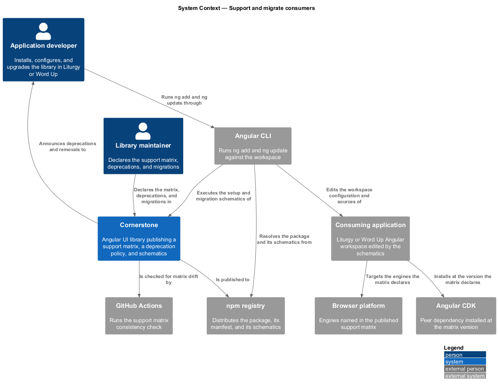
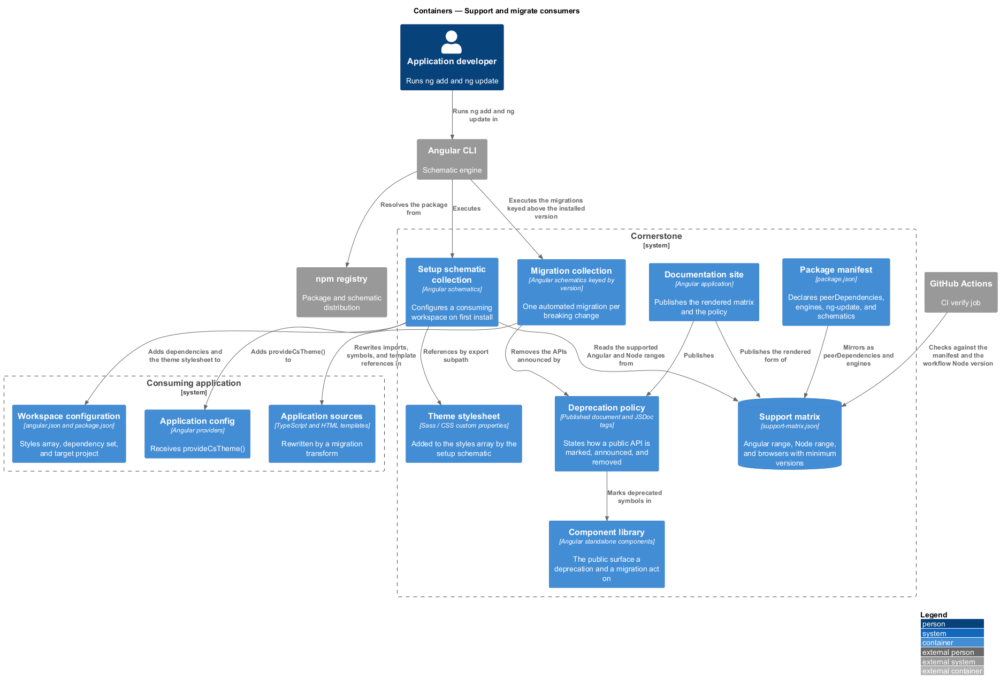
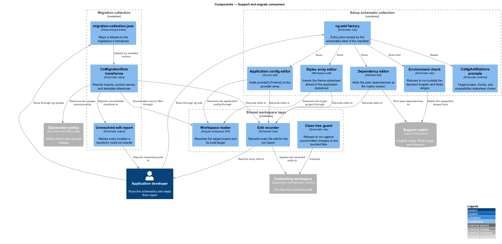
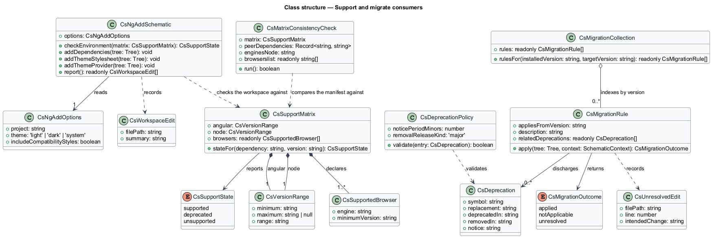
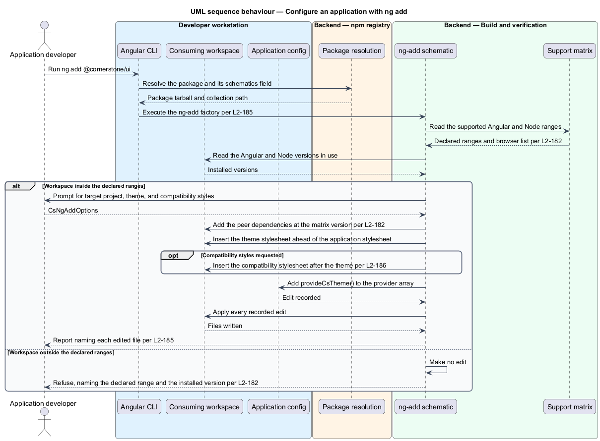
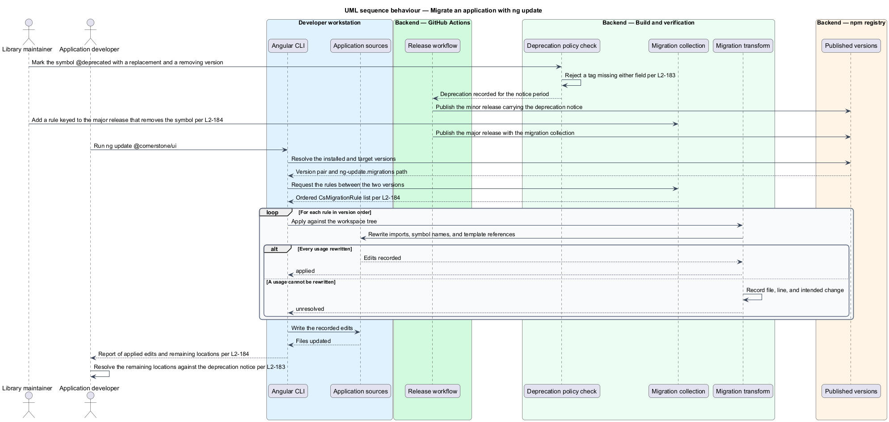

# Support and migrate consumers

## Overview

Cornerstone is the Angular user-interface library published as `@quinntyne/cornerstone`.
Liturgy and Word Up install it, upgrade it, and eventually meet a release that
removes something they depend on. This feature covers the promises the library
makes about which versions it works with, the notice it gives before removing a
public API, and the two automated commands that carry a consuming application
across those boundaries.

**support matrix** — declared set of Angular versions, Node versions, and
browsers the library is verified against and installs into

**deprecation policy** — published rule stating how a public API is marked,
announced, and removed, and how long the marked form remains available

**migration schematic** — automated code change shipped with a release and run by
`ng update`, rewriting a consuming application's sources for one breaking change

**setup schematic** — automated change run by `ng add`, configuring a consuming
application to use the library for the first time

The library declares four peer dependencies today —
`@angular/cdk`, `@angular/common`, `@angular/core`, and `@angular/forms`, each at
`^21.2.0` — and the `CI` workflow installs on Node 22. Those two facts are the
current, implicit support statement. This feature turns them into a published,
machine-readable declaration that the install itself enforces, and adds the
schematic surface the library does not yet ship.

The feature sits at the boundary between the library and the applications that
consume it. It shares that boundary with `bridge-legacy-markup`, which carries
the same applications across their markup migration; the deprecation policy
defined here is the mechanism that eventually removes the bridge (L2-189).

## Description

The feature spans declared metadata in the published package, two schematic
collections, a policy document, and the checks that keep the three consistent.

- **`support-matrix.json`** — the machine-readable declaration, published in the
  package and read by the tooling. It names the supported Angular version range,
  the supported Node version range, and the supported browsers with their minimum
  versions. It is the single source the cross-browser runner in
  `verify-every-change` reads its engine list from (L2-156).
- **`docs/specs/support-matrix.md`** — the human-readable rendering of the same
  data, generated from `support-matrix.json` so the two cannot diverge (L2-182).
- **`peerDependencies`** — the install-time enforcement of the Angular range.
  A consuming application outside the declared range fails its install rather
  than discovering the incompatibility at runtime.
- **`engines.node`** — the install-time enforcement of the Node range, added to
  the published package manifest by this design.
- **`browserslist`** — the build-time enforcement of the browser list, generated
  from `support-matrix.json` so that a browser leaving the matrix also leaves the
  compiled output's target set (L2-182).
- **`CsSupportMatrix`** — type describing the declaration: `angular`, `node`, and
  `browsers`, where each browser carries an engine name and a minimum version.
- **`docs/specs/deprecation-policy.md`** — the published policy. A public API
  scheduled for removal carries a `@deprecated` JSDoc tag naming the replacement
  and the release that removes it, emits a build-time notice through that tag,
  remains present for the declared notice period, and is removed only in a major
  release. The length of the notice period is `<TO SUPPLY>` (L2-183).
- **`CsDeprecation`** — type pairing an exported symbol with its replacement,
  the version that deprecated it, and the version that removes it. A deprecation
  check reads the tags from `public-api.ts` and fails the build when a tag omits
  either the replacement or the removing version.
- **`ng update` migration collection** — `migrations/migration-collection.json`,
  referenced from the package manifest's `ng-update.migrations` field. Each
  breaking change contributes one entry keyed by the version that introduces it
  (L2-184).
- **`CsMigrationRule`** — type describing one migration: the version it applies
  from, a description, and the transform it runs. Transforms rewrite Angular
  template references, TypeScript imports, and symbol names, and report every
  location they cannot rewrite rather than leaving it silently unchanged.
- **`ng add` schematic** — `schematics/ng-add/`, referenced from the package
  manifest's `schematics` field. It installs `@angular/cdk` at the matrix
  version, appends `@quinntyne/cornerstone/styles/theme.scss` to the target project's
  `styles` array in `angular.json` ahead of the application stylesheet, adds
  `provideCsTheme()` to the application config, and offers the optional
  compatibility stylesheet that `bridge-legacy-markup` defines (L2-185, L2-186).
- **`CsNgAddOptions`** — type describing the prompts the setup schematic accepts:
  `project`, `theme`, and `includeCompatibilityStyles`.
- **Support matrix check** — a step in the `CI` verify job that compares
  `support-matrix.json` against the declared `peerDependencies`, the `engines`
  field, the generated `browserslist`, and the Node version the workflow installs.
  A drift between any two fails the build, which is what makes the matrix
  enforced rather than merely published (L2-182).

Both schematics change files a consuming application owns, so both report every
edit they make and refuse to run against a workspace with uncommitted changes to
the files they touch. A migration that cannot complete an edit records the
location and the intended change, so the remaining work is a list rather than a
search.

The number of minor releases in the deprecation notice period and the initial
browser list are `<TO SUPPLY>`.

## Requirements

The feature realizes the following level-2 (L2) requirements. Each L2 requirement
refines a level-1 (L1) requirement, cited by identifier.

| L2 ID | Refines (L1) | Requirement |
|-------|--------------|-------------|
| `L2-182` | `L1-023` | The library shall publish a support matrix for Angular versions, Node versions, and browsers, and shall enforce it at install time, at build time, and in continuous integration. |
| `L2-183` | `L1-023` | Removal of a public API shall follow the published deprecation policy. |
| `L2-184` | `L1-023` | Every breaking change shall ship an automated migration that `ng update` executes against a consuming application. |
| `L2-185` | `L1-023` | The library shall provide `ng add` support that configures a consuming application. |

## Diagrams

### System context

An application developer installs and upgrades the library through the Angular
CLI. The support matrix governs which Angular, Node, and browser versions that
exchange accepts.

### Containers

The published package carries the library, the two schematic collections, and the
support matrix. The Angular CLI reads the collections; the consuming workspace is
what they edit.

### Components

The setup schematic and the migration collection are separate entry points over a
shared workspace-editing layer. The support matrix is read by the schematics, by
the build, and by the continuous integration check alike.

### Class structure

`CsSupportMatrix` models the published declaration, `CsDeprecation` the notice a
removal carries, and `CsMigrationRule` one automated change. `CsNgAddOptions`
carries the prompts the setup schematic accepts.

### Behaviour — configure an application with `ng add`

A developer runs `ng add @quinntyne/cornerstone`. The schematic checks the workspace
against the support matrix, then edits the styles array, the application config,
and the dependency set.

### Behaviour — migrate an application with `ng update`

A major release removes a deprecated API. The migration collection supplies a
transform keyed to that version, and `ng update` runs it over the application's
sources.

