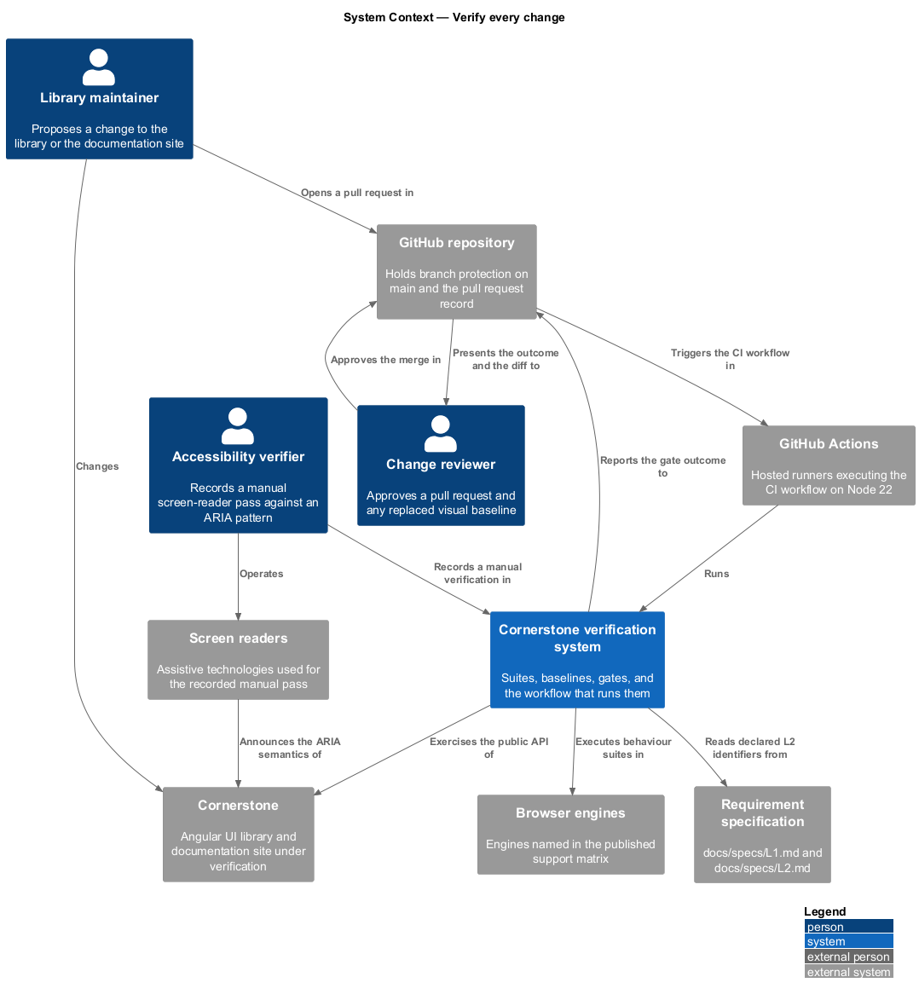
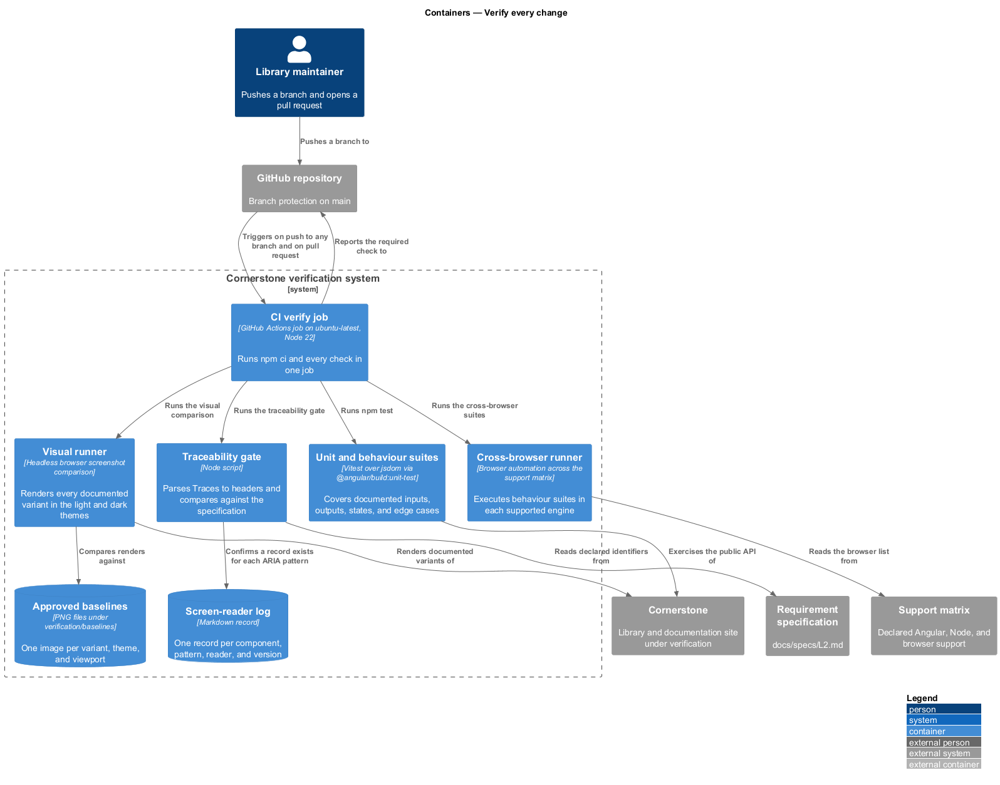
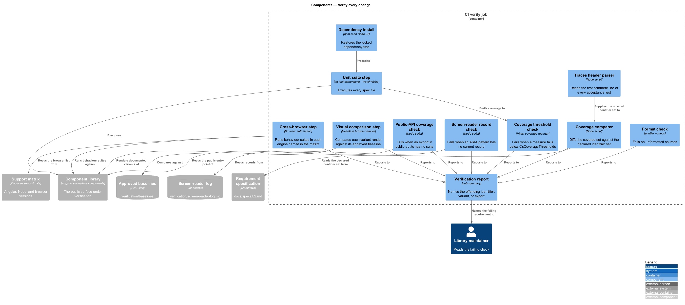
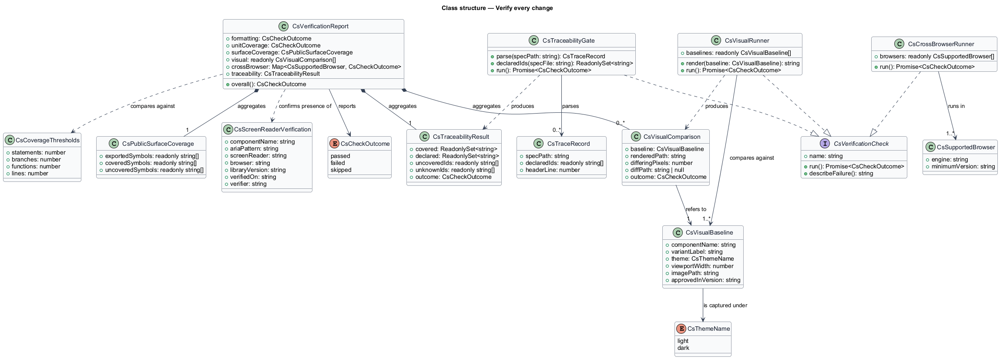
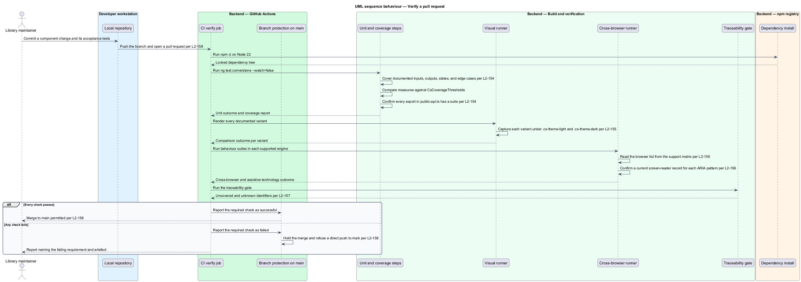
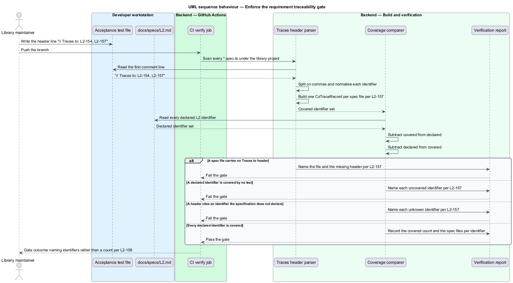
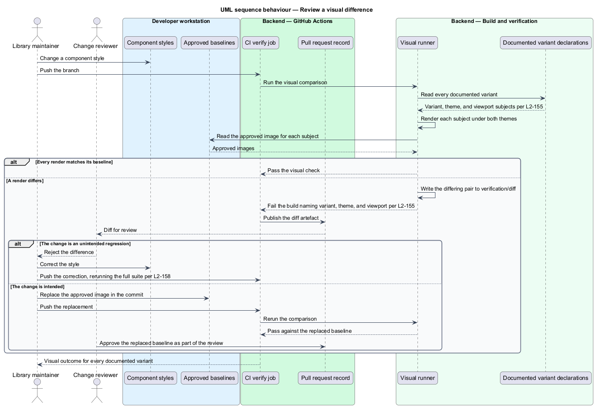

# Verify every change

## Overview

Cornerstone is the Angular user-interface library published as `@quinntyne/cornerstone`.
Liturgy and Word Up depend on it for the behaviour, accessibility semantics, and
appearance of their screens, so a defect in one component reaches every screen
that composes it. This feature is the verification system that stands between a
change and `main`.

**acceptance test** — automated test that exercises a documented behaviour of a
public API and declares the requirements it covers

**visual baseline** — approved screenshot of one documented component variant in
one theme, stored in the repository and compared byte-for-byte against the
rendering produced by a change

**traceability gate** — check that reads the `// Traces to:` header of every
acceptance test, builds the set of covered L2 identifiers, and compares that set
against the requirement specification

**quality gate** — the set of checks that a change passes before it may merge

The workspace already runs a `CI` workflow on every push to any branch and on
every pull request. That workflow checks out the repository, installs Node 22
with an npm cache, and runs `npm ci`, `npm test`, `npm run build`, and
`npm run format:check`. `npm test` resolves to `ng test cornerstone
--watch=false`, which drives the `@angular/build:unit-test` builder over Vitest
with a jsdom environment. This feature keeps that shape and adds the four checks
the requirements name: enforced coverage thresholds, visual baselines,
cross-browser and assistive-technology verification, and the traceability gate.

Verification sits beside every other feature rather than beneath one. A component
design is complete when the components it introduces are covered by acceptance
tests that cite its L2 identifiers, and the traceability gate is what makes that
claim checkable rather than asserted.

## Description

The feature spans test suites in the library project, a verification runner
outside it, a set of approved artefacts committed to the repository, and the
workflow that runs them.

- **Unit and behaviour suites** — `*.spec.ts` files beside each public API,
  executed by `ng test cornerstone --watch=false`. Each suite covers the
  documented inputs, outputs, states, and edge cases of one exported symbol. The
  workspace currently holds one suite, `src/cornerstone/
  primitives.spec.ts`; the design extends the pattern to every export in
  `public-api.ts` (L2-154).
- **`CsCoverageThresholds`** — the enforced floor for statement, branch,
  function, and line coverage, declared in the Vitest coverage configuration and
  failing the run when any measure falls below it. The threshold values are
  `<TO SUPPLY>`.
- **Public-API coverage check** — a step that compares the exported symbols of
  `public-api.ts` against the symbols named by at least one suite, and fails when
  an export has no suite. A coverage percentage alone does not satisfy L2-154,
  because a percentage can be met while one export is untested.
- **`CsVisualBaseline`** — record binding one documented component variant, one
  theme, and one viewport width to an approved screenshot under
  `verification/baselines/`. The baseline set is generated from the same
  `CsDocsVariant` declarations that drive the documentation variant gallery, so a
  variant cannot be documented without acquiring a baseline (L2-155).
- **Visual runner** — the step that renders every baseline subject in the light
  and dark themes, compares each render against its approved image, writes
  differing pairs to `verification/diff/`, and fails the run on any difference.
  Approving a change is an explicit act: the author replaces the baseline file
  and the replacement is reviewed as part of the pull request.
- **Cross-browser runner** — the step that executes the behaviour suites in each
  browser named in the support matrix that
  `support-and-migrate-consumers` publishes (L2-182). The browser list is the
  matrix, read from one file rather than restated in the runner configuration
  (L2-156).
- **`CsScreenReaderVerification`** — record of one manual verification: the
  component, the ARIA pattern it implements, the screen reader and browser pair,
  the library version, the date, and the verifier. The records are held in
  `verification/screen-reader-log.md`, and the gate fails when a component
  implementing an ARIA pattern has no record against the current major version
  (L2-156).
- **`// Traces to:` header** — the first comment line of every acceptance test
  file, listing the L2 identifiers the file covers, one comma-separated list, for
  example `// Traces to: L2-051, L2-052`.
- **Traceability gate** — the step that parses those headers, builds the covered
  set, reads the declared identifiers from `docs/specs/L2.md`, and fails on two
  conditions: an L2 identifier covered by no acceptance test, and a header citing
  an identifier the specification does not declare. Both failures name the
  offending identifiers rather than a count (L2-157).
- **`CsTraceRecord`** — type pairing a spec file path with the identifiers its
  header declares, and the intermediate the gate reports from.
- **`CI` workflow** — the existing `verify` job, extended with the coverage,
  visual, cross-browser, assistive-technology, and traceability steps. The job
  triggers stay `push: branches ['**']` and `pull_request`, so every push and
  every pull request runs the full suite (L2-158).
- **Branch protection on `main`** — the repository setting that requires the
  `verify` job to succeed before a pull request may merge and forbids a direct
  push to `main`. The gate is a repository configuration rather than a file, so
  the design records it as a named setting whose state is auditable (L2-158).

A failing check reports the requirement it enforces. A visual difference names
the variant, the theme, and the viewport; a traceability failure names the
uncovered identifier; a coverage failure names the export. The verification
system is read most often when it fails, so its output is written for that case.

The retention period for diff artefacts and the re-verification interval for
screen-reader records are `<TO SUPPLY>`.

## Requirements

The feature realizes the following level-2 (L2) requirements. Each L2 requirement
refines a level-1 (L1) requirement, cited by identifier.

| L2 ID | Refines (L1) | Requirement |
|-------|--------------|-------------|
| `L2-154` | `L1-017` | Every public API shall have unit tests covering its documented inputs, outputs, states, and edge cases, and the run shall fail when an enforced coverage threshold is not met. |
| `L2-155` | `L1-017` | Every documented component variant shall have an approved visual baseline in the light and dark themes, and an unintended visual change shall fail the build. |
| `L2-156` | `L1-017` | The suite shall verify components in every browser named in the support matrix, and every component implementing an ARIA pattern shall carry a recorded manual screen-reader verification. |
| `L2-157` | `L1-017` | Every acceptance test shall declare the L2 requirements it covers, and every L2 requirement shall be covered by at least one acceptance test. |
| `L2-158` | `L1-017` | Every pull request and every push shall run the full verification suite, and `main` shall be protected so that no unverified change reaches it. |

## Diagrams

### System context

A library maintainer proposes a change; the verification system decides whether
it may reach `main`. The system draws on hosted runners, browser engines, and the
requirement specification.

### Containers

One workflow job runs five checks against the library, the documentation site,
and the committed verification artefacts. The support matrix and the requirement
specification are inputs rather than duplicated configuration.

### Components

Each check is a separate step with its own failure message. The traceability gate
reads spec headers and the requirement specification; the visual runner reads the
documented variant declarations.

### Class structure

`CsTraceRecord`, `CsVisualBaseline`, and `CsScreenReaderVerification` model the
three artefact kinds the gates compare against. `CsVerificationReport` aggregates
the outcomes the workflow reports.

### Behaviour — verify a pull request

A pull request runs the full suite. Formatting, unit coverage, visual baselines,
cross-browser behaviour, and traceability each report, and branch protection
holds the merge until every check passes.

### Behaviour — enforce the traceability gate

The gate parses the `// Traces to:` header of every acceptance test, builds the
covered set, and compares it against the identifiers declared in
`docs/specs/L2.md`.

### Behaviour — review a visual difference

A render differs from its approved baseline. The runner fails the build and
publishes the diff; the author either fixes the regression or approves the new
baseline by replacing the committed image.

