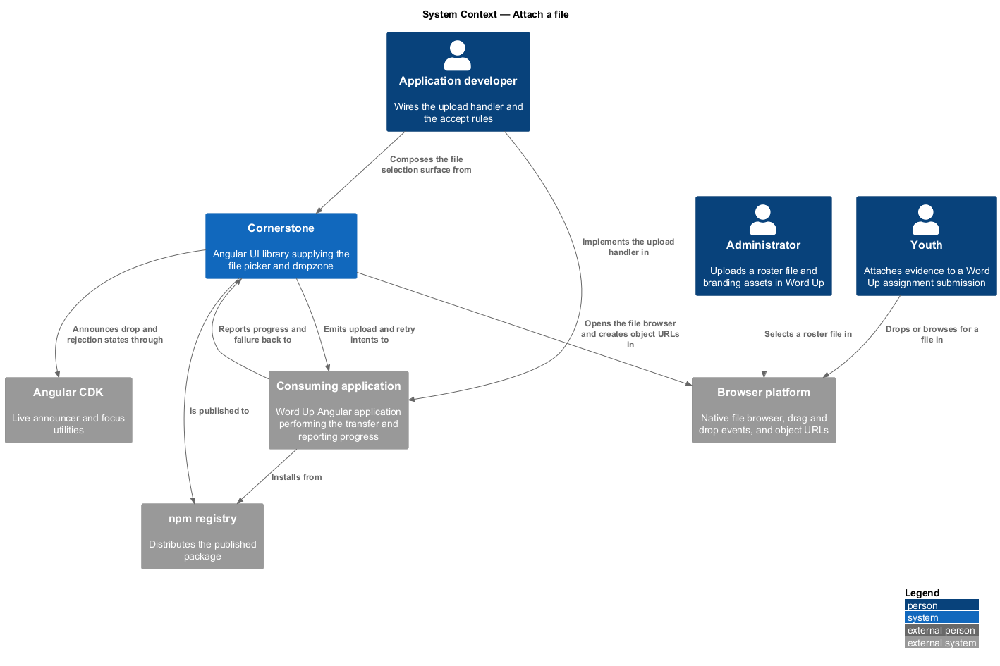
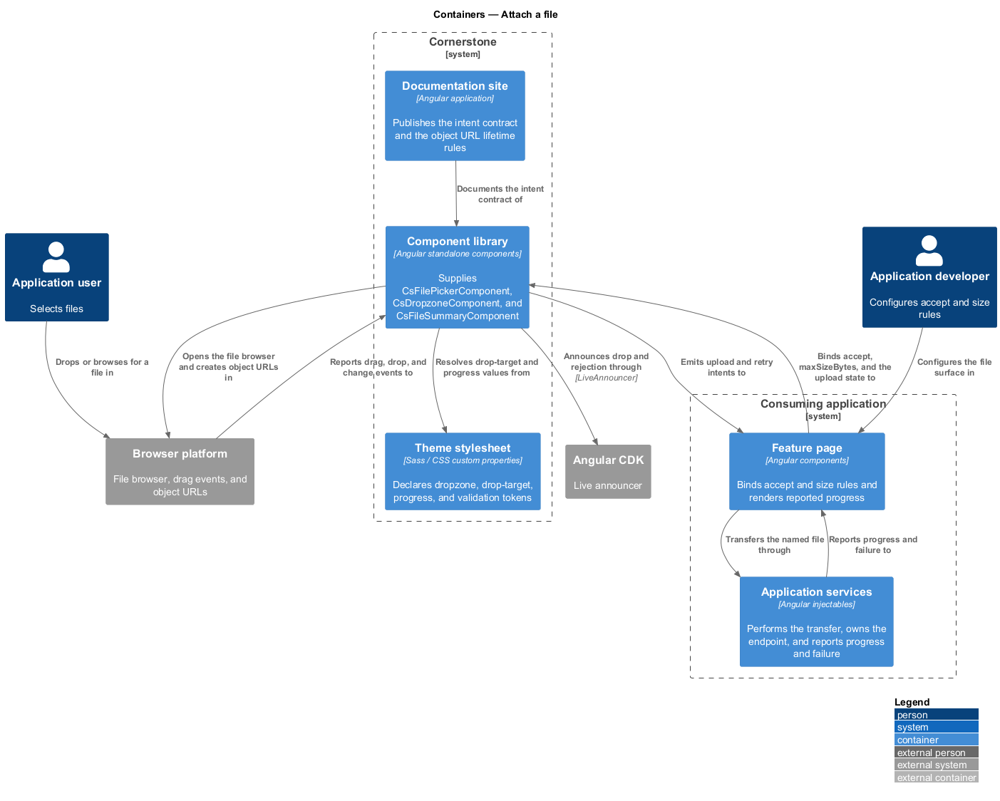
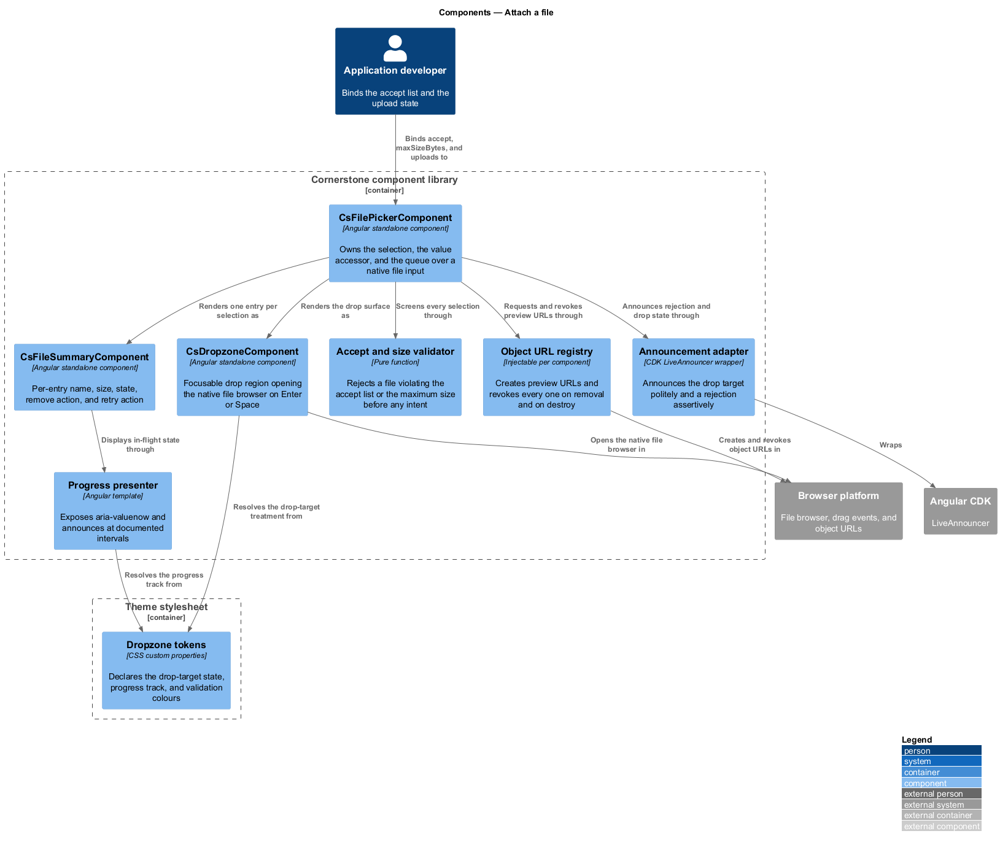
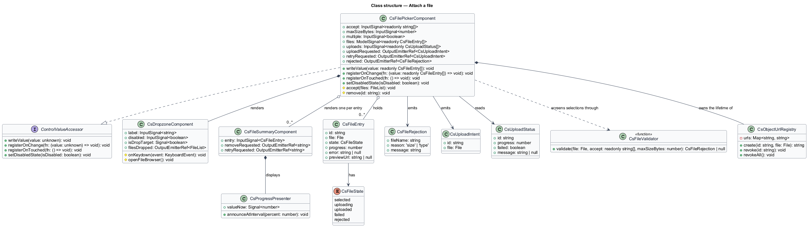
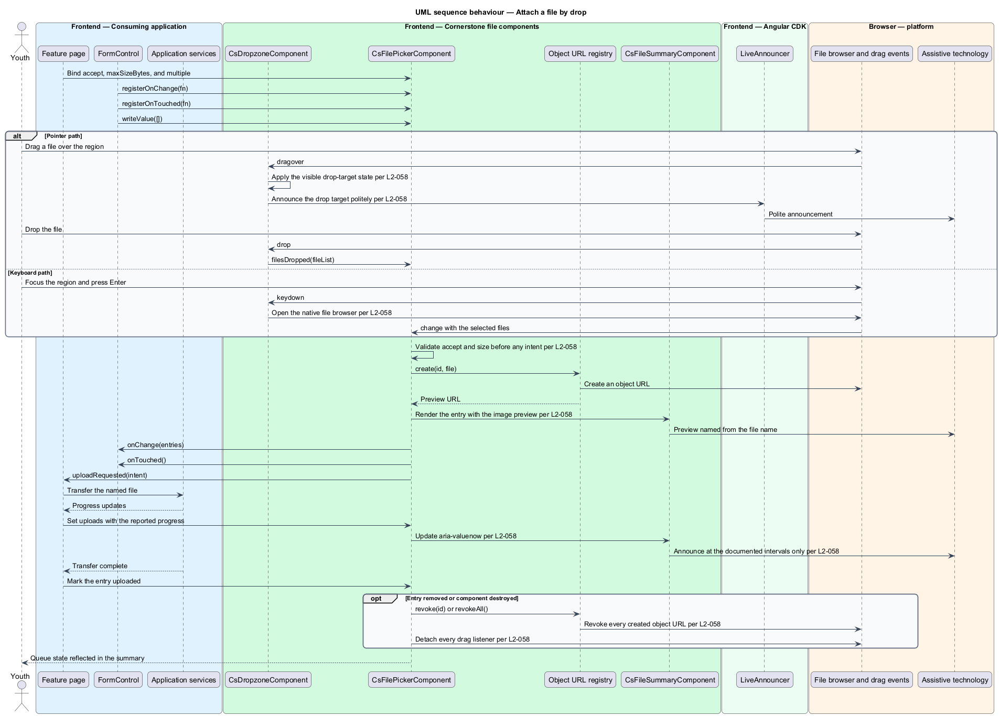
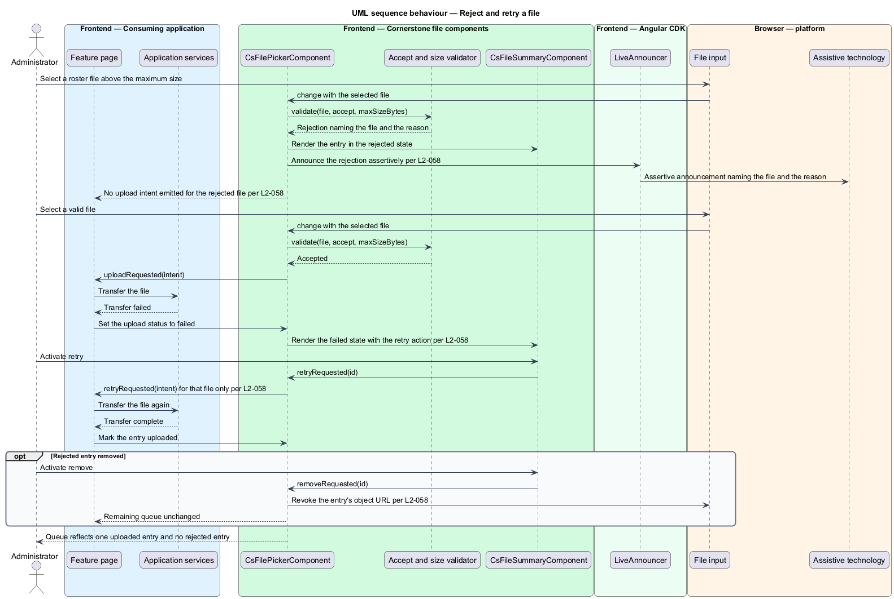

# Attach a file

## Overview

Cornerstone is the Angular user-interface library published as `@quinntyne/cornerstone`.
It supplies the components that the Liturgy and Word Up applications compose
their screens from. This feature covers the file-selection surface of the actions
and form controls suite: choosing files by browse or by drop, validating them
before any transfer starts, and presenting their progress and preview.

**dropzone** — bounded region accepting files dragged from the operating system
and reachable by keyboard

**accept list** — set of MIME types and file extensions a control admits

**upload intent** — typed output naming one file the application shall transfer

**object URL** — browser-scoped reference to file content, used to render a
preview and revoked when the preview ends

Word Up uses the slice for roster imports, assignment submissions, evidence
attachments, and branding uploads. The catalog names those four surfaces. Liturgy
uses no file selection at present, so the components are designed against Word Up
alone and stay domain-neutral.

The slice performs no transfer. Cornerstone holds no HTTP client, so the
components validate the selection, present the queue, and emit intents; the
application performs the upload and reports progress and failure back through
inputs. That division keeps authorization, endpoint choice, retry policy, and
storage entirely in the application.

**value accessor** — object implementing Angular's `ControlValueAccessor`, which
transports a value between a form control and the rendered control

`FilePickerComponent` holds the selected file list as its value and implements
that interface. Its inner `<input type="file">` participates in native form
submission (L2-063) when the application submits the form natively.

## Description

The feature is two components over one validation and preview core. The dropzone
is the drop surface; the picker is the complete control that owns the selection,
the queue, and the states.

- **`FilePickerComponent`** — element component with the `cs-file-picker`
  selector wrapping a native `<input type="file">`. It carries the `accept`
  input, the `maxSizeBytes` input, the `multiple` input, the `files` model
  holding the selected entries, and the `uploads` input carrying the per-file
  progress and failure the application reports. It emits the `uploadRequested`
  output and the `retryRequested` output, each naming one file.
- **`DropzoneComponent`** — element component with the `cs-dropzone` selector.
  It renders a bounded drop region with the browse action inside it. A drag over
  the region applies a visible drop-target state and announces the drop target
  politely. The region is focusable, and `Enter` or `Space` opens the native file
  browser, so a keyboard-only user reaches the same selection path as a pointer
  user.
- **Validation** — a file exceeding `maxSizeBytes` or violating `accept` is
  rejected before any intent is emitted. The rejection announces assertively and
  names both the file and the reason. No `uploadRequested` output is emitted for
  a rejected file.
- **`FileSummaryComponent`** — element component with the `cs-file-summary`
  selector presenting one selected entry: its name, its size, its state, its
  remove action, and its retry action when the state is `failed`. Activating
  retry emits `retryRequested` for that entry alone.
- **Preview** — a selected image renders through an object URL with an accessible
  name derived from the file name. A document renders the documented type icon
  and label instead. Every object URL created is revoked on removal and on
  destroy.
- **Progress** — an in-flight entry renders a progress element exposing
  `aria-valuenow`. The percentage announces at the documented intervals rather
  than on every update, so a fast upload produces a bounded number of
  announcements.
- **Destruction** — destroying the component mid-upload revokes every object URL
  it created and detaches every listener it attached, so no drag listener and no
  object URL outlive the component.
- **`FileEntry`** — type describing one selection: the `File`, a stable `id`,
  the `state`, the `progress` percentage, and the `error` when present.
- **`CsFileState`** — union type of the entry states: `'selected' | 'uploading' |
  'uploaded' | 'failed' | 'rejected'`.
- **`FileRejection`** — type naming the rejected file and the reason
  (`size` or `type`).
- **`CsUploadIntent`** — type carried by the `uploadRequested` and
  `retryRequested` outputs, holding the entry `id` and its `File`.

The exact progress announcement intervals, expressed as percentage steps, are
`<TO SUPPLY>`.

## Requirements

The feature realizes the following level-2 (L2) requirements. Each L2 requirement
refines a level-1 (L1) requirement, cited by identifier.

| L2 ID | Refines (L1) | Requirement |
|-------|--------------|-------------|
| `L2-058` | `L1-008` | The library shall provide browse and drag-drop file selection with accept and size validation, a selected-file summary, remove and retry actions, upload progress display, and image or document preview. |

## Diagrams

### System context

An application developer wires the upload handler and an application user selects
files from the operating system. Cornerstone validates and presents; the browser
supplies the file browser, the drag events, and the object URLs.

### Containers

The feature page receives the upload intent and reports progress back as an
input. No transfer crosses the Cornerstone boundary, because the library holds no
HTTP client.

### Components

`DropzoneComponent` owns the drop surface and the keyboard path to the file
browser. `FilePickerComponent` owns the selection, the validator, the object
URL registry, and the per-entry summary.

### Class structure

`FilePickerComponent` realizes `ControlValueAccessor` over a list of
`FileEntry`. The object URL registry is composed into the picker so its
lifetime ends with the component.

### Behaviour — attach a file by drop

The user drags a file over the dropzone, the picker validates it, registers an
object URL for the preview, and emits an upload intent. The application reports
progress back through an input.

### Behaviour — reject and retry a file

An oversized file is rejected before any intent is emitted, and a failed upload
is retried for that entry alone without disturbing the rest of the queue.

