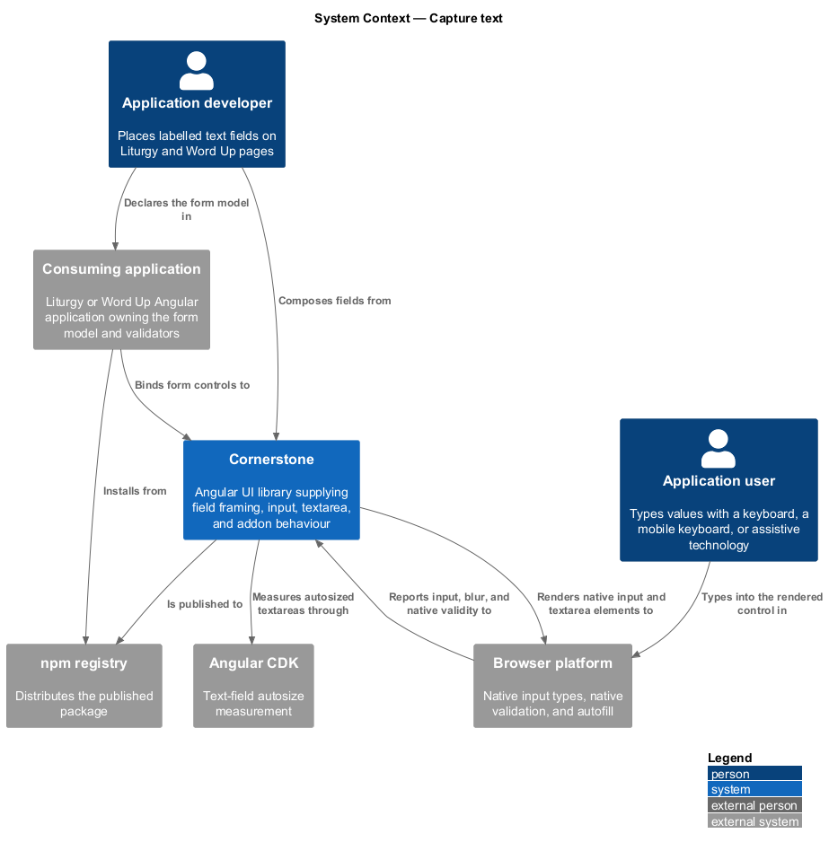
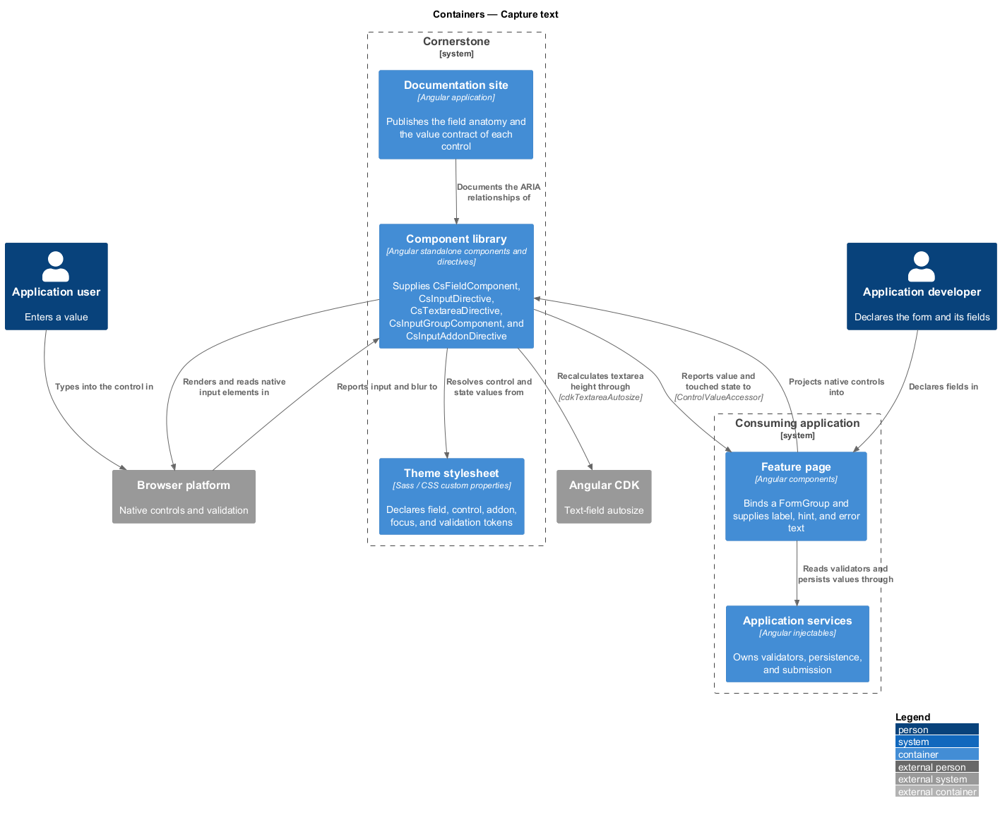
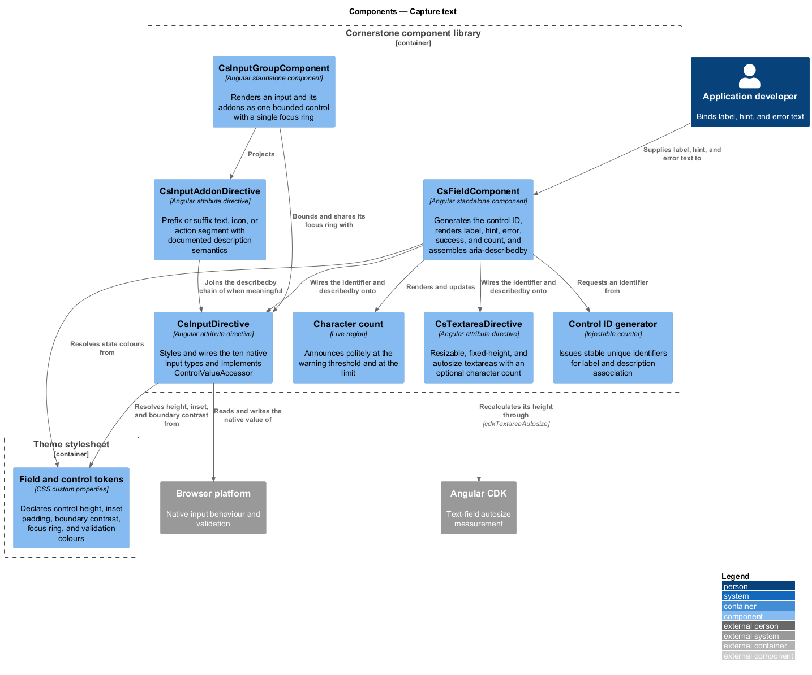
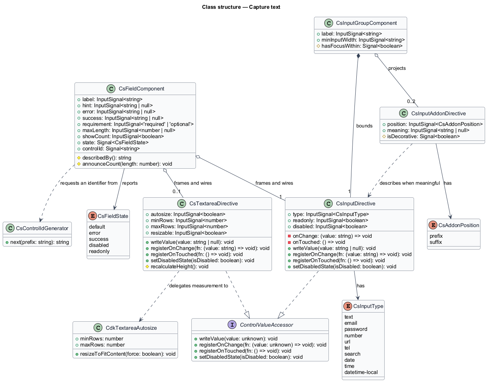
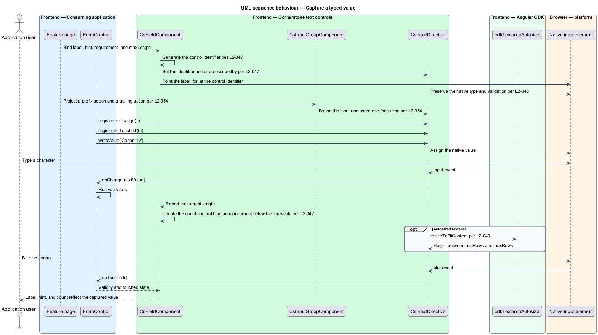
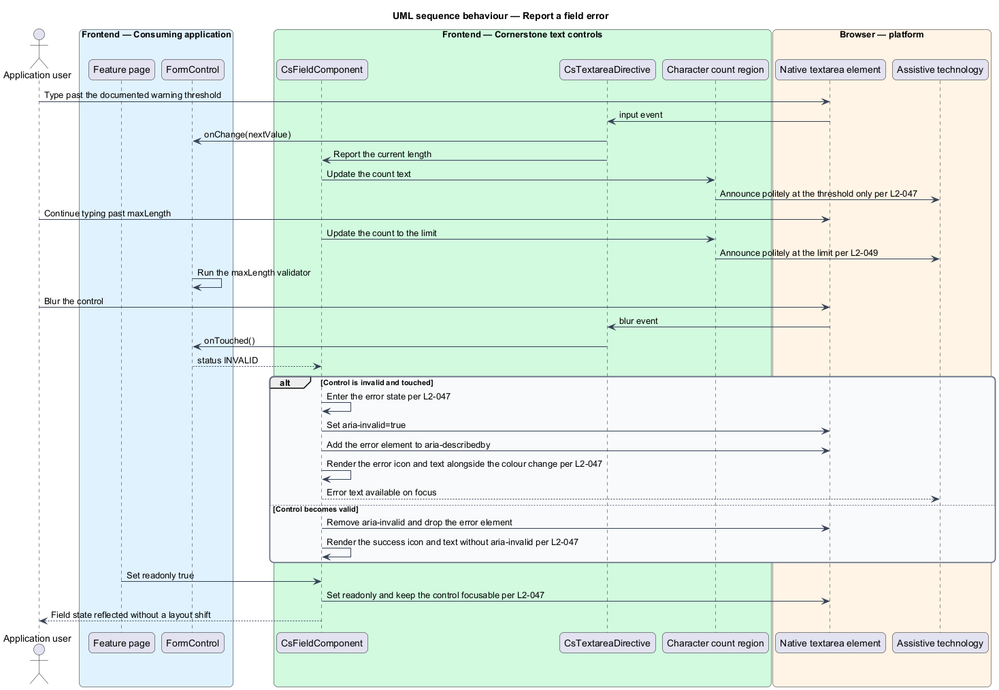

# Capture text

## Overview

Cornerstone is the Angular user-interface library published as `@quinntyne/cornerstone`.
It supplies the components that the Liturgy and Word Up applications compose
their screens from. This feature covers the text-entry surface of the actions and
form controls suite: the framing that explains a control, the native inputs that
carry a typed value, and the connected addons that qualify one.

**field** — framing around one control carrying its label, requirement marker,
hint, error, success indication, and character count

**control ID wiring** — generation and propagation of the identifier that binds a
label and its descriptions to the control they describe

**addon** — text, icon, or action segment connected to an input's leading or
trailing edge inside one bounded group

**autosize** — mode in which a textarea's height tracks its content between a
minimum and a maximum row count

Text capture is the most repeated interaction in both applications. Liturgy uses
it for project names, movement notes, and member details. Word Up uses it for
authentication, onboarding, announcement authoring, assignment submissions, and
every administrative record form. Placing the framing in one component means each
page states its label, hint, and error as data rather than rebuilding the ARIA
relationships that connect them.

The slice is native-first. Every value in it rides on a native `<input>` or
`<textarea>` element, so native validation, native mobile keyboards, password
manager autofill, and native form submission (L2-063) all continue to work. The
Cornerstone directives add styling, state presentation, and the Angular forms
contract; they replace no native behaviour.

**value accessor** — object implementing Angular's `ControlValueAccessor`, which
transports a value between a form control and the rendered element

## Description

The feature is a framing component, two host directives over native elements, and
a connected-group pair. The field owns the identifiers and the ARIA
relationships; the directives own presentation and the value contract.

- **`FieldComponent`** — element component with the `cs-field` selector. It
  carries the `label` input, the `hint` input, the `error` input, the `success`
  input, the `requirement` input (`required` or `optional`), the `maxLength`
  input, and the `showCount` input. It projects one control, generates an ID when
  the projected control declares none, points the label's `for` at that ID, and
  assembles `aria-describedby` from the hint, error, and count elements in
  document order.
- **`FieldComponent` state presentation** — the error state sets
  `aria-invalid="true"` on the projected control and distinguishes the message by
  icon and text as well as colour. The success state indicates by icon and text
  and sets no `aria-invalid`. The read-only state leaves the control focusable
  and copyable. The requirement marker is never the sole indicator; the control
  also carries `required` or `aria-required="true"`.
- **`FieldComponent` character count** — the count reads the control's current
  length against `maxLength` and announces politely at the documented warning
  threshold and at the limit only, not on every keystroke.
- **`CsInputDirective`** — attribute directive with the `[csInput]` selector,
  applied to a native `<input>`. It supports the `text`, `email`, `password`,
  `number`, `url`, `tel`, `search`, `date`, `time`, and `datetime-local` types
  and retains the native type on the host. It implements `ControlValueAccessor`
  and registers through `NG_VALUE_ACCESSOR`, writing the value to the host
  element and reporting input and blur back to the form control.
- **`CsInputDirective` presentation** — prefix and suffix content is inset so it
  never overlaps the caret at any supported size, and activating it moves focus
  to the input. The disabled and read-only presentations keep a boundary contrast
  ratio of at least 3:1. No value is echoed to the DOM as an attribute, and the
  documented autofill attributes are preserved.
- **`CsTextareaDirective`** — attribute directive with the `[csTextarea]`
  selector, applied to a native `<textarea>`. It carries the `autosize` input,
  the `minRows` input, the `maxRows` input, and the `resizable` input. In
  autosize mode it delegates measurement to the CDK `cdkTextareaAutosize`
  directive, grows to `maxRows`, and then scrolls internally. It recalculates
  height in the same change detection cycle in which a value is written
  programmatically. It implements `ControlValueAccessor` on the same contract as
  `CsInputDirective`.
- **`InputGroupComponent`** — element component with the `cs-input-group`
  selector. It renders one input and its addons as one bounded control, draws a
  single focus ring around the whole group when the inner input takes focus, and
  keeps the input at the documented minimum usable width when addon text is long.
- **`InputAddonDirective`** — attribute directive with the `[csInputAddon]`
  selector. It carries the `position` input (`prefix` or `suffix`) and the
  `meaning` input. A meaningful addon joins the input's `aria-describedby`; a
  decorative addon is hidden from assistive technology. A long addon truncates
  visually while its full text remains available to assistive technology.
- **`FieldState`** — union type of the field states: `'default' | 'error' |
  'success' | 'disabled' | 'readonly'`.
- **`CsInputType`** — union type of the ten supported native input types.
- **`AddonPosition`** — union type of the two addon positions: `'prefix' |
  'suffix'`.

A trailing action button inside an input group is an ordinary `CsButtonDirective`
host. Pressing `Enter` in the input triggers the form's default submit exactly
once; the group adds no second submit path.

The exact character-count warning threshold, expressed as a proportion of
`maxLength`, is `<TO SUPPLY>`.

## Requirements

The feature realizes the following level-2 (L2) requirements. Each L2 requirement
refines a level-1 (L1) requirement, cited by identifier.

| L2 ID | Refines (L1) | Requirement |
|-------|--------------|-------------|
| `L2-047` | `L1-008` | The library shall provide field framing with a label, a required or optional marker, hint, error, success, and character count, wiring the control ID and the ARIA relationships and reflecting the disabled and read-only states. |
| `L2-048` | `L1-008` | The library shall style and wire native inputs of type text, email, password, number, url, tel, search, date, time, and datetime-local, and shall support prefix and suffix content. |
| `L2-049` | `L1-008` | The library shall provide resizable and fixed-height textareas with an autosize mode backed by the CDK text field and an optional character count. |
| `L2-054` | `L1-008` | The library shall provide connected prefix and suffix addons for text or icon content and connected submit or action buttons. |

## Diagrams

### System context

An application developer places text fields on a page and an application user
types into them. Cornerstone draws its autosize measurement from Angular CDK and
leaves native validation and native keyboards to the browser.

### Containers

The feature page binds a reactive form to the controls the component library
supplies. The theme stylesheet declares the field, input, and addon tokens; the
application services never see the rendered element.

### Components

`FieldComponent` generates the identifier and assembles the described-by chain.
`CsInputDirective` and `CsTextareaDirective` implement the value accessor over
their native hosts, and `InputGroupComponent` binds addons to the same input.

### Class structure

Both host directives realize `ControlValueAccessor`. `FieldComponent` composes
one projected control and the description elements that reference it, and
`InputGroupComponent` aggregates the addons attached to that control.

### Behaviour — capture a typed value

The form writes an initial value through the accessor, the field wires the label
and descriptions to the control, and each keystroke reports back to the form
control. Blur marks the control touched.

### Behaviour — report a field error

The control fails validation after blur. The field switches to the error state,
sets `aria-invalid`, and moves the error message into the described-by chain
without disturbing the hint.

