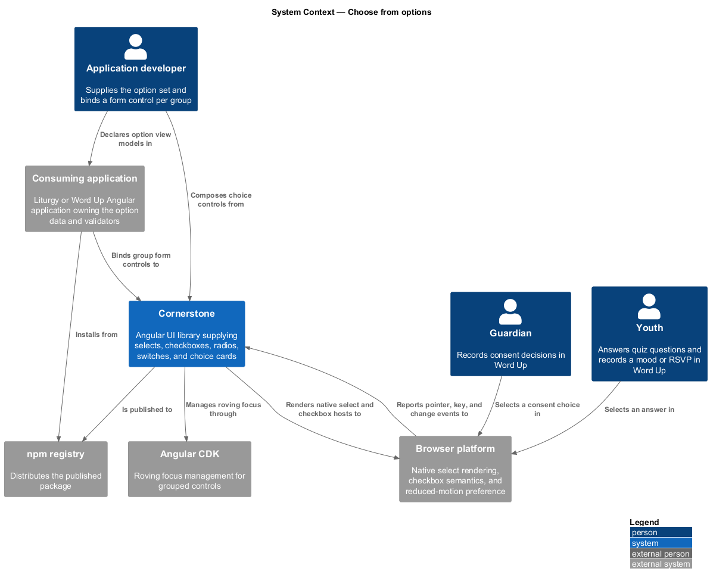
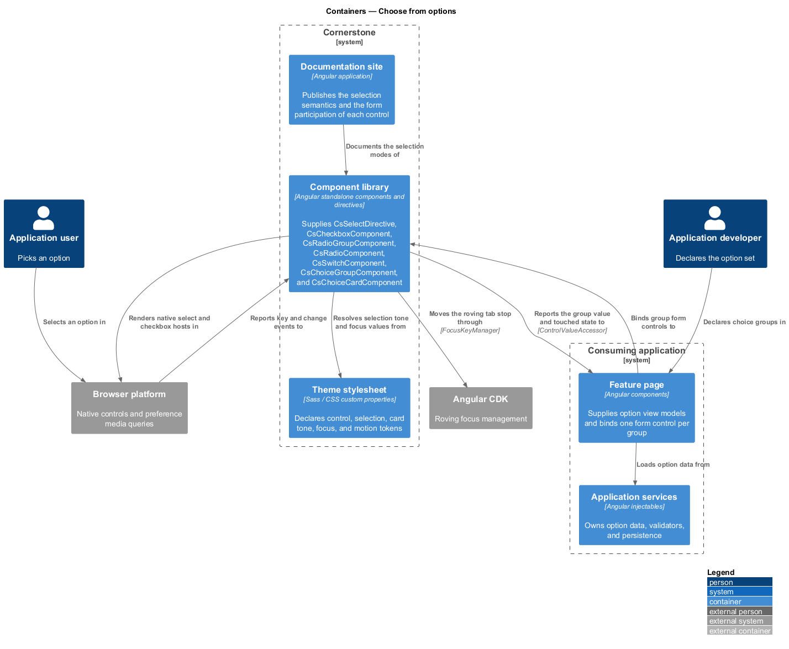
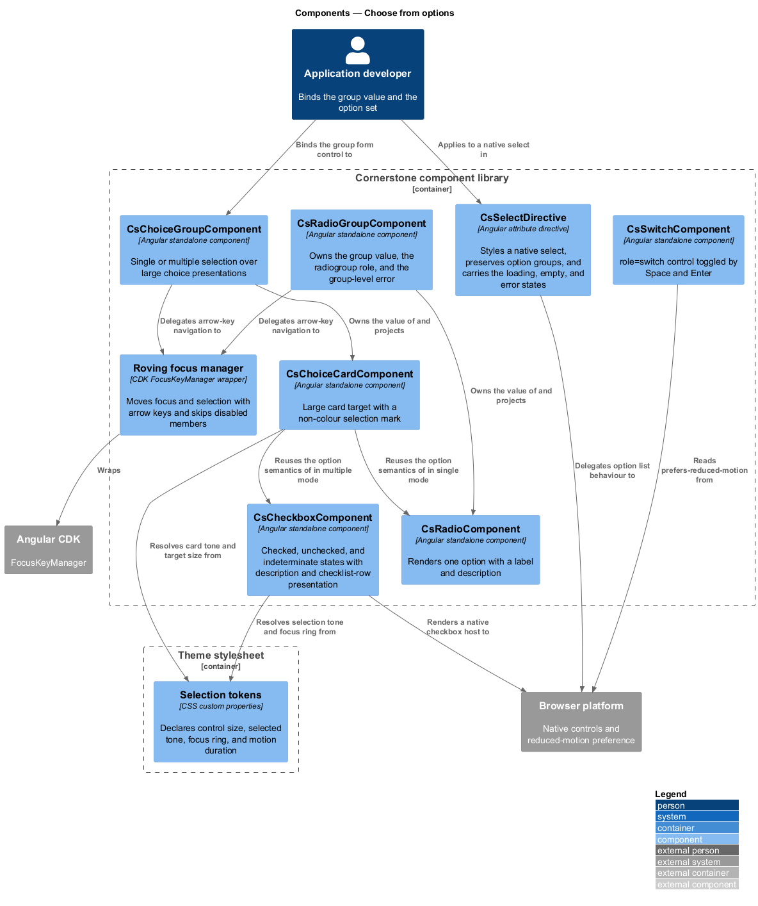
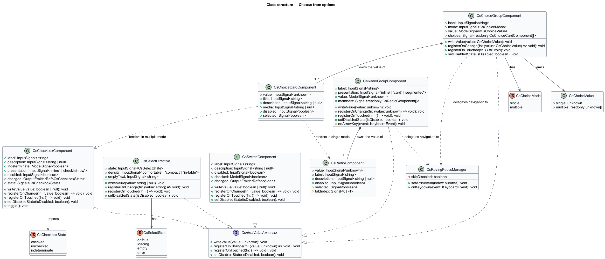
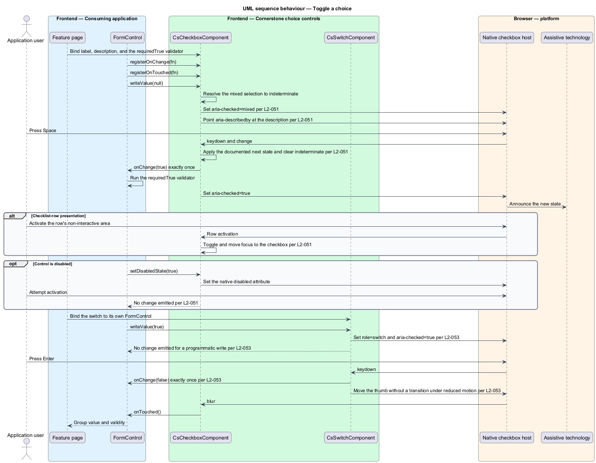
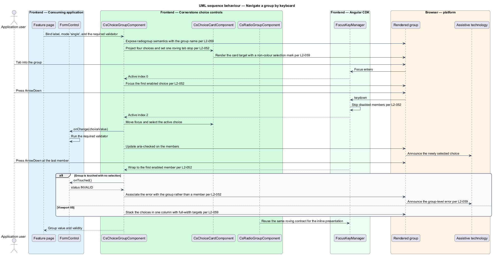

# Choose from options

## Overview

Cornerstone is the Angular user-interface library published as `@quinntyne/cornerstone`.
It supplies the components that the Liturgy and Word Up applications compose
their screens from. This feature covers the part of the actions and form controls
suite in which a person picks from a bounded set of values that the screen
already shows: selects, checkboxes, radio groups, switches, and choice cards.

**option** — one selectable value presented inside a control

**indeterminate state** — checkbox presentation standing for a mixed selection
among the items the checkbox summarises

**roving tab stop** — arrangement in which one member of a group holds the tab
stop and arrow keys move both focus and selection within the group

**choice card** — large selectable region presenting one option with a title, a
description, and a non-colour selection mark

Liturgy uses the slice for assignee selection, requirement checklists, filter
toggles, and settings switches. Word Up uses it for quiz answers, RSVP replies,
mood and attendance capture, announcement audience targeting, and guardian
consent decisions. The catalog names the choice-card presentation as the shared
form behind those six Word Up surfaces.

The slice divides on one line. `CsSelectDirective` decorates a native `<select>`,
so the browser owns the option list, its keyboard behaviour, and its mobile
presentation. The remaining controls own their own rendering because no native
element carries the description, card layout, and group validation those surfaces
need.

**value accessor** — object implementing Angular's `ControlValueAccessor`, which
transports a value between a form control and the rendered control

Every value-bearing control in the slice implements that interface. The select
and the checkbox also participate in native form submission through their native
hosts (L2-063); the radio group, the switch, and the choice group state their
Angular-only participation in their documentation.

## Description

The feature is one host directive over a native element and six components. Each
component owns its value, its keyboard contract, and its group-level validation
association.

- **`CsSelectDirective`** — attribute directive with the `[csSelect]` selector,
  applied to a native `<select>`. It preserves `<optgroup>` labels for assistive
  technology and carries the `state` input covering `default`, `loading`,
  `empty`, and `error`. The loading state disables the control and exposes
  `aria-busy="true"`. The empty state renders the documented empty option text
  and reports no selectable value. The error state sets `aria-invalid="true"`
  without altering native option behaviour.
- **`CsSelectDirective` variants** — the `density` input selects `comfortable`,
  `compact`, or `in-table`. The compact and in-table variants stay at least 44 px
  tall at viewport XS and never overflow their table cell.
- **`CheckboxComponent`** — element component with the `cs-checkbox` selector
  wrapping a native `<input type="checkbox">`. It carries the `label` input, the
  `description` input, the `indeterminate` model, the `presentation` input
  (`inline` or `checklist-row`), and the `disabled` input. `Space` toggles it and
  emits the change exactly once. The indeterminate state exposes
  `aria-checked="mixed"` and clears on activation. The description is referenced
  by `aria-describedby` and stays out of the accessible name.
- **`CheckboxComponent` checklist row** — in the `checklist-row` presentation,
  activating the row's non-interactive area toggles the checkbox and moves focus
  to it, so the whole row behaves as one target.
- **`RadioGroupComponent`** — element component with the `cs-radio-group`
  selector. It exposes `role="radiogroup"` with an accessible name from its
  required `label` input, owns the value and the form binding for the whole
  group, and associates any group-level error with the group rather than with a
  member.
- **`RadioComponent`** — element component with the `cs-radio` selector. It
  carries the `value` input, the `label` input, the `description` input, and the
  `disabled` input. The group keeps one roving tab stop; `ArrowDown` and
  `ArrowRight` move focus to the next enabled member and select it, wrapping at
  the end, and skip disabled members.
- **`SwitchComponent`** — element component with the `cs-switch` selector. It
  exposes `role="switch"` with `aria-checked`, toggles on `Space` and `Enter`,
  and emits the change exactly once. A programmatic `setValue` updates the
  rendered state and emits nothing back to the form control. Under
  `prefers-reduced-motion: reduce` the thumb position changes without a
  transition.
- **`ChoiceGroupComponent`** — element component with the `cs-choice-group`
  selector. Its `mode` input selects `single` or `multiple`. In `single` mode it
  exposes radio-group semantics; in `multiple` mode it exposes a labelled group
  of checkboxes. It owns the value, the required validation, and the group-level
  error announcement.
- **`ChoiceCardComponent`** — element component with the `cs-choice-card`
  selector. It carries the `value` input, the `title` input, the `description`
  input, the `media` input, and the `disabled` input. Activating any part of the
  card toggles the choice and moves focus to the underlying control. A selected
  card shows a check mark or equivalent non-colour affordance in addition to its
  tone. At viewport XS the group stacks in one column with full-width targets.
- **`CsSelectState`** — union type of the select states: `'default' | 'loading' |
  'empty' | 'error'`.
- **`CsCheckboxState`** — union type of the checkbox states: `'checked' |
  'unchecked' | 'indeterminate'`.
- **`ChoiceMode`** — union type of the choice modes: `'single' | 'multiple'`.
- **`CsChoiceValue<T>`** — generic value type the choice group emits, single for
  `single` mode and an array for `multiple` mode.

The documented next state for an indeterminate checkbox on activation is
`checked`, and activation clears the indeterminate flag.

The exact card minimum height at viewport XS, in CSS pixels, is `<TO SUPPLY>`.

## Requirements

The feature realizes the following level-2 (L2) requirements. Each L2 requirement
refines a level-1 (L1) requirement, cited by identifier.

| L2 ID | Refines (L1) | Requirement |
|-------|--------------|-------------|
| `L2-050` | `L1-008` | The library shall style native single selects with option group support and shall provide the empty, loading, error, compact form, and in-table variants. |
| `L2-051` | `L1-008` | The library shall provide a checkbox supporting the checked, unchecked, and indeterminate states, validation, descriptive supporting content, the disabled state, and a checklist-row presentation, with full forms integration. |
| `L2-052` | `L1-008` | The library shall provide a keyboard-managed radio group with descriptions, validation, the disabled state, and card or segmented choice presentations, with forms integration on the group. |
| `L2-053` | `L1-008` | The library shall provide a switch with a label and description, the disabled state, validation, and full `ControlValueAccessor` integration. |
| `L2-059` | `L1-008` | The library shall provide large radio and checkbox choice presentations for quiz answers, RSVP, mood, attendance, audience, and consent decisions, with single and multiple selection modes. |

## Diagrams

### System context

An application developer supplies the option set and an application user picks
from it. Cornerstone draws its roving focus behaviour from Angular CDK and leaves
the native select's option list to the browser.

### Containers

The feature page supplies option view models and binds a form control per group.
The component library renders the controls and reports selection back through the
value accessor.

### Components

`CsSelectDirective` decorates the native select. `RadioGroupComponent` and
`ChoiceGroupComponent` own the group value and the roving tab stop, while
`RadioComponent` and `ChoiceCardComponent` render one option each.

### Class structure

The four value-owning types realize `ControlValueAccessor`. Each group composes
its members and holds the validation the members report against.

### Behaviour — toggle a choice

The form writes an indeterminate value, the checkbox exposes the mixed state, and
activation resolves it to the documented next state and reports back to the form
control exactly once.

### Behaviour — navigate a group by keyboard

The user tabs into a choice group and moves through it with arrow keys. Focus and
selection move together, disabled members are skipped, and the group-level error
is announced against the group.

