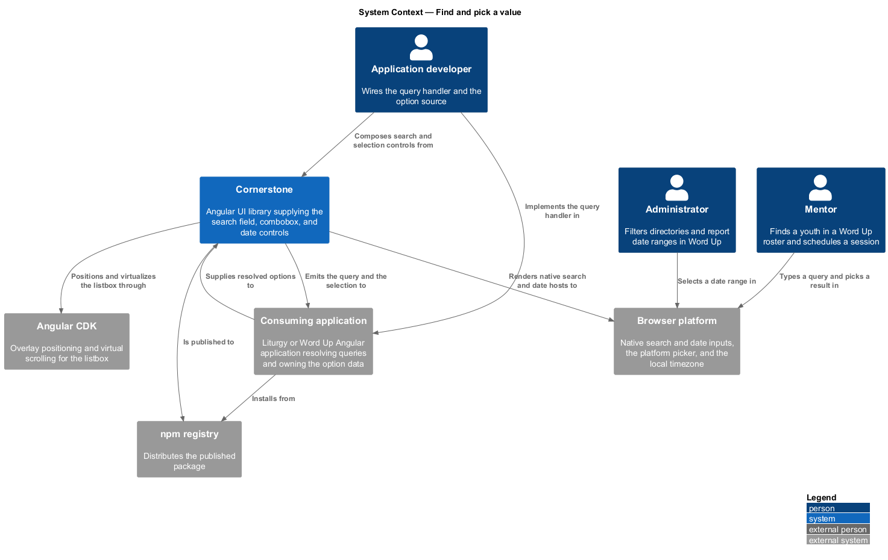
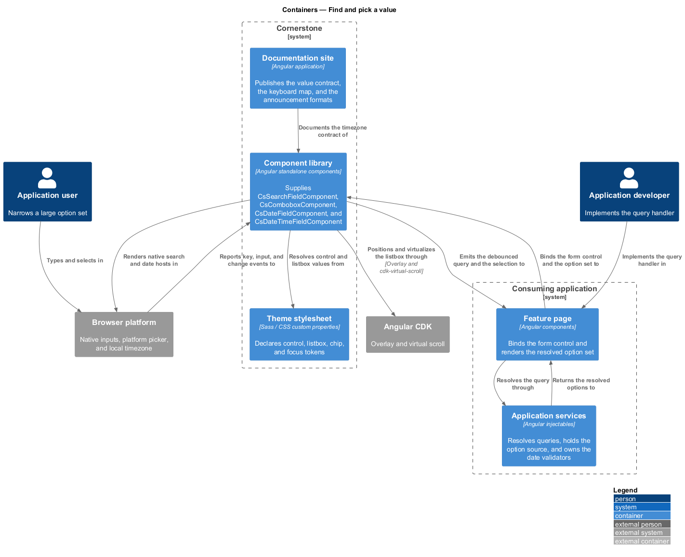
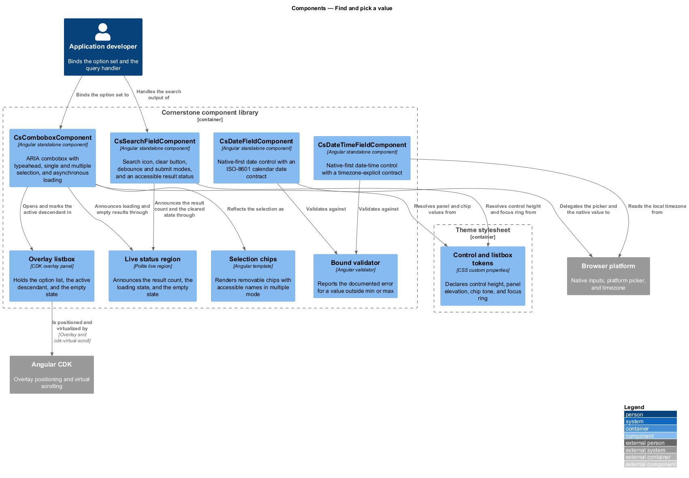
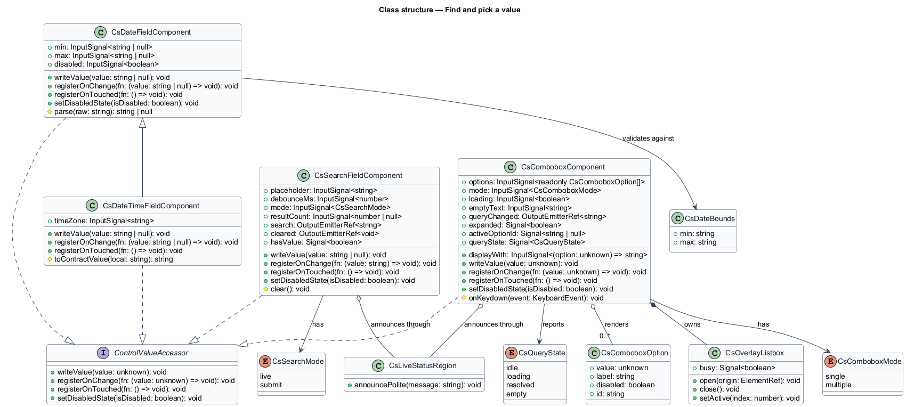
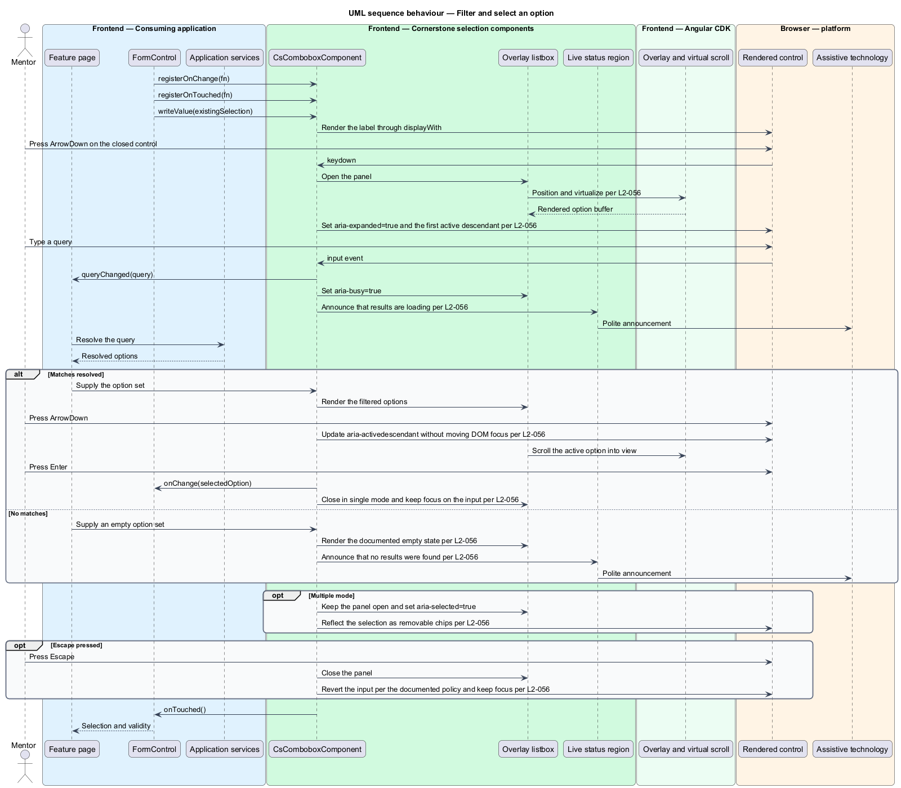
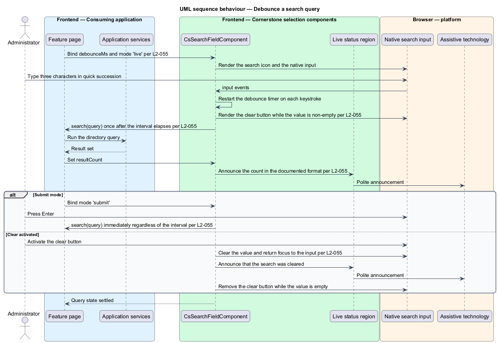
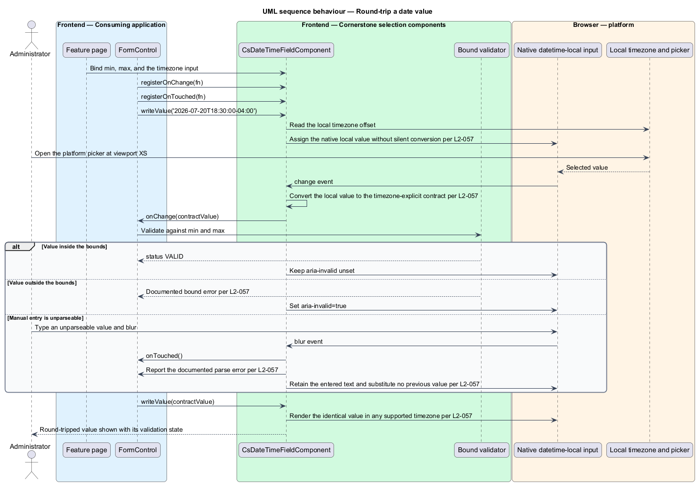

# Find and pick a value

## Overview

Cornerstone is the Angular user-interface library published as `@quinntyne/cornerstone`.
It supplies the components that the Liturgy and Word Up applications compose
their screens from. This feature covers the controls in the actions and form
controls suite whose option set is too large, too remote, or too structured to
render in full: search, typeahead selection, and calendar values.

**typeahead** — progressive filtering of an option set against the characters
typed into the control

**active descendant** — option marked as current inside an open listbox while DOM
focus stays on the input

**debounce interval** — quiet period following the final keystroke that shall
elapse before the control emits a query

**value contract** — documented string form a control writes and reads,
independent of the viewer's locale and timezone

Word Up uses the search field across its directories, rosters, and reports; the
combobox for people and cohort selection; and the date controls for schedules,
report ranges, and announcement delivery times. Liturgy uses the search field in
its member list and the date controls in its project records.

The three controls share one problem: the value the user sees and the value the
form holds are not the same string. The search field emits a query rather than a
selection. The combobox holds a typed option while displaying its label. The date
controls hold an ISO-8601 string while displaying a locale-formatted date. Each
control states its contract explicitly rather than converting silently.

**value accessor** — object implementing Angular's `ControlValueAccessor`, which
transports a value between a form control and the rendered control

The date controls are native-first, so they participate in native form
submission (L2-063). The combobox renders its listbox in a CDK overlay outside
the form element and documents its Angular-only participation.

## Description

The feature is four components over two behaviour bases: a debounced query
emitter and an overlay-backed listbox.

- **`SearchFieldComponent`** — element component with the `cs-search-field`
  selector wrapping a native `<input type="search">`. It carries the
  `placeholder` input, the `debounceMs` input, the `mode` input (`live` or
  `submit`), and the `resultCount` input. It emits the `search` output carrying
  the query string.
- **`SearchFieldComponent` behaviour** — a clear button with an accessible name
  appears while the value is non-empty and is absent while it is empty.
  Activating it clears the value, returns focus to the input, and announces
  politely that the search was cleared. In `live` mode the `search` output emits
  once after `debounceMs` elapses following the final keystroke; in `submit` mode
  `Enter` emits immediately regardless of the interval. A change to `resultCount`
  announces the count politely in the documented format.
- **`ComboboxComponent<T>`** — element component with the `cs-combobox`
  selector implementing the ARIA combobox pattern. It carries the `options`
  input, the `displayWith` input, the `mode` input (`single` or `multiple`), the
  `loading` input, and the `emptyText` input. It emits the `queryChanged` output
  for asynchronous result loading and holds the selection through the value
  accessor.
- **`ComboboxComponent` keyboard contract** — `ArrowDown` on a closed control
  opens the listbox, sets `aria-expanded="true"`, and marks the first option as
  the active descendant. `ArrowDown` and `ArrowUp` move `aria-activedescendant`
  and scroll the active option into view while DOM focus stays on the input.
  `Enter` selects the active option and, in `single` mode, closes the listbox
  with focus still on the input. `Escape` closes the listbox, reverts the input
  per the documented policy, and keeps focus on the input.
- **`ComboboxComponent` query debounce** — the `queryChanged` output follows the
  same debounce contract the search field states (L2-055), so one query reaches
  the application after the interval elapses following the final keystroke.
- **`ComboboxComponent` multiple mode** — selecting an option keeps the listbox
  open, sets `aria-selected="true"` on the option, and reflects the selection as
  removable chips with accessible names.
- **`ComboboxComponent` loading and empty states** — an in-flight query sets
  `aria-busy="true"` on the listbox and announces politely that results are
  loading. A resolved query with no matches renders the documented empty state
  inside the listbox and announces politely that no results were found.
- **`ComboboxComponent` scale** — the listbox renders through CDK virtual
  scrolling, so an option set of 5,000 entries renders only the documented
  buffer, and open-to-paint time stays inside the budget stated by L2-161.
- **`DateFieldComponent`** — element component with the `cs-date-field`
  selector wrapping a native `<input type="date">` by default. Its value contract
  is an ISO-8601 calendar date string with no timezone conversion applied. It
  carries the `min` input, the `max` input, and the `disabled` input.
- **`DateTimeFieldComponent`** — element component with the `cs-date-time-field`
  selector wrapping a native `<input type="datetime-local">`. Its value contract
  is timezone-explicit, so a written value read back is identical in every
  supported browser timezone, including a timezone with a fractional-hour offset.
- **Date validation** — a value outside `min` or `max` reports the documented
  bound error and sets `aria-invalid="true"`. An unparseable manual entry reports
  the documented parse error on blur and substitutes no previous value silently.
  At viewport XS the field is at least 44 px tall and the platform picker remains
  reachable.
- **`SearchMode`** — union type of the search modes: `'live' | 'submit'`.
- **`ComboboxMode`** — union type of the selection modes: `'single' |
  'multiple'`.
- **`DateBounds`** — type holding the `min` and `max` ISO-8601 strings.
- **`CsQueryState`** — union type of the query states: `'idle' | 'loading' |
  'resolved' | 'empty'`.

The exact `Escape` revert policy for a combobox with an uncommitted typed query
is `<TO SUPPLY>`, and the rendered virtual-scroll buffer size in options is
`<TO SUPPLY>`.

## Requirements

The feature realizes the following level-2 (L2) requirements. Each L2 requirement
refines a level-1 (L1) requirement, cited by identifier.

| L2 ID | Refines (L1) | Requirement |
|-------|--------------|-------------|
| `L2-055` | `L1-008` | The library shall provide a search field with a search icon, a clear button, submit and debounce options, and an accessible result status. |
| `L2-056` | `L1-008` | The library shall provide a CDK-overlay combobox with typeahead autocomplete, single and multiple selection, asynchronous result loading, and an empty state, implementing the ARIA combobox pattern. |
| `L2-057` | `L1-008` | The library shall provide FaithTech-styled, native-first date and date-time controls with validation, minimum and maximum bounds, and a locale-safe, timezone-explicit value contract. |

## Diagrams

### System context

An application developer wires a query handler and an application user narrows a
large option set. Cornerstone positions the listbox through Angular CDK and reads
the platform date picker through the browser.

### Containers

The feature page answers the query the controls emit and supplies the resolved
options back to them. The component library owns the overlay, the keyboard
contract, and the announcements.

### Components

`SearchFieldComponent` debounces and announces. `ComboboxComponent` owns the
overlay listbox and the active-descendant contract. The two date components share
one value contract and one bound validator.

### Class structure

All four components realize `ControlValueAccessor`. The combobox composes an
overlay listbox and a virtual scroll viewport, and the date components share the
bounds type and the parse contract.

### Behaviour — filter and select an option

The user types into the combobox, the application resolves the query
asynchronously, and the user selects the active option by keyboard without DOM
focus leaving the input.

### Behaviour — debounce a search query

The user types continuously in a search field. One query emits after the interval
elapses, and the resulting count is announced politely once.

### Behaviour — round-trip a date value

The form writes an ISO-8601 value, the field renders it through the native
control, and an out-of-bounds entry reports the documented error rather than
being coerced.

