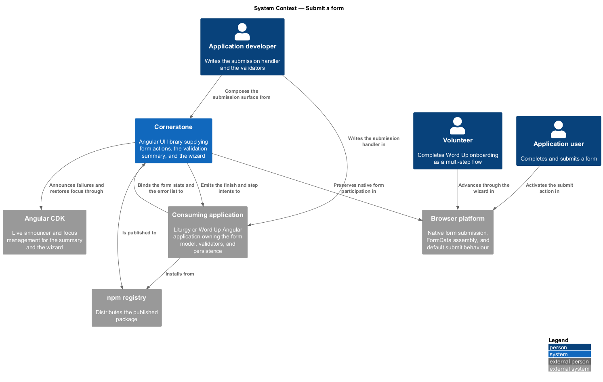
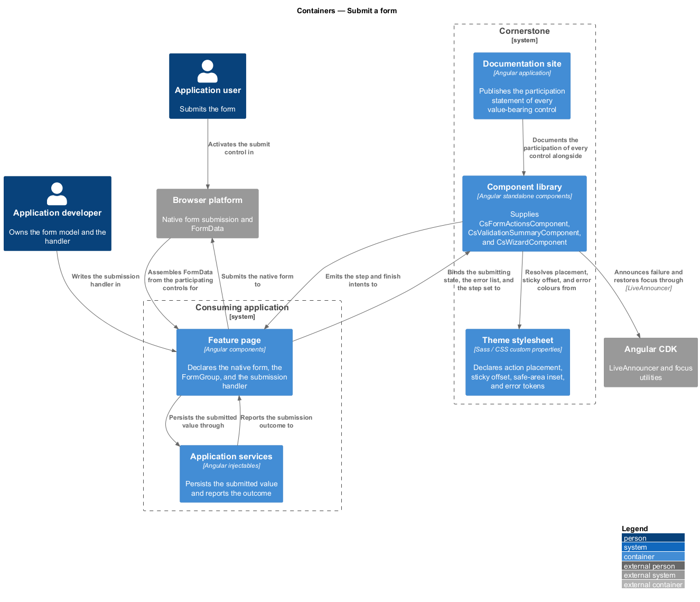
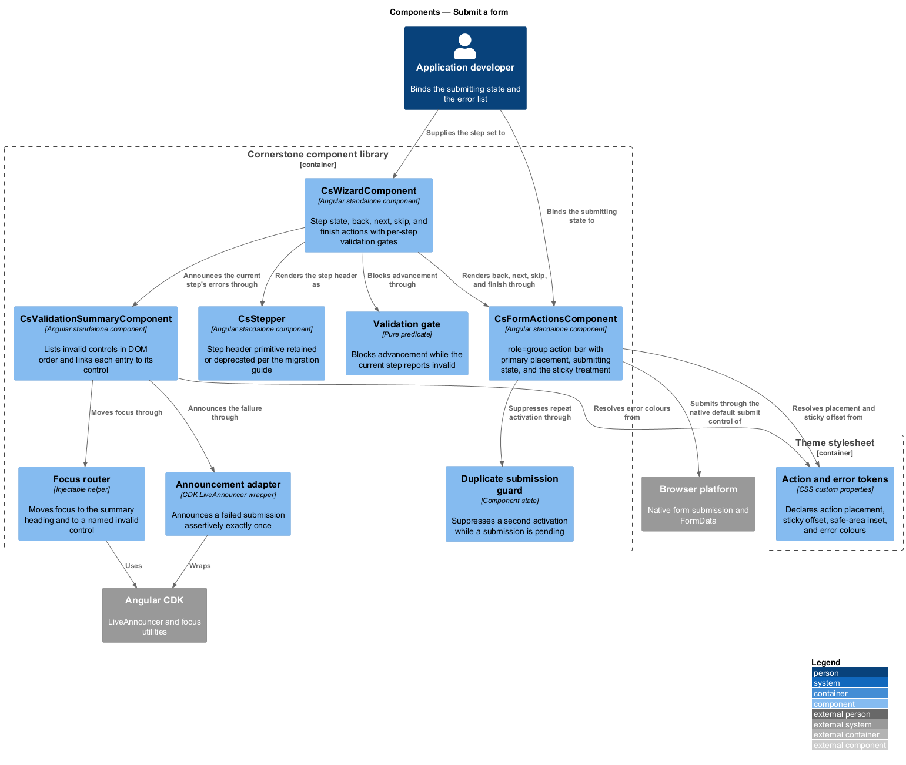
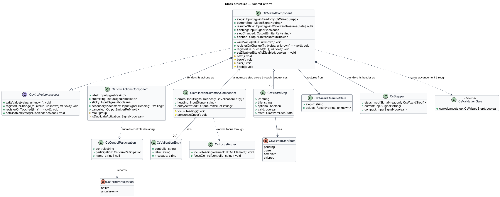
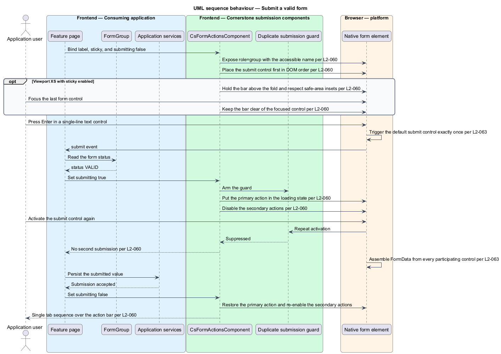
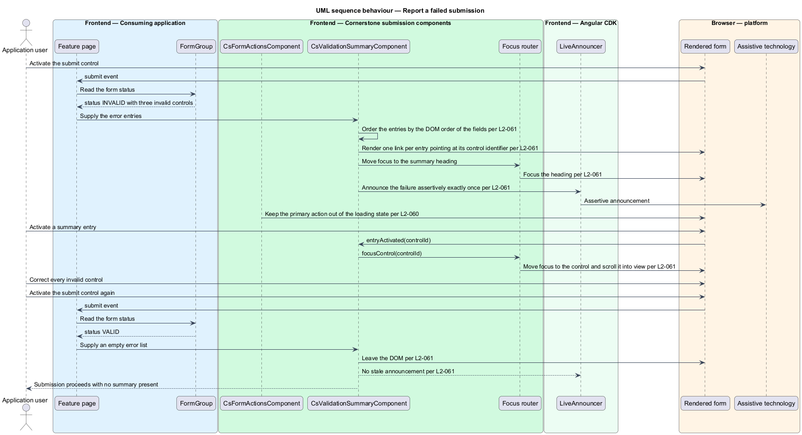
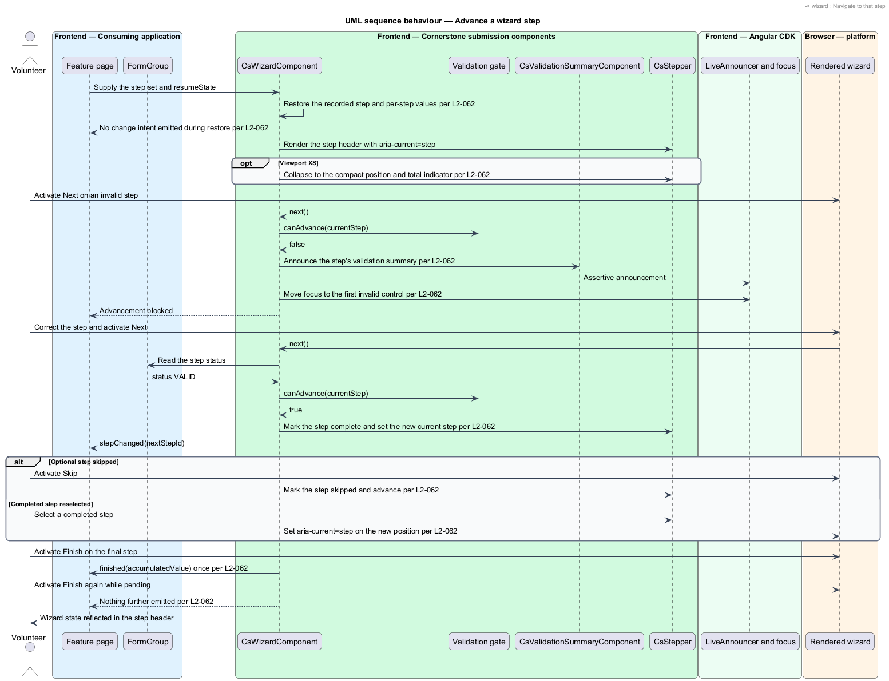

# Submit a form

## Overview

Cornerstone is the Angular user-interface library published as `@quinntyne/cornerstone`.
It supplies the components that the Liturgy and Word Up applications compose
their screens from. This feature covers the end of a form: where its actions sit,
what happens when validation fails, how a long form breaks into steps, and how
Cornerstone controls behave inside a native `<form>` element.

**submission** — attempt to commit a form's accumulated value to the application

**validation summary** — form-level list of the invalid controls, each entry
linking to the control it names

**validation gate** — condition a wizard step shall satisfy before the wizard
advances past it

**native form participation** — inclusion of a control's value in the `FormData`
a native form submission produces

Both applications submit forms. Liturgy submits project, movement, and member
records. Word Up submits authentication, onboarding, announcement, attendance,
consent, and administrative records, and runs its onboarding and roster import as
multi-step flows. The catalog names Word Up's complex forms as the driver for the
validation summary and Word Up's onboarding and roster import as the driver for
the wizard.

This feature also carries the submission contract for the whole subsystem. Every
value-bearing control designed in the other five features states whether it
participates natively or through Angular forms alone, and L2-063 makes that
statement a documented obligation rather than an implementation detail.

**value accessor** — object implementing Angular's `ControlValueAccessor`, which
transports a value between a form control and the rendered control

## Description

The feature is three components and one cross-cutting contract. None of them
performs the submission; the application owns the handler, the persistence, and
the navigation that follows.

- **`FormActionsComponent`** — element component with the `cs-form-actions`
  selector. It exposes `role="group"` with an accessible name from its required
  `label` input, and carries the `submitting` input, the `sticky` input, and the
  `secondaryPlacement` input. It places the primary action in the documented
  position relative to secondary actions while DOM order places the submit
  control first, per the documented keyboard convention.
- **`FormActionsComponent` submitting state** — the primary action enters its
  loading state, secondary actions are disabled, and a second activation produces
  no second submission. Its buttons stay reachable in one tab sequence.
- **`FormActionsComponent` sticky treatment** — at viewport XS with `sticky`
  enabled, the action bar stays visible above the fold boundary, respects
  safe-area insets, and does not overlap the last form control while that control
  holds focus.
- **`ValidationSummaryComponent`** — element component with the
  `cs-validation-summary` selector. It carries the `errors` input, listing one
  entry per invalid control in the DOM order of the fields, each entry a link to
  that control's identifier. Activating an entry moves focus to the control and
  scrolls it into view.
- **`ValidationSummaryComponent` announcement** — the summary appears only
  after a failed submission, moves focus to its heading, and announces assertively
  exactly once. When every error is corrected and the form is resubmitted, the
  summary leaves the DOM and produces no stale announcement.
- **`WizardComponent`** — element component with the `cs-wizard` selector. It
  carries the `steps` input, the `currentStep` model, the `resumeState` input,
  and the `finishing` input. It emits the `stepChanged` output and the `finished`
  output. Each step declares its validity, its optional flag, and its title.
- **`WizardComponent` gates and navigation** — activating Next on an invalid
  step blocks advancement, announces that step's validation summary, and moves
  focus to the first invalid control. Selecting a completed step in the header
  navigates to it and sets `aria-current="step"` on the new position. Activating
  Skip on an optional step advances and marks that step skipped in the header.
- **`WizardComponent` save and resume** — supplying `resumeState` restores the
  recorded step and the per-step values and emits no change intent while doing
  so. At viewport XS the step header collapses to the documented compact
  indicator stating the current position and the total count as text.
- **`WizardComponent` completion** — activating Finish on the final step emits
  one `finished` output carrying the accumulated typed value; a repeated
  activation while that output is pending emits nothing further.
- **`CsStepper` disposition** — `CsStepper` is the pre-existing step-header
  primitive. It is retained as the wizard's documented step header or deprecated
  under L2-183, and the migration guide records the outcome that applies.
- **Native submission semantics** — a Cornerstone control wrapping a native
  element inside a `<form>` contributes its value to the submitted `FormData`
  under its `name`. Pressing `Enter` in a single-line text control submits the
  form once through its default submit button. A control that cannot participate
  natively states that limitation in its documentation and participates through
  Angular forms alone.
- **`CsFormParticipation`** — union type recording a control's participation:
  `'native' | 'angular-only'`. Each control in the subsystem publishes one value
  of this type in its documentation.
- **`ValidationEntry`** — type describing one summary entry: the control `id`,
  the field `label`, and the `message`.
- **`WizardStep`** — type describing one step: its `id`, `title`, `optional`
  flag, `valid` flag, and `state`.
- **`WizardStepState`** — union type of the step states: `'pending' | 'current'
  | 'complete' | 'skipped'`.

The exact primary-action position relative to secondary actions at viewport LG is
`<TO SUPPLY>`, pending the FaithTech placement decision.

## Requirements

The feature realizes the following level-2 (L2) requirements. Each L2 requirement
refines a level-1 (L1) requirement, cited by identifier.

| L2 ID | Refines (L1) | Requirement |
|-------|--------------|-------------|
| `L2-060` | `L1-008` | The library shall provide standard form action placement with primary and secondary actions, a submit loading state, a cancel or back action, and a sticky treatment on narrow viewports. |
| `L2-061` | `L1-008` | The library shall provide a form-level error summary that links to the invalid fields and announces itself when submission fails. |
| `L2-062` | `L1-008` | The library shall provide a multi-step wizard with step state; back, next, skip, and finish actions; per-step validation gates; save and resume support; and a compact mobile layout. |
| `L2-063` | `L1-008` | Value-bearing controls shall preserve native form participation where a native element can carry the value, and custom controls shall document their non-participation explicitly. |

## Diagrams

### System context

An application developer writes the submission handler and an application user
completes a form. Cornerstone presents the actions, the errors, and the steps;
the browser owns native submission.

### Containers

The feature page owns the form model and the handler. The component library
supplies the action bar, the summary, and the wizard, and reads its placement and
state values from the theme stylesheet.

### Components

`FormActionsComponent` guards against duplicate submission,
`ValidationSummaryComponent` links each error to its control, and
`WizardComponent` gates advancement on per-step validity.

### Class structure

`WizardComponent` realizes `ControlValueAccessor` over its accumulated value,
and each control in the subsystem publishes a `CsFormParticipation` value that
records how it reaches a submission.

### Behaviour — submit a valid form

The user activates the submit action. The action bar enters its submitting state,
the native form contributes every participating control's value, and a repeated
activation is suppressed.

### Behaviour — report a failed submission

Submission fails validation. The summary lists the invalid controls in DOM order,
takes focus, announces once, and moves focus to a named control when an entry is
activated.

### Behaviour — advance a wizard step

The user activates Next on an invalid step and advancement is blocked. After
correction the wizard advances, updates the step header, and finishes with one
typed output.

