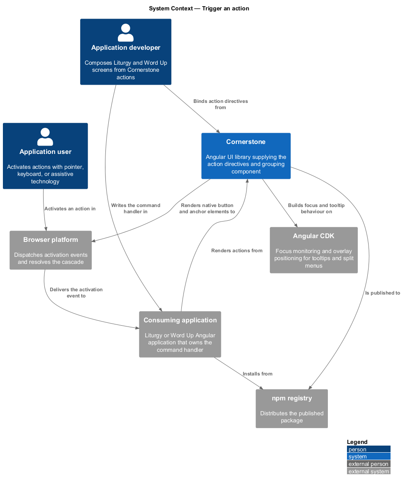
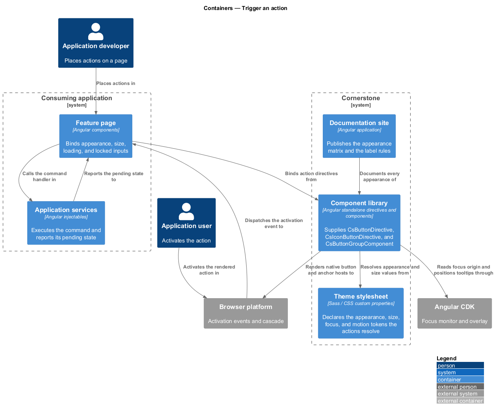
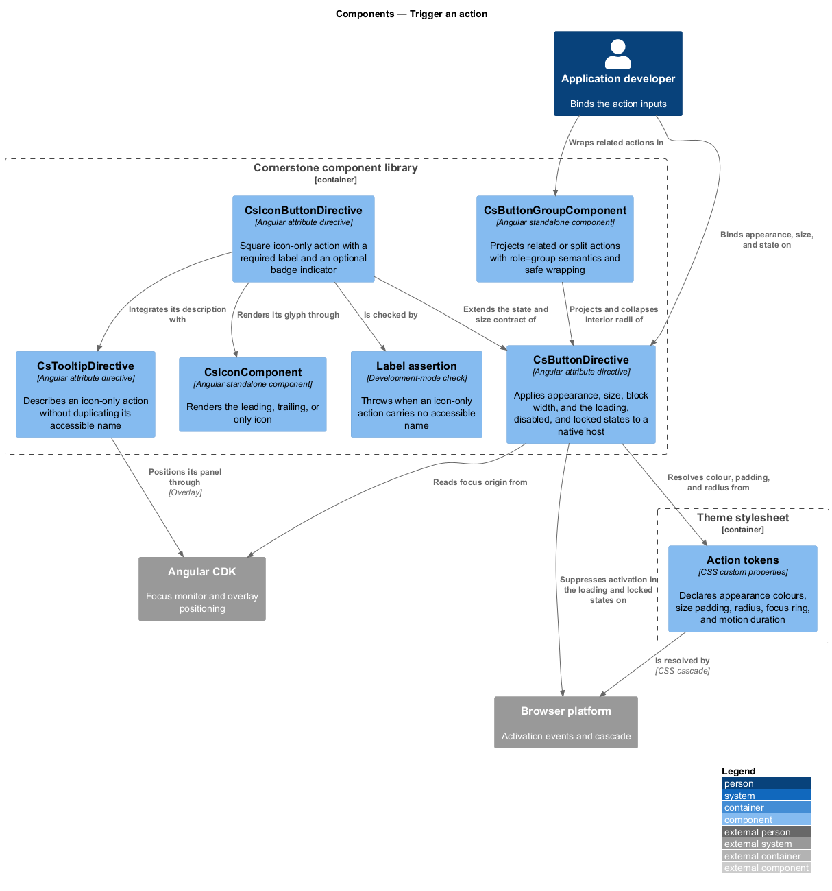
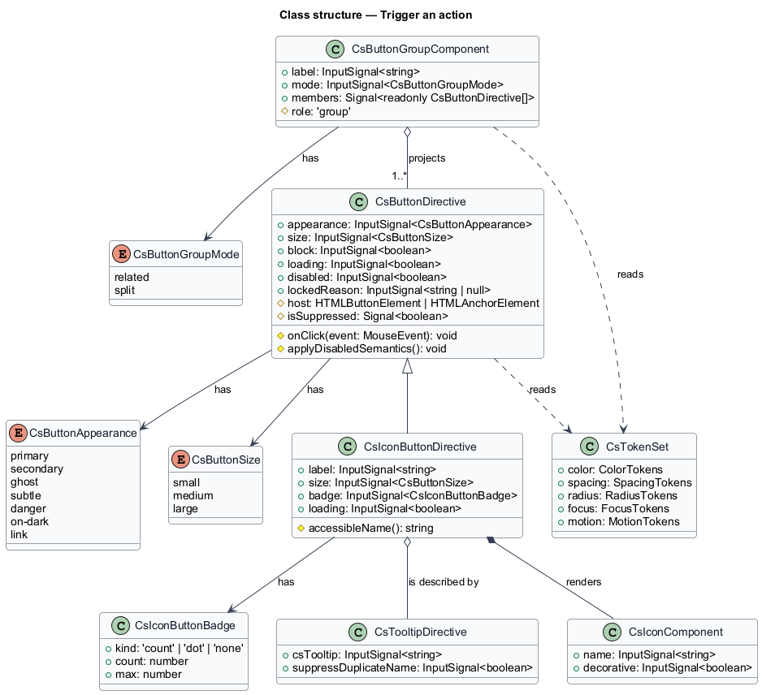
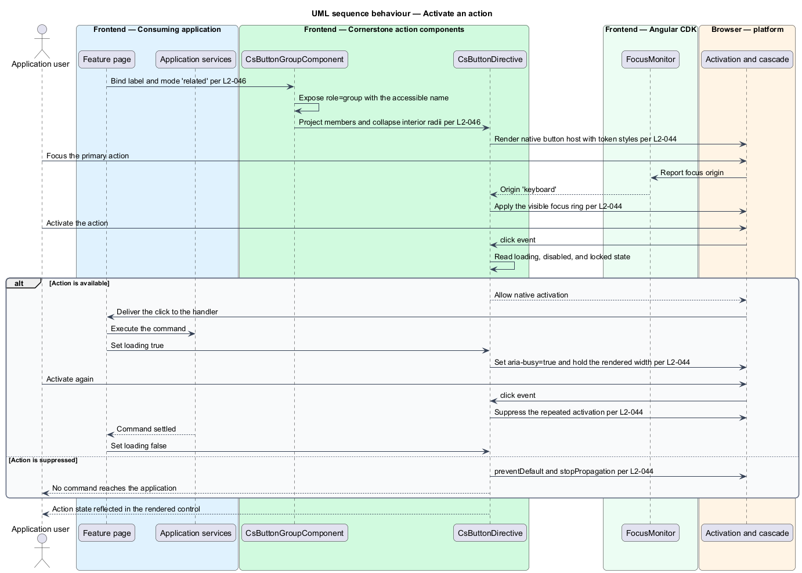
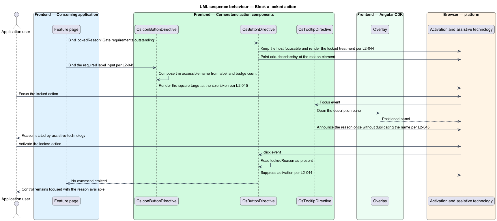

# Trigger an action

## Overview

Cornerstone is the Angular user-interface library published as `@quinntyne/cornerstone`.
It supplies the components that the Liturgy and Word Up applications compose
their screens from. The actions and form controls suite is the part of that
surface a person operates directly, and this feature covers its entry point: the
controls that carry a command.

**action** — user-initiated command that a screen exposes as one activatable
control

**appearance** — named visual treatment that signals an action's prominence and
tone, resolved entirely from design tokens

**locked action** — action rendered as unavailable together with a stated reason
for the unavailability

**split action** — primary action and a menu trigger presented as one connected
control with two separate focus stops

Every other feature in the forms subsystem ends in an action. A form submits
through one, a wizard advances through one, a file is chosen through one, and a
row of a directory is opened through one. Placing the action surface in a single
slice keeps one definition of focus indication, target size, loading state, and
disabled semantics behind every button in both applications.

Liturgy uses the slice for its workspace toolbars, gate advance controls, and
work-item menus. Word Up uses it for its public-site calls to action, its
authenticated page headers, and its icon-only shell controls. Neither application
declares button styling of its own.

The slice styles native `<button>` and `<a>` elements through attribute
directives rather than wrapping them in a component. That choice preserves native
activation, native form participation (L2-063), and native link behaviour,
including middle-click and modifier-click navigation.

## Description

The feature is a directive layer over the native activation elements, plus one
component that groups them. It holds no state beyond the inputs bound to it and
emits no output of its own; activation reaches the application through the native
`click` event of the host element.

- **`CsButtonDirective`** — attribute directive with the `[csButton]` selector,
  applied to a `<button>` or an `<a>` host. It carries the `appearance` input
  (`primary`, `secondary`, `ghost`, `subtle`, `danger`, `on-dark`, `link`), the
  `size` input (`small`, `medium`, `large`), the `block` input for full-container
  width, the `loading` input, the `disabled` input, and the `lockedReason` input.
  It resolves colour, padding, radius, and typography from `--cs-` tokens and
  declares no literal visual value.
- **`CsButtonDirective` state semantics** — the loading state sets
  `aria-busy="true"`, suppresses activation, and holds the rendered width so the
  surrounding layout does not shift. The disabled state sets the native
  `disabled` attribute on a `<button>` host, and `aria-disabled="true"` with
  `tabindex="-1"` on a host that carries no native disabled attribute. The locked
  state keeps the host focusable, exposes the reason as an accessible
  description, and suppresses activation.
- **`CsIconButtonDirective`** — attribute directive with the `[csIconButton]`
  selector for a square icon-only action. It declares `label` as
  `input.required<string>()`, so a host without an accessible name fails
  compilation. It carries the `size` input, the `badge` input for a count or dot
  indicator, and the `loading` input. The badge count joins the accessible name
  in one documented format rather than rendering as a second control.
- **`CsIconButtonDirective` target size** — the rendered box is square at the
  size token, and at viewport XS the interactive target including padding is at
  least 44 x 44 CSS pixels.
- **`ButtonGroupComponent`** — element component with the `cs-button-group`
  selector. It exposes `role="group"` with an accessible name from its required
  `label` input, projects the member actions, collapses interior radii, and wraps
  members onto a second row at narrow viewports without clipping any focus ring.
  Its `mode` input selects `related` for a row of peer actions or `split` for a
  primary action paired with a menu trigger.
- **`CsButtonAppearance`** — union type of the seven appearances.
- **`CsButtonSize`** — union type of the three sizes: `'small' | 'medium' |
  'large'`.
- **`CsButtonGroupMode`** — union type of the two grouping modes: `'related' |
  'split'`.
- **`CsIconButtonBadge`** — type describing the indicator: a count, a dot, or
  none.
- **`CsTooltipDirective`** — the tooltip the icon button integrates with. When a
  tooltip carries the same text as the accessible name, the announcement states
  that name once rather than twice.

Development-mode assertion covers the label rules. A button whose projected
content is an icon alone, and which carries no `aria-label`, `aria-labelledby`,
or visually hidden text, throws an error naming the missing label.

The exact badge-count format string for counts above the documented display
maximum is `<TO SUPPLY>`.

## Requirements

The feature realizes the following level-2 (L2) requirements. Each L2 requirement
refines a level-1 (L1) requirement, cited by identifier.

| L2 ID | Refines (L1) | Requirement |
|-------|--------------|-------------|
| `L2-044` | `L1-008` | The library shall provide a button directive supporting the `primary`, `secondary`, `ghost`, `subtle`, `danger`, `on-dark`, and `link` appearances; the `small`, `medium`, and `large` sizes; block width; leading and trailing icon composition; and the loading, disabled, and locked-with-reason states. |
| `L2-045` | `L1-008` | The library shall provide a square icon-only action that requires an accessible label and supports documented sizes, an optional badge or dot indicator, a loading state, and tooltip integration. |
| `L2-046` | `L1-008` | The library shall provide grouping for related actions and for split primary and secondary actions, with `role="group"` semantics and safe wrapping on narrow viewports. |

## Diagrams

### System context

An application developer composes screens from Cornerstone actions, and an
application user activates them in a browser. Cornerstone draws its focus and
overlay behaviour from Angular CDK and publishes to the npm registry.

### Containers

The feature page binds the action directives supplied by the component library
and reads its appearance values from the theme stylesheet. Application services
receive the resulting command; no styling crosses that boundary.

### Components

`CsButtonDirective` and `CsIconButtonDirective` decorate native activation
elements. `ButtonGroupComponent` projects them and owns the grouping
semantics. Both directives read tokens and delegate focus behaviour to Angular
CDK.

### Class structure

`CsButtonDirective` holds the appearance, size, and state inputs.
`CsIconButtonDirective` extends the same base with a required label and a badge.
`ButtonGroupComponent` aggregates the members it projects.

### Behaviour — activate an action

The user activates a primary action inside a group. The directive checks its
state, allows the native activation to proceed, and the application handles the
resulting command. The loading state then suppresses a second activation.

### Behaviour — block a locked action

The application sets a locked reason on an action. The directive exposes the
reason as an accessible description and suppresses activation, so the user learns
why the command is unavailable rather than receiving no response.

