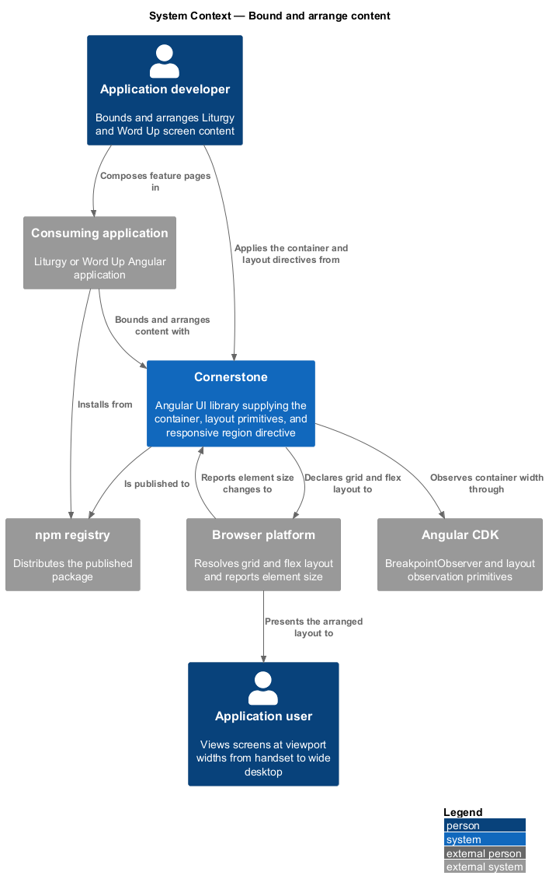
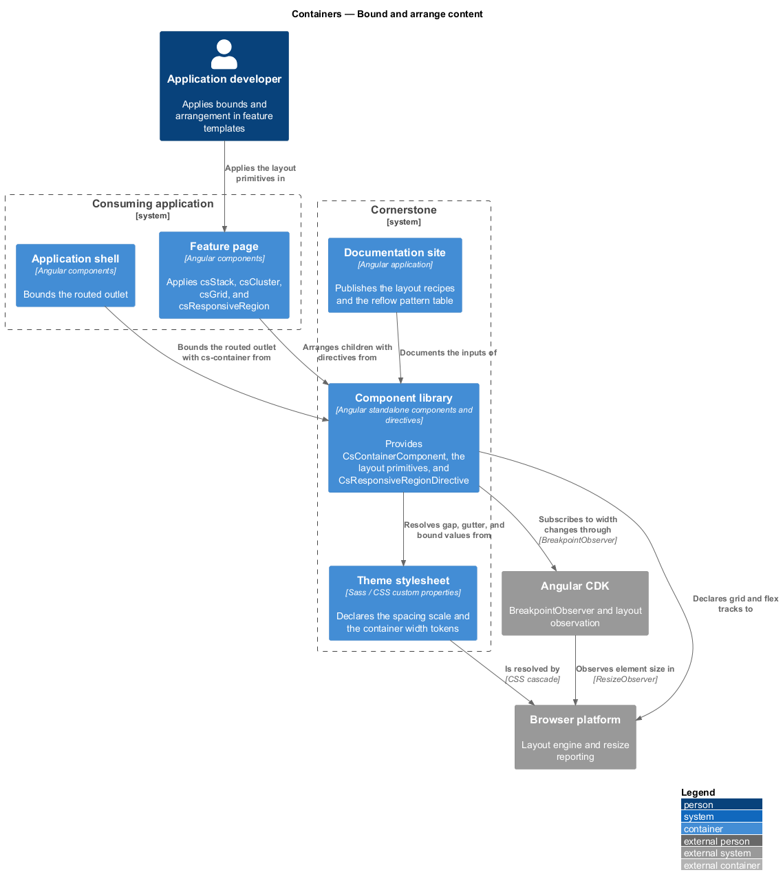
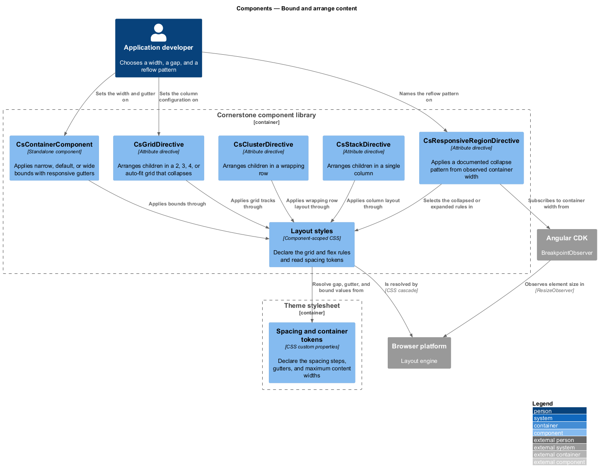
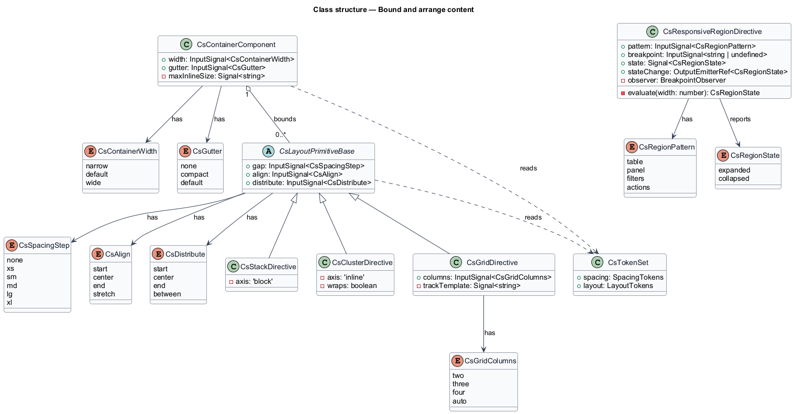
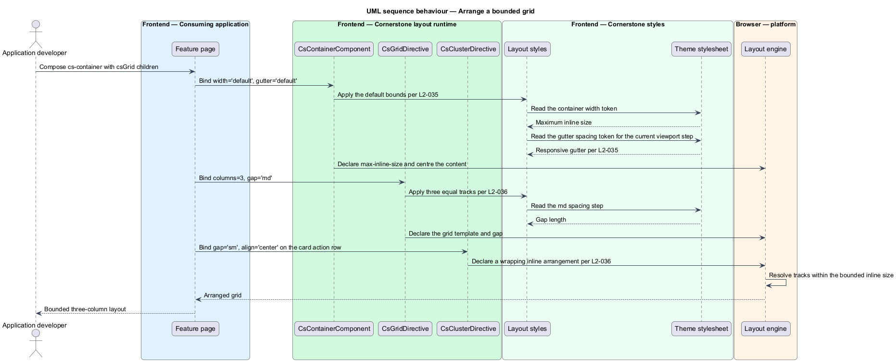
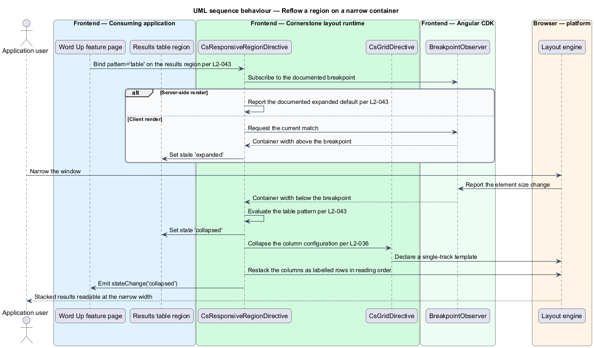

# Bound and arrange content

## Overview

Cornerstone is the Angular user-interface library published as `@quinntyne/cornerstone`.
It supplies the components that the Liturgy and Word Up applications compose
their screens from. Before either application places a card, a form, or a table,
it decides how wide the content runs and how the pieces sit next to each other.
This feature owns those two decisions.

**content bounds** — maximum inline width a block of content occupies, together
with the gutters that hold it away from the viewport edge

**layout primitive** — attribute directive that arranges an element's children
along one documented axis, with no visual styling of its own

The feature covers one bounding component, three layout primitives, and one
responsive behaviour directive. It sits at the base of the foundations and layout
subsystem: the page frame, the section frame, and the card all arrange their own
contents through these primitives rather than declaring layout rules of their own.
Both Liturgy and Word Up consume the bounding and layout primitives;
`CsResponsiveRegionDirective` is consumed by Word Up, whose tables, side panels,
and filter groups reflow on narrow viewports.

**gutter** — horizontal space between the content bounds and the edge of the
viewport, resolved from a spacing token and stepped by viewport width

**reflow** — change of arrangement that a region applies when its own width
crosses a documented breakpoint, such as a two-column split becoming stacked

Reflow is measured against the width of the region, not the width of the
viewport. A side panel narrows when it is placed in a narrow column even on a
wide screen, so the same directive serves a mobile viewport and a constrained
desktop region.

## Description

The feature is a stylesheet-and-directive slice with one Angular component. Every
piece resolves its spacing from the token layer (L2-005) and declares no literal
length.

- **`ContainerComponent`** — the `cs-container` element that applies content
  bounds. It takes a `width` signal input over `'narrow' | 'default' | 'wide'`
  and a `gutter` input over `'none' | 'compact' | 'default'`. Each width resolves
  its maximum inline size from a container token, and the gutter steps with the
  viewport. The component centres its content in the available inline space and
  emits no outputs.
- **`CsStackDirective`** — the `csStack` attribute directive that arranges
  children in a single column. It takes `gap` over the spacing scale, `align`
  over `'start' | 'center' | 'end' | 'stretch'` for the cross axis, and
  `distribute` over `'start' | 'center' | 'end' | 'between'` for the main axis.
  It applies no padding, background, or border.
- **`CsClusterDirective`** — the `csCluster` attribute directive that arranges
  children in a row that wraps. It takes the same `gap`, `align`, and
  `distribute` inputs as the stack, and it wraps onto a new line rather than
  overflowing or shrinking a child below its content width.
- **`CsGridDirective`** — the `csGrid` attribute directive that arranges children
  in a responsive grid. It takes `columns` over `2 | 3 | 4 | 'auto'` and the same
  `gap` input. The fixed column counts collapse in documented steps as the
  container narrows, and `'auto'` fits every column the minimum track width
  admits. The minimum track width for the `'auto'` configuration is `<TO SUPPLY>`.
- **`CsResponsiveRegionDirective`** — the `csResponsiveRegion` attribute
  directive that applies a documented collapse or reflow to a region. It takes a
  `pattern` input over `'table' | 'panel' | 'filters' | 'actions'` naming the
  behaviour, an optional `breakpoint` input naming the width at which the
  behaviour engages, and it exposes a read-only `state` signal over
  `'expanded' | 'collapsed'`. It observes the region's own width through the CDK
  `ObserversModule` and `BreakpointObserver` rather than reading the viewport
  directly, and it emits a `stateChange` output when the state crosses the
  breakpoint.
- **`CsSpacingStep`** — the union type naming the steps of the spacing scale that
  `gap` accepts.
- **`CsGridColumns`** — the union type of the grid column configurations:
  `2 | 3 | 4 | 'auto'`.

The three layout primitives are directives rather than components so that they
add no element to the DOM. A consumer applies `csStack` to a `<ul>`, a `<form>`,
or a `
` and keeps the semantics of that element intact.

Every primitive arranges children through CSS grid or flex layout declared in a
component-scoped stylesheet. None of them reads a browser global, so a server
renderer produces the same markup and the same arrangement as a client renderer.
`CsResponsiveRegionDirective` is the one piece that observes width; under a
server renderer it reports the documented expanded default and re-evaluates at
the first client render.

The four reflow patterns behave as follows. `'table'` converts a column layout
into stacked labelled rows. `'panel'` moves a side panel from beside the content
to above it. `'filters'` collapses a filter group into a single disclosure
control. `'actions'` hands its excess actions to the overflow strategy that the
toolbar owns (L2-041). Each pattern preserves the reading order of the region so
that the collapsed arrangement matches the expanded one.

## Requirements

The feature realizes the following level-2 (L2) requirements. Each L2 requirement
refines a level-1 (L1) requirement, cited by identifier.

| L2 ID | Refines (L1) | Requirement |
|-------|--------------|-------------|
| `L2-035` | `L1-007` | The library shall provide a content-bounds container offering `default`, `wide`, and `narrow` widths with responsive gutters derived from spacing tokens. |
| `L2-036` | `L1-007` | The library shall provide layout primitive directives for vertical stacking, wrapping clusters, and responsive grids, each accepting gap, alignment, and distribution inputs, and the grid shall support 2, 3, 4, and auto-fit column configurations that collapse responsively. |
| `L2-043` | `L1-007` | The library shall provide a shared directive that applies documented collapse and reflow behaviour to tables, side panels, filter groups, and action bars based on container width, using CDK layout observation. |

## Diagrams

### System context

An application developer bounds and arranges content with Cornerstone
primitives. Cornerstone draws its width observation from Angular CDK and applies
the arrangement through the browser's layout engine.

### Containers

The consuming application's feature pages apply the container and the layout
directives. The directives resolve their spacing from the theme stylesheet and
their width signals from the CDK layout observation container.

### Components

`ContainerComponent` sets the bounds; the stack, cluster, and grid directives
arrange within them; `CsResponsiveRegionDirective` observes the region width and
selects a documented pattern.

### Class structure

The three layout primitives share the `gap`, `align`, and `distribute` input
surface through a common base. `CsResponsiveRegionDirective` carries the pattern,
the breakpoint, the resolved state, and the state-change output.

### Behaviour — arrange a bounded grid

A feature page places a container, applies the grid directive with three columns,
and renders its cards. The container resolves its bounds and gutters from tokens,
and the grid lays out the tracks.

### Behaviour — reflow a region on a narrow container

The region's width crosses the documented breakpoint. The CDK reports the change,
the directive switches to the collapsed pattern, and the region emits the new
state to the consuming page.

