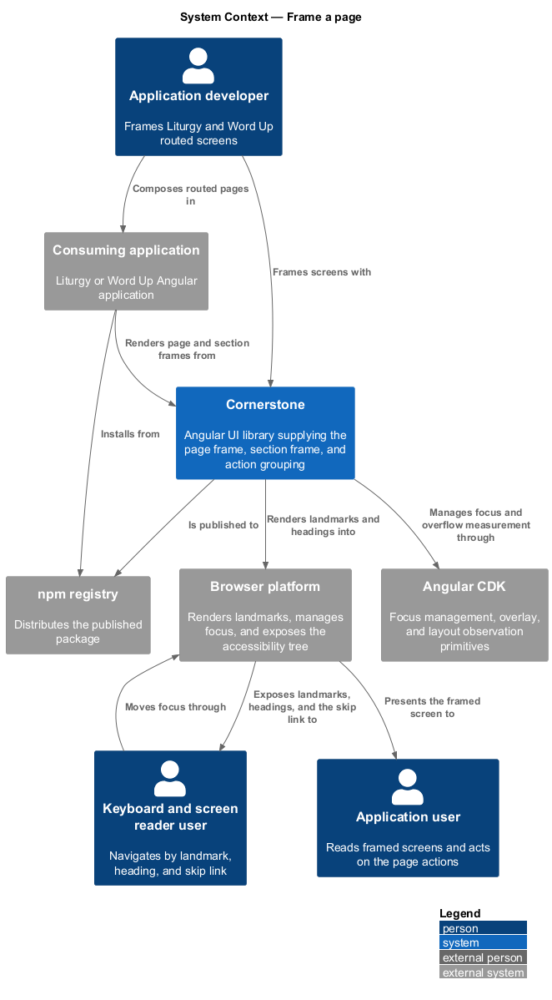
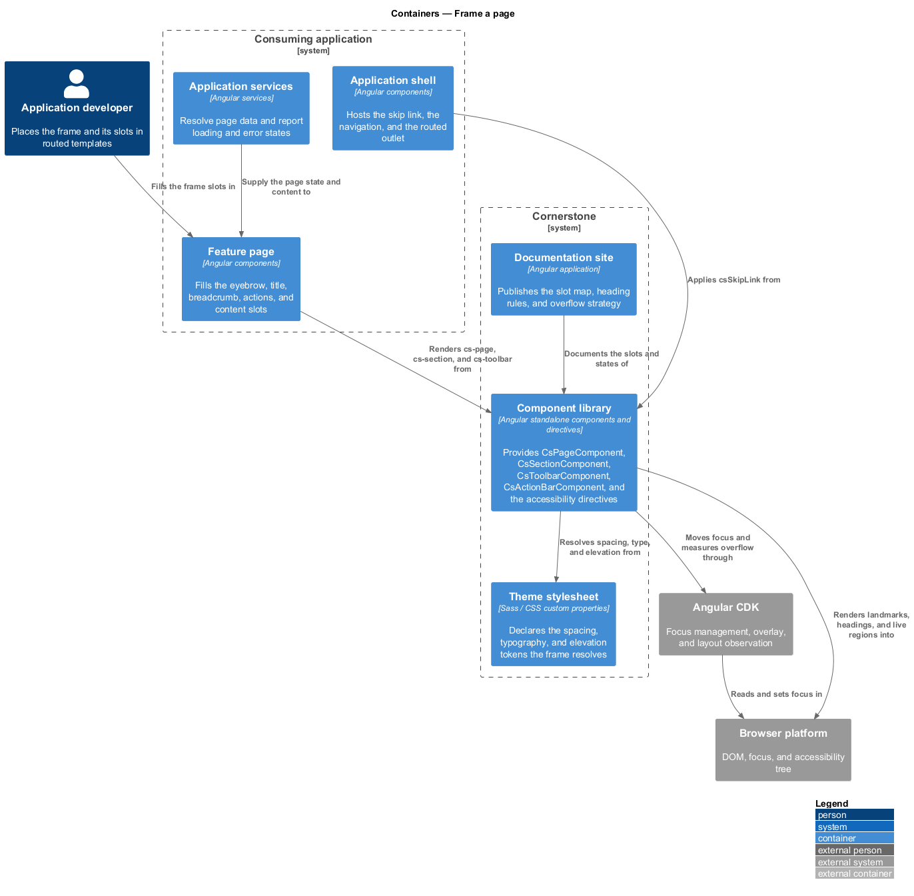
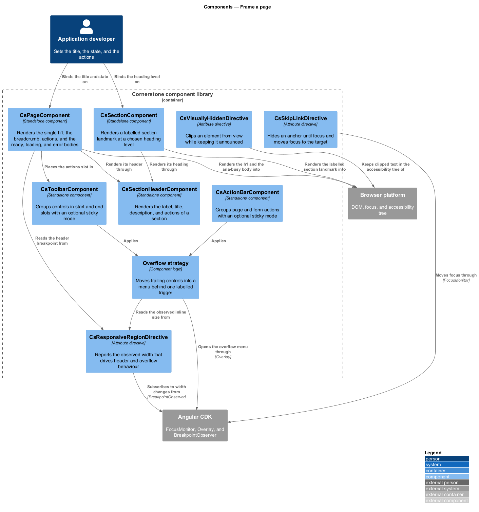
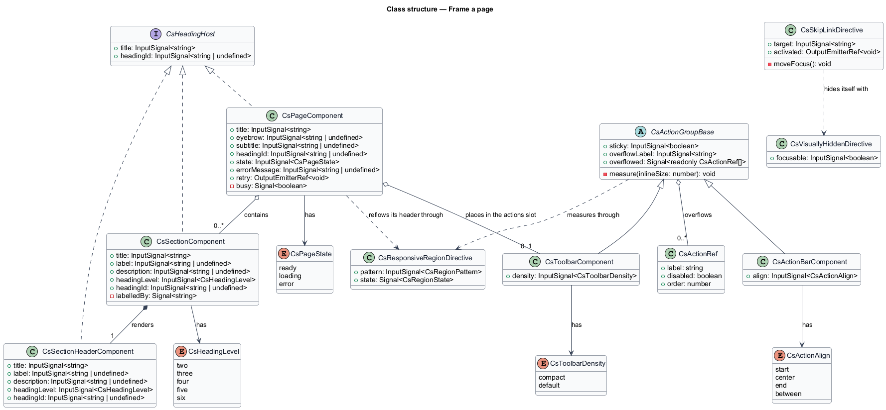
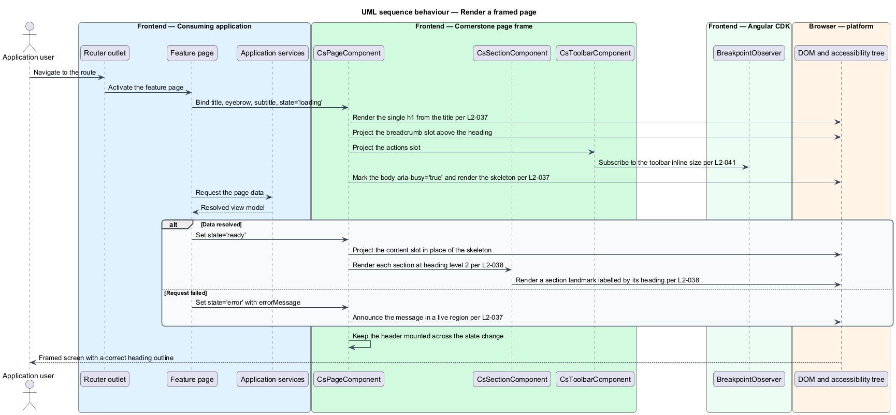
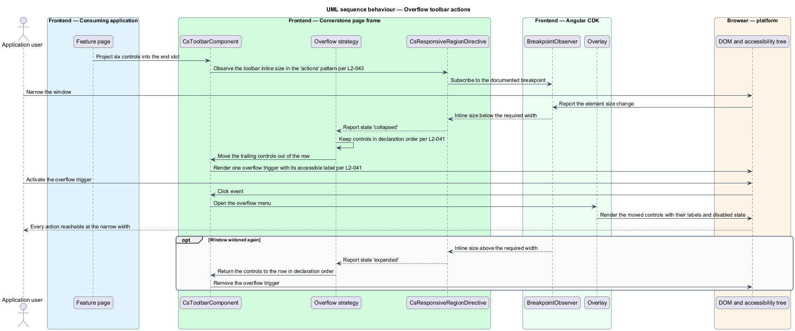
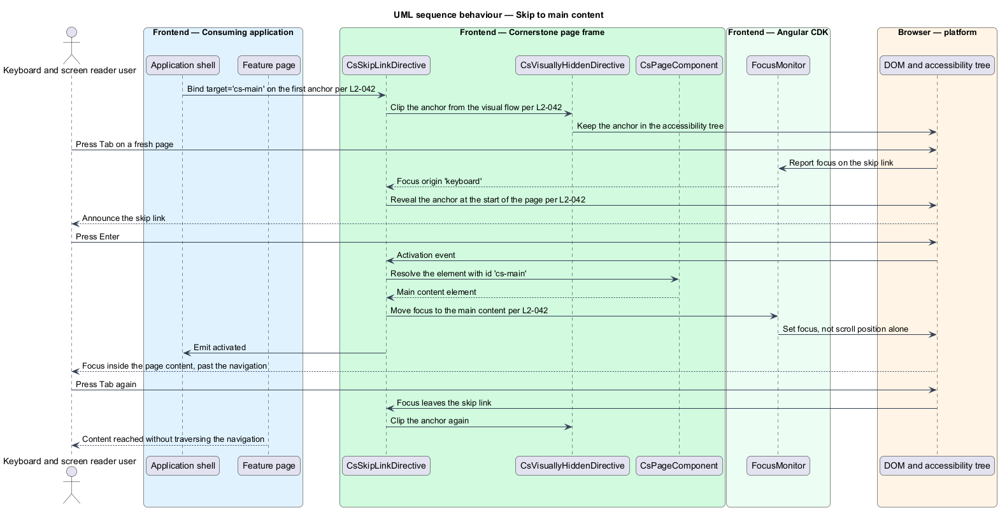

# Frame a page

## Overview

Cornerstone is the Angular user-interface library published as `@quinntyne/cornerstone`.
It supplies the components that the Liturgy and Word Up applications compose
their screens from. Nearly every screen in both applications repeats the same
outer structure: an eyebrow and a title, a subtitle, a breadcrumb trail, a row of
actions, and a body that may be loading, in error, or showing content. This
feature owns that structure and the landmark and heading semantics that go with
it.

**page frame** — outer structure of a routed screen, carrying its heading, its
supporting text, its actions, and its body states

**section** — labelled block within a page frame, grouping related content under
its own heading

**action bar** — grouped row of controls that act on the page or on a section

The feature covers the page frame, the section frame, the two action-grouping
components, and the two accessibility directives that make keyboard and screen
reader navigation of the frame work. It sits in the foundations and layout
subsystem, above the container and layout primitives (L2-035, L2-036) that it
arranges its own parts with, and beneath every feature page in both applications.
Both Liturgy and Word Up consume it; the page frame is pervasive in Word Up.

**slot** — named projection target that a consumer fills with its own markup,
declared through content projection

**heading level** — position of a heading in the document outline, from `h1`
through `h6`

The frame owns the outline. A page frame renders exactly one `h1`, and each
section renders a heading one level below its containing frame. A consumer
supplies the heading text, not the heading element, so the outline stays correct
however the page is composed.

**overflow strategy** — documented rule that moves actions that do not fit the
available width into a menu

**skip link** — keyboard-reachable link, hidden until it takes focus, that moves
focus past repeated navigation to the main content

## Description

The feature is a vertical slice from a routed component's template to the
rendered landmark structure and the accessibility tree. It introduces four
components and two directives.

- **`PageComponent`** — the `cs-page` element that frames a routed screen. It
  takes `title` as a required signal input, and `eyebrow`, `subtitle`, and
  `headingId` as optional inputs. It takes a `state` input over
  `'ready' | 'loading' | 'error'` and an `errorMessage` input read when the state
  is `'error'`. It projects a breadcrumb slot, an actions slot, and a default
  content slot, and it renders the title as the single `h1` of the screen. The
  header stacks its title and actions on narrow viewports and places them on one
  row on wide viewports, through `CsResponsiveRegionDirective` (L2-043).
- **`SectionComponent`** — the `cs-section` element that frames a block within
  a page. It renders a `<section>` landmark labelled by its own heading through
  `aria-labelledby`. It takes `title` as a required input, `label` and
  `description` as optional inputs, and `headingLevel` over `2 | 3 | 4 | 5 | 6`.
  It projects an actions slot and a default content slot.
- **`SectionHeaderComponent`** — the `cs-section-header` element that renders
  the label, title, description, and actions of a section on its own. It carries
  the same `title`, `label`, `description`, and `headingLevel` inputs, and a
  consumer places it where a section heading is needed outside a `cs-section`.
- **`ToolbarComponent`** — the `cs-toolbar` element that groups controls in a
  row. It projects a `start` slot and an `end` slot, takes a `sticky` input over
  `boolean` that pins the toolbar to the top of its scroll container, and takes a
  `density` input over `'compact' | 'default'`. It applies the overflow strategy
  to the controls that do not fit.
- **`ActionBarComponent`** — the `cs-action-bar` element that groups the
  primary and secondary actions of a page or a form. It projects the same `start`
  and `end` slots, takes the same `sticky` input, and takes an `align` input over
  `'start' | 'end' | 'between'`. It pins to the bottom of its scroll container
  when `sticky` is set.
- **`CsSkipLinkDirective`** — the `csSkipLink` attribute directive that turns an
  anchor into a skip link. It takes a `target` input holding the id of the
  element to move focus to. The anchor is removed from the visual flow until it
  receives focus, at which point it becomes visible at the start of the page.
  Activating it moves focus, not only scroll position, to the target.
- **`CsVisuallyHiddenDirective`** — the `csVisuallyHidden` attribute directive
  that removes an element from the visual presentation while leaving it in the
  accessibility tree. It clips the element rather than setting `display: none` or
  `visibility: hidden`, so screen readers still announce it.
- **`CsPageState`** — the union type of the page body states:
  `'ready' | 'loading' | 'error'`.
- **`CsHeadingLevel`** — the union type of the heading levels a section accepts.

The overflow strategy runs as follows. The toolbar measures its own inline size
through `CsResponsiveRegionDirective` in the `'actions'` pattern. Controls are
kept in declaration order; the last controls that do not fit move into an
overflow menu opened by a single trigger at the end of the row. The overflow
trigger carries its own accessible label, and the moved controls keep their
labels and their disabled state. The number of controls the toolbar always keeps
visible before overflowing is `<TO SUPPLY>`.

The page frame renders its three body states from one slot set. In the
`'loading'` state it renders a skeleton in place of the content and marks the
region `aria-busy="true"`. In the `'error'` state it renders `errorMessage` in a
live region and keeps the header visible. In the `'ready'` state it projects the
content unchanged. The state change never re-mounts the header, so focus inside
the header survives a body state change.

None of the six pieces reads a browser global at construction, so all six render
under a server renderer. The sticky behaviour and the overflow measurement engage
at the first client render.

## Requirements

The feature realizes the following level-2 (L2) requirements. Each L2 requirement
refines a level-1 (L1) requirement, cited by identifier.

| L2 ID | Refines (L1) | Requirement |
|-------|--------------|-------------|
| `L2-037` | `L1-007` | The library shall provide a standard page frame with eyebrow, title, subtitle, actions, breadcrumb, loading, error, and content slots, correct heading semantics, and responsive header behaviour. |
| `L2-038` | `L1-007` | The library shall provide section framing with label, title, description, and action slots, correct `<section>` landmark labelling, and heading level control. |
| `L2-041` | `L1-007` | The library shall provide responsive action grouping with start and end slots, an optional sticky mode, and a documented overflow strategy that moves excess actions into an overflow menu. |
| `L2-042` | `L1-007` | The library shall provide a keyboard skip link that is hidden until it receives focus, and a reusable screen-reader-only directive. |

## Diagrams

### System context

An application developer frames routed screens with Cornerstone. A keyboard user
and a screen reader user both reach the framed content through the landmark and
skip-link structure the frame renders.

### Containers

The application shell hosts the skip link and the routed outlet. Feature pages
place the page frame, its sections, and its action grouping, all bounded by the
container from the same subsystem.

### Components

`PageComponent` owns the heading and the body states, `SectionComponent` and
`SectionHeaderComponent` own the section outline, and the toolbar and action
bar own action grouping and overflow.

### Class structure

The page and section components share a heading contract; the toolbar and action
bar share the start and end slot surface and the sticky input. The two
accessibility directives stand alone.

### Behaviour — render a framed page

A route activates, the page frame renders its header and its loading body, the
application resolves its data, and the frame projects the ready content into the
same slot set.

### Behaviour — overflow toolbar actions

The toolbar's inline size falls below the width its controls need. The overflow
strategy moves the trailing controls into a menu behind a single labelled
trigger.

### Behaviour — skip to main content

A keyboard user presses Tab on a fresh page. The skip link becomes visible, and
activating it moves focus to the page's main content rather than scrolling to it.

