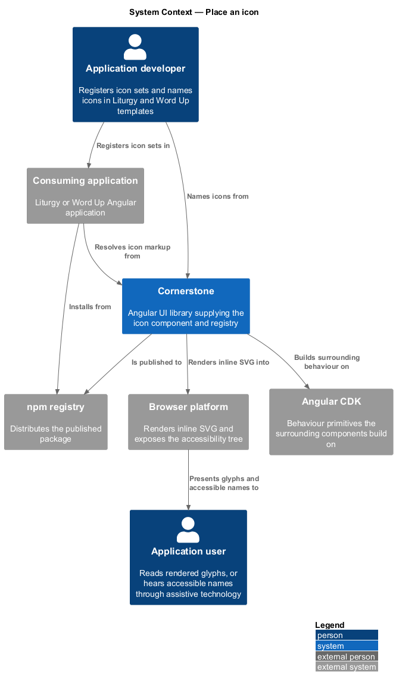
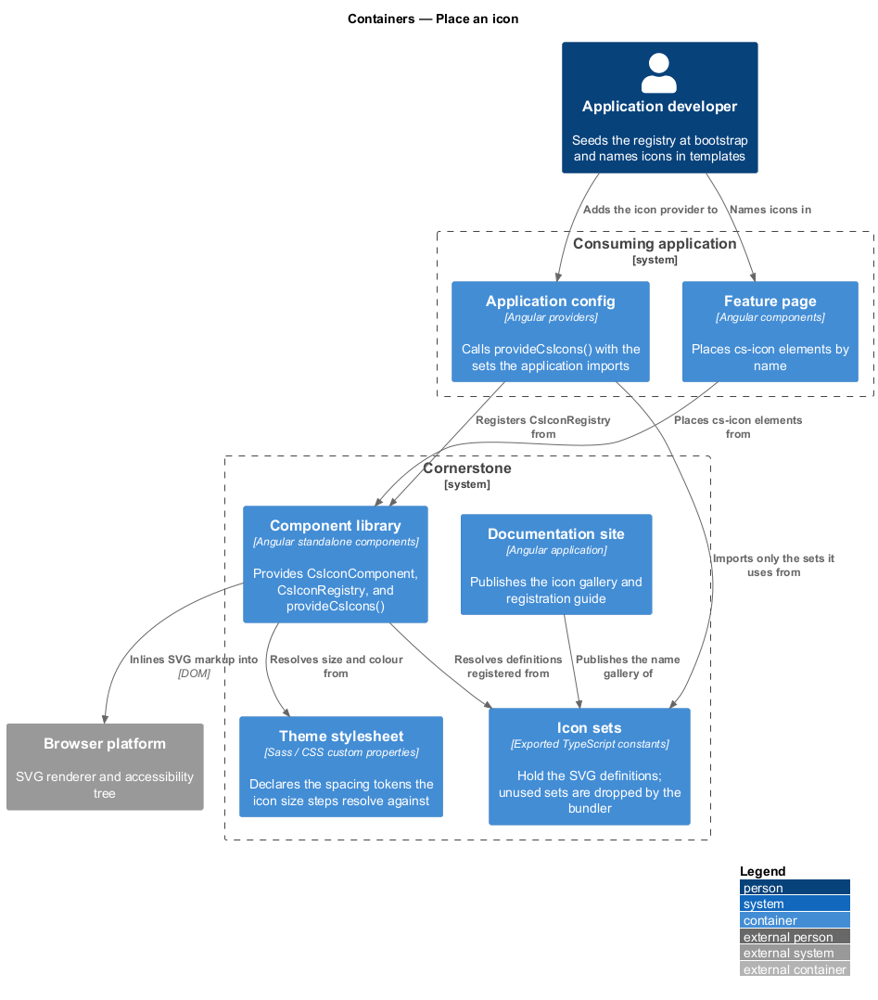
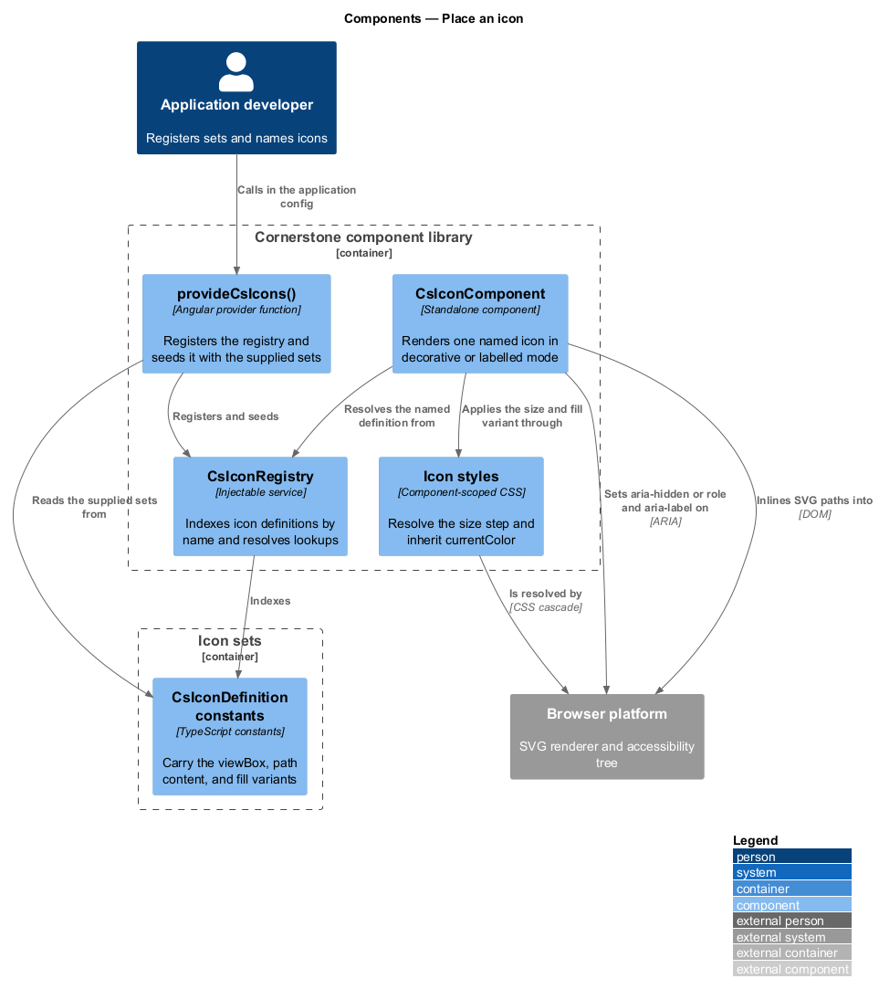
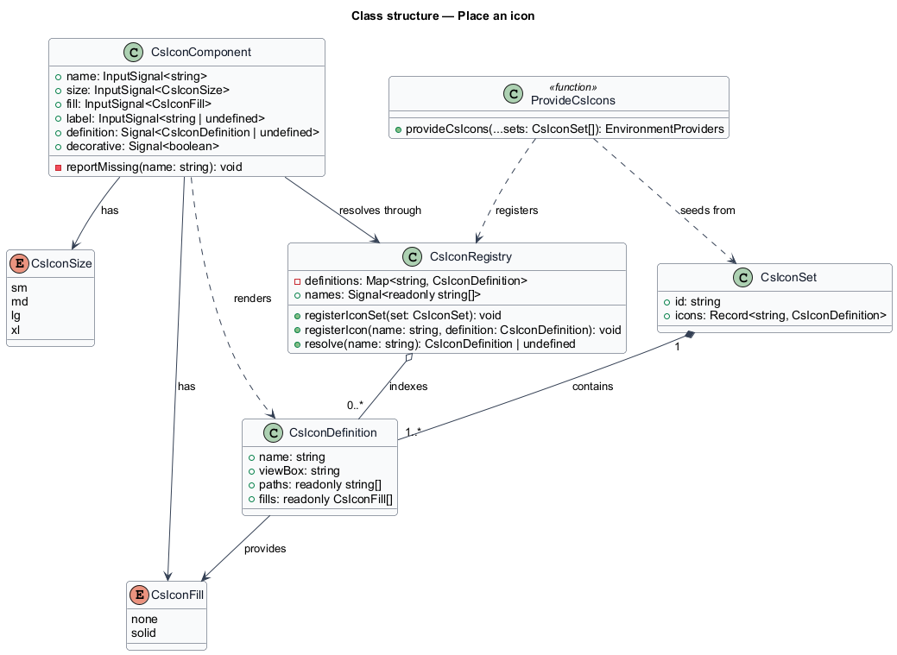
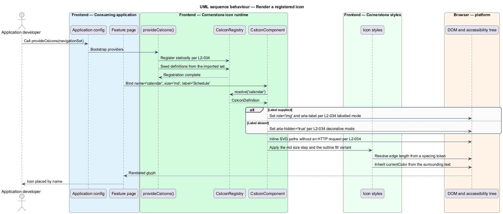
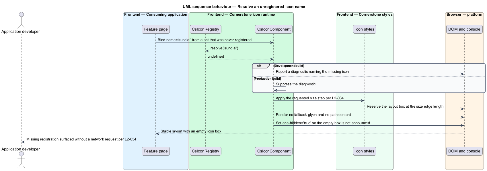

# Place an icon

## Overview

Cornerstone is the Angular user-interface library published as `@quinntyne/cornerstone`.
It supplies the components that the Liturgy and Word Up applications compose
their screens from. Icons appear in almost every one of those screens: in
buttons, menu items, status badges, navigation rails, and empty states.

**icon** — small vector glyph carrying a fixed meaning, rendered inline as SVG
and inheriting its colour from the surrounding text

This feature covers how Cornerstone names icons, how an application registers the
sets it uses, and how a single component renders one. It sits in the foundations
and layout subsystem alongside the container, layout, and page-framing features,
and beneath the action, form, and navigation subsystems that place icons inside
their own controls. Both Liturgy and Word Up consume it; the Word Up shell and
action surfaces use it most heavily.

**icon registry** — runtime index mapping an icon name to the SVG markup that
draws it

The registry exists so that an icon is addressed by name rather than by import.
A component template names `calendar`, and the registry supplies the markup. That
indirection keeps templates free of inline SVG and keeps the drawing of an icon in
one place.

**icon set** — named group of icon definitions registered together as a single
constant

An application registers only the sets it uses. Each set is a plain exported
constant, so a bundler drops any set the application does not import. No icon
reaches the browser unless the application asked for it.

**decorative mode** — rendering in which the icon carries no meaning of its own
and is hidden from assistive technology

**labelled mode** — rendering in which the icon carries meaning and exposes an
accessible name to assistive technology

Every icon renders in exactly one of the two modes. The mode follows from whether
the consumer supplies a label, so a consumer cannot leave the question unanswered.

## Description

The feature is a vertical slice from an application's bootstrap configuration to
the SVG element in the rendered page. It spans a provider function, a registry
service, one component, and the type surface that names icons.

- **`IconComponent`** — the `cs-icon` element that renders one icon. It takes a
  required `name` signal input holding the registered icon name, an optional
  `size` input over `'sm' | 'md' | 'lg' | 'xl'`, an optional `fill` input over
  `'none' | 'solid'` selecting the outline or filled drawing, and an optional
  `label` input holding the accessible name. When `label` is absent the host
  carries `aria-hidden="true"` and no role; when `label` is present the host
  carries `role="img"` and `aria-label`. The component uses `OnPush` change
  detection and emits no outputs.
- **`IconRegistry`** — the injectable service that holds the resolved index. It
  exposes `registerIconSet(set: IconSet): void` for a whole set,
  `registerIcon(name: string, svg: string): void` for one icon,
  `resolve(name: string): IconDefinition | undefined` for lookup, and a
  read-only `names` signal listing every registered name. Registration is
  idempotent: registering a name that is already present replaces the previous
  definition.
- **`provideCsIcons()`** — the provider function an application calls in its
  application config. It accepts zero or more `IconSet` values, registers
  `IconRegistry`, and seeds the registry with those sets before the first
  render.
- **`IconSet`** — the shape of a registered set: an `id` naming the set and an
  `icons` record mapping each icon name to its `IconDefinition`.
- **`IconDefinition`** — the shape of a single icon: a `viewBox`, the SVG path
  content, and the `fill` variants the drawing provides.
- **`IconName`** — the union type of the names the shipped sets register. A
  consuming application widens the type by declaring its own set.
- **`IconSize`** — the union type of the size steps: `'sm' | 'md' | 'lg' | 'xl'`.
  Each step resolves its edge length from a spacing token, so an icon scales with
  the theme rather than with a literal pixel value.

Registered markup is inlined, never fetched. `IconComponent` reads the
definition from the registry during its own change detection and renders the
paths into its template. The component issues no HTTP request, holds no
`HttpClient` dependency, and touches no browser global, so it renders identically
under a server renderer and under a client renderer, and the server-rendered
markup hydrates without a visual change.

An icon inherits `currentColor` for its stroke and fill, so it takes the colour
of the text around it and re-resolves under a theme change with no component code
running. It declares no literal colour of its own.

When `name` holds a value the registry does not carry, the component renders an
empty box of the requested size and reports a development-mode diagnostic naming
the missing icon. It renders no fallback glyph, so a missing registration is
visible during development and silent in production layout terms.

The complete list of icon names in the sets Cornerstone ships is `<TO SUPPLY>`.

## Requirements

The feature realizes the following level-2 (L2) requirement. The requirement
refines a level-1 (L1) requirement, cited by identifier.

| L2 ID | Refines (L1) | Requirement |
|-------|--------------|-------------|
| `L2-034` | `L1-007` | The library shall provide a tree-shakeable named SVG icon component with a registry supporting statically registered icon sets and per-icon registration, decorative and labelled modes, size and fill variants, and server-safe inline rendering that issues no runtime HTTP request for a registered icon. |

## Diagrams

### System context

An application developer registers icon sets and names icons in templates. An
application user reads the rendered glyphs, or hears their accessible names
through assistive technology when the icons are labelled.

### Containers

The consuming application installs the published package, seeds the registry from
its application config, and names icons from its feature pages. The registry and
the icon component both run inside the application's Angular injector.

### Components

`provideCsIcons()` registers `IconRegistry` and seeds it with the sets the
application imported. `IconComponent` resolves a name against the registry and
inlines the resulting SVG; the icon styles resolve size and colour from tokens.

### Class structure

`IconRegistry` holds a map of `IconDefinition` keyed by name.
`IconComponent` depends on the registry and carries the name, size, fill, and
label inputs that decide what it draws and how it is announced.

### Behaviour — render a registered icon

The application seeds the registry at bootstrap. A feature page places a
`cs-icon` with a name and a label; the component resolves the definition, applies
the accessible name, and inlines the SVG without any network call.

### Behaviour — resolve an unregistered name

A template names an icon whose set was never registered. The registry returns no
definition, the component reserves the layout box, and a development-mode
diagnostic names the gap.

