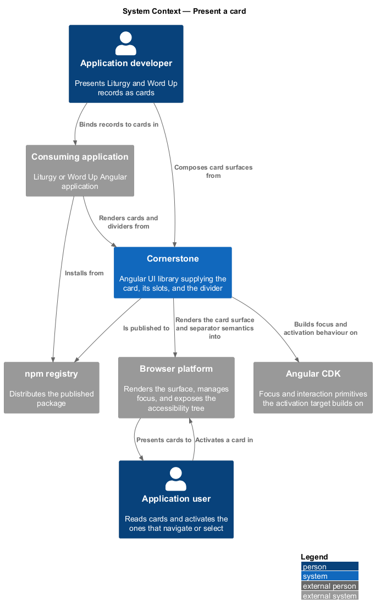
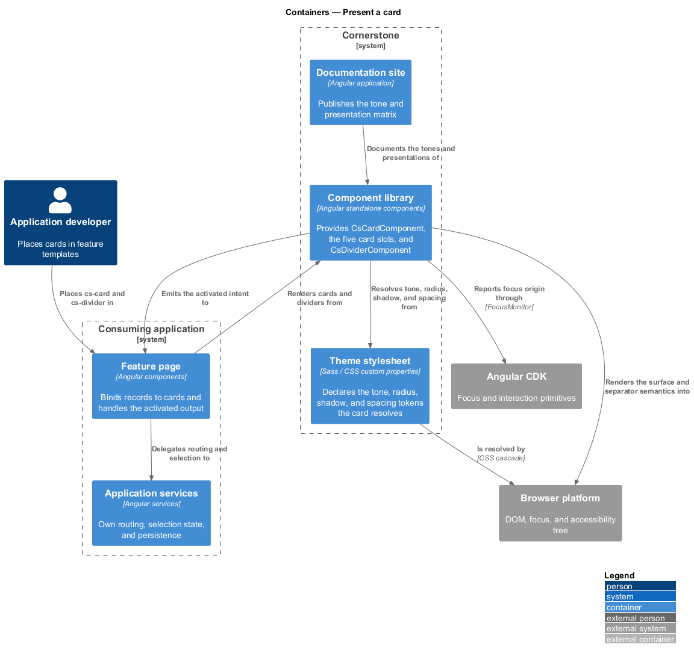
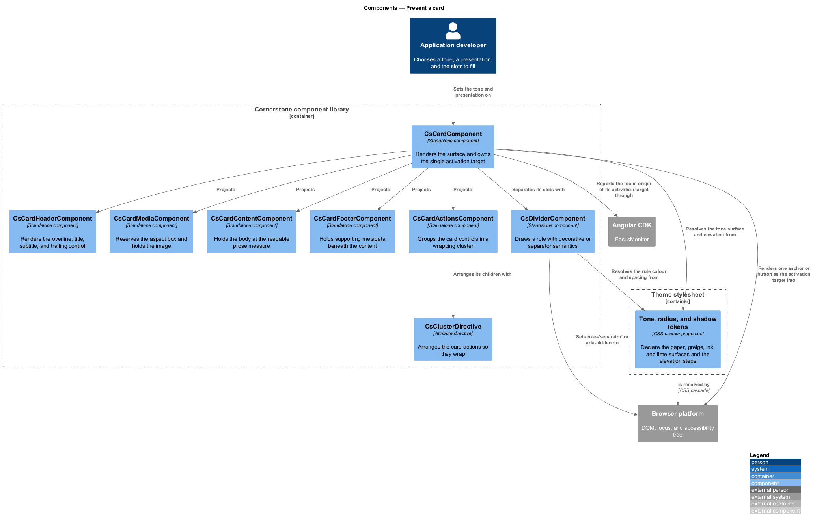
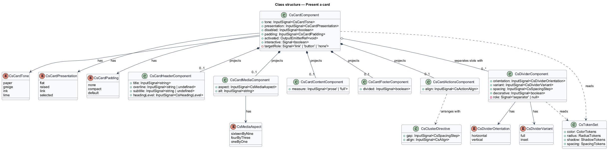
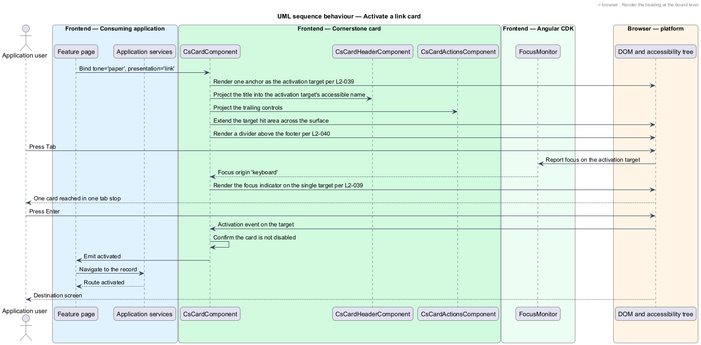
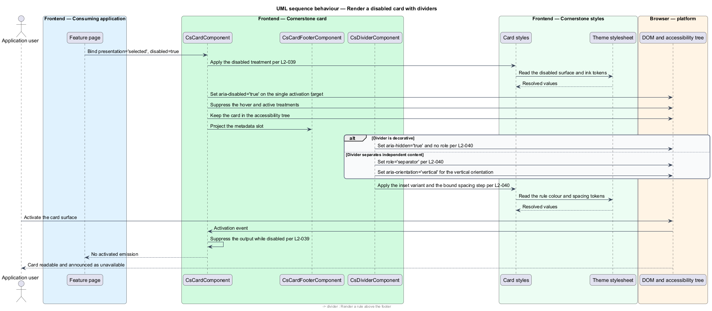

# Present a card

## Overview

Cornerstone is the Angular user-interface library published as `@quinntyne/cornerstone`.
It supplies the components that the Liturgy and Word Up applications compose
their screens from. The card is the unit both applications reach for when a
screen shows a list of things: a session, a lesson, a mentor, a report, a
settings group. This feature owns the card and the divider that separates content
inside and around it.

**card** — bounded surface grouping the content that describes one thing, with an
optional header, media, footer, and actions

**tone** — colour treatment of a card surface, selected from a fixed set and
resolved from theme tokens

**presentation** — combination of elevation and interaction state a card carries,
such as flat, raised, or selected

**divider** — thin rule separating two blocks of content, either decorative or
carrying separator semantics

The feature sits in the foundations and layout subsystem. It arranges its own
slots with the stack and cluster primitives (L2-036) and takes every colour,
radius, shadow, and spacing value from the token layer (L2-005). Both Liturgy and
Word Up consume it. Cards are placed inside the page and section frames (L2-037,
L2-038) and are commonly laid out by the grid primitive.

**interactive card** — card whose whole surface acts as a single control, either
navigating or selecting

An interactive card exposes exactly one activation target. The surface is not
made clickable by attaching a handler to the container; a single anchor or button
inside the card carries the accessible name and receives focus, and the surface
around it extends that target's hit area. That rule keeps one card equal to one
stop in the tab order, whatever the card contains.

## Description

The feature introduces one card component with five projection slots, one divider
component, and the type surface that names their variants.

- **`CardComponent`** — the `cs-card` element that renders a card surface. It
  takes a `tone` signal input over `'paper' | 'greige' | 'ink' | 'lime'`, a
  `presentation` input over `'flat' | 'raised' | 'link' | 'selected'`, a
  `disabled` input over `boolean`, and a `padding` input over
  `'none' | 'compact' | 'default'`. It emits an `activated` output when a `link`
  or `selected` card is activated, and it emits nothing when `disabled` is set.
- **`CsCardHeaderComponent`** — the `cs-card-header` element carrying the card's
  title, an optional overline, and an optional trailing control. It takes `title`
  as a required input, `overline` and `subtitle` as optional inputs, and
  `headingLevel` over `2 | 3 | 4 | 5 | 6`.
- **`CsCardMediaComponent`** — the `cs-card-media` element holding an image or
  illustration at the top of the card. It takes an `aspect` input over
  `'16:9' | '4:3' | '1:1'` and reserves the aspect box before the media loads, so
  the card does not shift as images arrive.
- **`CsCardContentComponent`** — the `cs-card-content` element holding the card's
  body. It applies the card padding and the readable prose measure.
- **`CsCardFooterComponent`** — the `cs-card-footer` element holding supporting
  metadata beneath the content, separated from it by a divider when the card
  declares one.
- **`CsCardActionsComponent`** — the `cs-card-actions` element holding the card's
  controls. It takes an `align` input over `'start' | 'end' | 'between'` and
  arranges its children with `CsClusterDirective` so the controls wrap rather
  than overflow.
- **`DividerComponent`** — the `cs-divider` element that draws a rule. It takes
  an `orientation` input over `'horizontal' | 'vertical'`, a `variant` input over
  `'full' | 'inset'`, a `spacing` input over the spacing scale, and a
  `decorative` input over `boolean`. When `decorative` is true the host carries
  `aria-hidden="true"` and no role; when it is false the host carries
  `role="separator"` and, for the vertical orientation,
  `aria-orientation="vertical"`.
- **`CardTone`** — the union type of the tones: `'paper' | 'greige' | 'ink' | 'lime'`.
- **`CardPresentation`** — the union type of the presentations:
  `'flat' | 'raised' | 'link' | 'selected'`.
- **`DividerOrientation`** and **`CsDividerVariant`** — the union types of the
  divider's orientation and inset variants.

The `disabled` input is a presentation and a behaviour together. A disabled card
dims its surface, suppresses its hover and active treatments, sets
`aria-disabled="true"` on its activation target, and emits no `activated` output.
It stays in the accessibility tree and stays reachable by screen reader, so the
reason it is unavailable can still be read.

The `ink` tone inverts the surface: it resolves the dark surface token and the
paper ink token, and the components inside it read the same inverted values
through the token layer rather than declaring their own on-dark colours. Every
tone meets the contrast requirement under both the light and the dark theme
(L2-006).

A `link` card renders its activation target as an anchor and a `selected` card
renders it as a button with `aria-pressed`. Which of the two a consumer gets
follows from the presentation, so a card that navigates and a card that selects
are never confused in the accessibility tree.

The elevation step the `raised` presentation resolves for the hover state is
`<TO SUPPLY>`.

## Requirements

The feature realizes the following level-2 (L2) requirements. Each L2 requirement
refines a level-1 (L1) requirement, cited by identifier.

| L2 ID | Refines (L1) | Requirement |
|-------|--------------|-------------|
| `L2-039` | `L1-007` | The library shall provide a card with `paper`, `greige`, `ink`, and `lime` tones, `flat`, `raised`, `link`, `selected`, and `disabled` presentations, and header, media, content, footer, and actions slots; an interactive card shall expose a single accessible activation target. |
| `L2-040` | `L1-007` | The library shall provide a divider with horizontal and vertical orientations, inset and full variants, and configurable spacing, exposing separator semantics only when it is not purely decorative. |

## Diagrams

### System context

An application developer presents records as cards. An application user reads
them and activates the ones that navigate or select, by pointer or by keyboard.

### Containers

Feature pages in both applications render cards inside the page and section
frames. The card resolves every tone, radius, and shadow value from the theme
stylesheet.

### Components

`CardComponent` owns the surface and the activation target; the five slot
components own the internal structure; `DividerComponent` separates the slots
and any content around them.

### Class structure

`CardComponent` composes its five slot components and carries the tone,
presentation, and disabled state. `DividerComponent` stands alone and switches
its semantics on the `decorative` input.

### Behaviour — activate a link card

A feature page renders a list of link cards. A keyboard user reaches one card in
a single tab stop and activates its one target, which emits the intent to the
application.

### Behaviour — render a disabled card with dividers

A card is rendered disabled with a decorative divider above its footer. The
surface dims, the activation target reports its disabled state, and the divider
stays out of the accessibility tree.

