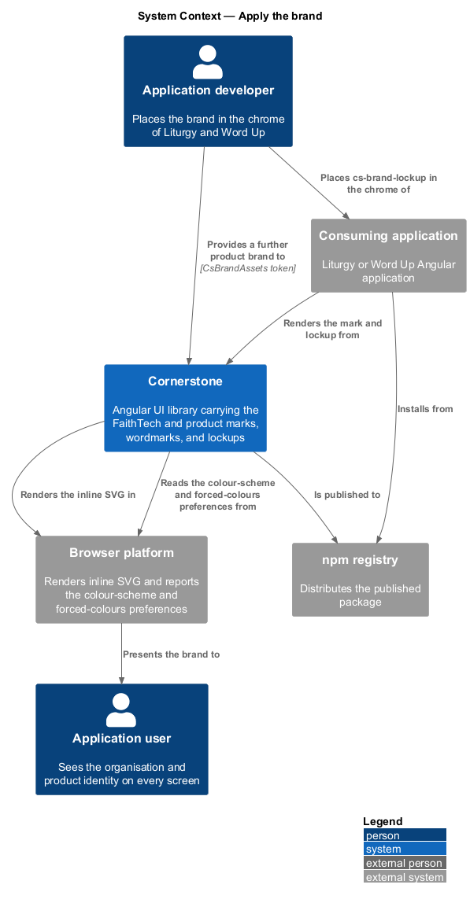
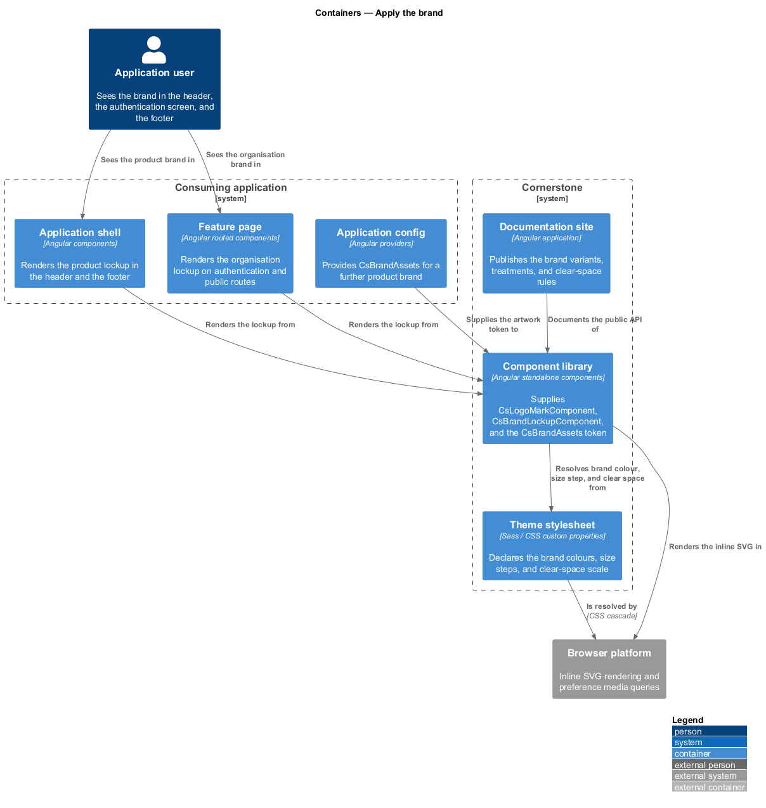
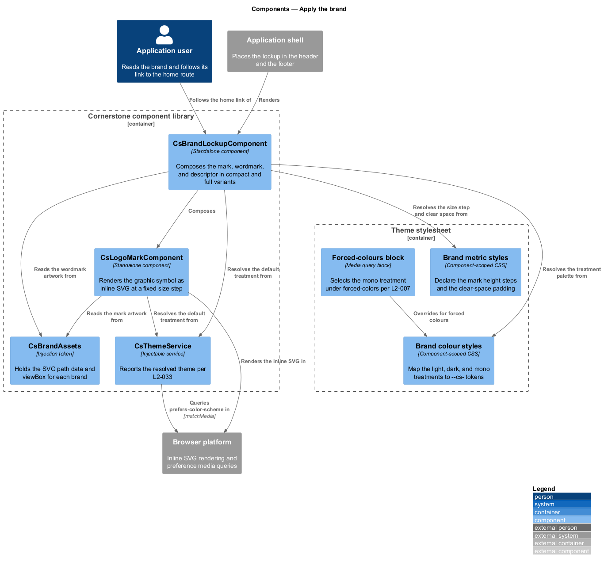
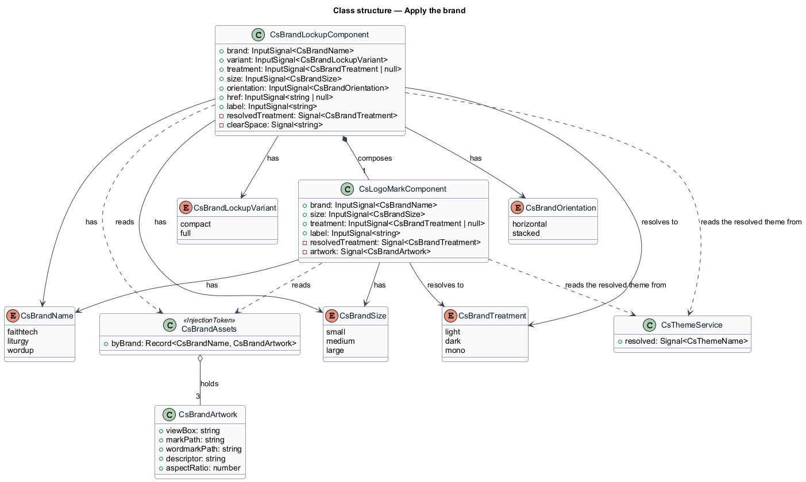
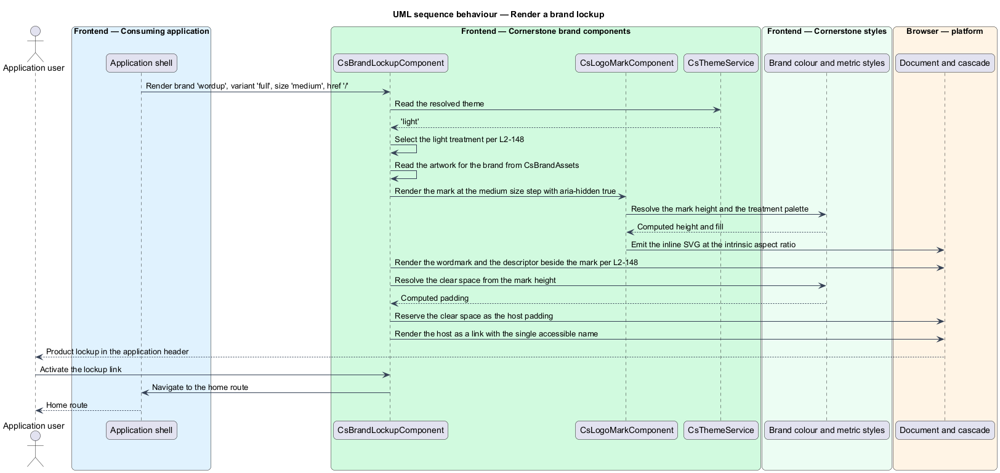
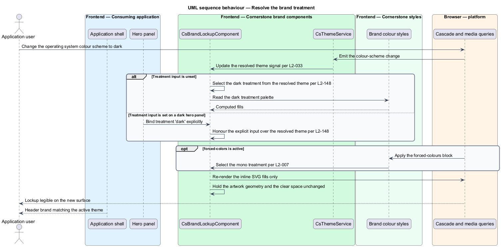

# Apply the brand

## Overview

Cornerstone is the Angular user-interface library published as `@quinntyne/cornerstone`.
It supplies the components that the Liturgy and Word Up applications compose their
screens from. This feature covers the brand identity itself: the graphic mark, the
wordmark, and the rules that govern how the two appear together wherever an
application presents itself.

**mark** — graphic symbol identifying an organisation or a product, carrying no
lettering

**wordmark** — name of an organisation or a product set in its designated typeface

**lockup** — fixed arrangement of a mark and a wordmark, with the spacing and
relative size between them held constant at every size

**clear space** — minimum margin around a lockup in which no other content appears

**treatment** — resolution of a mark or lockup for a background, holding its shape
constant and changing only its colours

Two brands appear in these applications. FaithTech is the organisation behind both;
Liturgy and Word Up are the products. A screen shows the product brand in its own
chrome and the organisation brand where the relationship to FaithTech is stated,
such as a page footer or an authentication screen. Before this feature each
application carried its own inline logo markup, so the mark was resized
inconsistently and the clear space was applied by hand or not at all.

The feature underlies the other two marketing features. The authentication layout
(L2-144) projects a lockup into its brand region, and the landing page (L2-145)
places one in the sticky header and the page footer. Placing the identity in a
component means the proportions, the clear space, and the accessible name are
correct at every one of those call sites without the calling code restating them.

The components carry the artwork as inline SVG rather than as a fetched asset, so a
mark renders during server-side rendering, resolves its colours from the token
surface (L2-005), and needs no network request.

## Description

The feature spans two components and the types that name the brands, the variants,
and the treatments.

- **`LogoMarkComponent`** — the `cs-logo-mark` element that renders the graphic
  symbol alone. It carries a `brand` input of `'faithtech' | 'liturgy' | 'wordup'`,
  a `size` input of `'small' | 'medium' | 'large'`, a `treatment` input of
  `'light' | 'dark' | 'mono'`, and a `label` input supplying the accessible name.
  It renders inline SVG with `role="img"` when `label` is set and
  `aria-hidden="true"` when it is empty, so a mark beside a wordmark is not
  announced twice.
- **`BrandLockupComponent`** — the `cs-brand-lockup` element that renders the mark
  and the wordmark together. It carries a `brand` input, a `variant` input of
  `'compact' | 'full'`, a `treatment` input, a `size` input, an `orientation` input
  of `'horizontal' | 'stacked'`, and an optional `href` input. It renders as a link
  when `href` is set and as a plain element otherwise.
- **`CsBrandName`** — union type of the brands: `'faithtech' | 'liturgy' | 'wordup'`.
- **`BrandLockupVariant`** — union type of the lockup variants:
  `'compact' | 'full'`. The compact variant renders the mark alone at small sizes
  and the mark with an abbreviated wordmark above them. The full variant renders
  the mark, the wordmark, and the descriptor line.
- **`CsBrandTreatment`** — union type of the treatments: `'light' | 'dark' | 'mono'`.
  The light and dark treatments resolve the brand palette for a light or a dark
  surface; the mono treatment renders in a single ink colour for print and for
  forced-colours mode (L2-007).
- **`CsBrandSize`** — union type of the size steps:
  `'small' | 'medium' | 'large'`. Each step fixes the mark height; the wordmark and
  the clear space scale from that height, so the lockup proportions hold at every
  step.
- **`CsBrandAssets`** — the injection token holding the SVG path data and the
  viewBox for each brand. An application that carries a further product brand
  provides its own value for the token rather than forking the components.

The treatment resolves automatically by default. When `treatment` is not set, both
components read the resolved theme from `CsThemeService` (L2-033) and select the
light or dark treatment to match, so a lockup inverts with the rest of the screen.
An explicit `treatment` overrides that resolution, which is what a dark hero panel
on a light page needs.

The clear space is enforced by the component. Each component reserves the clear
space as its own padding, so a lockup placed adjacent to other content keeps its
margin without the calling code adding spacing.

The lockup does not stretch. Both components hold the intrinsic aspect ratio of the
artwork under every container width, and the stacked orientation is the documented
route to a narrower footprint rather than a compressed horizontal one.

The descriptor line the `full` variant renders beneath the wordmark for each brand
is `<TO SUPPLY>`.

## Requirements

The feature realizes the following level-2 (L2) requirements. Each L2 requirement
refines a level-1 (L1) requirement, cited by identifier.

| L2 ID | Refines (L1) | Requirement |
|-------|--------------|-------------|
| `L2-148` | `L1-015` | The library shall provide the FaithTech and product mark plus wordmark in compact and full variants and light and dark treatments. |

## Diagrams

### System context

An application developer places the brand in application chrome, and every reader of
either application sees it. Cornerstone carries the artwork; the browser renders the
inline SVG and reports the colour-scheme preference that selects the treatment.

### Containers

The application shell, the authentication route, and the public-site route each
render a lockup from the component library. The theme stylesheet supplies the brand
colours, and the theme service reports which treatment to resolve.

### Components

`BrandLockupComponent` composes `LogoMarkComponent` with the wordmark and the
descriptor. Both read their artwork from the `CsBrandAssets` token and their
treatment from `CsThemeService` when none is set explicitly.

### Class structure

`BrandLockupComponent` holds the brand, variant, treatment, size, and orientation
and composes one `LogoMarkComponent`. `CsBrandAssets` supplies the artwork for
each `CsBrandName`.

### Behaviour — render a brand lockup

The application shell renders a lockup with no explicit treatment. The component
reads the resolved theme, selects the artwork and the treatment, reserves the clear
space, and renders inline SVG with a single accessible name.

### Behaviour — resolve the treatment on a tone change

The theme flips to dark, or the lockup is placed on a dark hero panel. The component
re-resolves the treatment from the signal or from the explicit input, and the mark
falls back to the mono treatment under forced colours.

