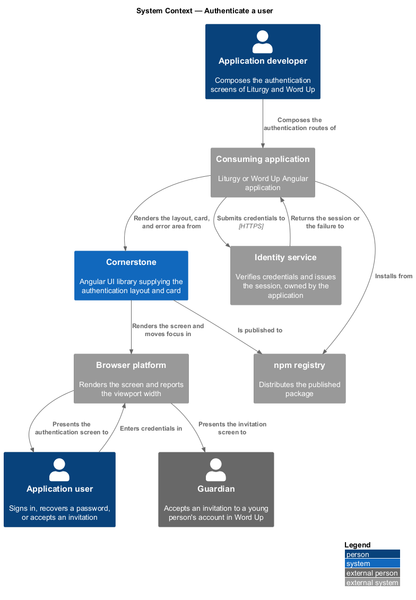
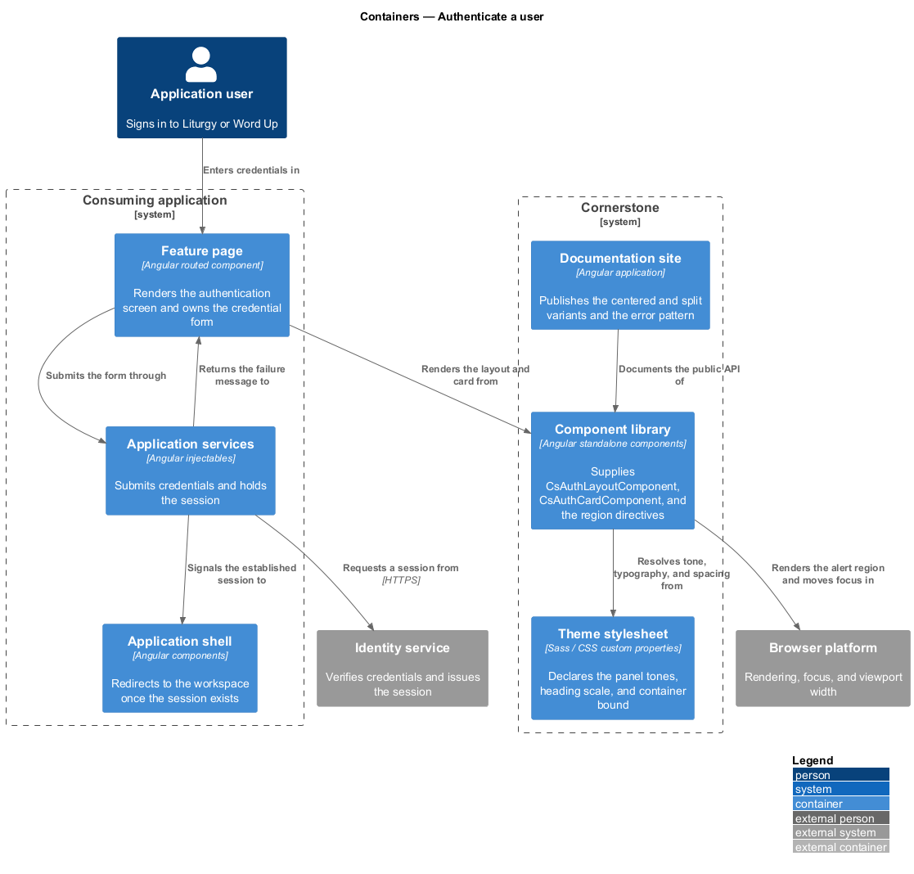
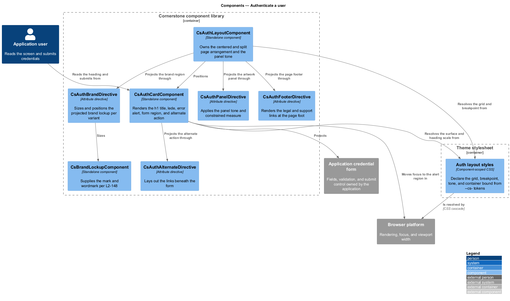
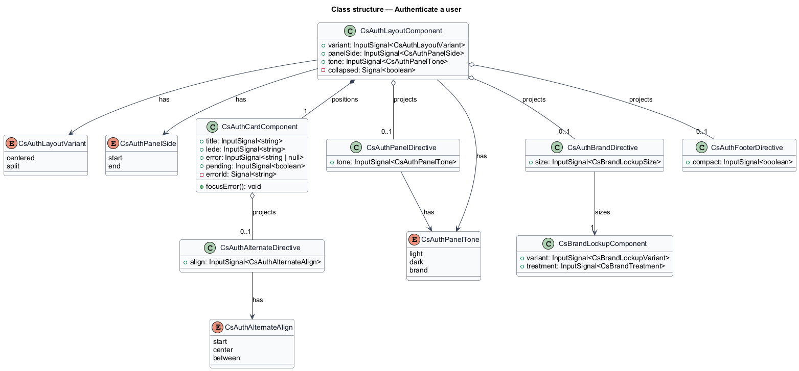
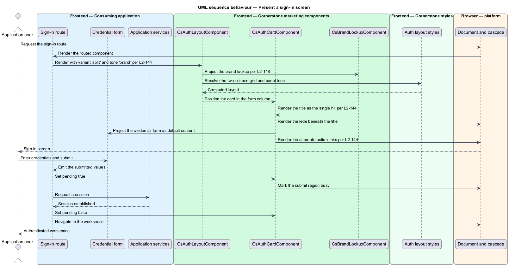
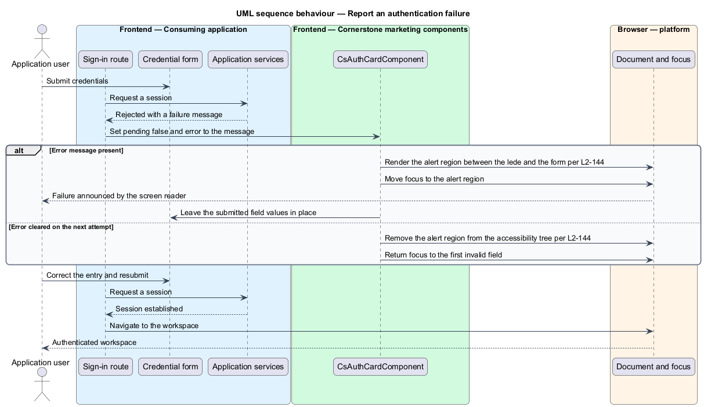
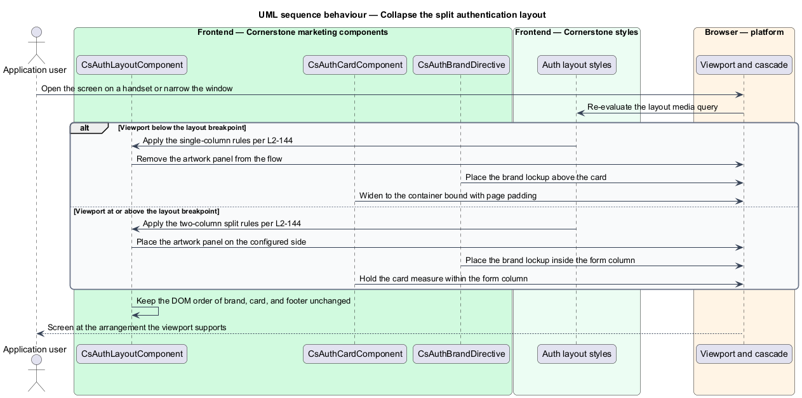

# Authenticate a user

## Overview

Cornerstone is the Angular user-interface library published as `@quinntyne/cornerstone`.
It supplies the components that the Liturgy and Word Up applications compose their
screens from. This feature covers the frame around every authentication screen: the
page layout that carries the brand and the surrounding artwork, and the card that
holds the title, the error area, the form, and the alternate action.

**authentication screen** — screen on which a person establishes or recovers access
to an application, such as sign-in, sign-up, password reset, or invitation
acceptance

**lede** — short sentence beneath a screen title that states what the screen asks
for or what happens next

**alternate action** — secondary route away from the current screen, such as the
link from sign-in to password recovery

Both applications carry authentication screens. Word Up signs in youth, mentors,
guardians, volunteers, and administrators, and accepts guardian invitations; Liturgy
signs in its workspace users. Before this feature each screen composed its own page
grid and card, so the brand placement, the heading scale, and the error presentation
differed between screens within the same application.

The feature is presentational only. Cornerstone holds no HTTP client and no session
state; it renders the frame and projects whatever form the application supplies. The
application owns the credential fields, the validation rules, the request, the
session, and the redirect after success. The library owns the layout, the responsive
behaviour, the heading semantics, and the announcement of the error.

The feature sits at the entry point of the marketing subsystem: it is the first
screen a person sees, and it shares the brand components (L2-148) with the landing
page (L2-145).

## Description

The feature spans two components and the directives that name their projection
regions.

- **`AuthLayoutComponent`** — the `cs-auth-layout` element that owns the page. It
  carries a `variant` input of `'centered' | 'split'`, a `panelSide` input of
  `'start' | 'end'` governing which side the artwork panel occupies in the split
  variant, and a `tone` input of `'light' | 'dark' | 'brand'` for the panel. It
  projects a brand region selected by `[csAuthBrand]`, the default card region, a
  panel region selected by `[csAuthPanel]`, and a footer region selected by
  `[csAuthFooter]`.
- **`AuthCardComponent`** — the `cs-auth-card` element that holds the screen
  content. It carries a `title` input, a `lede` input, an `error` input, and a
  `pending` input. It projects the form as its default content and an
  alternate-action region selected by `[csAuthAlternate]`.
- **`AuthLayoutVariant`** — union type of the layout variants:
  `'centered' | 'split'`. The centered variant places the card in the middle of the
  viewport with the brand above it. The split variant places the card in one column
  and an artwork or message panel in the other.
- **`AuthBrandDirective`** — the `csAuthBrand` attribute directive. It sizes and
  positions the projected brand lockup (L2-148) for each variant.
- **`AuthPanelDirective`** — the `csAuthPanel` attribute directive. It applies the
  panel tone, the constrained content measure, and the panel's own typographic
  treatment.
- **`AuthAlternateDirective`** — the `csAuthAlternate` attribute directive. It
  lays out the links beneath the form and separates them from the submit control.
- **`AuthFooterDirective`** — the `csAuthFooter` attribute directive. It renders
  the legal and support links at the foot of the page in both variants.

The card owns the error area. When `error` holds a message, the card renders it in a
region carrying `role="alert"`, places it between the lede and the form, and moves
focus to it so a screen reader reports the failure without the person hunting for
it. When `error` is empty the region is absent from the accessibility tree rather
than present and empty.

The card owns one heading. `title` renders as the single `h1` of the page, and the
projected form contributes no heading of its own, so every authentication screen
exposes the same heading structure.

The split variant collapses on narrow viewports. Below the layout breakpoint the
artwork panel is removed from the flow, the brand moves above the card, and the card
occupies the viewport width within the container bound.

The exact viewport width at which the split variant collapses to the centered
arrangement is `<TO SUPPLY>`.

## Requirements

The feature realizes the following level-2 (L2) requirements. Each L2 requirement
refines a level-1 (L1) requirement, cited by identifier.

| L2 ID | Refines (L1) | Requirement |
|-------|--------------|-------------|
| `L2-144` | `L1-015` | The library shall provide centered and split-panel authentication layouts with a brand slot, a title and lede, an error area, and form and alternate-action slots. |

## Diagrams

### System context

An application developer composes the authentication screen from the layout and the
card; a person signing in reads it in a browser. The application, not Cornerstone,
carries the credentials to its identity service.

### Containers

The authentication route in the consuming application renders the layout and card
from the component library and supplies its own form. Application services perform
the sign-in request and the redirect.

### Components

`AuthLayoutComponent` positions the brand, the card, the panel, and the footer.
`AuthCardComponent` renders the heading, the lede, the error alert, and the
projected form, and the brand lockup arrives from the brand feature (L2-148).

### Class structure

`AuthLayoutComponent` holds the variant, panel side, and tone; `AuthCardComponent`
holds the title, lede, error, and pending state. Four directives name the projection
regions the two components render into.

### Behaviour — present a sign-in screen

The route renders the split layout, the card renders the heading and the projected
form, and the person submits. The application performs the request; the card holds
the pending state while it runs.

### Behaviour — report an authentication failure

The application sets an error message on the card. The card renders the alert
region, moves focus to it, and keeps the submitted field values so the person
corrects rather than retypes.

### Behaviour — collapse the split layout

The viewport narrows below the layout breakpoint. The artwork panel leaves the flow,
the brand moves above the card, and the card widens to the container bound.

