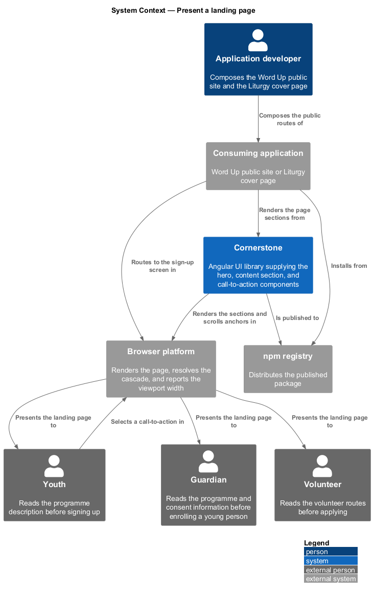
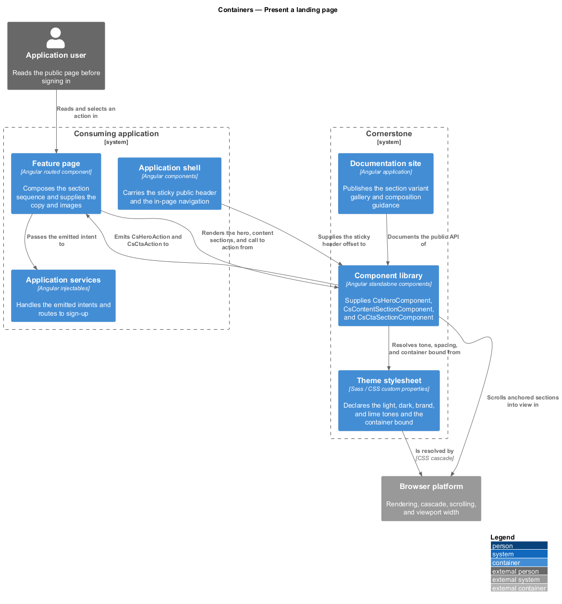
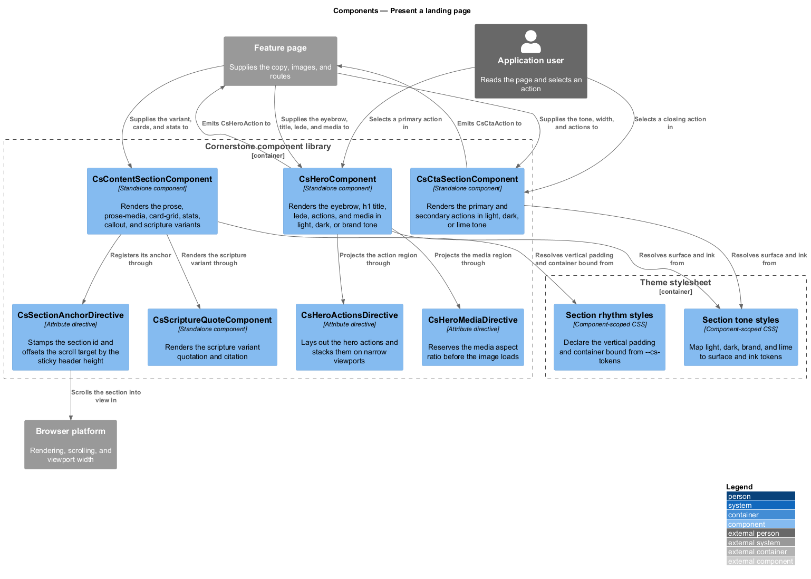
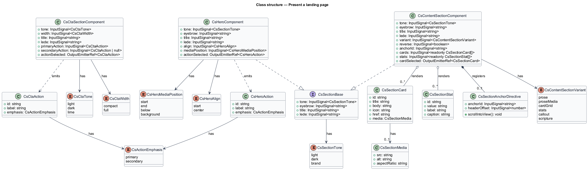
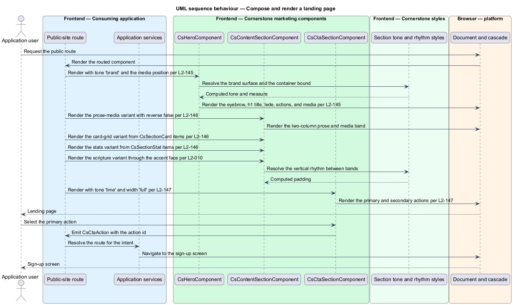
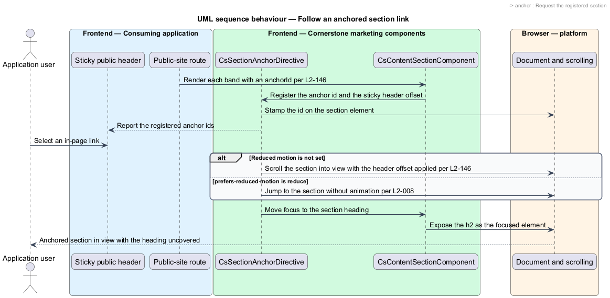
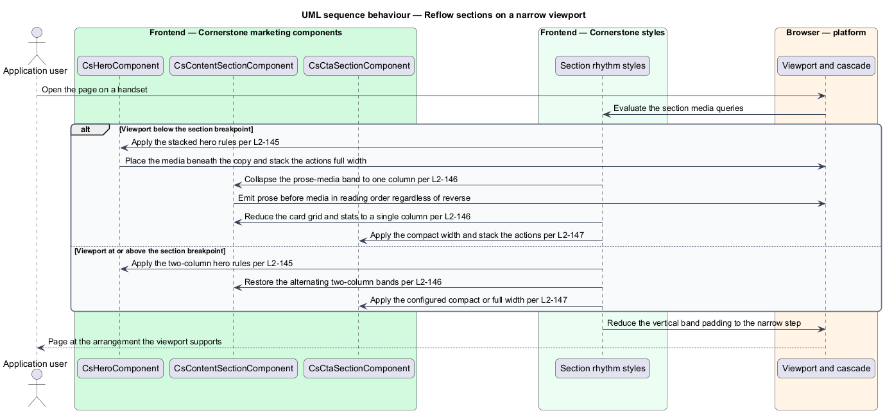

# Present a landing page

## Overview

Cornerstone is the Angular user-interface library published as `@quinntyne/cornerstone`.
It supplies the components that the Liturgy and Word Up applications compose their
screens from. This feature covers the three section components a public page is
built from: the hero at the top, the content sections in the body, and the
call-to-action section that closes it.

**landing page** — public page that introduces a product or a programme to a person
who has not signed in, and offers a route into the application

**section** — full-width horizontal band of a page carrying one idea, with its own
background tone and its content constrained to the reading measure

**hero** — opening section of a page, carrying the eyebrow, the page title, the
lede, the primary actions, and an optional image or video

**eyebrow** — short label above a title that names the category the section belongs
to

**call to action** — closing section offering the primary and secondary routes
forward, such as signing up or contacting a team

Word Up's public site is the main consumer: it presents the programme, the age
groups, the scripture memorisation approach, and the volunteer routes to youth,
guardians, and volunteers who have not yet signed in. Liturgy uses the hero on its
cover page. Before this feature every band on the public site carried its own grid,
its own vertical rhythm, and its own background rules, so the spacing between bands
varied down the page.

The three components share one structural contract. Each occupies the full viewport
width, each applies its own background tone, each constrains its content to the
container bound declared by the token surface (L2-005), and each owns the vertical
padding between itself and its neighbours, so a page composes as a plain sequence of
sections with no spacing declared between them.

The feature is presentational. The components accept a typed view model and content
projection, and they emit typed intents for the actions; the application owns the
copy, the routes, the analytics, and the images.

## Description

The feature spans three components, the directives that name their projection
regions, and the view-model types the applications populate.

- **`HeroComponent`** — the `cs-hero` element that opens a page. It carries a
  `tone` input of `'light' | 'dark' | 'brand'`, an `eyebrow` input, a `title`
  input, a `lede` input, an `align` input of `'start' | 'center'`, and a
  `mediaPosition` input of `'start' | 'end' | 'below' | 'background'`. It projects
  an actions region selected by `[csHeroActions]` and a media region selected by
  `[csHeroMedia]`, and emits `actionSelected` carrying a `HeroAction`.
- **`HeroAction`** — the typed intent a hero action emits. It carries an `id`, a
  `label`, and an `emphasis` of `'primary' | 'secondary'`.
- **`ContentSectionComponent`** — the `cs-content-section` element that carries a
  body band. It renders one of six variants selected by its `variant` input:
  `'prose'`, `'prose-media'`, `'card-grid'`, `'stats'`, `'callout'`, and
  `'scripture'`. It carries a `tone` input, an `eyebrow` input, a `title` input, a
  `lede` input, an `anchorId` input, and a `reverse` input that swaps the prose and
  media columns for the alternating rhythm down a page.
- **`ContentSectionVariant`** — union type of the six body variants above.
- **`SectionCard`** — the view-model item the `card-grid` variant renders. It
  carries an `id`, a `title`, a `body`, an optional `icon`, an optional `href`, and
  an optional `media`.
- **`SectionStat`** — the view-model item the `stats` variant renders. It carries
  an `id`, a `value`, a `label`, and an optional `caption`. The value renders in
  the display scale and the label in the meta scale (L2-010).
- **`CtaSectionComponent`** — the `cs-cta-section` element that closes a page. It
  carries a `tone` input of `'light' | 'dark' | 'lime'`, a `width` input of
  `'compact' | 'full'`, a `title` input, a `lede` input, a `primaryAction` input,
  and a `secondaryAction` input. It emits `actionSelected` carrying a
  `CtaAction`.
- **`CtaAction`** — the typed intent a call-to-action emits. It carries an `id`, a
  `label`, and an `emphasis`.
- **`HeroActionsDirective`, `CsHeroMediaDirective`** — the `csHeroActions` and
  `csHeroMedia` attribute directives that lay out the projected regions and stack
  them on narrow viewports.
- **`CsSectionAnchorDirective`** — the `csSectionAnchor` attribute directive. It
  stamps the section id, registers the section with the in-page navigation, and
  offsets the scroll target by the sticky header height so an anchored heading is
  not covered when a person follows a link to it.

Each component renders one heading level. The hero renders the page `h1`, and each
content and call-to-action section renders an `h2`, so a page composed from these
sections carries a valid heading outline without the application setting levels.

The `scripture` variant renders its quotation through the accent scripture face
declared by the typographic scale (L2-010), with a `blockquote` element and a
`cite` for the reference.

The media region carries an aspect ratio and reserves its space before the image
loads, so a section does not shift once the image arrives.

The `background` media position places the image behind the hero content and applies
a scrim. The contrast ratio the scrim shall guarantee over the supplied image is
`<TO SUPPLY>`.

## Requirements

The feature realizes the following level-2 (L2) requirements. Each L2 requirement
refines a level-1 (L1) requirement, cited by identifier.

| L2 ID | Refines (L1) | Requirement |
|-------|--------------|-------------|
| `L2-145` | `L1-015` | The library shall provide light, dark, and brand heroes with eyebrow, title, lede, actions, and media slots, constrained content, and responsive layout. |
| `L2-146` | `L1-015` | The library shall provide prose and media, alternating layout, card grid, stats, scripture or callout, and anchored section variants. |
| `L2-147` | `L1-015` | The library shall provide primary and secondary actions in light, dark, and lime tones, in compact and full-width variants. |

## Diagrams

### System context

An application developer composes the public page from the three section
components; a visitor reads it before signing in. Cornerstone supplies the sections
and the tokens; the application supplies the copy, the routes, and the images.

### Containers

The public-site route renders a sequence of sections from the component library. The
theme stylesheet declares the tones and the container bound the sections resolve
against, and application services handle the intents the actions emit.

### Components

`HeroComponent`, `ContentSectionComponent`, and `CtaSectionComponent` compose
the page in order. The anchor directive registers each section for in-page
navigation, and both action-bearing sections emit typed intents outward.

### Class structure

The three section components share the tone and title inputs and differ in variant.
`SectionCard` and `SectionStat` are the view-model items the card-grid and stats
variants render, and the two action types carry the emitted intents.

### Behaviour — compose and render a landing page

The route renders the hero, a sequence of content sections, and the call to action.
Each section constrains its own content and owns its vertical rhythm; a visitor then
selects an action and the application routes.

### Behaviour — follow an anchored section link

A visitor selects an in-page link. The anchor directive scrolls the registered
section into view with the sticky-header offset applied and moves focus to the
section heading.

### Behaviour — reflow sections on a narrow viewport

The viewport narrows. The hero stacks its media beneath its copy, the alternating
sections collapse to a single column in reading order, and the card grid and stats
reduce their column count.

