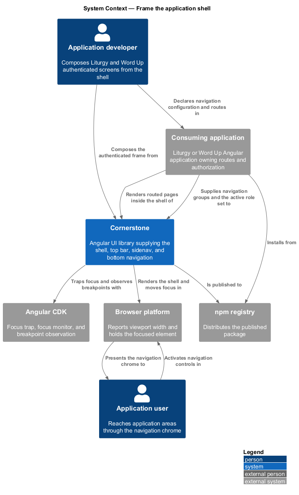
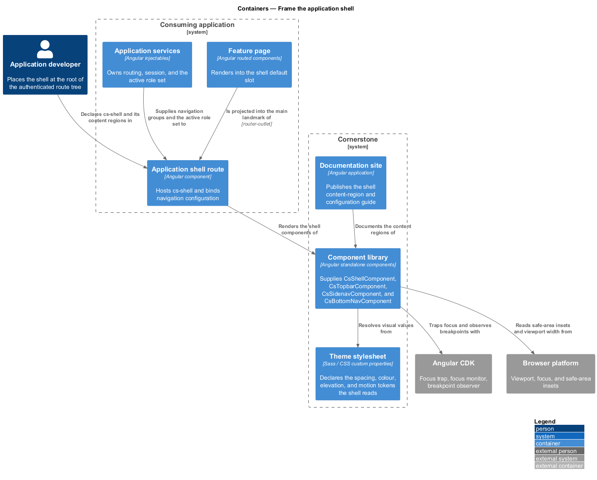
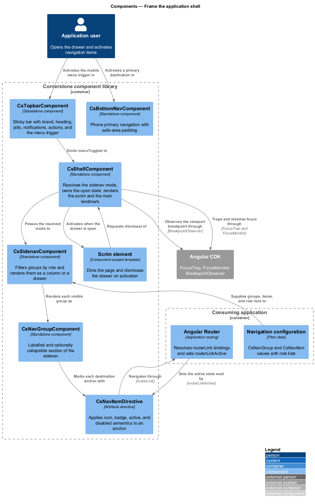
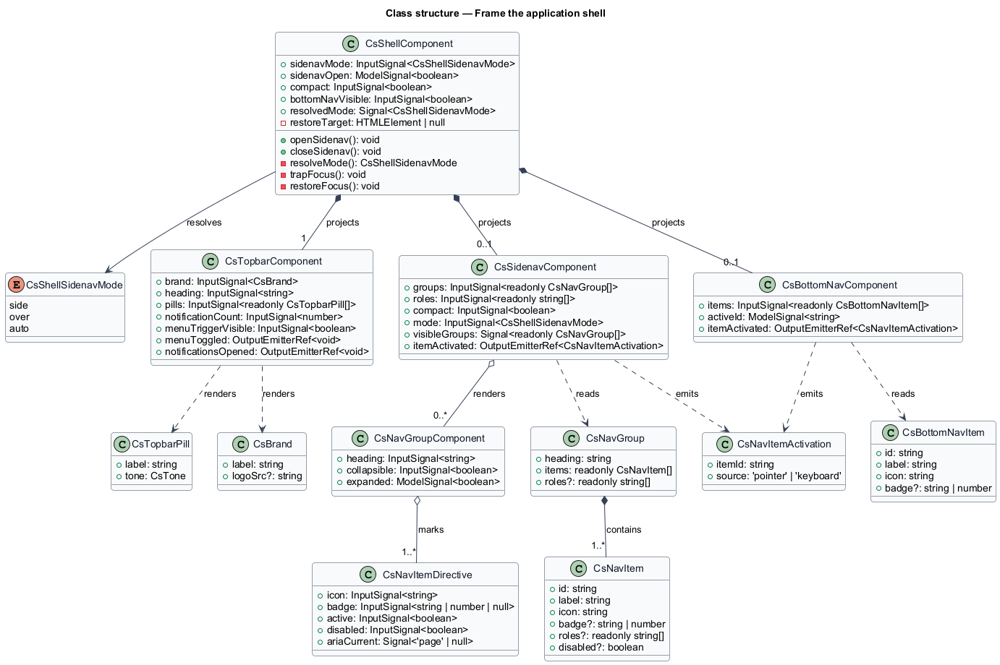
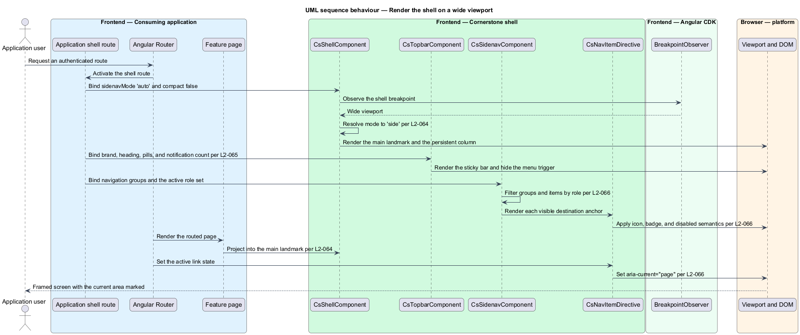
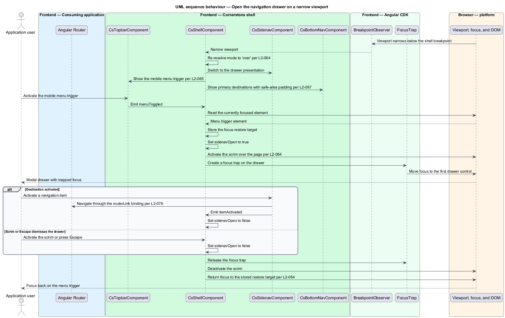

# Frame the application shell

## Overview

Cornerstone is the Angular user-interface library published as `@quinntyne/cornerstone`.
It supplies the components that the Liturgy and Word Up applications compose
their screens from. Every authenticated screen in both applications renders
inside one persistent frame, and this feature defines that frame.

**application shell** — persistent frame that surrounds every routed page and
carries the navigation chrome that does not change between routes

The shell is the outermost Cornerstone component an application renders. It
holds a sticky top bar, side navigation, an optional bottom navigation bar for
narrow viewports, a scrim, and a `<main>` landmark into which the router places
the active page. The routed page changes; the shell does not.

**navigation chrome** — set of controls that stay on screen across route changes
and let a user reach another area of the application

**scrim** — full-viewport translucent layer that dims the page behind a modal
surface and dismisses that surface when activated

The shell sits at the top of the navigation subsystem. The four other navigation
features render inside it: breadcrumbs in the top bar, tabs and paginators in the
page region, anchored menus from the top bar, and the marketing header on
unauthenticated routes where the shell is absent. Liturgy consumes the shell for
its authenticated workspace. Word Up consumes it for the youth, mentor, guardian,
volunteer, and administrator portals, and adds the bottom navigation bar on
phones.

**sidenav mode** — resolution of the side navigation to either a persistent
column that occupies layout space or a modal drawer that overlays the page

The shell owns one behaviour that no consuming application should reimplement:
at narrow viewports the persistent side navigation becomes a modal drawer. That
transition changes the focus contract, not only the layout. The drawer traps
focus, the scrim becomes active, the `Escape` key closes the drawer, and focus
returns to the control that opened it.

The shell performs no navigation. It renders the controls an application binds
`routerLink` to, and it emits activation intents; the application's router
resolves them (L2-076).

## Description

The feature is a vertical slice from the application's root template down to the
focus state of a single DOM element. It spans six public building blocks and the
types that describe their configuration.

- **`ShellComponent`** (`cs-shell`) — the frame itself. It reads
  `sidenavMode: InputSignal<ShellSidenavMode>` (`'side' | 'over' | 'auto'`),
  `sidenavOpen: ModelSignal<boolean>`, `compact: InputSignal<boolean>`, and
  `bottomNavVisible: InputSignal<boolean>`. It emits through the two-way
  `sidenavOpen` model. It projects four content regions: `[csShellTopbar]`,
  `[csShellSidenav]`, `[csShellBottomNav]`, and the default slot, which the
  component wraps in a single `<main>` landmark. It carries three states:
  `side`, `over-closed`, and `over-open`.
- **`TopbarComponent`** (`cs-topbar`) — the sticky bar across the top of the
  shell. It reads `brand: InputSignal<CsBrand>`, `heading: InputSignal<string>`,
  `pills: InputSignal<readonly CsTopbarPill[]>`,
  `notificationCount: InputSignal<number>`, and
  `menuTriggerVisible: InputSignal<boolean>`. It emits
  `menuToggled: OutputEmitterRef<void>` and
  `notificationsOpened: OutputEmitterRef<void>`. It projects a
  `[csTopbarActions]` region for the account menu and any application-specific
  action. It accepts breadcrumbs or a plain heading in the same position; the
  breadcrumbs component is defined in the `locate-the-current-page` feature
  (L2-068).
- **`SidenavComponent`** (`cs-sidenav`) — the navigation column. It reads
  `groups: InputSignal<readonly NavGroup[]>`,
  `roles: InputSignal<readonly string[]>`, `compact: InputSignal<boolean>`, and
  `mode: InputSignal<ShellSidenavMode>`. It emits
  `itemActivated: OutputEmitterRef<CsNavItemActivation>`. It filters each group
  and item against the supplied role set; it resolves no authorization of its
  own. Its states are `expanded`, `compact`, and `drawer`.
- **`NavGroupComponent`** (`cs-nav-group`) — a labelled section of the
  sidenav. It reads `heading: InputSignal<string>`,
  `collapsible: InputSignal<boolean>`, and `expanded: ModelSignal<boolean>`. It
  renders the heading as a group label and associates it with the item list so
  assistive technology reports the grouping.
- **`CsNavItemDirective`** (`[csNavItem]`) — the attribute directive an
  application applies to an anchor or button inside a nav group. It reads
  `icon: InputSignal<string>`, `badge: InputSignal<string | number | null>`,
  `disabled: InputSignal<boolean>`, and `active: InputSignal<boolean>`. It sets
  `aria-current="page"` when active and `aria-disabled` when disabled. It reads
  the active state that `routerLinkActive` supplies; it does not query the
  router itself.
- **`BottomNavComponent`** (`cs-bottom-nav`) — the primary navigation bar for
  phone viewports, consumed by Word Up. It reads
  `items: InputSignal<readonly BottomNavItem[]>` and
  `activeId: ModelSignal<string>`, and emits
  `itemActivated: OutputEmitterRef<CsNavItemActivation>`. It pads its lower edge
  by `env(safe-area-inset-bottom)` so no item falls under a device home
  indicator.
- **`NavGroup`** — configuration type holding a heading, an item list, and an
  optional role list.
- **`CsNavItem`** — configuration type holding an identifier, a label, an icon
  name, an optional badge, an optional role list, and a disabled flag.
- **`BottomNavItem`** — configuration type holding an identifier, a label, an
  icon name, and an optional badge.
- **`CsNavItemActivation`** — output type carrying the activated item identifier
  and the originating pointer or keyboard event.
- **`ShellSidenavMode`** — union type of the sidenav resolutions:
  `'side' | 'over' | 'auto'`.

The shell reads Angular CDK `BreakpointObserver` to resolve `auto` to `side` or
`over`, and CDK `FocusTrap` and `FocusMonitor` for the drawer's focus contract.
It reads no other browser global directly.

Focus restoration works from a single stored reference. When the drawer opens,
the shell records the currently focused element, moves focus to the drawer, and
traps it there. When the drawer closes by any route — the close control, the
scrim, the `Escape` key, or a route change — the shell returns focus to the
recorded element and releases the trap.

The shell renders exactly one `<main>` landmark. Nested shells are not
supported; an application that nests page-level layout does so inside the
default slot.

Every visual value the shell declares resolves from the token layer (L2-005), so
the shell inherits the light, dark, forced-colours, and reduced-motion
resolutions without declaring any of them. The drawer's open and close
transitions collapse to an instant state change under
`prefers-reduced-motion: reduce` (L2-008).

The viewport width at which `auto` resolves from `side` to `over` is
`<TO SUPPLY>`. The compact rail width in the `compact` state is `<TO SUPPLY>`.

## Requirements

The feature realizes the following level-2 (L2) requirements. Each L2 requirement
refines a level-1 (L1) requirement, cited by identifier.

| L2 ID | Refines (L1) | Requirement |
|-------|--------------|-------------|
| `L2-064` | `L1-009` | The library shall provide an application shell with a sticky top bar, side navigation that becomes a modal drawer on narrow viewports, a scrim, a `<main>` landmark, focus restoration, and projected content regions. |
| `L2-065` | `L1-009` | The library shall provide a top bar carrying brand, breadcrumbs or title, context and status pills, notifications, user and account actions, and a mobile menu trigger. |
| `L2-066` | `L1-009` | The library shall provide side navigation with group headings, icons, badges, active and disabled states, Angular Router integration, role filtering driven by application-supplied configuration, and compact and mobile behaviours. |
| `L2-067` | `L1-009` | The library shall provide mobile primary navigation carrying an icon, a label, and a badge per item, with safe-area handling. |

## Diagrams

### System context

An application developer composes an authenticated screen from the shell. The
shell draws its focus and breakpoint behaviour from Angular CDK and renders
through the browser platform, which reports the viewport width that selects the
sidenav mode.

### Containers

The consuming application places the shell at the root of its authenticated
route tree and supplies the navigation configuration and the active role set.
The router renders each feature page into the shell's default slot.

### Components

`ShellComponent` coordinates the four chrome components and the scrim. The
sidenav filters the supplied groups against the role set; the nav item directive
reflects the active state that `routerLinkActive` sets.

### Class structure

The shell holds the sidenav mode and open state and composes the top bar,
sidenav, and bottom navigation. The configuration types travel from the
application into the sidenav as plain data.

### Behaviour — render the shell on a wide viewport

The application supplies navigation configuration and a role set. The shell
resolves `auto` to `side`, the sidenav filters items by role, and the router
renders the page into the `<main>` landmark.

### Behaviour — open the drawer on a narrow viewport

The breakpoint observer reports a narrow viewport, the shell re-resolves the
sidenav to `over`, and the menu trigger opens a modal drawer. The drawer traps
focus behind an active scrim and returns focus to the trigger on dismissal.

