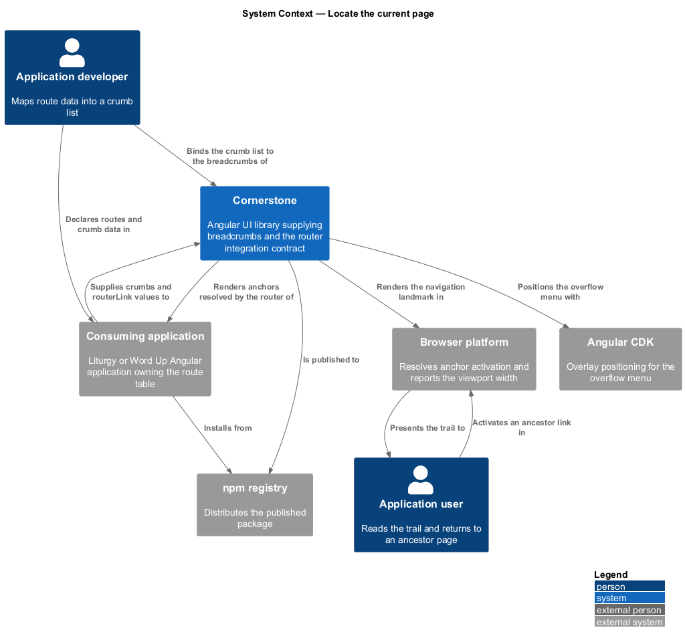
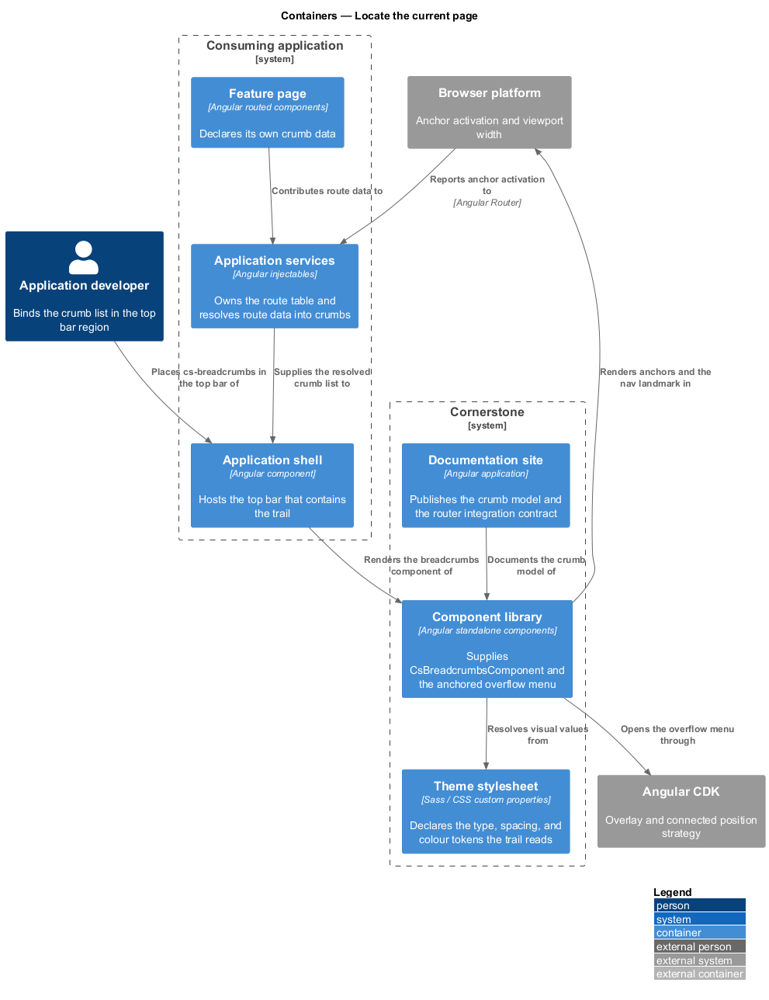
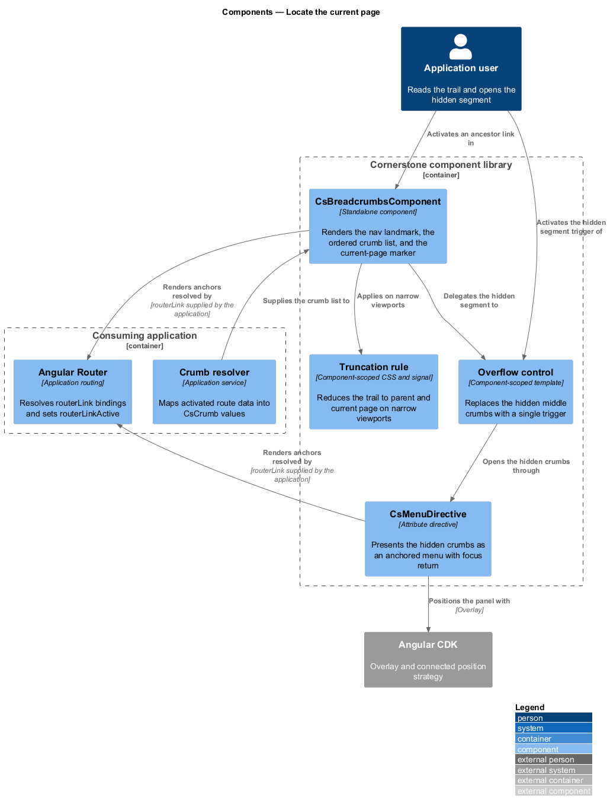
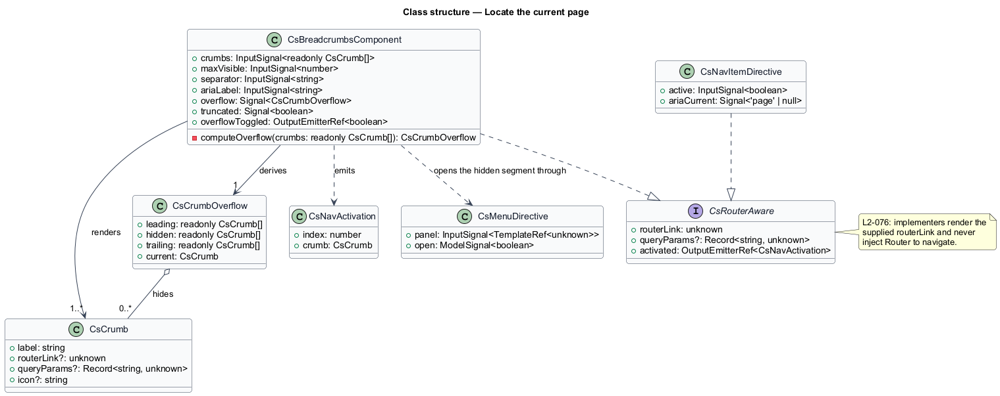
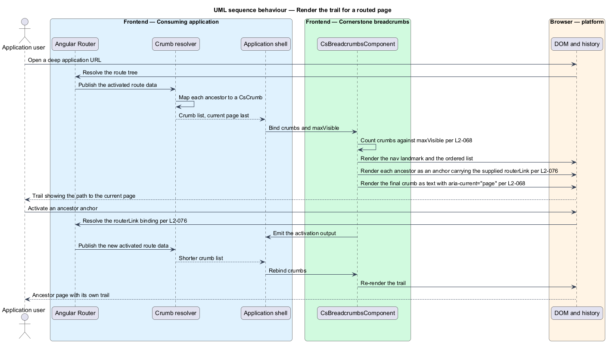
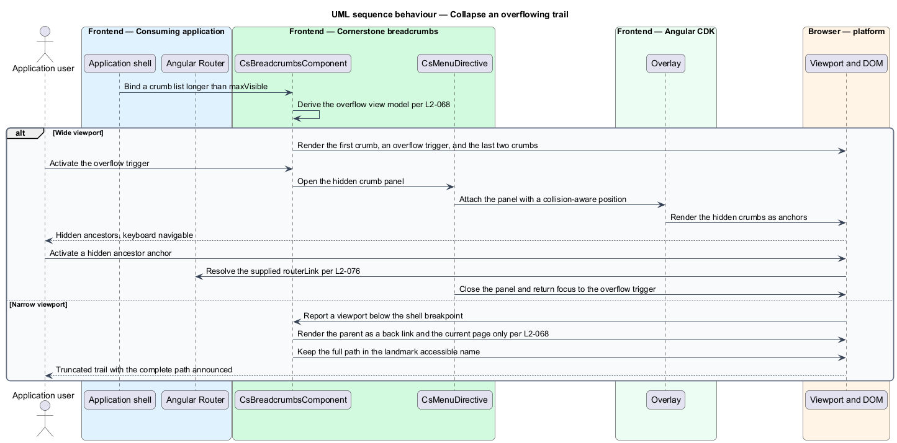

# Locate the current page

## Overview

Cornerstone is the Angular user-interface library published as `@quinntyne/cornerstone`.
It supplies the components that the Liturgy and Word Up applications compose
their screens from. Both applications nest content more than two levels deep, and
a user who arrives on a deep page needs to know where that page sits and how to
reach the levels above it. This feature covers that answer.

**breadcrumb trail** — ordered sequence of ancestor labels ending in the current
page, each ancestor a link and the current page plain text

**crumb** — single entry in a breadcrumb trail, holding a label and, for every
entry except the current page, a route

The trail renders in the top bar region of the application shell (L2-065), which
the `frame-the-application-shell` feature defines. Liturgy uses it across its
authenticated workspace, where a rehearsal or service page sits under a season
and a ministry. Word Up uses it in the portals, where a youth record sits under a
cohort and a programme.

The feature also carries a contract that applies to every component in the
navigation subsystem, not only to breadcrumbs.

**router integration contract** — rule that navigation components render the
route bindings an application supplies and never call the router themselves

Under that contract a navigation component accepts a `routerLink` value, renders
it on an anchor, and lets Angular Router resolve activation. No navigation
component injects `Router` and calls `navigate()` on its own initiative. The
contract keeps the library free of route knowledge, keeps every destination a
real anchor that a browser can open in a new tab, and keeps the application the
single owner of its route table.

The trail derives from data the application supplies, not from route inspection.
An application that wants router-derived crumbs maps its own route data into the
crumb list; the component reads that list.

## Description

The feature is a vertical slice from the application's crumb configuration down
to the rendered navigation landmark. It spans one component, the types it reads,
and the contract that binds the whole subsystem to Angular Router.

- **`BreadcrumbsComponent`** (`cs-breadcrumbs`) — the trail itself. It reads
  `crumbs: InputSignal<readonly Crumb[]>`,
  `maxVisible: InputSignal<number>`, `separator: InputSignal<string>`, and
  `ariaLabel: InputSignal<string>`. It emits
  `overflowToggled: OutputEmitterRef<boolean>` when the collapsed segment
  opens or closes. It renders a `<nav>` landmark containing an ordered list, and
  marks the final crumb with `aria-current="page"` and no link. Its states are
  `full`, `collapsed`, and `truncated`.
- **`Crumb`** — configuration type holding a label, an optional `routerLink`
  value, optional `queryParams`, and an optional icon name. A crumb without a
  `routerLink` renders as plain text.
- **`CrumbOverflow`** — internal view model describing the collapsed segment:
  the leading crumb kept visible, the hidden crumb list, and the trailing crumbs
  kept visible.

Overflow collapsing runs on crumb count. When the trail exceeds `maxVisible`,
the component keeps the first crumb and the last two, replaces the middle with a
single overflow control, and moves the hidden crumbs into an anchored menu. That
menu is the `CsMenuDirective` surface defined in the `open-an-anchored-surface`
feature (L2-072), so the overflow control inherits its keyboard navigation,
outside-click dismissal, and focus return.

Mobile truncation runs on width rather than count. Below the shell's narrow
breakpoint the component renders the current page and its immediate parent only,
with the parent presented as a back link. The full trail stays in the accessible
name of the landmark, so assistive technology reports the complete path even when
the visual trail is short.

The router integration contract (L2-076) applies to `BreadcrumbsComponent`,
`CsNavItemDirective`, `BottomNavComponent`, `TabGroupComponent`,
`CsMenuItemDirective`, and `MarketingHeaderComponent`. Each of them renders an
anchor carrying the `routerLink` value an application binds, and each emits a
typed activation output the application may observe. None of them injects
`Router`. A component that offers a non-route action renders a `<button>`
instead of an anchor and emits an output only.

Active-state marking follows the same rule. A navigation component reads the
active flag that `routerLinkActive` sets on its host and reflects it as
`aria-current`; it does not compare the current URL itself.

Every visual value resolves from the token layer (L2-005), so the trail inherits
the light, dark, forced-colours, and reduced-motion resolutions.

The default value of `maxVisible` is `<TO SUPPLY>`, and the character used as the
default separator is `<TO SUPPLY>`.

## Requirements

The feature realizes the following level-2 (L2) requirements. Each L2 requirement
refines a level-1 (L1) requirement, cited by identifier.

| L2 ID | Refines (L1) | Requirement |
|-------|--------------|-------------|
| `L2-068` | `L1-009` | The library shall provide router-aware breadcrumbs with current-page semantics, overflow collapsing, and mobile truncation. |
| `L2-076` | `L1-009` | Navigation components shall integrate with Angular Router through `routerLink` bindings the consuming application supplies, and shall not inject `Router` to navigate on their own initiative. |

## Diagrams

### System context

An application developer maps route data into a crumb list. Cornerstone renders
the trail; the consuming application's router resolves every link the trail
carries.

### Containers

The crumb list travels from the application's route configuration into the
breadcrumbs component inside the shell's top bar. Angular Router remains inside
the application boundary.

### Components

`BreadcrumbsComponent` renders the visible crumbs and delegates the hidden
segment to the anchored menu. Every link it renders carries an
application-supplied `routerLink` value.

### Class structure

The component reads a crumb list and derives an overflow view model from it. The
router integration contract appears as the interface that every navigation
component realizes.

### Behaviour — render the trail for a routed page

The application resolves route data into a crumb list on navigation. The
component renders the ancestors as links, marks the final crumb as the current
page, and leaves activation to the router.

### Behaviour — collapse an overflowing trail

The crumb count exceeds `maxVisible`, so the component hides the middle crumbs
behind an overflow control and restores them through an anchored menu.

