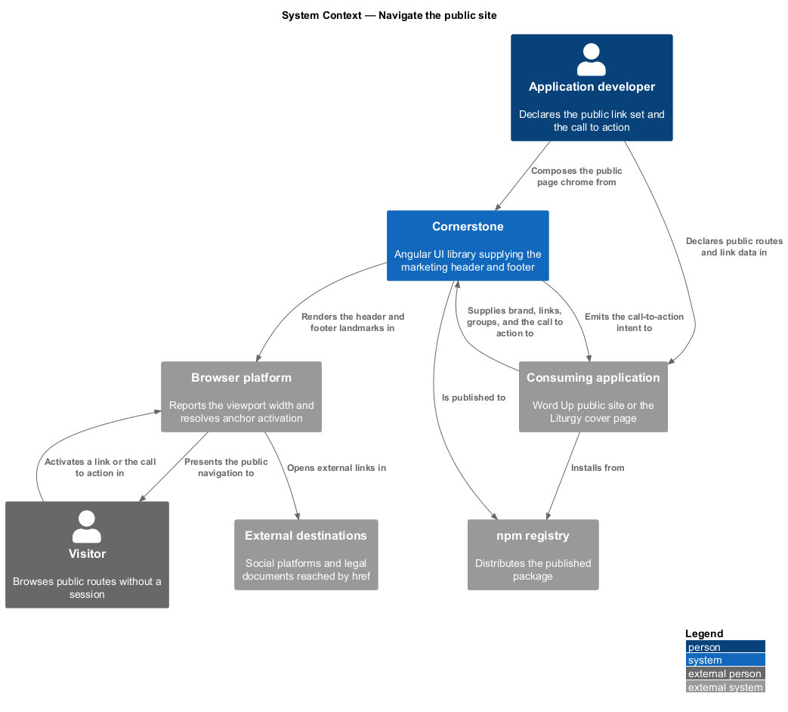
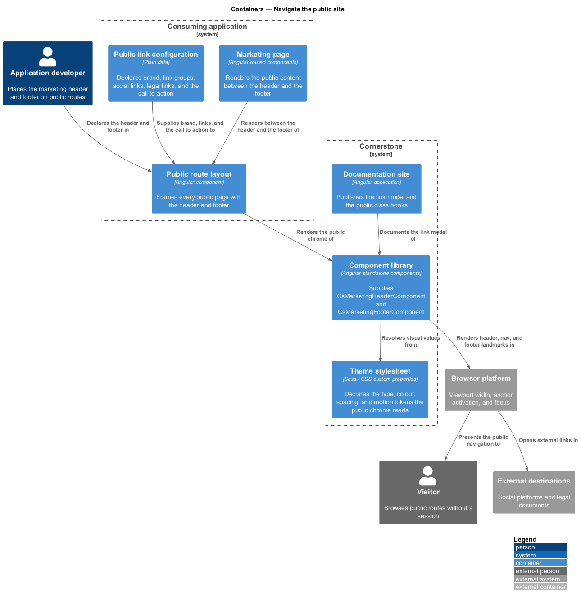
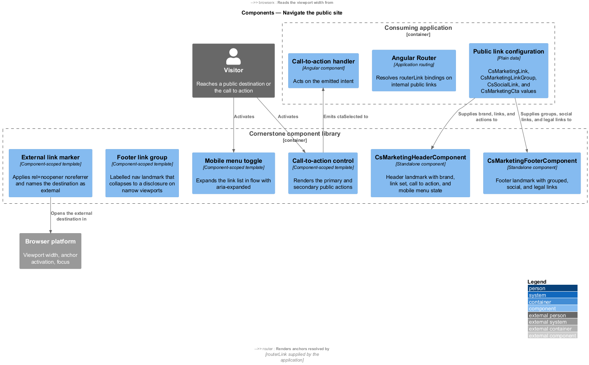
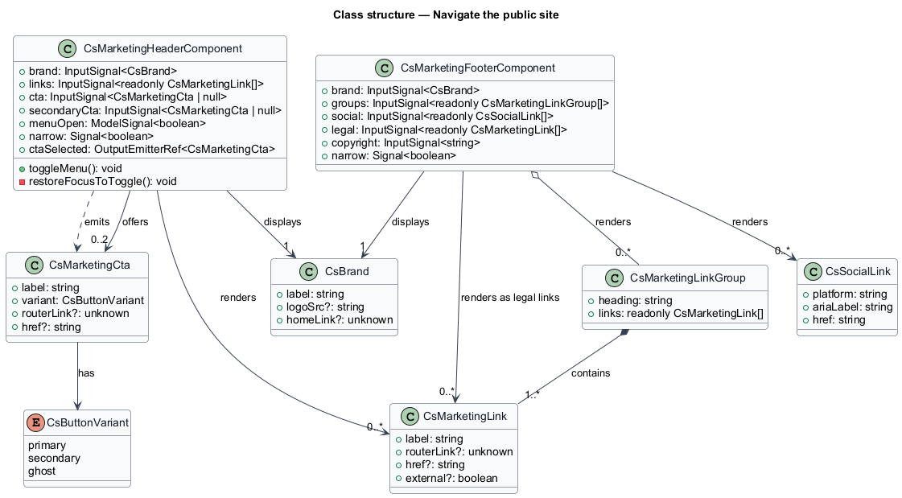
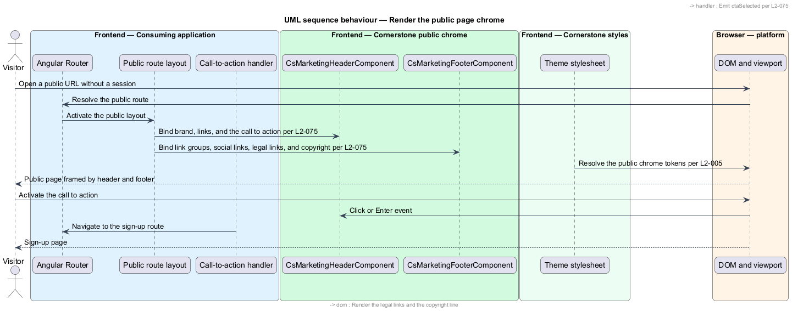
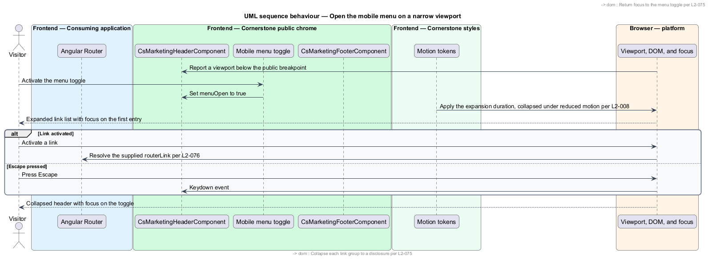

# Navigate the public site

## Overview

Cornerstone is the Angular user-interface library published as `@quinntyne/cornerstone`.
It supplies the components that the Liturgy and Word Up applications compose
their screens from. Not every screen sits behind a sign-in. Word Up publishes a
public site that describes the programme to families and volunteers, and Liturgy
publishes a cover page. This feature covers the navigation those unauthenticated
pages carry.

**public site** — set of routes a visitor reaches without a session, describing
the product rather than operating it

**marketing header** — top navigation for a public route, carrying brand, a small
link set, and a call to action

**call to action** — single prominent control that moves a visitor towards the
one outcome a public page seeks, such as signing up or signing in

**marketing footer** — bottom navigation for a public route, carrying grouped
links, social links, and legal notices

The header and footer replace the application shell on public routes. A public
route renders no sidenav, no bottom navigation, and no account menu, because a
visitor holds no session and no role. The two components sit at the edges of the
navigation subsystem for that reason: they are navigation chrome, but they frame
a page rather than an application.

**visitor** — person browsing a public route without a session

Word Up consumes both components across its public site. Liturgy consumes the
header on its cover page. Both components perform no navigation of their own;
each renders anchors carrying the `routerLink` or external `href` values the
application supplies, under the router integration contract (L2-076).

## Description

The feature is a vertical slice from a public route's link configuration down to
the rendered landmark elements. It spans two components and the types describing
their content.

- **`MarketingHeaderComponent`** (`cs-marketing-header`) — the public top
  navigation. It reads `brand: InputSignal<CsBrand>`,
  `links: InputSignal<readonly CsMarketingLink[]>`,
  `cta: InputSignal<MarketingCta | null>`,
  `secondaryCta: InputSignal<MarketingCta | null>`, and
  `menuOpen: ModelSignal<boolean>`. It emits
  `ctaSelected: OutputEmitterRef<MarketingCta>`. It renders a `<header>`
  element containing a `<nav>` landmark. Its states are `wide`, `narrow-closed`,
  and `narrow-open`.
- **`MarketingFooterComponent`** (`cs-marketing-footer`) — the public bottom
  navigation. It reads `brand: InputSignal<CsBrand>`,
  `groups: InputSignal<readonly MarketingLinkGroup[]>`,
  `social: InputSignal<readonly SocialLink[]>`,
  `legal: InputSignal<readonly CsMarketingLink[]>`, and
  `copyright: InputSignal<string>`. It renders a `<footer>` element containing
  one `<nav>` landmark per link group, each labelled by its heading. On narrow
  viewports each group collapses to a disclosure that a visitor expands.
- **`CsMarketingLink`** — configuration type holding a label, an optional
  `routerLink` value, an optional external `href`, and an optional flag marking
  the link as external.
- **`MarketingLinkGroup`** — configuration type holding a heading and a link
  list.
- **`MarketingCta`** — configuration type holding a label, a variant, an
  optional `routerLink` value, and an optional external `href`.
- **`SocialLink`** — configuration type holding a platform identifier, an
  accessible label, and an `href`.
- **`CsBrand`** — configuration type holding a label, an optional logo source,
  and an optional home `routerLink` value. The header shares this type with
  `TopbarComponent` (L2-065).

The narrow-viewport behaviour differs from the shell's drawer. The header's
mobile menu expands in flow beneath the header rather than overlaying the page,
so it needs no scrim and no focus trap. Focus moves to the first link on
expansion, the `Escape` key collapses the menu, and focus returns to the toggle
on collapse. Activating a link collapses the menu.

A link carrying an external `href` renders with `rel="noopener noreferrer"` and
an accessible marker naming it as an external destination. A link carrying a
`routerLink` value renders as a router anchor and resolves inside the
application.

The header sets no sticky position by default. An application that wants a
sticky public header sets the `cs-marketing-header--sticky` public class hook
(L2-009) rather than overriding component internals.

Every visual value resolves from the token layer (L2-005), so both components
inherit the light, dark, forced-colours, and reduced-motion resolutions. The
mobile menu's expand and collapse transitions collapse to an instant state change
under `prefers-reduced-motion: reduce` (L2-008).

The viewport width at which the header switches to the mobile menu is
`<TO SUPPLY>`, and the set of platform identifiers `SocialLink` accepts is
`<TO SUPPLY>`.

## Requirements

The feature realizes the following level-2 (L2) requirements. Each L2 requirement
refines a level-1 (L1) requirement, cited by identifier.

| L2 ID | Refines (L1) | Requirement |
|-------|--------------|-------------|
| `L2-075` | `L1-009` | The library shall provide responsive public-site navigation with brand, links, a call to action, and a mobile menu, and a footer carrying legal, social, and grouped links. |

## Diagrams

### System context

An application developer declares the public link set. Cornerstone renders the
header and footer; a visitor reaches the public routes without a session.

### Containers

Public routes render the marketing header and footer instead of the application
shell. The link configuration comes from the public site's own route data.

### Components

The header composes brand, links, and the call to action with a mobile menu
toggle. The footer composes grouped links, social links, and legal notices into
labelled landmarks.

### Class structure

Both components read plain link configuration and emit only the call-to-action
intent. The link types cover internal routes and external destinations alike.

### Behaviour — render the public page chrome

A visitor opens a public route. The header renders brand, links, and the call to
action; the footer renders one labelled landmark per link group.

### Behaviour — open the mobile menu on a narrow viewport

A visitor on a phone activates the menu toggle. The header expands the link list
in flow, moves focus to the first link, and collapses on selection or `Escape`.

